## Overview

In Zadig, a [project](/en/Zadig%20v4.1/quick-start/concepts/#project) is the core business management unit for independent teams or product lines. Each project includes workflows, environments, services, builds, tests, code scans, and versions. This manual covers project access, template management, service configuration, workflow setup, permissions, and collaboration management. It helps you quickly understand and use Zadig to improve efficiency and support R&D processes.

## Project Access Methods

Zadig supports three project access methods:

- **Existing project hosting**: For projects with service configurations not managed by Zadig
- **Existing project import**: For projects with configurations managed through Git repositories or other storage
- **New project access**: For new projects that need to build an engineering system

### Existing Project Hosting

1. Create a new project -> Select hosted project.

2. Configure hosting environment by selecting services from specified cluster and namespace.

3. Configure service builds. See: [Build](/en/Zadig%20v4.1/project/build).

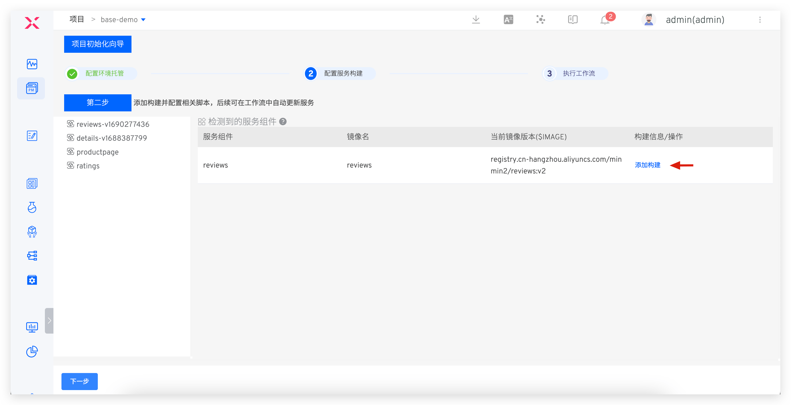

4. Execute workflows to deploy and update services in specified environment.

::: tip
To manage service configuration on Zadig later, switch project type. See: [Switch project type](/en/Zadig%20v4.1/project/host-k8s-resources/#switch-a-k8s-hosting-project-to-a-k8s-yaml-project).
:::

### Existing Project Import

The access steps are introduced separately for the two forms of configuration files (YAML/Helm Chart).

#### YAML Form

1. Create new project, select K8s YAML project.

2. Create new service: Sync service configuration from codebase. See: [Create service](/en/Zadig%20v4.1/project/service/k8s/#create-a-new-service).

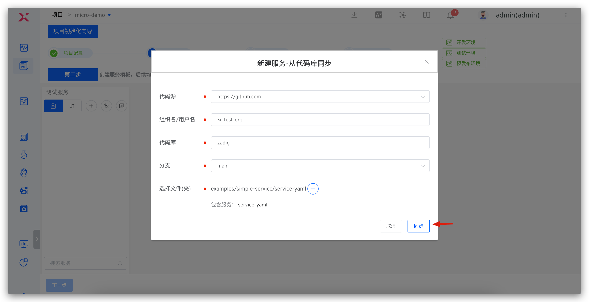

3. Add build for service: Select service -> Variables -> Add build, configure build script.

4. Create new environment: Select existing namespace (e.g., dev/sit/uat/prod). See: [Create environment](/en/Zadig%20v4.1/project/env/k8s/#create-a-new-environment).

5. Execute workflows: Enter project -> Workflows, run workflow to update services.

#### Helm Chart Form

1. Create new project, select K8s Helm Chart project.

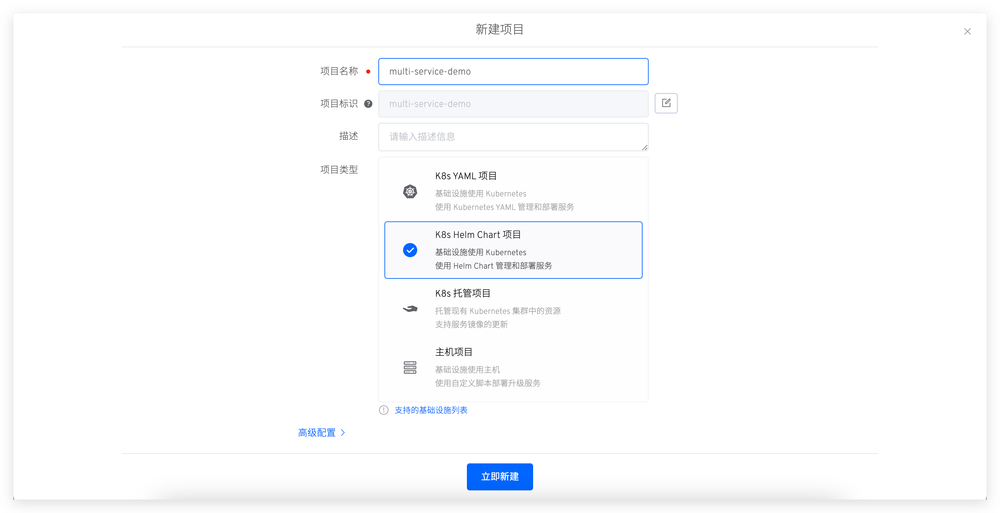

2. Create new service: Sync service configuration from codebase. See: [Create service](/en/Zadig%20v4.1/project/service/helm/chart/#create-a-new-service).

3. Add build for service: Select service -> Variables -> Add build, configure build script.

4. Create new environment: Select existing namespace (e.g., dev/sit/uat/prod). See: [Create environment](/en/Zadig%20v4.1/project/env/k8s/#create-a-new-environment).

5. Execute workflows: Enter project -> Workflows, run workflow to update services. See: [Workflows](/en/Zadig%20v4.1/project/common-workflow/).

### New Project Access

The access steps are introduced separately for the two forms of configuration files (YAML/Helm Chart).

#### YAML Form

1. Create new project: Select K8s YAML project.

2. Create a new service: Use templates to create a new service. See: [Create a new service](/en/Zadig%20v4.1//project/service/k8s/#create-a-single-service-using-templates).

3. Create a new environment: Select the service to create new dev/sit/uat/prod environments.

4. Configure builds: Use build templates to configure build scripts. See: [Build](/en/Zadig%20v4.1/project/build).

5. Configure workflows: Configure the corresponding workflows for test and production environments. See: [Workflows](/en/Zadig%20v4.1/project/common-workflow/).

#### Helm Chart Form

1. Create a new project: Select the K8s Helm Chart type project.

2. Create a new service: Use templates to create a new service. See: [Create a new service](/en/Zadig%20v4.1/project/service/helm/chart/#create-a-single-service-using-templates).

3. Create a new environment: Select the service to create new dev/sit/uat/prod environments.

4. Configuration build: Use the build template to configure the build script. See: [Build](/en/Zadig%20v4.1/project/build/#%E6%9B%B4%E5%A4%9A%E6%9E%84%E5%BB%BA%E6%AD%A5%E9%AA%A4).

5. Configure workflows: Configure the corresponding workflows for test and production environments. See: [Workflows](/en/Zadig%20v4.1/project/common-workflow/).

## Standard Template Management

Through the Zadig template library, the operations team can achieve unified application delivery standards, standardize release processes, and accumulate standardized templates that meet the company's own characteristics. This provides the R&D and operations departments with an efficient engineering collaboration basis, quickly responding to the needs of business iteration, and ensuring the stability and scalability of the system. The template library provides various types of templates, including service templates, build templates, Dockerfile templates, and workflow templates.

### Service Templates

::: tip Scenario
The configuration file content structure of multiple services isomorphic, but the specific configuration is different. For example: the port number/number of replicas/database connection addresses of different services are different. Abstract the configuration of the service into a common K8s YAML/Helm Chart template, allowing users to create multiple services on the common template.
:::

The different organizational forms of service configurations (K8s YAML/Helm Chart) are introduced separately.

#### K8s YAML Template

Preparation: Abstract the configuration of multiple services into a K8s YAML template. The following are the relevant configurations of multi-service-demo projects for reference. For more usage postures, see: [K8s YAML Template](/en/Zadig%20v4.1/template/k8s_yaml/), [create a new service using templates](/en/Zadig%20v4.1/project/service/k8s/#%E4%BD%BF%E7%94%A8%E6%A8%A1%E6%9D%BF%E6%96%B0%E5%BB%BA%E6%9C%8D%E5%8A%A1).
- The K8s YAML configurations of three microservices: [service1](https://github.com/koderover/zadig/tree/main/examples/multi-service-demo/k8s-yaml/service1), [service2](https://github.com/koderover/zadig/tree/main/examples/multi-service-demo/k8s-yaml/service2), [service3](https://github.com/koderover/zadig/tree/main/examples/multi-service-demo/k8s-yaml/service3)
- The abstracted template for the above three service configurations: [K8s YAML Template](https://github.com/koderover/zadig/blob/main/examples/multi-service-demo/k8s-yaml/template.yaml).
1. Create a new template: Go to the template library -> K8s YAML -> Create template, enter the template content and save it.

2. Configure custom variables: Configure the default values of variables as needed.

3. Create a new service using the template.

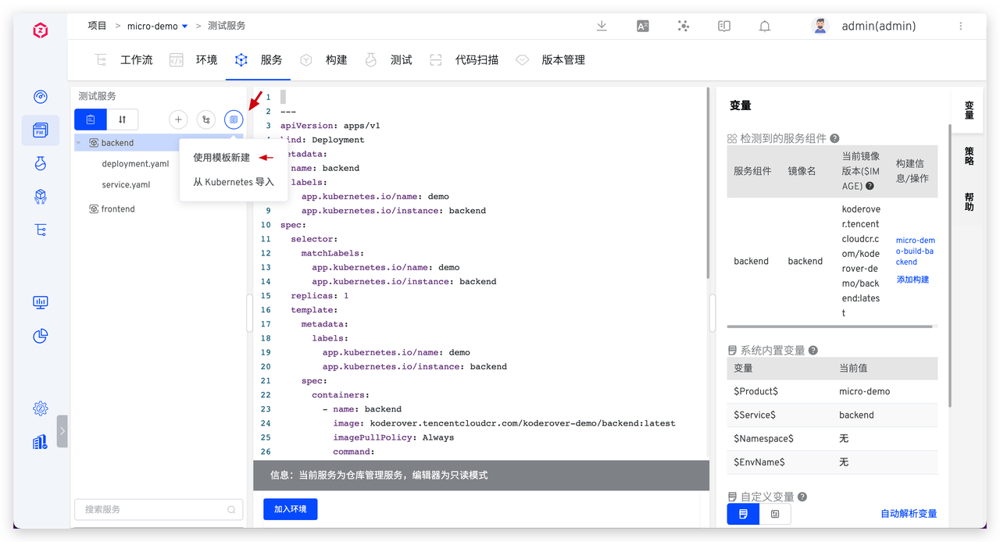

4. Template content changes will synchronize and update the service configuration: Enable automatic synchronization in the service configuration, and after the template content changes, it will be applied to the service

#### Helm Chart Template

Preparation: abstract the Helm Chart configurations of multiple services into Helm Chart templates, and the following are the relevant configurations of multi-service-demo projects for reference. For more usage postures, see: [Helm Chart Template](/en/Zadig%20v4.1/template/helm_chart/), [create a new service using template](/en/Zadig%20v4.1/project/service/helm/chart/#%E4%BD%BF%E7%94%A8%E6%A8%A1%E6%9D%BF%E6%96%B0%E5%BB%BA%E5%8D%95%E4%B8%AA%E6%9C%8D%E5%8A%A1).
- The Helm Chart configurations of three microservices: [service1](https://github.com/koderover/zadig/tree/main/examples/multi-service-demo/full-charts/service1), [service2](https://github.com/koderover/zadig/tree/main/examples/multi-service-demo/full-charts/service2), [service3](https://github.com/koderover/zadig/tree/main/examples/multi-service-demo/full-charts/service3).
- The abstracted template for the above three service configurations: [Helm Chart Template](https://github.com/koderover/zadig/tree/main/examples/multi-service-demo/general-chart).
1. Create a new template: Go to the template library -> K8s YAML -> Create template, enter the template content and save it.

2. Configure custom variables: Save the default values of variables as needed.
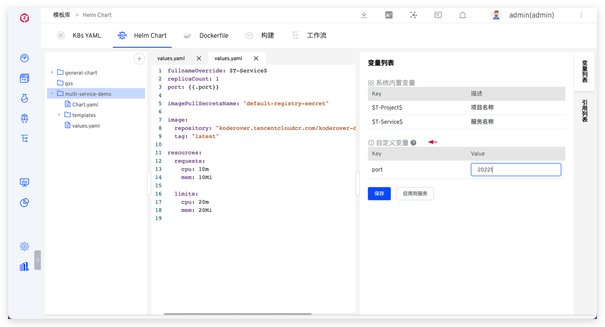

3. Create a new service using the template: Enter K8s Helm Chart project -> Services -> Create a new service using the template, fill in the parameters and import it.

4. Template content changes will synchronize and update the service configuration: Enable automatic synchronization in the service configuration, and after the template content changes, it will be applied to the service.

### Dockerfile Template

Preparation: Abstract the mirror building configuration of multiple services into a Dockerfile template. The following are the relevant configurations of multi-service-demo projects for reference. For more usage postures, see: [Dockerfile Template](/en/Zadig%20v4.1/template/dockerfile/), [build configuration](/en/Zadig%20v4.1/project/build/#%E6%9B%B4%E5%A4%9A%E6%9E%84%E5%BB%BA%E6%AD%A5%E9%AA%A4).
- The source code of three microservices: [service source code](https://github.com/koderover/zadig/tree/main/examples/multi-service-demo/src).
- The project build files for the above three services: [Makefile](https://github.com/koderover/zadig/blob/main/examples/multi-service-demo/Makefile).
- The abstracted image build configuration for the above three services: [Dockerfile Template](https://github.com/koderover/zadig/blob/main/examples/multi-service-demo/Dockerfile).
1. Create a new template: Go to the template library -> Dockerfile Template -> Create template, enter the template content and save it.

2. Use the Dockerfile template to configure the build for the service.
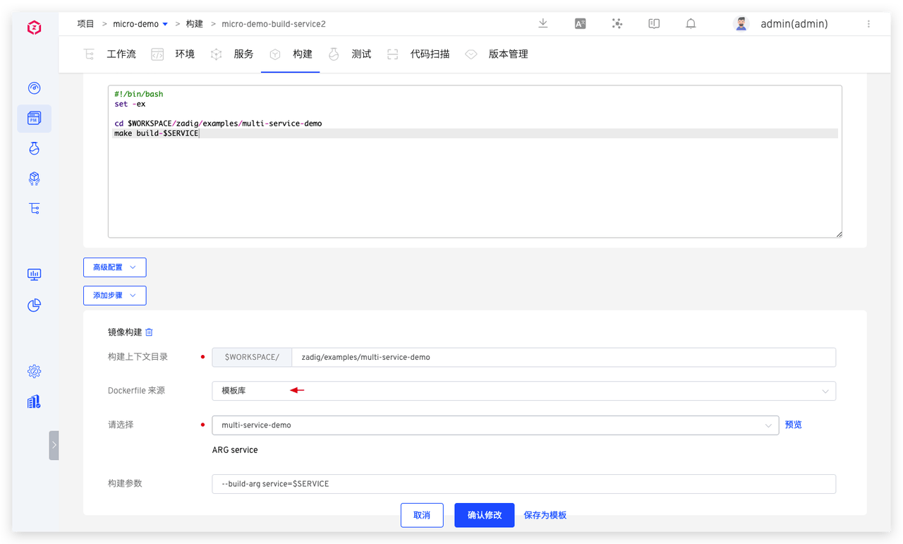

### Build Templates

::: tip Scenario
The build configurations of multiple services are isomorphic (e.g., multiple service codes of the same technology stack are maintained in separate codebases, the dependent software packages are the same, the build scripts are isomorphic, and only the code information differs...). Use Zadig build templates to improve the efficiency of configuration builds. For more details, see: [Build Templates](/en/Zadig%20v4.1/template/build/).
:::

1. Create a new build template: Go to the template library -> Build -> Create template, configure and save.

1. Using build templates: Use template configuration to configure the code information required for multiple service builds. For multiple services using the same build template, you can use batch entry to quickly configure it.

### Workflow Templates

Abstract workflow templates based on project processes, quickly create workflows based on templates. For more details, see: [Workflow Templates](/en/Zadig%20v4.1/template/workflow/).
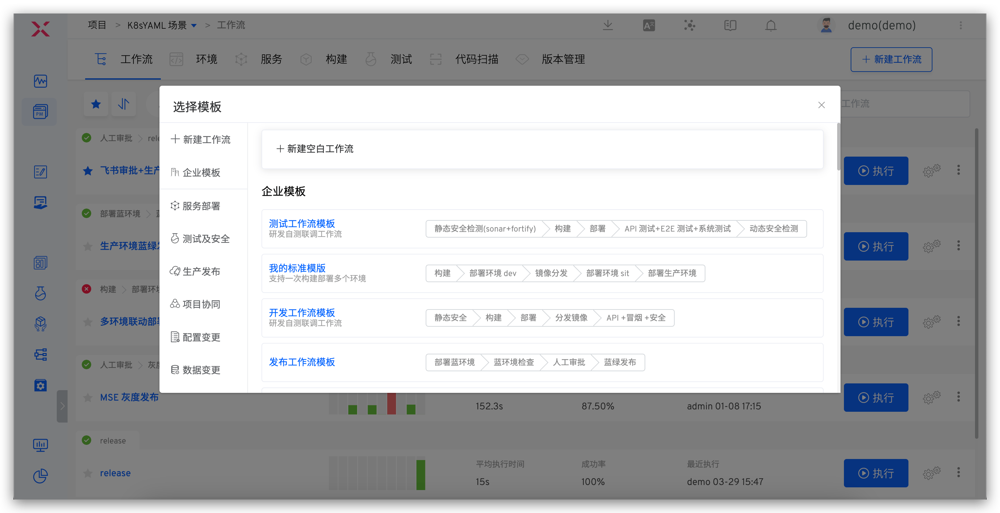

## Service and Environment Configuration

### Deploying Test Services

Step 1: Configure the test service
1. Based on K8s  YAML template, create new business services. See: [service](/en/Zadig%20v4.1/project/service/k8s/#%E4%BD%BF%E7%94%A8%E6%A8%A1%E6%9D%BF%E6%96%B0%E5%BB%BA%E6%9C%8D%E5%8A%A1).

2. Based on the build template, configure the build for the service. See: [Build](/en/Zadig%20v4.1/project/build/template/).

::: tip Optimization Suggestions:
|    Suggestions   |                Description                           |                    Reference Documents              |
|:----------- | :-------------------------------------------- |:-----------------------------------------|
| Speed up the build process | 1. Include commonly used build dependency tools  2. Customize cache directories| 1. [Custom build images](/en/Zadig%20v4.1/settings/custom-image/)  2. [Configure the build cache](/en/Zadig%20v4.1/project/build/#%E9%AB%98%E7%BA%A7%E9%85%8D%E7%BD%AE) |
| Reduce maintenance burden | 1. Multiple services have similar builds; configure a single build script to reduce maintenance costs  2. Standardize and unify the management of service build materials to reduce maintenance and management burdens| 1. [Share build scripts](/en/Zadig%20v4.1/project/build/#Zadig-%E5%85%B1%E4%BA%AB%E6%9E%84%E5%BB%BA)  2. [Use the build template](/1) |
:::

Step 2: Add to the environment. See: [K8s YAML Environment](/en/Zadig%20v4.1/project/env/k8s/#%E5%9F%BA%E6%9C%AC%E6%93%8D%E4%BD%9C).

Step 3: Add the service to the corresponding workflow, and add the service component and its corresponding build to the workflow.

### Offline Testing Service

1. Delete service definition. See: [Delete service](/en/Zadig%20v4.1/project/service/k8s/#%E5%88%A0%E9%99%A4%E6%9C%8D%E5%8A%A1).
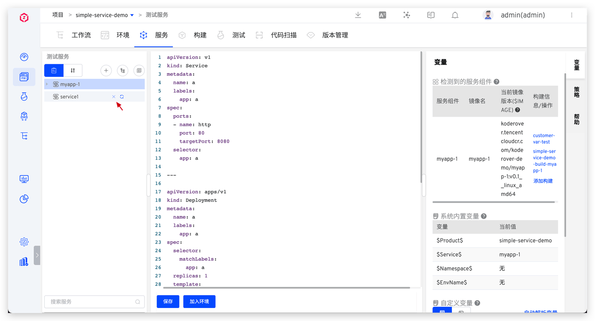

2. Delete the service from the environment. See: [K8s YAML Environment](/en/Zadig%20v4.1/project/env/k8s/#%E5%88%A0%E9%99%A4%E6%9C%8D%E5%8A%A1).
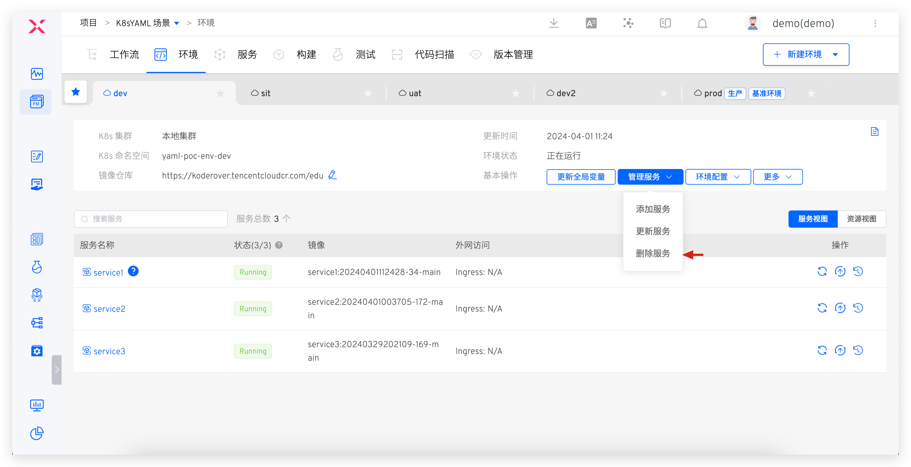

### Create a New Test Environment

Enter the project -> Environment -> Create a new environment -> Test Environment, fill in the parameters, and create a new one.
- K8s YAML Project. See: [Create a new K8s YAML environment](/en/Zadig%20v4.1/project/env/k8s/#%E6%96%B0%E5%BB%BA%E7%8E%AF%E5%A2%83).
- K8s Helm Chart Project. See: [Create a new Helm Chart environment](/en/Zadig%20v4.1/project/env/helm/chart/#%E6%96%B0%E5%BB%BA%E7%8E%AF%E5%A2%83).

Some best practices are provided for reference:
1. Use a single set of service configurations to create multiple test environments. See: [Configure Multiple Integrated Environments](/en/Zadig%20v4.1/env/multi-env/).
2. Different environments use different structures deployment , variable capabilities can be used. See: [K8s YAML](/en/Zadig%20v4.1/project/service/k8s/#%E5%8F%98%E9%87%8F%E9%85%8D%E7%BD%AE).
3. Different business lines can use different K8s cluster resources. For adding new cluster configurations, see: [Cluster Management](/en/Zadig%20v4.1/pages/cluster_manage/).
4. Environment configuration management. See: [Environment configuration](/en/Zadig%20v4.1/project/env/k8s/#%E7%8E%AF%E5%A2%83%E9%85%8D%E7%BD%AE).

### Online Production Service

Step 1: Configure production services. See: [production services](/en/Zadig%20v4.1/project/service/k8s/prod/#%E6%96%B0%E5%BB%BA).
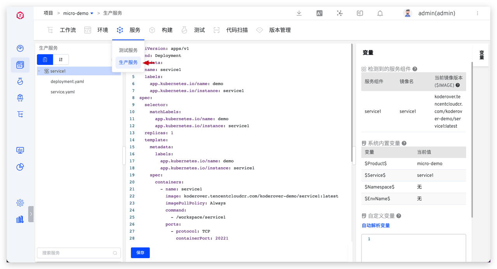

Step 2: Configure the production environment. See: [K8s YAML Production Environment](/en/Zadig%20v4.1/project/env/release/).

Step 3: Configure the workflow, add deployment tasks. See: [Workflow](/en/Zadig%20v4.1/project/workflow-jobs/#%E9%83%A8%E7%BD%B2%E4%BB%BB%E5%8A%A1).
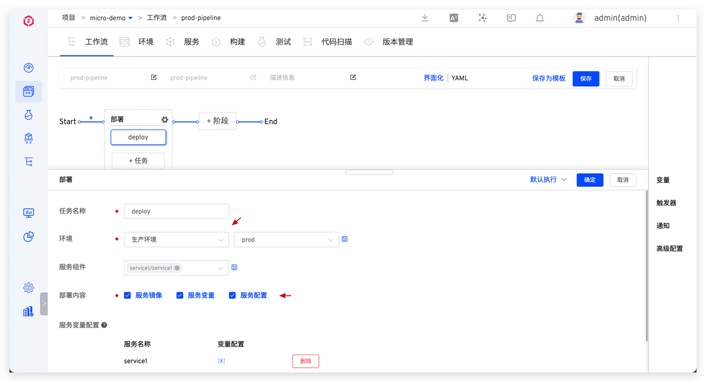

### Offline Production Service

::: tip Caution
Given the seriousness of production services, there are certain risks associated with offline operations. Please ensure that the service can be safely taken offline before proceeding.
:::

See: [Offline service](/en/Zadig%20v4.1/project/workflow-jobs/#%E4%B8%8B%E7%BA%BF%E6%9C%8D%E5%8A%A1).

### Create a New Production Environment

See: [Production Environment](/en/Zadig%20v4.1/project/env/release/#%E6%96%B0%E5%BB%BA%E7%8E%AF%E5%A2%83).

## Workflow Configuration

For specific configuration, see: [Workflow](/en/Zadig%20v4.1/project/workflow-overview/)

## Permission Management

Zadig user permissions consist of system permissions and project permissions. These are managed by configuring the user's system roles, project roles, and collaboration modes within the project. User permissions are the union of all granted permission items. The specific mechanism is shown in the figure below:

### Configuration Operations

First, understand the basic operations for configuring user project permissions.

#### Project Role Configuration

Access project configuration -> permissions, configure roles and project members. See: [permission configuration](/en/Zadig%20v4.1/project/permission/#permission-configuration).

#### Collaboration Mode Configuration

Access permission management -> Collaboration mode, just configure permissions for collaboration members, workflows, and environmental resources. For specific configuration process, see: [Collaboration mode](/en/Zadig%20v4.1/project/permission/#collaboration-mode).

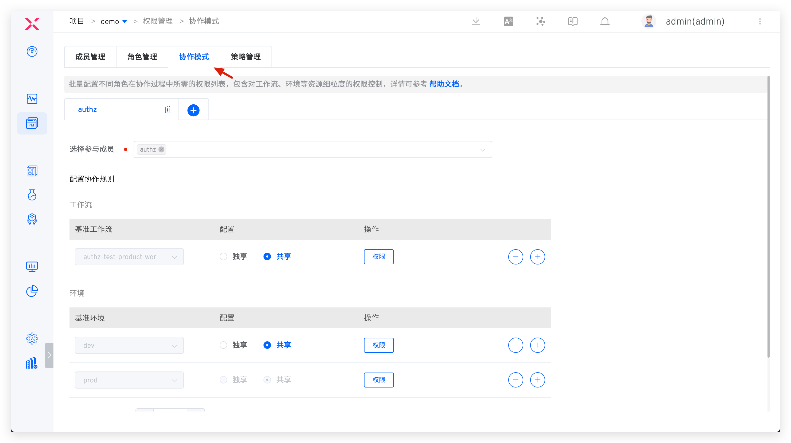

### Configuration Examples

The following examples illustrate how to configure permissions for different roles.
#### Project Administrator

Permission Description: Has permissions for any operation in the project

Specific Configuration: Grant the project role `project-admin`

#### R&D Engineer
Permission Description:
- All operation permissions for building, testing services, code scanning, and version management modules
- All operation permissions for dev workflows
- All operation permissions for dev and sit environments

Specific Configuration:
- Create and grant the project role `dev`, and configure permissions as shown in the figure below:

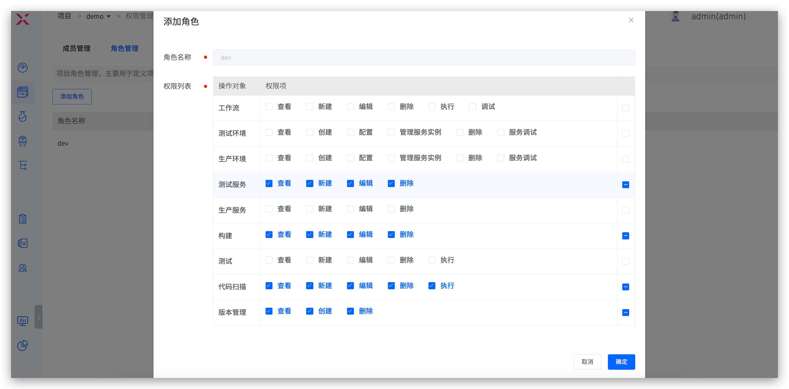
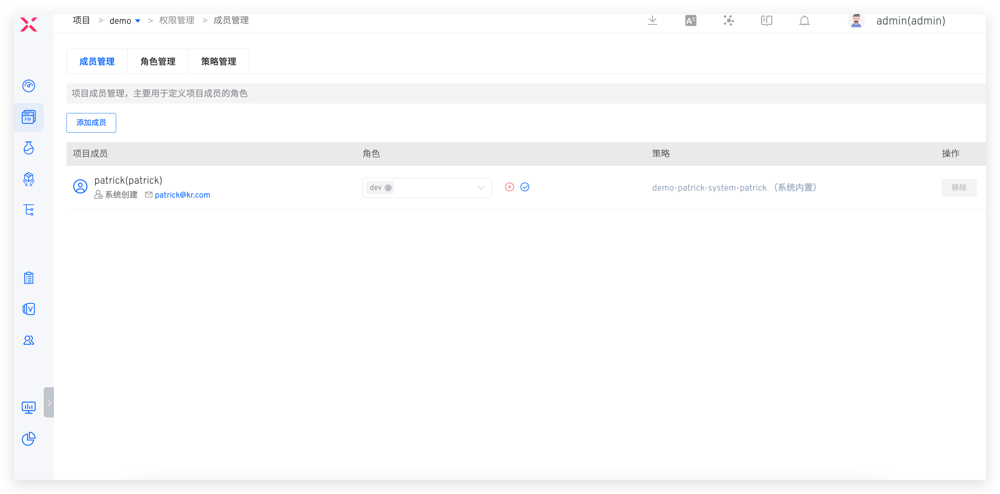

- Create and join the collaboration mode `dev`, and configure workflow and environment-related permissions as shown in the figure below:

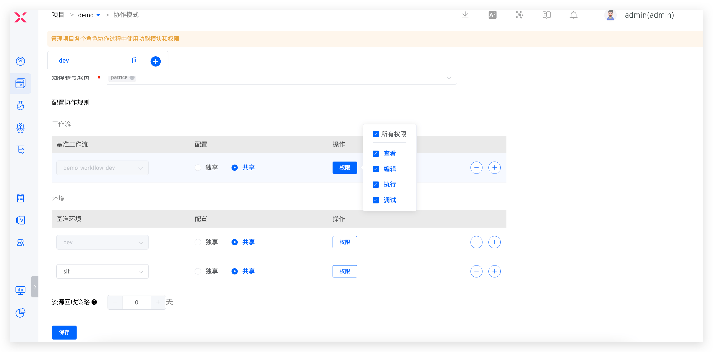

#### Test Engineer
Permission Description:
- All operation permissions for the test module
- All operation permissions for sit workflows
- All operation permissions for sit environments

Specific Configuration:
- Create and grant the project role `qa`, and configure permissions as shown in the figure below:

- Create and join the collaboration mode `qa`, and configure workflow and environment-related permissions as shown in the figure below:

#### Release Engineer
Permission Description:
- All operation permissions for production services, production environments, and version management
- All operation permissions for prod and uat workflows
- All operation permissions for uat environments

Specific Configuration:

- Create and grant the project role `sre`, and configure permissions as shown in the figure below:

- Create and join the collaboration mode `sre`, and configure workflow and environment-related permissions as shown in the figure below:

