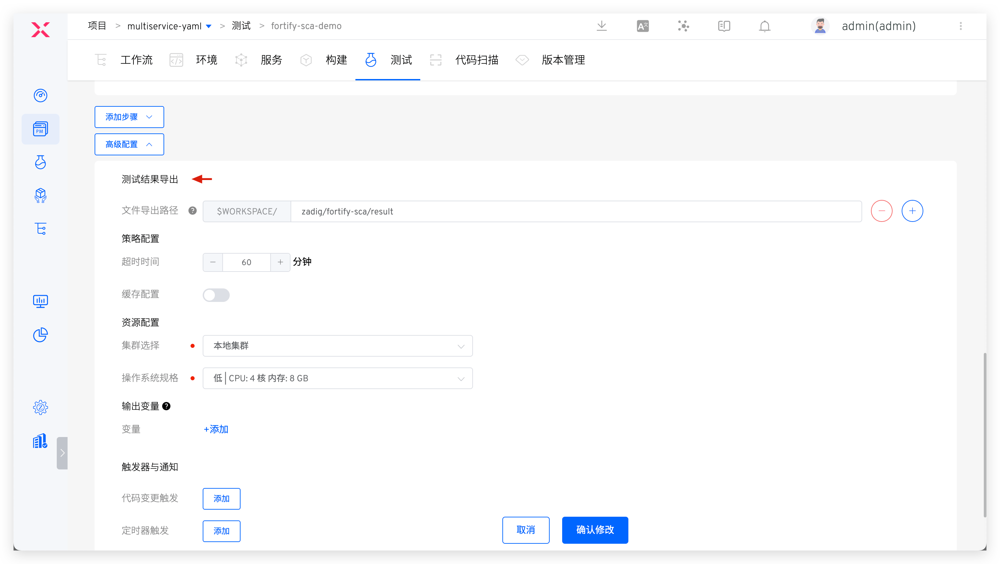
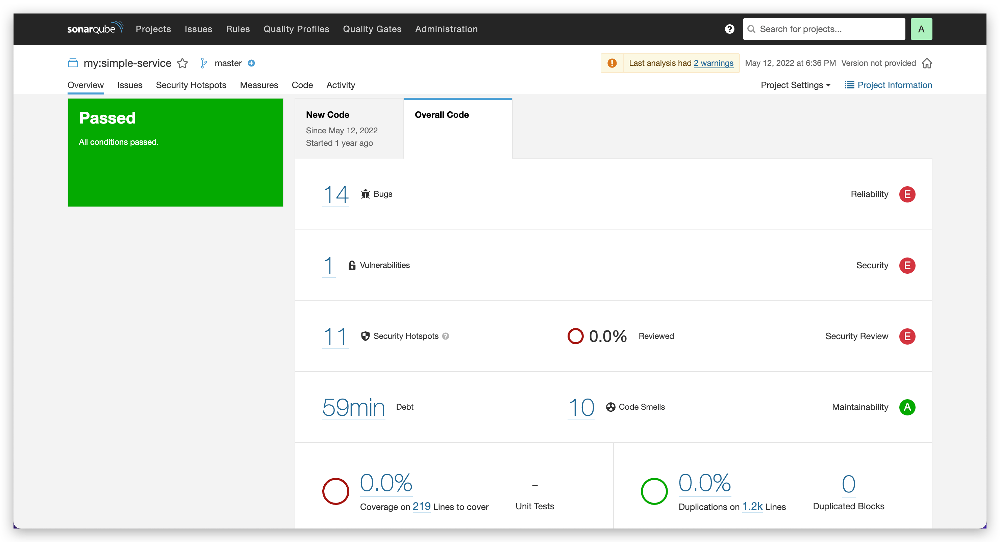
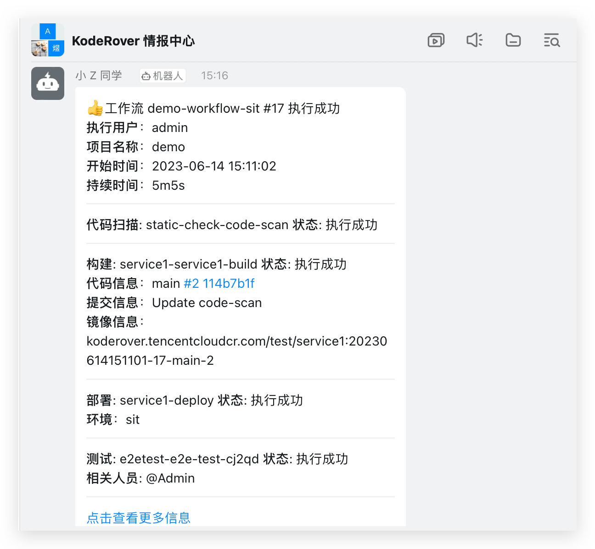
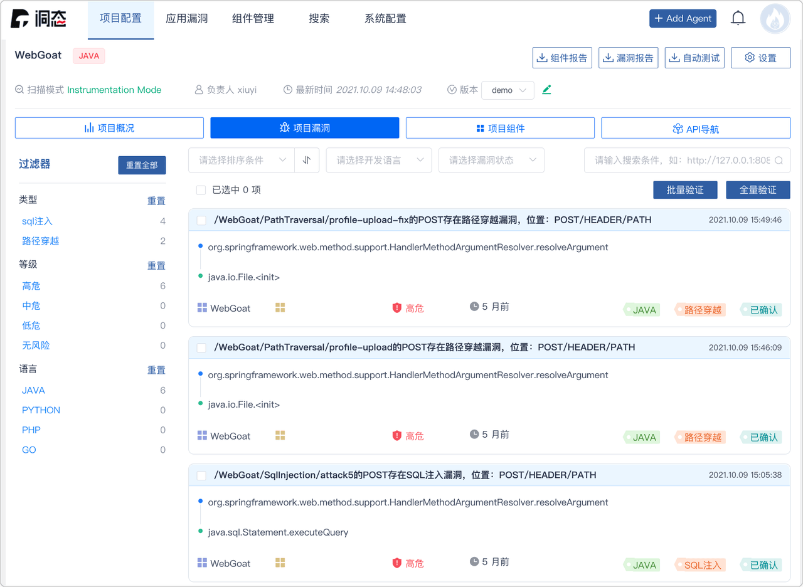

## Overview

Zadig manages the entire software development lifecycle and supports almost all security tools and services on the market. For example, SAST tools like [SonarQube](https://www.sonarsource.com/), [Fortify](https://www.microfocus.com/en-us/cyberres/application-security), and [Coverity](https://scan.coverity.com/), SCA tools like [CleanSource](https://www.sectrend.com.cn/), and DAST tools like [DongTai](https://dongtai.io/). Zadig easily integrates these tools into the entire delivery pipeline, leveraging powerful runtime environment and workflow capabilities to provide strong support to security teams.

Zadig helps security teams shift security services and capabilities left to development, testing, and operations teams, enabling early identification of security issues and involving other roles in addressing security and compliance issues, avoiding additional costs from fixing such issues.

## Security Service Access

### Static Security SAST - Sonar

**Step 1: Configure Code Scanning**

Add new code scan, select `SonarQube` scanning tool, and fill in code scanning configuration. See: [Code Scanning](/en/Zadig%20v4.1/project/scan/).


**Step 2: Orchestrate Code Scanning in Workflow**

Edit workflow and add code scanning task at specified stage (e.g., before build task). See: [Configure Workflow](/en/Zadig%20v4.1/project/common-workflow/).


### Software Composition Analysis SCA - Fortify

**Step 1: Build Custom Image**

1. Build custom image and upload to image registry. See: [Custom Image](/en/Zadig%20v4.1/settings/custom-image/#%E6%AD%A5%E9%AA%A4-1-%E7%94%9F%E6%88%90%E8%87%AA%E5%AE%9A%E4%B9%89%E9%95%9C%E5%83%8F).
2. Add custom image in Zadig. See: [Add custom image](/en/Zadig%20v4.1/settings/custom-image/#%E6%AD%A5%E9%AA%A4-2-%E5%88%9B%E5%BB%BA%E8%87%AA%E5%AE%9A%E4%B9%89%E9%95%9C%E5%83%8F).


**Step 2: Configure SCA Scan**

Add new `test` and complete specific configuration for Fortify SCA code scanning. Relevant parameters explained below. For detailed information, see: [Test](/en/Zadig%20v4.1/project/test/).

- `Operating System`: Custom image added in Step 1
- `Test Script`: Specific command to execute code scan. See Fortify SCA official documentation
- `Test Result Export`: Configure path where scan results are located




**Step 3: Orchestrate SCA Scan**

Orchestrate SCA scan in workflow. See: [Orchestrate tasks](/en/Zadig%20v4.1/project/workflow-jobs/#%E6%B5%8B%E8%AF%95%E4%BB%BB%E5%8A%A1).


Run workflow. After Fortify SCA execution completes, download scan results for analysis.


### Dynamic Security IAST - DongTai

**Step 1: Integrate IAST Capabilities into Service**

Modify service YAML configuration, install DongTai IAST Agent, and modify service startup command. Sample service YAML follows:

::: tip
Flexibly use Zadig service variable capability in service YAML configuration content, and control whether to install Agent for service on demand. See: [Service variables](/en/Zadig%20v4.1/project/service/k8s/#%E5%8F%98%E9%87%8F%E9%85%8D%E7%BD%AE).
:::

``` yaml
// Service Original YAML
apiVersion: apps/v1
kind: Deployment
metadata:
  labels:
    app: service1
  name: service1
spec:
  selector:
    matchLabels:
      app: service1
  template:
    metadata:
      labels:
        app: service1
    spec:
      containers:
        - name: service1
          image: dongtai/dongtai-java-agent-demo:0.0.1
```
``` yaml
// Service YAML with DongTai IAST Agent
apiVersion: apps/v1
kind: Deployment
metadata:
  labels:
    app: service1
  name: service1
spec:
  selector:
    matchLabels:
      app: service1
  template:
    metadata:
      labels:
        app: service1
    spec:
      {{- if .iast }}
      volumes:
        - name: dongtai-iast-agent
          emptyDir: {}
      initContainers:
        - name: agent-init-container
          image: curlimages/curl
          volumeMounts:
            - name: dongtai-iast-agent
              mountPath: /tmp
          args:
            - "-k"
            - "-X"
            - "GET"
            - "The download request URL for the Agent obtained from the DongTai management console"
            - "-H"
            - "Headers from the Agent Download Request (Retrieved via DongTai Management Console)"
            - "-o"
            - "/tmp/agent.jar"
      {{- end}}
      containers:
        - name: service1
          image: dongtai/dongtai-java-agent-demo:0.0.1
          {{- if .iast }}
          volumeMounts:
            - name: dongtai-iast-agent
              mountPath: /agent
          env:
            - name: JAVA_TOOL_OPTIONS
              value: "-javaagent:/agent/agent.jar"
          {{- end}}
```

**Step 2: Deploy Service to Environment**

Deploy the injected IAST Agent service to the environment. See: [Add service](/en/Zadig%20v4.1/project/env/k8s/#%E6%B7%BB%E5%8A%A0%E6%9C%8D%E5%8A%A1).


## DevSecOps Core User Scenarios

### Development Stage Static Security Injection

> Process: Code Commit > Static Scan > Build > Deploy > Self-test and Joint Debugging

After code implementation and PR submission, static code scanning automatically triggers. Scan results reflect in PR, click to jump to Zadig to view failure reasons, effectively avoiding quality and security risks in code at development source.


For code scanning using SonarQube tool, click link to jump to Sonar system to analyze more scan results, fix targeted issues, then execute dev workflow for daily self-test and joint debugging.




### Testing Stage Combined Security Strategy

> Process: Static Scan (Quality Gate Enabled) > Build > Deploy > Automated Testing (Business Testing + Dynamic Security Detection)

After development testing, test engineer executes workflow based on code branch + PR, deploys integrated test verification environment and performs automated testing. Workflow automatically notifies IM after execution. Login to management console to view dynamic security detection vulnerability details, promote team timely fixes, avoid security risks early.




If static scan task fails, subsequent build and deployment tasks will be blocked. Code changes failing acceptance will be rejected for merge, capturing security risks at source code level and establishing effective quality gate measures. This approach prevents potential issues from entering the system.


### Release Stage Full Inspection and Approval

> Process: Security Committee Review > Batch Gray Release > Automated Testing

After test acceptance, execute prod workflow for production release, approval required before release. Recommended configuration strategies:
1. Build release gates, automatically obtain quality results from security scans, unit tests, regression tests, etc., to determine whether release is allowed, serving as checkpoints in release process to ensure version passes acceptance and meets enterprise security requirements before going live.
2. Flexibly orchestrate MSE Grayscale, Blue-Green, Canary, Batch Grayscale, Istio and other release strategies to ensure release reliability. See: [Release Strategies](/en/Zadig%20v4.1/project/release-workflow/).
3. Add manual approval from security team during release phase to ensure release compliance in business processes.


