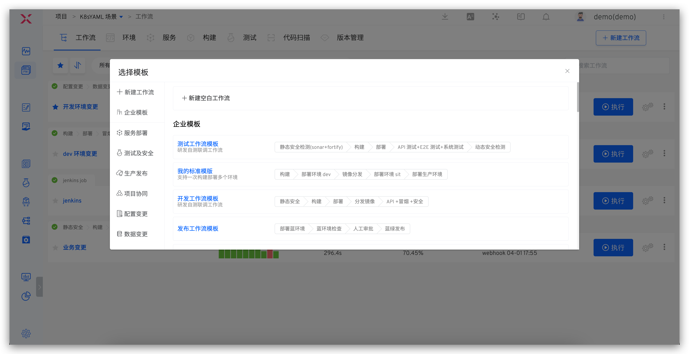
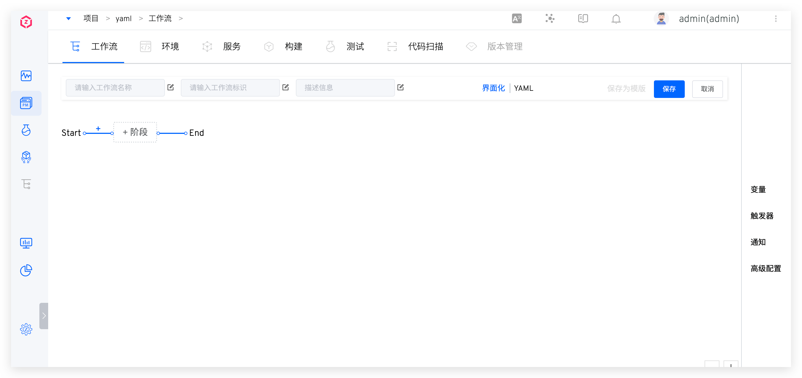
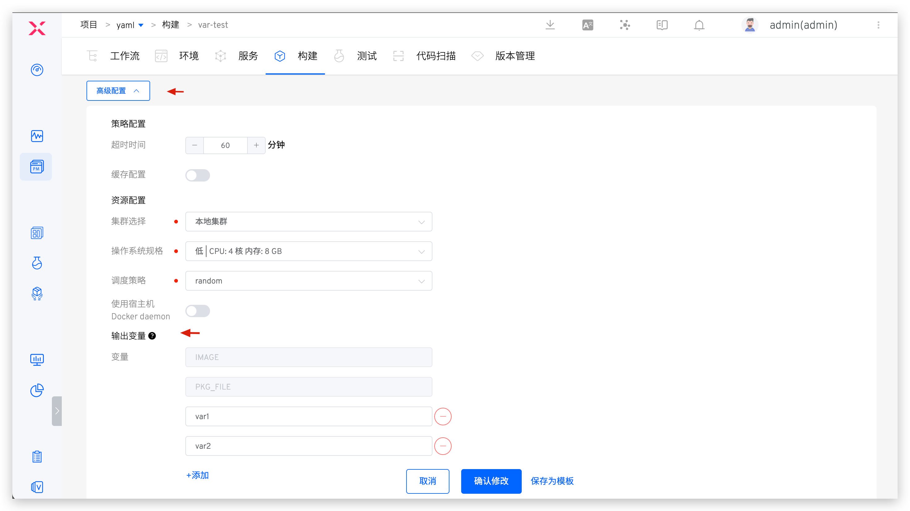
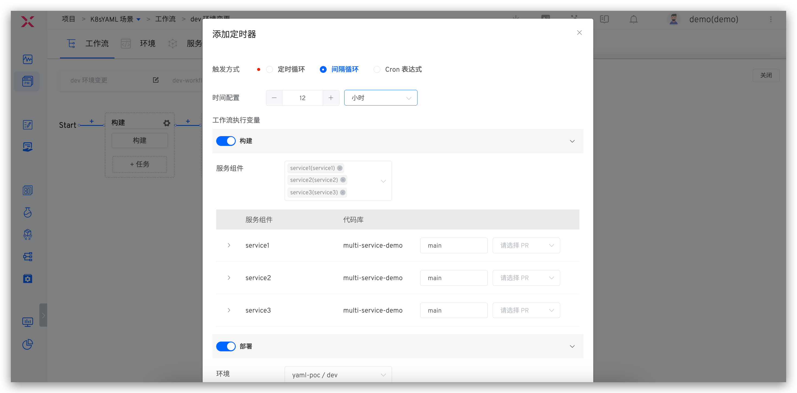
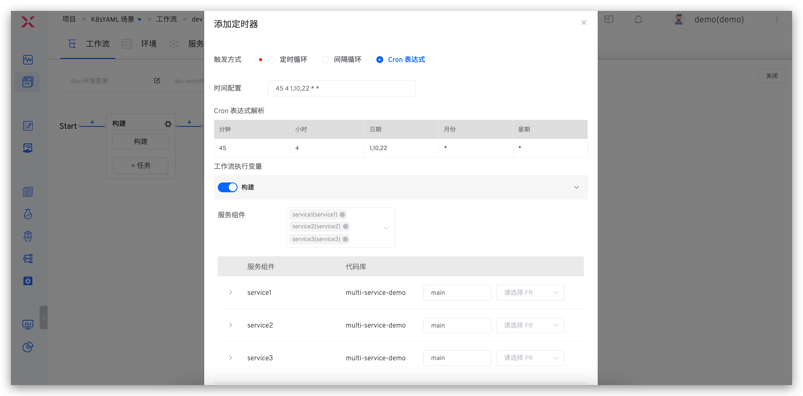
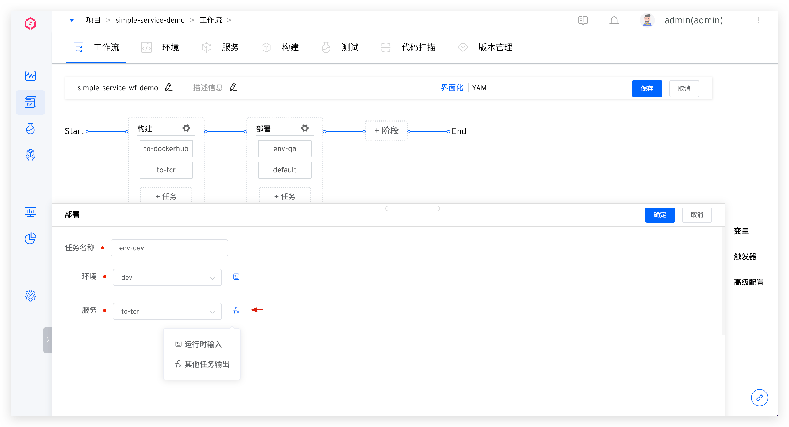
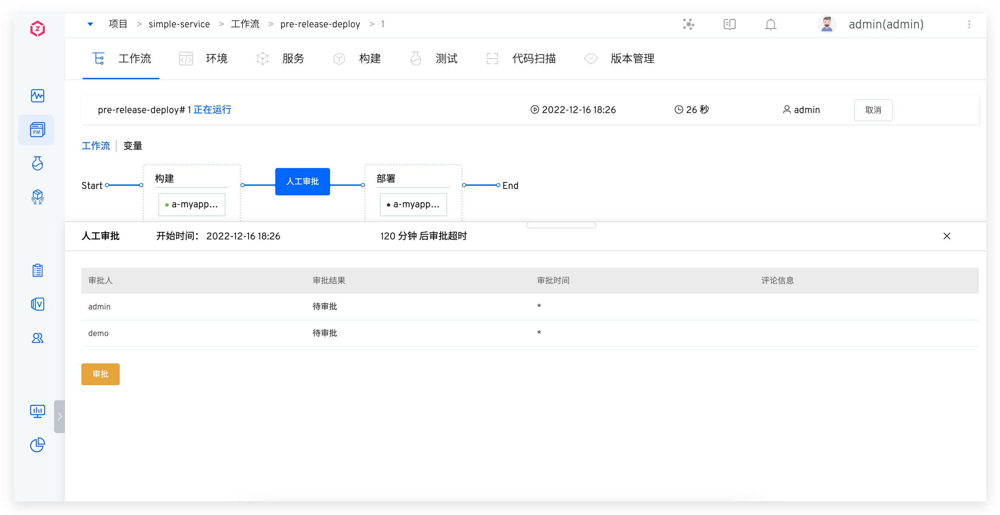
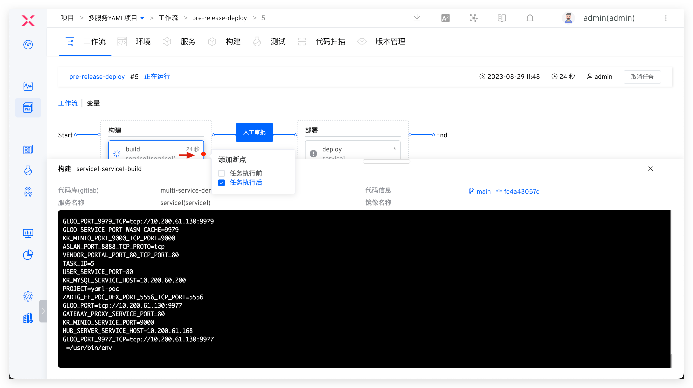
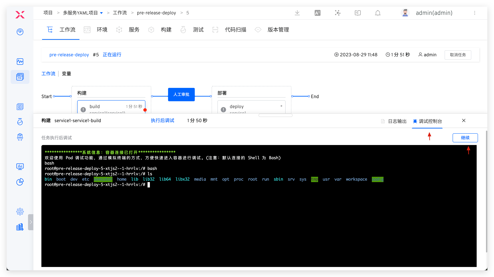

The workflow provides full openness, supporting free orchestration of workflow processes and custom execution steps. The following sections expand on the relevant configurations.

## Create Workflow
### Create a New Blank Workflow

Enter the project and click Create a New Workflow. The system provides two ways to configure the workflow: `UI` and `YAML`.




### Create New Using Template

To create a new workflow, you can choose a custom enterprise template or a built-in workflow template to create a new workflow, as shown in the figure below.


## Interface Configuration

### Basic Information

Includes workflow name, identifier, and description information:
- `Name`: Supports Chinese, upper and lower case letters, numbers, and special characters, and is unique within the project it belongs to, and can be modified.
- `Workflow Identifier`: Supports upper and lowercase letters, numbers, and hyphens, is globally unique, and does not support modification.
- `Description`: Describes the detailed information of the workflow and is displayed on the workflow details page.


### Stage

Click `+Stage` to add a new stage configuration.


Parameter Description:
- `Stage Name`: In the same workflow, the stage name must be unique
- `Concurrent Execution`: When enabled, multiple tasks configured in this stage will be executed concurrently


The stage supports two execution modes: `Automatic` and `Manual`. Manual execution allows you to specify the manual executor and re-enter task parameters during execution.

### Task
Click `+Task` below the stage to add task configuration. For the task types and specific configurations supported by the system, see [Workflow Tasks](/en/Zadig%20v4.1/project/workflow-jobs/).

## YAML Configuration

### Configuration Instructions

Define workflows using YAML files. The overall structure of YAML content is described as follows:

```
display_name:「Workflow Name」        // Required, unique within the project, supports Chinese, upper and lower case letters, numbers, and special characters
name:「Workflow Identifier」                // Required, unique within the project
  - 「Stage 1 Configuration」
  - 「Stage 2 Configuration」
  - 「More Stage Configurations...」
project: 「Workflow Project Name」      // Required
description: 「Workflow Description」
multi_run: 「Optional: true/false」  // When multiple workflows are triggered simultaneously, whether multiple tasks can be executed in parallel, the default is false
```

The specific configuration of each stage is as follows:

```
name: 「Stage Name」              // Required
parallel: 「Optional: true/false」  // Whether multiple tasks in this stage can be executed in parallel, the default is false
jobs:                           // Required
  - 「Task 1 Configuration」
  - 「Task 2 Configuration」
  - 「More Task Configurations...」
```

Currently, two types of tasks are built-in. The specific configuration of the build tasks is as follows:

> Setting the build variable in YAML is effective when there is a configuration of related build variables in the specified build.

```
name:「Task Name」                     // Required
type: zadig-build                    // Required, specify as zadig-build
spec:                                // Required
  docker_registry_id: 「Image Registry ID」
  service_and_builds:                // Service component build information, multiple service components can be configured
    - service_module: 「Service Component Name」
      service_name: 「Service Name」
      build_name: 「Build Name」
      key_vals:                      // Build variable information, supports configuring string and single-choice type variables, see the following string and choice type variable examples
        - key: username              // Build variable name
          value: Zadig               // Build variable value
          is_credential: false       // Whether to encrypt, the default is false
          type: string
        - key: password
          value: v1
          is_credential: false
          type: choice
          choice_option:             // Optional values for single-choice type variables
            - v1
            - v2
    - service_module: 「Service Component Name」  // More service component build information
      service_name: 「Service Name」
      build_name: 「Build Name」
      ...
```

The specific configuration of built-in deployment tasks is as follows:

```
name: 「Task Name」                    // Required
type: zadig-deploy                   // Specify as zadig-deploy
spec:
  env: 「Deployment Environment」                    // Required
  source: 「Source of Service Image Used for Deployment」  // Required, optional: runtime (runtime input) / fromjob (other task output)
  job_name: 「Task Name」             // When source is fromjob, configure
```

### YAML Sample

Use the following workflow configuration as an example:

1. The first stage: Contains build tasks and builds 2 services in parallel (myapp-1 and myapp-2)
2. The second stage: Contains deployment tasks, using the images from the above build tasks to deploy the pre-release environment

The corresponding complete YAML configuration example is as follows:

```
name: pre-release-deploy
display_name: pre-release-deploy
stages:
  - name: Build
    parallel: true
    jobs:
      - name: build-myapps
        type: zadig-build
        spec:
          docker_registry_id: 6247eb0832a15f910118318c
          service_and_builds:
            - build_name: simple-service-build-nginx-1
              key_vals:
                - is_credential: false
                  key: username
                  type: string
                  value: admin
                - is_credential: false
                  choice_option:
                    - v1
                    - v2
                  key: password
                  type: choice
                  value: v1
              service_module: myapp-1
              service_name: a
            - build_name: simple-service-build-myapp-2
              service_module: myapp-2
              service_name: b
  - name: Deployment
    jobs:
      - name: deploy
        type: zadig-deploy
        spec:
          env: pre-release
          job_name: build-myapps
          source: fromjob
project: simple-service
description: Pre-release Environment Deployment
multi_run: false
```

## Variables

The workflow provides rich variable capabilities to support parameterized configuration of workflows and to enable information passing between tasks, stages, workflows, and projects through variables.

### Built-in Variables

|Variable Sources| Variables                                               | Description                                                |
|------|---------------------------------------------------|-----------------------------------------------------|
| Project |  <span v-pre>`{{.project}}`</span>                | Project Name  |
| Workflow |  <span v-pre>`{{.workflow.name}}`</span>           | Workflow Identifier |
|  |  <span v-pre>`{{.workflow.task.id}}`</span>        | The ID number of the workflow task, which is `1` in the following figure                   |
| |  <span v-pre>`{{.workflow.task.creator.id}}`</span>   | The username of the workflow task executor, which is `admin` in the following figure          |
| |  <span v-pre>`{{.workflow.task.creator}}`</span>   | The nickname of the workflow task executor, which is `admin-nickname` in the following figure     |
| |  <span v-pre>`{{.workflow.task.timestamp}}`</span> | The Unix timestamp when the workflow task was created, which is `1686642562` in the following figure |
| Build Tasks| <span v-pre>`{{.job.<Task Name>.SERVICES}}`</span> | The value of the service component name collection variable selected for the construction task is as `aslan/zadig,zadig-portal/zadig` (Service component name / Service name)|
| | <span v-pre>`{{.job.<Task Name>.BRANCHES}}`</span> | The value of the branch information collection variable of the first code base corresponding to the service component selected for the construction task is as follows `feature1,feature2,feature3`|
| | <span v-pre>`{{.job.<Task Name>.IMAGES}}`</span> | The value of the mirror collection variable corresponding to the service component selected for the construction task is as follows `image1:tag1,image2:tag2`|
| | <span v-pre>`{{.job.<Task Name>.GITURLS}}`</span> | The collection of information for the first code repository corresponding to the service component selected for the build task. The value of the variable is in the form of `https://gitlab.com/group1/repo1,https://gitlab.com/group2/repo2` (code source URL/organization name or username/code repository name)|
| | <span v-pre>`{{.job.<Task Name>.<Service Name>.<Service Component Name>.COMMITID}}`</span> | The commit information of the first repository of the specified service component |
| | <span v-pre>`{{.job.<Task Name>.<Service Name>.<Service Component Name>.BRANCH}}`</span> | The branch information of the first repository when specifying the service component |
|Deployment Tasks| <span v-pre>`{{.job.<Task Name>.envName}}`</span> | Deployment Environment |
|      | <span v-pre>`{{.job.<Task Name>.IMAGES}}`</span> | The value of the deployed service component's image collection variable is as `image1:tag1,image2:tag2` |
|      | <span v-pre>`{{.job.<Task Name>.VERSION_NAME}}`</span> | The version name selected during deployment |
|Image Distribution Tasks| <span v-pre>`{{.job.<Task Name>.IMAGES}}`</span> | The value of the target image collection variable of the distributed service component is as `image1:tag1,image2:tag2` |

### Custom Variables

Workflow variables are divided into global variables and task variables. Global variables are configured as shown in the figure below, and custom variables in tasks are configured in the corresponding tasks.


Variable Description:

- `Type`: Supports string, multi-line text, single-choice, multiple-choice, code repository, image, and [dynamic variables](/en/Zadig%20v4.1/workflow/dynamic-variable/).
  - Among them, `image` and `dynamic variables` are only available in general tasks.
- `Key`: The key of the custom variable
- `Value` : Custom variable value, supports two configuration methods: runtime input and fixed value. For detailed introduction, please refer to the document [variable assignment method](#variable-assignment-method)

### Variable Assignment Method

Click the small icon to the right of the variable to assign a value. The different assignment methods are as follows:

- `Runtime`: Specify the value of this variable when executing the workflow
- `Fixed`: Set the variable value to a fixed value. The variable is not visible on the page during workflow execution, and there is no need to assign a value to the variable again
- `Global Variables/Other Task Output`: Use global variables or variables output by other tasks to assign values. The global variables will be automatically rendered when the workflow is executed to enable variable passing between different tasks
  - Supported global variables include [built-in variables](#built-in-variables) and [custom variables](#custom-variables)
  - If you use `Other Task Output` , you need to configure the output variables for the task first. Refer to the document: [Configure the output variables](#variable-passing)


There are two ways to use global variables:
1. Use shell environment variables in build, code scanning, testing, and general tasks
2. Define custom variables in the task, select the assignment method as `Global Variables/Other Task Output`, and choose the corresponding global variable to use.

### Variable Passing

Support passing variables between different tasks, and the process is as follows:

1. Declare the variables to be output in the advanced configuration of the preceding task
2. Use this variable through `Global Variables/Other Task Output` in the subsequent task

**Configure Output Variables**

The configuration output variables are supported in building/testing/code scanning/general tasks. The output variables of different tasks are as follows:
- Build Task: <span v-pre>`{{.job.<Task Name>.<Service Name>.<Service Component Name>.output.<Variable Name>}}`</span>
- Test Task: <span v-pre>`{{.job.<Task Name>.<Test Name>.output.<Variable Name>}}`</span>
- Code Scanning Task: <span v-pre>`{{.job.<Task Name>.<Code Scanning Name>.output.<Variable Name>}}`</span>
- General Task: <span v-pre>`{{.job.<Task Name>.output.<Variable Name>}}`</span>

As an example with a build task, add output variables in the advanced configuration and fill in the variable name.

::: tip
1. The added variables can come from custom variables in the build configuration or variables set in the build script, such as `export key=value`
2. The system will output the `IMAGE` and `PKG_FILE` variables in the build by default, representing the image name of the service and the delivery file name, respectively
:::



**Use Output Variables**

For tasks that support `Global Variables/Other Task Output` configuration mode, please refer to the documentation: [the configuration modes supported in different tasks](/en/Zadig%20v4.1/project/workflow-jobs/#%E4%B8%8D%E5%90%8C%E4%BB%BB%E5%8A%A1%E4%B8%AD%E6%94%AF%E6%8C%81%E7%9A%84%E9%85%8D%E7%BD%AE%E6%96%B9%E5%BC%8F) .<br>
As an example with a general task custom variable, specify `Global Variables/Other Task Output` when assigning a variable in a general task, and choose the output variable configured in the preceding task to achieve variable passing between different tasks.


## Task Scheduling Strategy

### Execution Policy


- Default Execution: Tasks configured for default execution will be executed by default when `Execute Task` and `Configure Trigger`, and users can choose not to execute them.
- Default Not Executed: Tasks configured for default non-execution will not be executed by default when `Execute Task` and `Configure Trigger`, and users can choose to execute them.
- Forced Execution: Tasks configured for forced execution must be executed when `Execute Task` and `Configure Trigger`, and users cannot choose not to execute them.

### Failure Strategy


- Mark as Failed: When the task fails, the workflow stops execution and is marked as failed
- Ignore Failure: When the task fails, the workflow continues to execute
- Manual Confirmation: When this task fails, manual judgment is required to determine whether to `Skip` the task or `Stop` the workflow
- Retry on Failure: When the task fails, it can be automatically retried based on the configured number of retry attempts

## Trigger Configuration

Configure triggers for workflows. When an event that meets the trigger conditions occurs, the workflow execution will be automatically triggered. It supports Git triggers, timers, JIRA triggers, Feishu project triggers, and general triggers. For details, please refer to the document: [Workflow Triggers](/en/Zadig%20v4.1/project/workflow-trigger/).


### Git Trigger

Parameter Description:

- `Code Repository`: The code repository that needs to listen to the trigger event. The corresponding trigger events will be different when selecting different code sources.
- `Target Branch`: The Base branch when submitting a pull request. Supports regular expression configuration, refer to [Regexp Syntax](https://pkg.go.dev/regexp/syntax@go1.17.3#hdr-Syntax).
- `Trigger Event`: Specifies the Webhook event that triggers the workflow to run. The optional events are as follows:
    - `Push commits` event triggered when (Merge operation).
    - `Pull requests` Triggered when submitting a pull request.
    - `Push tags` Triggered after creating a tag.
- `Trigger Strategy`: `Push commits` and `Pull requests` events support automatic cancellation. If you want to trigger only the latest commit, using this option will automatically cancel the preceding tasks in the queue.
- `File Directory`: By setting files and file directories, you can monitor files and directories, and trigger the workflow when files or directories change (add, modify, or delete). You can also ignore the corresponding file or directory changes and not trigger the workflow.

Using the following code repository file structure as an example:

``` bash
├── reponame  # Repository Name
  ├── Dockerfile
  ├── Makefile
  ├── README.md
  ├── src
    ├── service1/
    ├── service2/
    └── service3/
```
| Trigger Scenario | File Directory Configuration |
|----|------------|
| All file updates|`/`|
| All file updates except *.md|`/`<br>`!.md`|
| All file updates except service1 directory | `/`<br>`!src/service1/`|
| All file updates in the service1 directory | `src/service1/` |
| File updates in the src directory (except the service1 directory)|`src`<br>`!src/service1/`|

### Timer

By configuring the timer, periodic workflow execution can be achieved. Currently, the main timer methods supported by the workflow are:
- Timed Loop: Execute a workflow at a specific time point, for example, run at 12:00 every day and 10:00 every Monday
- Periodic Loop: Execute a task periodically, such as every 30 minutes
- Cron Expression: Use standard Linux Cron expressions to flexibly configure timers, such as: "45 4 1,10,22 * *" to execute the workflow task at 4:45 on the 1st, 10th, and 22nd of each month

#### Timed Loop

Specific Operation Steps:
- Click the Add button to add a timed loop entry, and select the cycle time and time point respectively
- Set the workflow task parameters, and execute according to the set parameters when running


#### Interval Loop

Specific Operation Steps:

- Step 1: Click the Add button to add an interval loop entry, and select the interval time and interval time units respectively
- Step 2: Set the workflow parameters, and execute according to the set parameters when running



#### Cron Expression
Specific Operation Steps:

- Step 1: Click the Add button to add a Cron expression entry, and fill in the Cron expression
- Step 2: Set the workflow parameters, and execute according to the set parameters when running



## Notification Configuration

Currently, it supports configuration workflow notifications to email / Feishu / Enterprise WeChat / DingTalk /Webhook in the detailed configuration parameter description can be found: [IM status notification](/en/Zadig%20v4.1/workflow/im) .


The notification message will include the execution status of all tasks in the workflow. For build tasks, deployment tasks, and test tasks, the naming rules in the notification content are as follows:

- Build Task: Service Name - Service Component Name - Build Task Name
- Deployment Task: Service Name - Deployment Task Name
- Test Task: Test Name - Test Task Name - Random String

Feishu Notification Example:


## Number of Execution Concurrency
Set the number of concurrent executions in `Advanced Configuration` > `Execution Strategy`. Multiple workflow tasks generated by triggering workflow execution will be executed concurrently, improving workflow operation efficiency.


## Disabled

After the disabled mode is turned on, the workflow will not be executed, including manual execution and execution through triggers.


<!-- ## 工作流样例

可在工作流中自由编排流程，下面简单举例几种场景。

**场景一：构建镜像到不同的仓库**

配置多个构建任务，每个任务中指定不同的镜像仓库。


**场景二：同时部署多个环境**

配置多个部署任务，每个任务中指定不同的环境。


**场景三：使用不同的镜像仓库来部署不同的环境**

配置多个构建任务，每个构建任务中指定不同的镜像仓库；为每个环境配置部署任务，服务来源选择`其他任务输出`并指定对应任务。



**场景四：审批通过后再部署环境**

部署阶段配置中增加人工审批。


在部署步骤执行之前会触发审批，审批通过后工作流才会继续执行。

 -->

## Debug

> Supports debugging of build tasks, test tasks, and general tasks.

Click `debug` to start the workflow and enter debugging mode. You can add breakpoint operations in the Shell script of the build/test/general task before execution, which facilitates debugging the workflow configuration.


It also supports adding breakpoint debugging to the specified tasks after executing the workflow. Click the debug icon in the upper right corner to configure the breakpoint position.




Click `Debug` to log in to the container of the current task. After debugging is completed, click `Continue` and the workflow will continue to be executed.



## Custom Execution Record Column Fields

You can customize the column fields in the execution record and add relevant information from build, deployment, and test tasks to the list. The format of the custom column fields is as follows:

- Service Component (Build Task Name)
- Code Information (Build Task Name)
- Service Component (Deployment Task Name)
- Environment (Deployment Task Name)
- Test Results (Test Task Name)
- Remark


Workflow tasks can be quickly filtered based on custom fields.


## Shared Storage
Zadig now supports implementing shared storage in workflow tasks. The specific operation steps are as follows:
1. Configure cluster resources and define shared storage resources.
2. Configure the workflow and add a shared directory.
3. Enable sharing and application in workflow tasks to achieve shared storage between tasks.

### Cluster Resource Configuration
Reference document: [Cluster shared storage resource configuration](/en/Zadig%20v4.1/pages/cluster_manage/#shared-storage-resource-configuration) .

### Workflow Configuration
Edit the workflow, click `Advanced Configuration`, add the shared directory, and save it.


### Workflow Task Configuration

For build/test/code scanning tasks, click the shared storage icon in the corresponding task to enable shared storage and configure the shared directory. For example, with a build task:


For tasks that support advanced configuration, enable shared storage in the advanced configuration, select a shared directory, and configure the shared directory. For example, with a general task:

> For tasks that support advanced configuration, please refer to the documentation: [Advanced Configuration](/en/Zadig%20v4.1/project/workflow-jobs/#advanced-configuration) .


