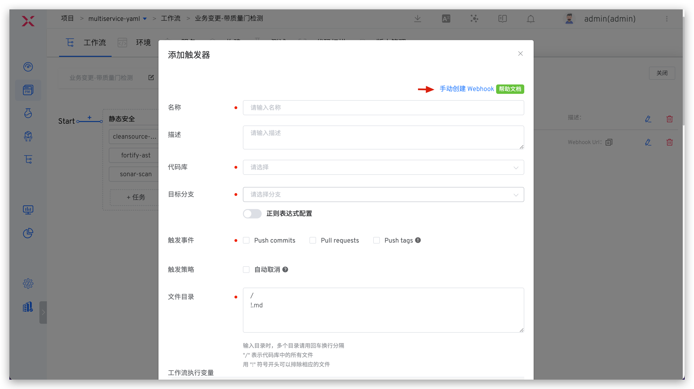
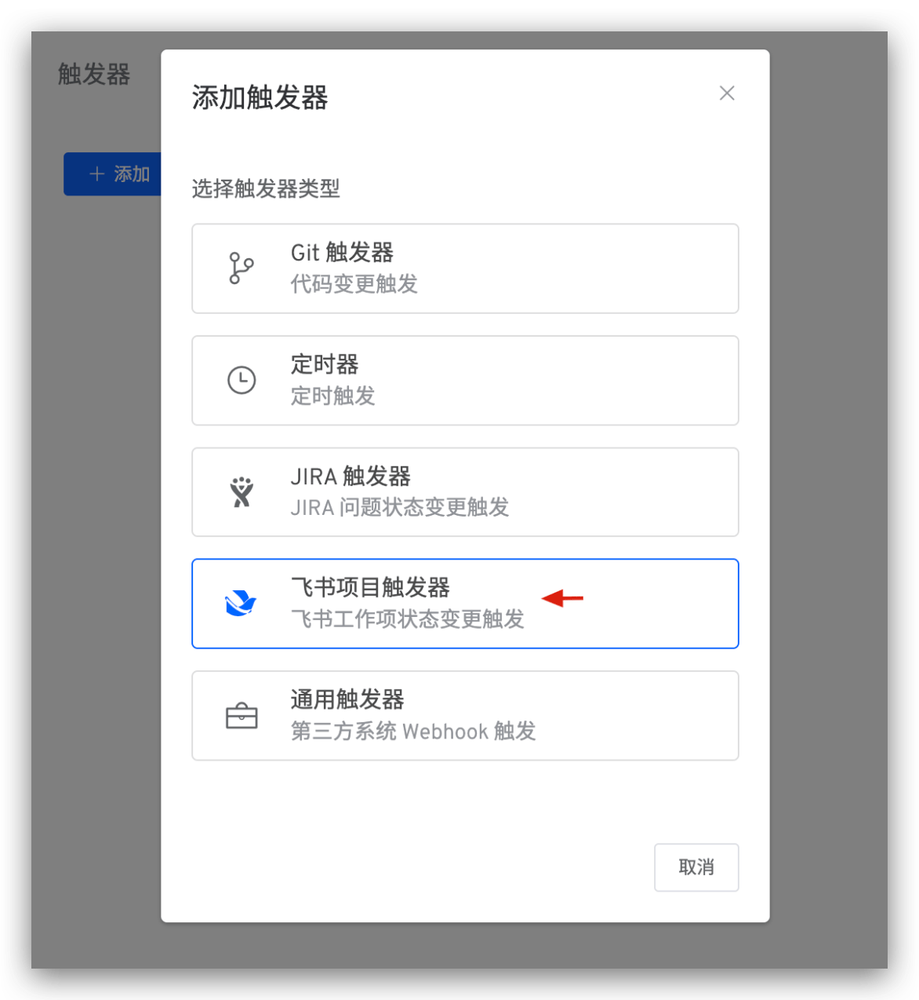

This article introduces Zadig workflow triggers, including:
- Manual Trigger
- Trigger-based triggers, supporting the following 5 types of triggers:
    - `Git Trigger`: Automatically trigger workflow after code changes
    - `Timer`: Trigger workflow at scheduled times
    - `JIRA Trigger`: Automatically trigger workflow after JIRA issue status changes
    - `Feishu Project Trigger`: Automatically trigger workflow after Feishu project status changes
    - `Universal Trigger`: Third-party systems automatically trigger workflow via Webhook
- Trigger by calling Developer OpenAPI

## Manual Trigger

### Workflow Execution

Click "Execute Workflow" to modify workflow variable values and select tasks to be executed as needed:
> If a workflow variable value is set to a fixed value, that variable will not be visible on the page when executing the workflow.

Click on a specific build task to view the build log:
> Task naming rule: `Service Name-Service Component Name-Task Name`

After workflow execution fails, you can retry the execution. When retried, it will start from the failed task, and previously successful tasks will not be executed again.

### Execution Parameters

Description:

- `Area 1`: Select tasks to be executed
- `Area 2`: Enter different execution parameters based on different tasks

## Git Trigger

After configuring Git trigger, when code changes that meet the configured conditions occur, the workflow can be automatically triggered.

::: warning
When the code source is of type `Other`, Git trigger is not supported.
:::

### How to Configure

Code hosting platforms trigger Zadig workflows via Webhook, so you need to configure the corresponding Webhook in the repository. Zadig provides two ways to configure Webhook:
- Automatic Creation: Configure trigger parameters in the workflow, and Zadig will automatically create Webhook in the corresponding code repository. Suitable for scenarios where the code source integration account has permission to create Webhook in the code repository.
- Manual Creation: First configure Webhook in the code repository, then configure trigger parameters in Zadig. Suitable for scenarios where the code source integration account does not have permission to create Webhook in the code repository.

##### Automatic Creation

Click `Triggers` on the right side of the workflow.

Select `Git Trigger` -> Fill in parameters and save.

Parameter Description:
- `Workflow Execution Variables`: Tasks you want to be triggered by Webhook, and their specific configurations
- Other parameters: Refer to the description in [Git Trigger Basic Configuration](/en/Zadig%20v4.1/project/common-workflow/#git-trigger)

##### Manual Creation

If the code source integration account in system integration does not have permission to create Webhook in the code repository, you can choose to use manual creation. The steps are as follows:

1. Click `Manual Webhook Creation` to switch to the manual creation page.

2. Access the code repository to configure Webhook, fill in Webhook URL, Secret Token, and trigger events. GitLab example is as follows:

::: tip Trigger events that need to be configured for different code sources
- GitHub code source: Branch or tag creation, Check runs, Pull requests, Pushes
- GitLab code source: Push events, Tag push events, Merge request events
- Gitee code source: Push, Tag Push, Pull Request
:::

3. Refer to [Git Trigger Basic Configuration](/en/Zadig%20v4.1/project/common-workflow/#git-trigger), fill in the relevant configuration in Zadig and save.

### Code Change Trigger Effect

After configuration is complete, you can trigger the workflow by submitting pull request, merge request, or push according to the configuration. Taking GitLab as an example, you can view workflow feedback information in the merge request, as shown below.

<!-- ### Advanced Scenario: Pull Request Independent Test Environment

::: tip
1. Through workflow trigger configuration of baseline environment and environment destruction strategy, achieve continuous delivery process of pull request independent test environment, completing full lifecycle quality verification of a piece of code.
2. Supported code sources refer to [Code Source Information](/en/Zadig%20v4.1/settings/codehost/overview/#feature-compatibility-list).
:::

Pull request level continuous delivery is divided into the following steps:
- Submit updated pull request code
- Generate a temporary environment with the same service version based on the selected baseline environment
- Execute workflow to update service version in the test environment, and perform related automated testing verification for the integration environment
- Recycle the test environment according to environment destruction strategy

Specific configuration is shown in the figure below:

After submitting code changes, you can see status information about the independent environment under the corresponding pull request:

The created independent environment effect is as follows:

 -->

## Timer

### How to Configure

Edit the workflow, click `Triggers` on the right -> Select `Timer`. By configuring the timer, you can achieve periodic workflow execution. It supports timed loops, periodic loops, and Cron expression-based loops.

Parameter Description:

- Workflow Execution Variables: Tasks to be triggered and their specific configurations
- Other parameters: Refer to [Timer Configuration](/en/Zadig%20v4.1/project/common-workflow/#timer)

### Use Effect

After configuration, Zadig executes the workflow according to the configured time period and workflow variables.

## JIRA Trigger

Can automatically trigger Zadig workflow after JIRA issue status changes.

### How to Configure

#### Step 1: Add JIRA Trigger to the Workflow

Edit the workflow, click `Triggers` on the right -> Select `JIRA Trigger`.

Fill in parameters and save the trigger configuration.

Parameter Description:
- `Trigger Event`: Workflow can only be triggered when configured issue status change conditions are met
- `Workflow Execution Variables`: Tasks you want to be triggered and their specific configurations

Copy the Webhook URL and save the workflow.

#### Step 2: Complete Webhook Configuration in JIRA

Access JIRA System -> Click the `Settings` icon in the upper right corner -> Click `System` -> Find `Webhooks` under `ADVANCED` on the left.

Click `+ Create a Webhook` -> Fill in the URL (i.e., the Webhook URL saved in Step 1) and configure trigger events.

::: tip Tips
Currently supports automatic workflow triggering based on `Issue related events`
:::

### Use Effect

When events that meet the conditions occur, the workflow will be automatically triggered. After the workflow execution is completed, a Comment will be added to the corresponding Issue.

## Feishu Project Trigger

Can automatically trigger Zadig workflow after Feishu work item status changes.

### How to Configure

#### Step 1: Add Feishu Project Trigger to the Workflow

Edit the workflow, click `Triggers` on the right -> Select `Feishu Project Trigger`.

Fill in parameters and save the trigger configuration.

Parameter Description:
- `Workflow Execution Variables`: Tasks you want to be triggered and their specific configurations

Copy the Webhook URL and save the workflow.

#### Step 2: Complete Webhook Configuration in Feishu Project

Click `Space Configuration` -> `Automation` -> `Create New Rule` to enter rule creation.

Select rules as needed, and set `Action Type` to WebHook in the operation -> Fill in the URL (i.e., the Webhook URL saved in Step 1) and save the rule.

### Use Effect

When events that meet the conditions occur, the workflow will be automatically triggered. After the workflow execution is completed, a Comment will be added to the corresponding Issue.

## Universal Trigger

### How to Configure

Click `Triggers` on the right -> Select `Universal Trigger` to configure third-party Webhook workflow triggering.

Parameter Description:
- `Workflow Execution Variables`: Tasks you want to be triggered and their specific configurations

Copy the Webhook URL and complete the addition in the third-party system.

## Trigger by Calling Developer OpenAPI

Trigger workflow by calling OpenAPI. For specific operations, refer to [Execute Workflow](/en/Zadig%20v4.1/api/workflow/#execute-workflow).