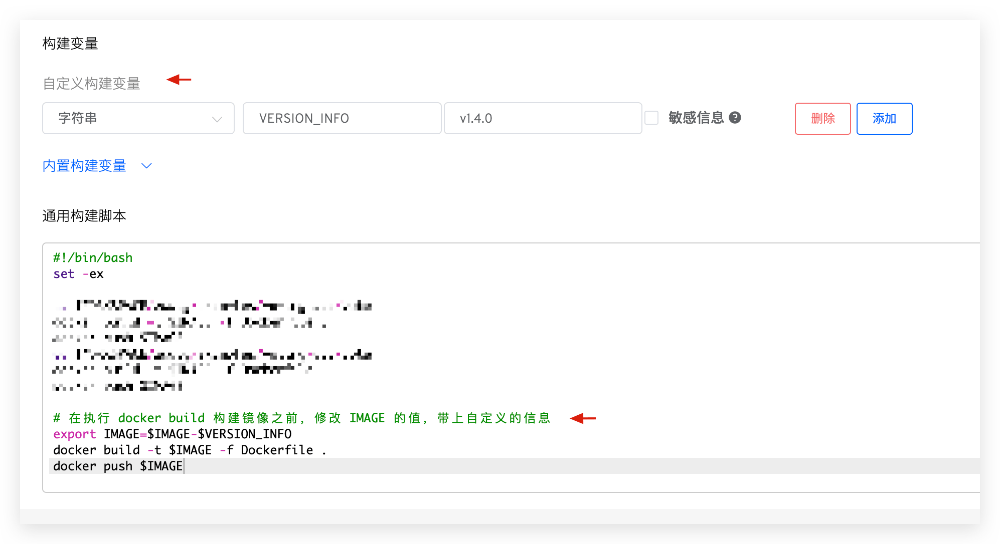

Workflows support various variables (project dimension, workflow dimension, task dimension) and can be freely passed between multiple tasks, workflows, and projects. This article uses a specific scenario to illustrate how to use them.

## Background

Use workflows to build deployment services, aiming to reflect more information in the built images, such as the version number the team is currently sprinting on.

## How to Use

1. Edit the workflow, add variable `VERSION_INFO`, set the value to `Runtime Input`, refer to [Workflow Variables](/en/Zadig%20v4.1/project/common-workflow/#workflow-variable).

2. Add custom variable `VERSION_INFO` to the build configuration and modify the build script. Before building the image, modify the value of variable `IMAGE` to connect it with `VERSION_INFO`, for example: `export IMAGE=$IMAGE-$VERSION_INFO`, refer to [Custom Variables](/en/Zadig%20v4.1/project/build/#build-variables).

3. Modify the variable configuration of the build task in the workflow, and use the workflow global variable `{{.workflow.params.VERSION_INFO}}` from the first step to assign it a value, refer to [Build Task Variables](/en/Zadig%20v4.1/project/common-workflow/#build-task).

## Usage Effect

When executing the workflow, specify the value of `VERSION_INFO`.

For more variable passing usage patterns, refer to [Variable Passing](/en/Zadig%20v4.1/project/common-workflow/#variable-passing) and [Trigger Zadig Workflow](/en/Zadig%20v4.1/project/workflow-jobs/#trigger-zadig-workflow).