This article introduces how to use the notification feature of Zadig workflows.

**Notification Scenarios:**
1. Notify when a workflow event occurs, such as when a workflow starts, completes successfully, or is canceled.
2. Orchestrate notification tasks within the process, for example, notifying a tester to confirm an operation at a specific node in the workflow.

**Notification Methods:**

1. [Feishu Group Notification](#feishu-group-notification)
2. [Feishu Member Notification](#feishu-member-notification)
3. [DingTalk](#dingtalk)
4. [Enterprise WeChat](#enterprise-wechat)
5. [Microsoft Teams](#microsoft-teams)
6. [Email](#email)
7. [Webhook](#webhook-notification)

## Feishu Group Notification

> Supports two configuration methods: "Custom Robot" and "Self-Built Application"

### How to Configure

#### Custom Robot Notification

Step 1: Add a custom robot to the Feishu group and obtain the Webhook address. Refer to [How to Use Robots in a Group](https://www.feishu.cn/hc/zh-CN/articles/360024984973)

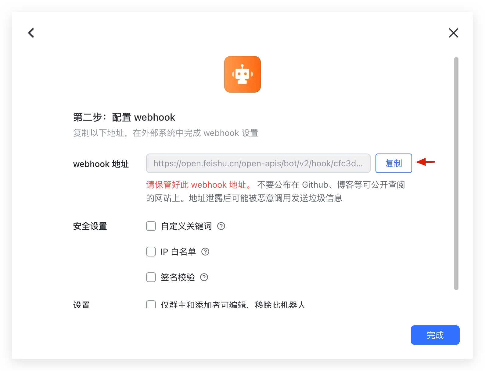

Step 2: Edit the workflow and add a Feishu notification.

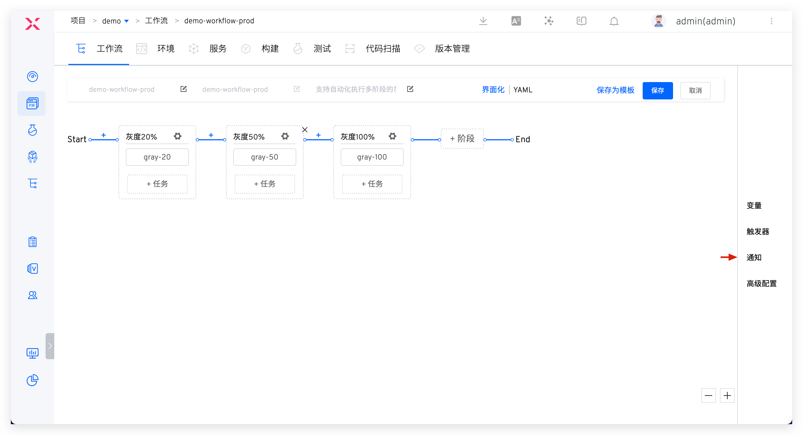

Parameter Description:

- `Notification Type`: Select `Feishu`
- `Webhook Address`: The Webhook address obtained in Step 1
- `@Specific Members`: If you want to notify specific individuals, enter the corresponding user IDs, separated by `;` for multiple users
- `Notification Events`: Configure the notification rules, and multiple workflow statuses can be selected

> Enter the Feishu management backend, click on Organizational Structure > Members and Departments, and select members to obtain their IDs.

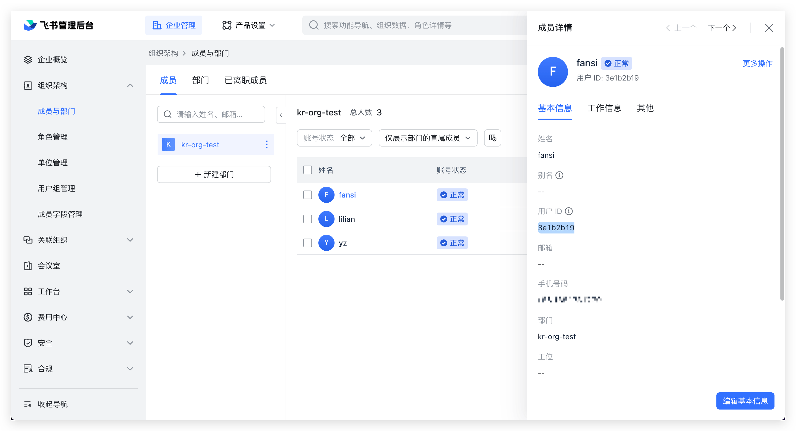

#### Self-Built Application Notification

Step 1: [Integrate Feishu IM](/en/Zadig%20v4.1/settings/approval/#feishu) on Zadig

Step 2: Edit the workflow and add a Feishu notification.

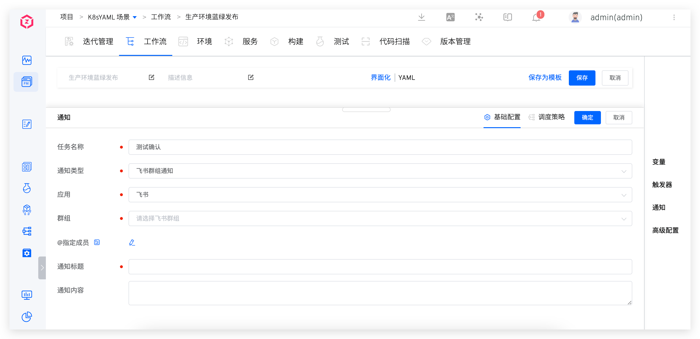


### Notification Effect


## Feishu Member Notification

### How to Configure

Step 1: [Integrate Feishu IM](/en/Zadig%20v4.1/settings/approval/#feishu) on Zadig

Step 2: Edit the workflow and add a Feishu notification.

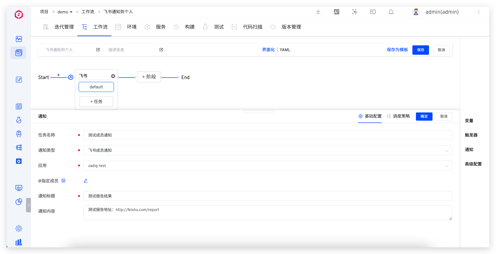

### Notification Effect

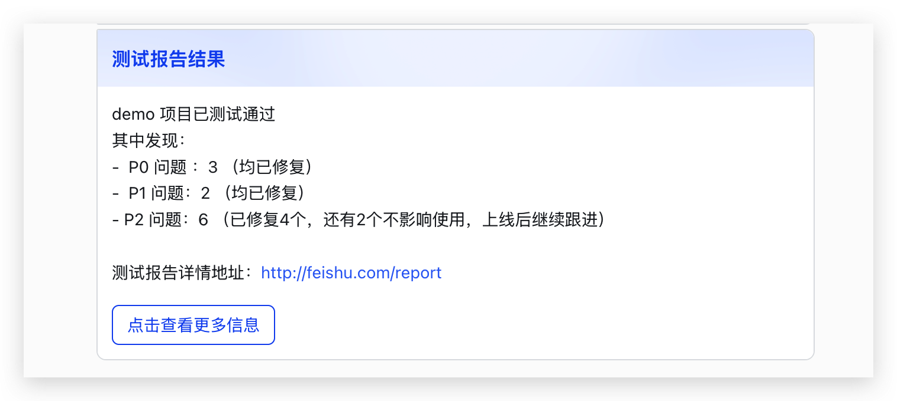

## DingTalk

### How to Configure

Step 1: Configure a DingTalk custom robot and obtain the Webhook address. Refer to [Add DingTalk Custom Robot](https://open.dingtalk.com/document/robots/custom-robot-access#title-jfe-yo9-jl2).

::: tip
When configuring a custom robot in DingTalk, if the security setting is specified as `Custom Keyword`, configure the keyword as `Workflow`.
:::

Step 2: Edit the workflow and add a DingTalk notification.


Parameter Description:

- `Notification Type`: Select `DingTalk`
- `Webhook Address`: The Webhook address obtained in Step 1
- `@Specific Members`: If you want to notify specific individuals, enter the mobile phone numbers of the corresponding DingTalk users, separated by `;` for multiple users
- `Notification Events`: Configure the notification rules, and multiple workflow statuses can be selected

### Notification Effect

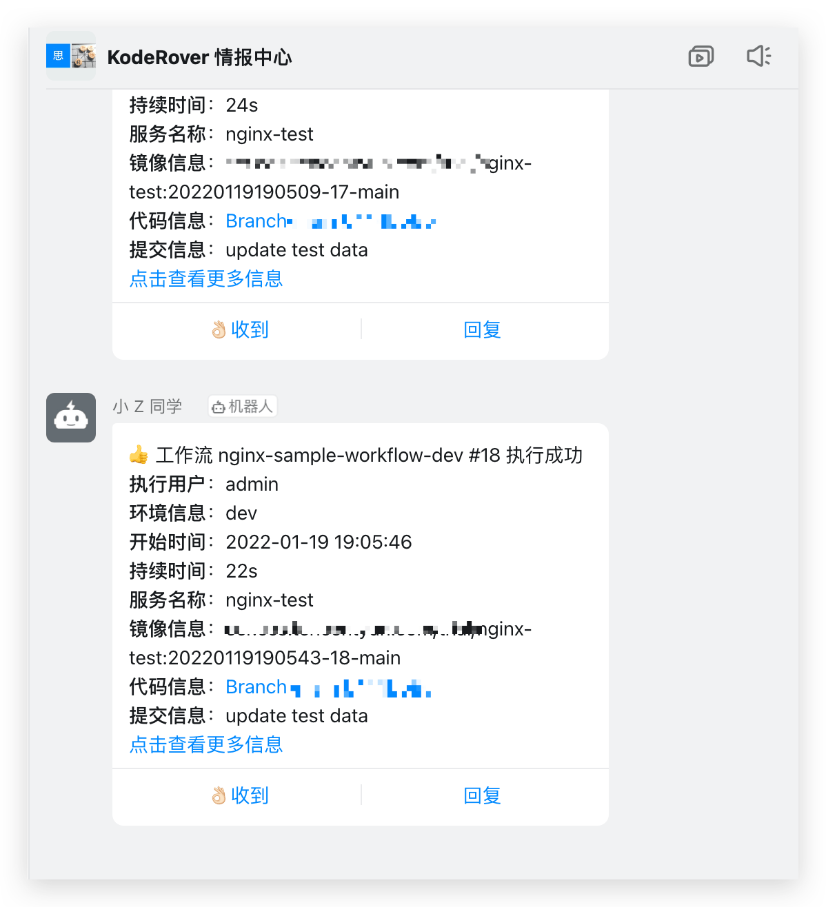

## Enterprise WeChat

### How to Configure

Step 1: Add the enterprise WeChat group robot and get the Webhook address, refer to [How to Set Up Enterprise WeChat Group Robot](https://open.work.weixin.qq.com/help2/pc/14931?person_id=1&is_tencent=).

Step 2: Edit the workflow and add an Enterprise WeChat notification.


Parameter Description:

- `Notification Type`: Select `Enterprise WeChat`
- `Webhook Address`: The Webhook address obtained in Step 1
- `@Specific Members`: If you want to notify specific individuals, enter the corresponding user IDs, separated by `;` for multiple users
- `Notification Events`: Configure the notification rules, and multiple workflow statuses can be selected

> Refer to [How to Obtain a Member's UserID](https://developers.weixin.qq.com/community/develop/doc/00084af5cc8010eaee9a1163f58400) to get the user ID

### Notification Effect

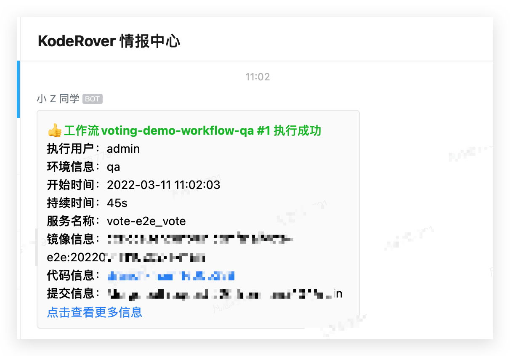

## Microsoft Teams
### How to Configure
Step 1: In the Teams Workflows App, create a workflow based on the "Post to a channel when a webhook request is received" template. Refer to the specific configuration in the [Teams Official Documentation](https://support.microsoft.com/en-us/office/create-incoming-webhooks-with-workflows-for-microsoft-teams-8ae491c7-0394-4861-ba59-055e33f75498)

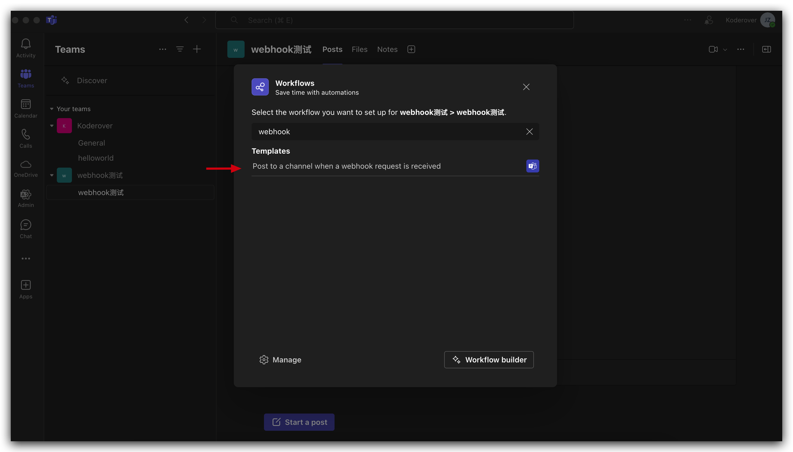

Step 2: After successful creation, obtain the Webhook address.

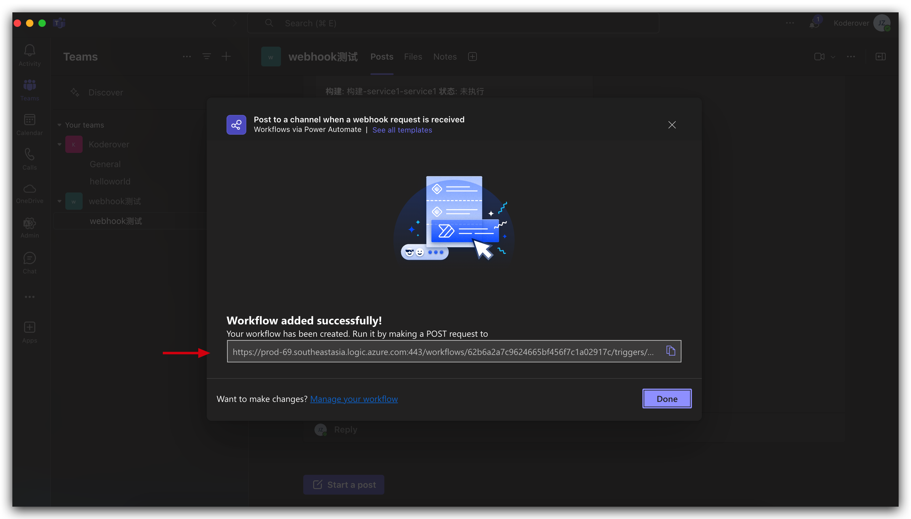

Step 3: Edit the workflow and add a Teams notification.

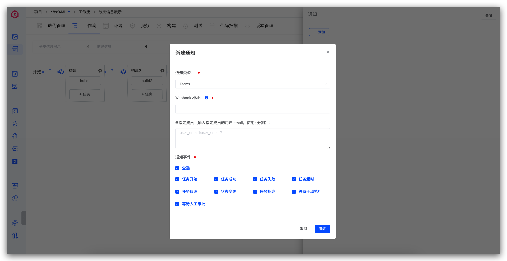

Parameter Description:
- `Webhook Address`: The Webhook address obtained in Step 2
- `Specific Members`: If you want to notify specific individuals, enter the email addresses of the corresponding Teams users, separated by `;` for multiple users

### Notification Effect

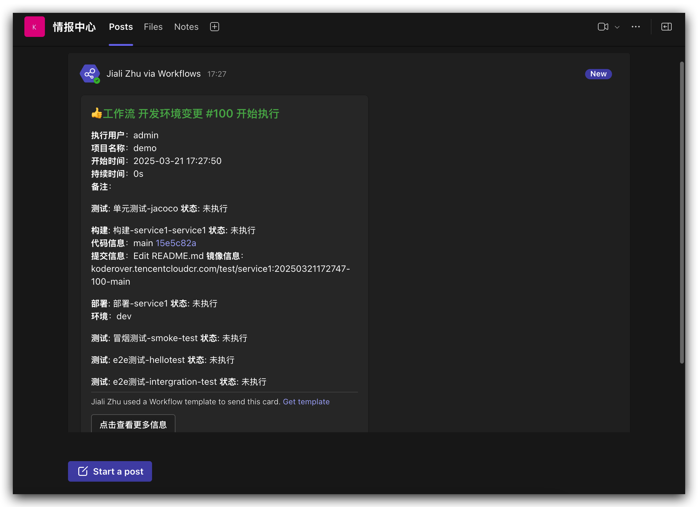

## Email

### How to Configure

Step 1: The system administrator goes to "System Settings" -> "System Configuration" -> "Mail Configuration" to configure the sending mail server configuration. For specific configuration, refer to [Email Configuration](/en/Zadig%20v4.1/settings/system-settings/#mail-configuration).

Step 2: Edit the workflow and add an email notification.

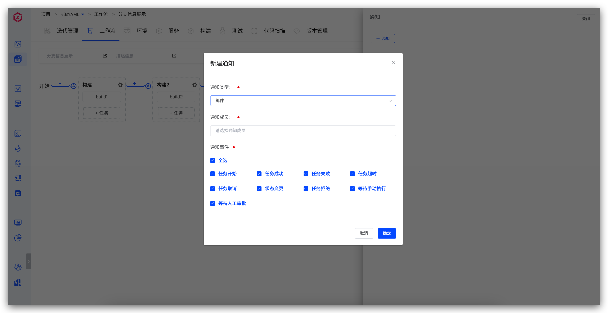

Parameter Description:
- `Notification Members`: You can select the workflow executor, user or user group. Make sure that the notification member has [configured personal email](/en/Zadig%20v4.1/preferences/#account-settings) in the "Account Settings".
- `Notification Events`: Configure the notification rules, and multiple workflow statuses can be selected.

### Notification Effect

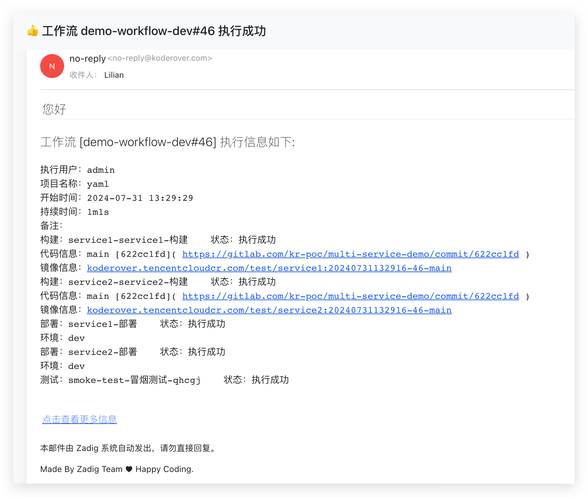


## Webhook Notification

### How to Configure

Edit the workflow and add a Webhook type notification.
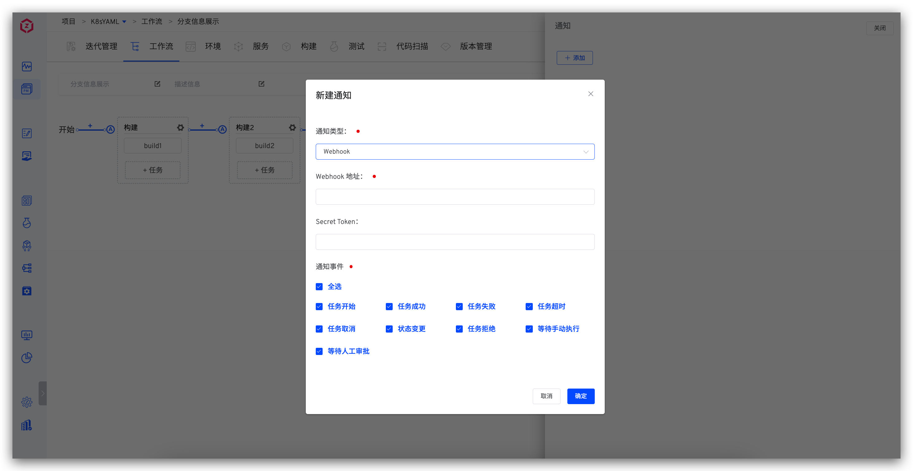

### Payload

#### Header Information

- `x-zadig-event`: The value is workflow
- `x-zadig-event-uuid`: The unique identifier of the webhook event
- `x-zadig-instance`: Zadig access address
- `x-zadig-token`: If a Secret Token is configured, it will be sent
- `x-zadig-webhook-uuid`: The unique identifier of the Webhook

#### Webhook Request Example

::: details

```
curl -X "POST" "https://webhook.site/764375c9-3dd3-41a0-9392-e284015a811e" \
     -H 'Accept-Encoding: gzip' \
     -H 'X-Zadig-Webhook-Uuid: c1bdb079-2653-4f90-96f0-171e621583a9' \
     -H 'X-Zadig-Token: 764375c9-3dd3-41a0-9392-e284015a811e' \
     -H 'X-Zadig-Instance: https://course.koderover.com' \
     -H 'X-Zadig-Event-Uuid: 496534b5-8ac1-4c97-9ddd-be93821f6dc0' \
     -H 'X-Zadig-Event: workflow' \
     -H 'Content-Type: application/json' \
     -H 'Accept: application/json' \
     -H 'Content-Length: 1898' \
     -H 'User-Agent: Zadig/3.2.0' \
     -H 'Host: webhook.site' \
     -d $'{
  "object_kind": "workflow",
  "event": "workflow",
  "workflow": {
    "task_creator": "admin",
    "project_name": "yaml",
    "task_creator_id": "89358827-5137-11ee-b0c5-56d5fd1dd39e",
    "task_creator_email": "xxx@koderover.com",
    "stages": [
      {
        "status": "passed",
        "start_time": 1722404733,
        "end_time": 1722404763,
        "name": "build",
        "jobs": [
          {
            "status": "passed",
            "end_time": 1722404763,
            "start_time": 1722404733,
            "spec": {
              "repositories": [
                {
                  "source": "gitlab",
                  "repo_namespace": "kr-poc",
                  "branch": "main",
                  "commit_id": "622cc1fdfaa87cd72d33c227a1895b860c0e7bd3",
                  "commit_url": "https://gitlab.com/kr-poc/multi-service-demo/commit/622cc1fd",
                  "repo_name": "multi-service-demo",
                  "prs": null,
                  "tag": "",
                  "repo_owner": "kr-poc",
                  "commit_message": "Update deployment.yaml"
                }
              ],
              "image": "koderover.tencentcloudcr.com/test/service1:20240731134527-47-main"
            },
            "type": "zadig-build",
            "error": "",
            "name": "service1-service1-build"
          }
        ],
        "error": ""
      },
      {
        "status": "passed",
        "start_time": 1722404763,
        "end_time": 1722404771,
        "name": "deploy-dev-environment",
        "jobs": [
          {
            "status": "passed",
            "end_time": 1722404771,
            "start_time": 1722404763,
            "spec": {
              "env": "dev",
              "service_name": "service1",
              "service_modules": [
                {
                  "service_module": "service1",
                  "image": "koderover.tencentcloudcr.com/test/service1:20240731134527-47-main"
                }
              ]
            },
            "type": "zadig-deploy",
            "error": "",
            "name": "service1-deploy"
          }
        ],
        "error": ""
      },
      {
        "status": "passed",
        "start_time": 1722404771,
        "end_time": 1722404783,
        "name": "smoke-test",
        "jobs": [
          {
            "status": "passed",
            "end_time": 1722404783,
            "start_time": 1722404771,
            "spec": null,
            "type": "zadig-test",
            "error": "",
            "name": "smoke-test-smoke-test"
          }
        ],
        "error": ""
      }
    ],
    "error": "",
    "start_time": 1722404733,
    "workflow_name": "demo-workflow-dev",
    "detail_url": "https://course.koderover.com/v1/projects/detail/yaml/pipelines/custom/demo-workflow-dev?display_name=demo-workflow-dev",
    "task_id": 47,
    "remark": "",
    "workflow_display_name": "demo-workflow-dev",
    "end_time": 1722404783,
    "task_creator_phone": "1340096xxxx",
    "create_time": 1722404727,
    "status": "passed"
  }
}'
```
:::