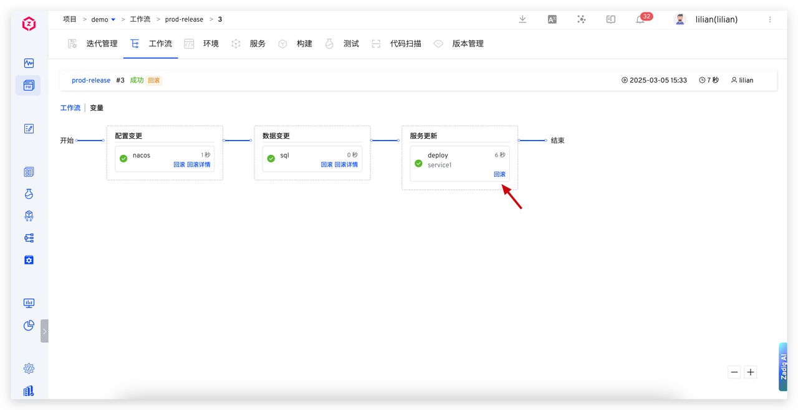
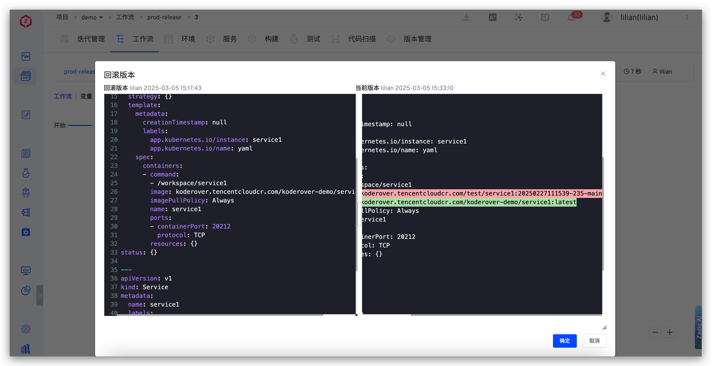
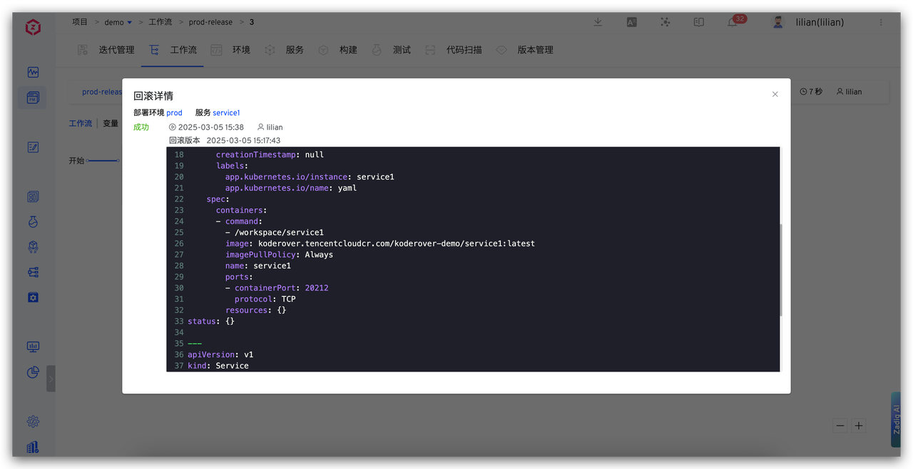
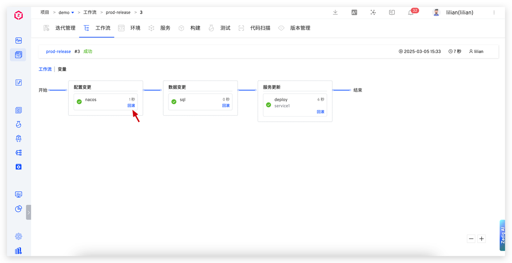
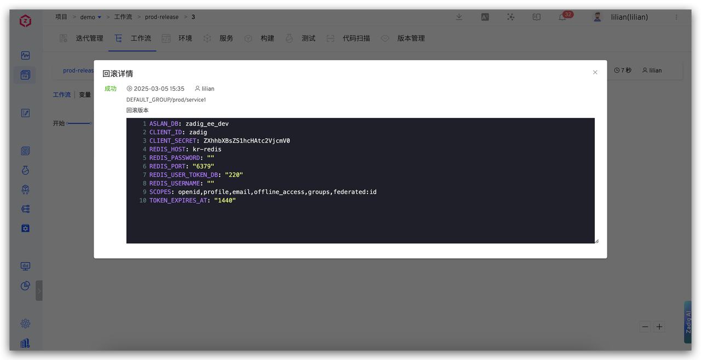
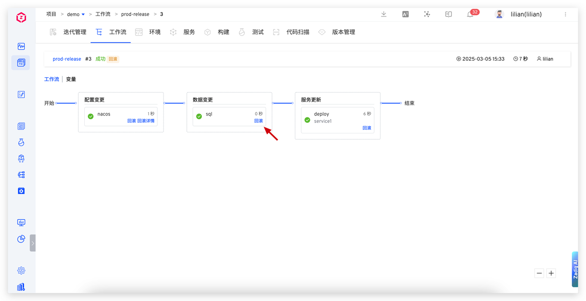
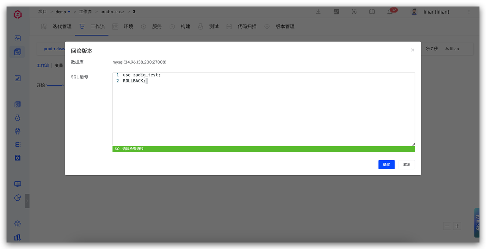
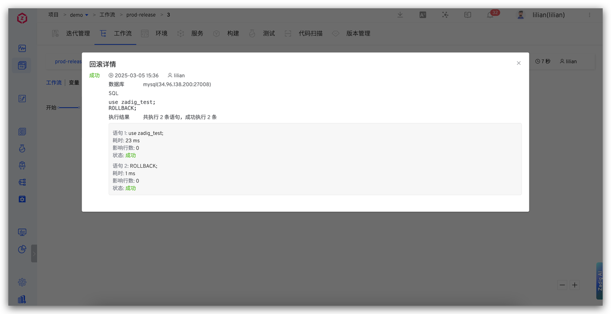

This article introduces the release rollback capabilities supported by Zadig workflows, including rollback functions for service deployment, Nacos configuration changes, and SQL data changes.

## Service Version Rollback

Zadig fully records service image versions. When issues arise with new service versions, users can click the "Rollback" operation in the workflow to compare version differences, quickly switch to stable older versions, and ensure the system resumes operation swiftly.

## Configuration Change Rollback

Leveraging Nacos' configuration version management capabilities, Zadig automatically records independent versions for each configuration change. When problems arise, users can click the "Rollback" button in the workflow to visually compare configuration differences before and after, eliminating blind operations, and roll back to a stable state with one click to ensure configuration correctness and prevent service anomalies.

## SQL Data Change Rollback

Zadig provides data change rollback functionality, ensuring that data operations are traceable and recoverable. When issues arise, users can quickly click the "Rollback" button, enter the rollback SQL, and restore the system to a safe state with one click. This function not only quickly restores data and ensures integrity but also facilitates subsequent audits.

