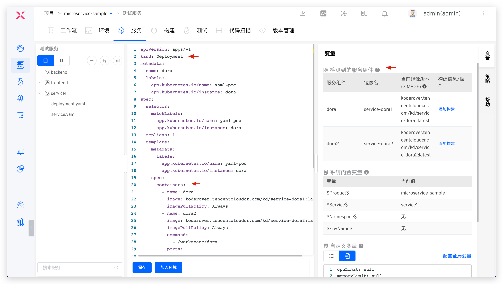
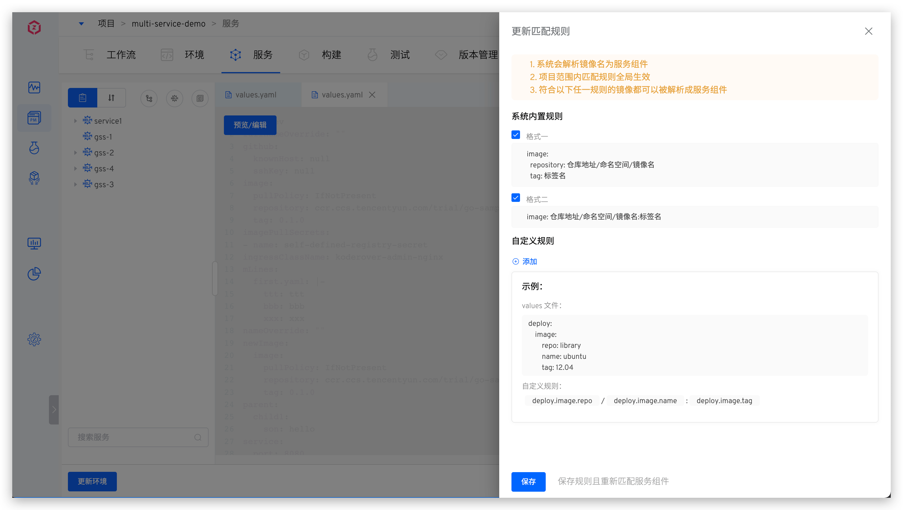

This article introduces the fundamental concepts of Zadig services and environments.

## Environment

A Zadig environment is a comprehensive term for a set of services, their configurations, and the runtime environment. It has a one-to-one relationship with Kubernetes' Namespace. Using a single set of service templates, multiple environments can be created.

Zadig environments are categorized as follows:
- Based on the service deployment method and infrastructure, they are divided into: `K8s YAML Environment`, `K8s Helm Chart Environment`, `K8s Managed Environment`, and `Host Environment`.
- Based on the scenario, they are divided into: `Test Environment` and `Production Environment`.

## Service

Services in Zadig can be understood as a set of Kubernetes resources, including Ingress, Service, Deployment/Statefulset/CronJob, InitContainer, ConfigMap, etc., or a complete Helm Chart or cloud host/physical machine service. After successful deployment, they can provide service capabilities externally.

Zadig services can be classified as follows:
- Based on the service deployment method and infrastructure, they are divided into: `K8s YAML Service`, `K8s Helm Chart Service`, `K8s Managed Service`, and `Host Service`.
- Based on the scenario, they are divided into: `Test Service` and `Production Service`. Test services are used in the test environment, and production services are used in the production environment.

### What is a Service Component?
A service component is an extremely important concept in container services and is the smallest unit that can be updated. Taking the open-source [Zadig](https://github.com/koderover/zadig/blob/main/System-Architecture-Overview.md) service as an example, it includes the following service components:

- `aslan`: Responsible for core functionalities in Zadig, such as projects, environments, services, builds, and system management
- `zadig-portal`: The web interface of Zadig
- `dex`: Responsible for third-party accounts and authentication-related services in Zadig
- ......

A service can contain multiple service components, which can be understood as independent and self-governing modules. All service components combined provide overall service capabilities.


### Analysis of Service Components

For different project types, the logic for parsing service components varies. The following sections provide detailed explanations.

#### K8s YAML Project

The information of the service component comes from the Deployment/Statefulset/CronJob/InitContainer resources in the service K8s YAML configuration. The following figure is an example:

- `Service Component`: The name of the container in the Deployment/StatefulSet/CronJob/InitContainer resource
- `Current Image Version`: The image information of the service component
- `Image Name`: Parsed from `Current Image Version`, the format is: `Repository Address/Namespace/Image Name:Tag Name`



#### K8s Helm Chart Project
The information of the service component comes from the service's values.yaml file content, as shown in the following figure:

- `Current Image Version` : The system analyzes the file according to certain rules to obtain mirror information values.yaml For the analysis rules, see [parse rules](#service-component-parsing-rules)
- `Service Component`: The same as `Image Name`
- `Image Name`: Parsed from `Current Image Version`, the format is: `Repository Address/Namespace/Image Name:Tag Name`


##### Service Component Parsing Rules

Includes built-in rules and custom rules. After importing the Helm Chart configuration file, the system will parse the mirrored content in the vaues.yaml file according to the built-in rules. When the built-in rules do not meet the needs, you can click `Update Matching Rules` on the right side of the service component to customize the mirror resolution rules.



**Built-in Rules**
1. There is the following code segment structure in values.yaml , splicing `image.repository:image.tag` as the mirror version of this component, and the deployment version and update of the service are both centered around `image.repository` and `image.tag` . In this example, it is: `koderover.tencentcloudcr.com/koderover-demo/backend:latest` .

::: details
```yaml
# Helm Chart values.yaml Demo
key1: value1
key2: value2
key3:
  key4: value4
  key5:
    image:
      repository: "koderover.tencentcloudcr.com/koderover-demo/backend"
      tag: "latest"
  key6:
    ...
...
```
:::
2. The value of the `image` field in values.yaml is the mirror information, and the deployment version and update of the service are both around `image` . In this example, `koderover.tencentcloudcr.com/koderover-demo/backend:latest` is.

::: details
```yaml
# Helm Chart values.yaml Demo
key1: value1
key2: value2
key3:
  key4: value4
  key5:
    image: "koderover.tencentcloudcr.com/koderover-demo/backend:latest"
  key6:
    ...
...
```
:::

**Custom Rules**

1. Use the absolute path of the key to parse the component's image information. In the following example, fill in `deploy.image.repo`/`deploy.image.project`/`deploy.image.name`:`deploy.image.tag` in the custom rule.
::: details
```yaml
key1: value1
key2: value2
...
deploy:
  image:
    repo: library
    project: public
    name: ubuntu
    tag: 20.04
```
:::

2. Use the relative path of the key to parse the image information of the service component. In the following example, fill in `repo`, `name`, and `tag` in the repository address, image name, and tag name of the custom rule.
::: details
```yaml
key1: value1
key2: value2
...
deploy:
  image:
    repo: library
    name: ubuntu
    tag: 20.04
```
:::

3. A single parsing rule can be used to parse multiple service components. In the following example, if you fill in `repo`, `name`, and `tag` in the repository address, image name, and tag name of the custom rule, you can parse the images of `service1` and `service2` as `library/service1:v1` and `library/service2:v2`, respectively.
::: details
```yaml
key1: value1
key2: value2
...
deploy:
  service1:
    repo: library
    name: service1
    tag: v1
  service2:
    repo: library
    name: service2
    tag: v2
```
:::

4. The `values.yaml` file can reuse certain keys. In the following example, if you fill in `public.repoInfo` for the repository address, `name:tag` for the image name and tag name in the custom rule, the images for `service1` and `service2` will be parsed as `library/service1:v1` and `library/service2:v2`, respectively.
::: details
```yaml
key1: value1
key2: value2
...
public:
  repoInfo: library
deploy:
  service1:
    name: service1
    tag: v1
  service2:
    name: service2
    tag: v2
```
:::

5. The `Namespace` and `Tag Name` in the custom rule are optional, and you can fill in either the `Repository Address` or the `Image Name`. In the following example, filling in `deploy.image.name` in the repository address or image name of the custom rule is sufficient

::: details
```yaml
deploy:
  image:
    name: library/ubuntu:12.04
```
:::

#### K8s Managed Project

The information of the service component comes from the managed service instances. Currently, it supports Deployment/Statefulset/CronJob/InitContainer type service instances. The following figure is an example:

- `Service Component`: The name of the container in the Deployment/StatefulSet/CronJob/InitContainer instance
- `Current Image Version`: The image version of the managed service instance resource, i.e., the image information
- `Image Name`: Parsed from `Current Image Version`, the format is: `Repository Address/Namespace/Image Name:Tag Name`


### How to Update Service Components

There are three ways to update service components:

1. After configuring the build for the service component, you can select the corresponding service component to update it when running the workflow. See the following configuration documents:
- [Build configuration](/en/Zadig%20v4.1/project/build/#zadig-build)
- [Workflow deployment task configuration](/en/Zadig%20v4.1/project/workflow-jobs/#deployment)

2. Directly modify the service component image in the environment to update it, see [Service instance operation](/en/Zadig%20v4.1/project/env/service/#service-instance-operations) .
3. Update service components by modifying the mirror information in the service configuration file and updating the service in the environment. See [Update service](/en/Zadig%20v4.1/project/env/service/#basic-information) .