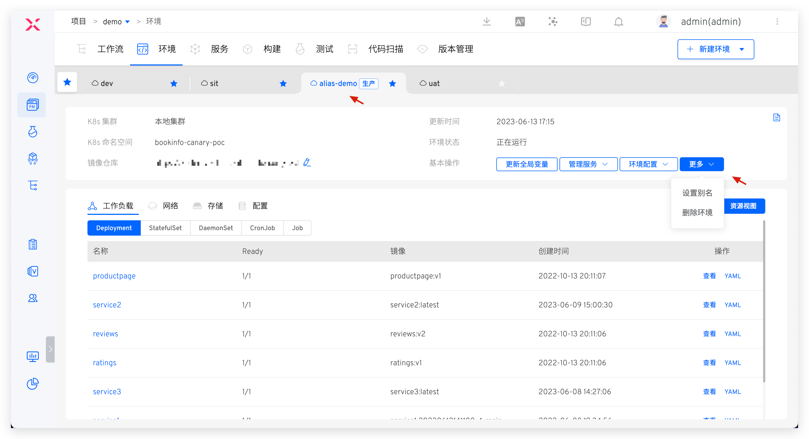

This article introduces the configuration related to the test and production environments in the K8s Helm Chart project.

## View the environment

After the environment is created, click on a different Tab to switch to the details page of the environment. Click `Resource View` to view the resources in the namespace where the environment is located from the resource perspectives such as workload / group / network / storage / configuration.

The basic information of the environment includes the K8s cluster, K8s namespace, update time, environment status, image repository, service list, and Chart view.

- For more information on the Chart view, refer to [Chart View](#chart-view)
- Other introductions can be found K8s YAML Description in the test environment: [View the environment](/en/Zadig%20v4.1/project/env/k8s/#view-the-environment)

## Create a New Environment

::: tip
The number of services and the resources required to start the services will affect the creation time of the environment. Please be patient.
:::

### Test Environment
In the project, click the `New Environment` button, select the test environment, and enter the new environment page.

#### Basic Information

- `Environment Name`: The name of the environment to be created, which can be configured based on actual semantics, such as `dev` or `pre-release`.
- `Creation Method` : Supports `New` and `Copy` methods. Reference can be made to replicate environment: [replication environment](#%E5%A4%8D%E5%88%B6%E7%8E%AF%E5%A2%83) .
- `Resource Selection` :
	- `K8s Cluster`: Select the cluster resource to be used when creating a new environment. `Local Cluster` refers to the cluster where the Zadig system is located. For cluster integration, refer to [Cluster Management](/en/Zadig%20v4.1/pages/cluster_manage/)
	- `K8s Namespace`: Different environments will use independent Kubernetes namespaces to achieve isolation. The default rule for creating namespaces in the Zadig system is `<project name>-env-<environment name>`. Users can also customize or select an existing namespace.
	- `Image Repository` : Specify the image registry used after the environment is created, use the workflow to build and deploy services, and modify service images, and use the image registry specified here. For the integration of image registrys, refer to [image registry management](/en/Zadig%20v4.1/settings/image-registry/#add-a-mirror-repository) .
- `Service Selection`: Select the services to be included in the new environment. By default, it includes all services under the current project.

#### Environment Configuration

When creating a new environment, you can create configurations for the environment. The details are as follows:

- You can create multiple configurations of types Ingress, ConfigMap, Secret, and PVC
- Supports direct pasting or importing configurations from the code base. For supported code sources, refer to [Code Source Information](/en/Zadig%20v4.1/settings/codehost/overview/#function-compatibility-list)
- After the environment is created successfully, the newly created configuration here will take effect in the environment / cluster. You can also manage the environment configuration after the environment is created, refer to [the environment configuration management.](/en/Zadig%20v4.1/project/env/k8s/#environment-configuration)

#### Global Service Variables
Click to expand `Global Service Variables` to modify the content of the values file and set environment-level variable values. Two methods are supported:

- Manually enter the content of the YAML file. The details of the content are the variable information to be set.
- Import from the specified code base values. For supported code sources, refer to [Code Source Information](/en/Zadig%20v4.1/settings/codehost/overview/#function-compatibility-list) .

If the `Automatic Synchronization` switch is turned on when importing from the code repository, Zadig will periodically fetch the latest values file from the code repository and automatically update it to the environment.

#### Service Variables

You can modify the content of the values file for the specified service and configure service-level variable values. Three methods are supported:
- Manually enter the content of the values file.
- Synchronize the values file from a specified GitHub/GitLab code repository. If the `Automatic Synchronization` switch is turned on, Zadig will periodically fetch the latest values file from the specified code repository and automatically update it to the environment.
- Manually enter key-value pairs to override the content of the values file in the service configuration.

::: tip Knowledge
1. The settings of service variables only affect a single service.
2. The settings of global service variables affect all services in the current environment.
2. If both global service variables and service variables are set, the priority of service variables is higher than that of global service variables.
:::

### Production Environment

Refer to [Create a new environment](/en/Zadig%20v4.1/project/env/k8s/#production-environment) .

## Copy Environment

> Only the test environment supports copying environments.

Reference K8s YAML Description in the Test Environment: [Copy Environment](/en/Zadig%20v4.1/project/env/k8s/#copy-environment) .

## Update Global Variables
Click `Update Global Variables` in the basic operations to modify the global service variables. After modification, the changes will take effect for all services in the current environment. The following methods are supported:

- Manually enter the values content
- Import values files from the code base. For supported code base, refer to [Code Source Information](/en/Zadig%20v4.1/settings/codehost/overview/#function-compatibility-list)
- Using variable groups, variable groups manage reference [variable group configuration](/en/Zadig%20v4.1/project/helm-chart/#variable-groups)

## Manage Services
Click `Manage Services` in the basic operations to add, update, and delete services in the environment.

### Add a Service

Add services to the environment. Two service sources are supported: `Zadig Service` and `Chart Repository`.

> The test environment only supports adding `Zadig Service`.

**Zadig Serve**

The configuration of the service is managed in Zadig.

Click `Manage Services` -> `Add Service` to select the service you want to add and modify its values content as needed. After selecting a service, the system will automatically detect whether the release exists in the selected Kubernetes namespace. If the resource already exists, you can choose to import the existing service or redeploy the service.

**Chart storehouse**

The service configuration is managed in the Chart repository. To add a service, select `Chart Repository` > click the Add button > enter the service Release name > select the Chart repository and version, and you can modify the values file content as needed.

You can batch import services from an existing Kubernetes namespace: Click `Import from Environment` -> select the default Chart repository -> select the release and click OK. You can modify the Chart version of the release as needed.

::: tip Prerequisites
The release already exists in the namespace where the environment is located.
:::

When adding a service, the system will automatically detect whether the release already exists in the namespace. If it already exists, you can choose to import only the service or redeploy the service to the environment.

### Update Service

Click `Manage Services` -> `Update Service` -> select the service to update, and you can modify its values content as needed -> click `Confirm` to update the service in the environment. If you do not modify the values content, the service will be updated using the values in the service configuration.

### Delete Service

Click `Manage Services` -> `Delete Service` -> select the service to delete -> click `Confirm` to delete the service from the current environment.

## Service Rollback

In the Chart view, click the historical version icon to the right of the Chart to view all historical versions of the Chart, compare the configuration differences between two different versions, and roll back the Chart to the specified version with one click.

## Environment Configuration

For environment configuration Ingress ConfigMap , Secret , PVC resources, refer to [Environment Configuration Management](/en/Zadig%20v4.1/project/env/k8s/#environment-configuration) for details.

## Self-Test Mode

Refer to [Self-test mode](/en/Zadig%20v4.1/project/env/k8s/#self-test-mode) .

## Sleep and Wake Up

Refer to [Sleep and Wake Up](/en/Zadig%20v4.1/project/env/k8s/#sleep-and-wake-up) .

## Change Record
Click the icon in the upper right corner to view the operation log of the environment.

## Chart View

In the Chart view on the left side of the service list, you can quickly filter services, view the values file content of the service instances, and click the update button on the left to update the services in the environment.

If the update fails, the service will turn red, and you can view the specific reason for the failure.

## Set an Alias

Click `Basic Operations` -> `More` -> `Set Alias` button and enter a new name to set an alias for the environment and display it in the Tab.

## Delete Environment
Click `Basic Operations` -> `More` -> `Delete Environment` button and enter the environment name to delete the environment. When the `Delete the K8s namespace and services corresponding to the environment` option is selected:

- If the environment is created based on a new namespace, the delete environment operation will delete the corresponding namespace of the environment and the resources created by the Zadig system.
- If the environment is created based on an existing namespace, the delete environment operation will delete the resources created by the Zadig system in the namespace but will not delete the namespace.

::: tip
1. Given the seriousness of production services, deleting a production environment in Zadig only deletes the environment record. The related service resources in the Kubernetes cluster will not be deleted.
2. If you need to delete resources in the cluster, do it manually after ensuring there is no impact.
:::