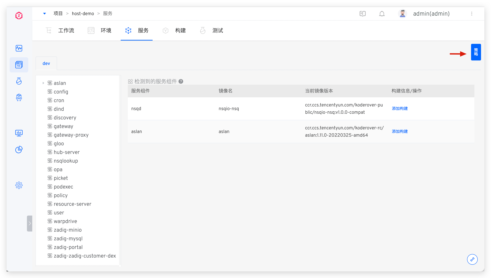
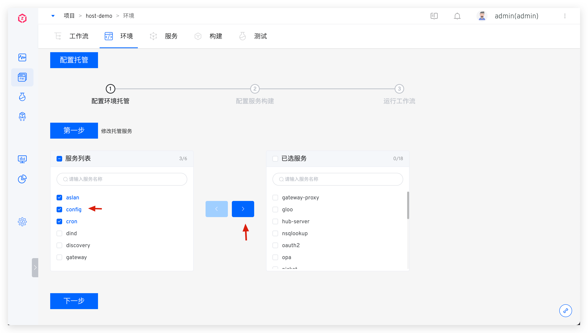

This article introduces the service-related configurations in the K8s hosting project.

## View Hosting Services

Click to switch to different environment tabs to view the service information when hosting services on the Zadig platform.

### Service Components

Refer to [Service Components](/en/Zadig%20v4.1/env/overview/#what-is-a-service-component).

## Tag Management

By tagging services, you can quickly classify and retrieve service metadata. For specific configuration and usage, refer to [documentation](/en/Zadig%20v4.1/project/service/label/).

## Policy Configuration

Set the timeout time for the deployment service and the delivery object naming rules in the policy. For details, refer to [Policy configuration](/en/Zadig%20v4.1/project/service/k8s/#policy-configuration).

## Configure Hosting Services
When you need to remove a service from the environment or add a service to the environment, click `配置托管` under the environment.

Select the service from the left list as needed and drag it to the right, then click `下一步` to add hosting management for the service; or drag the hosted service from the right to the left to cancel hosting the service.

