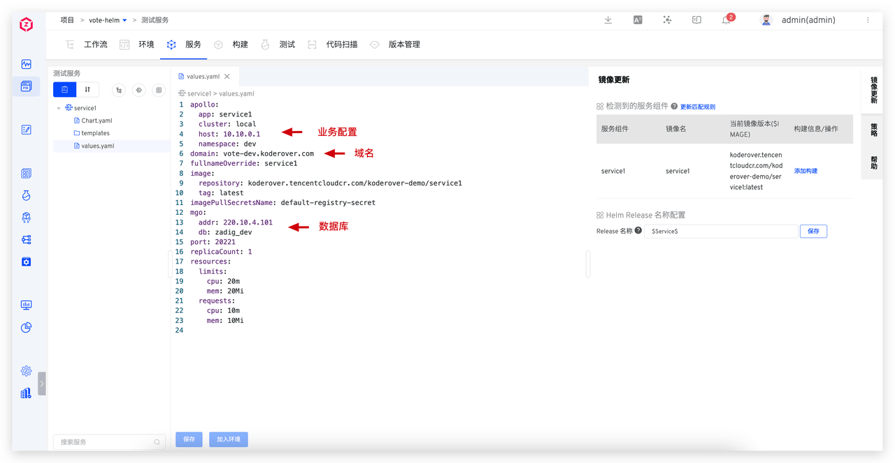
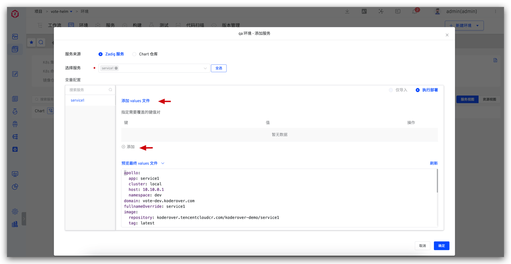
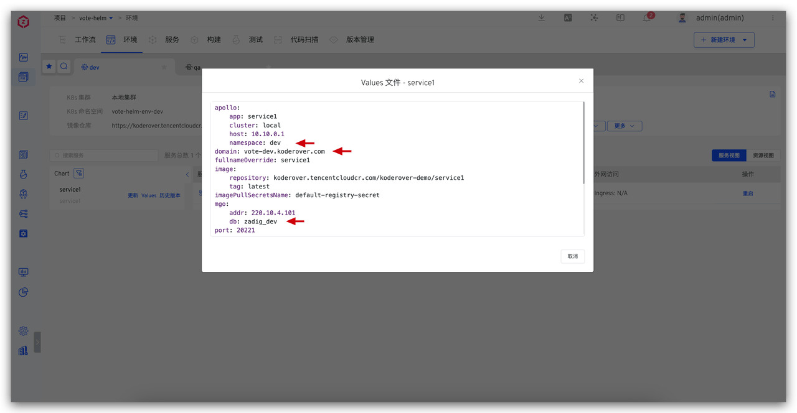
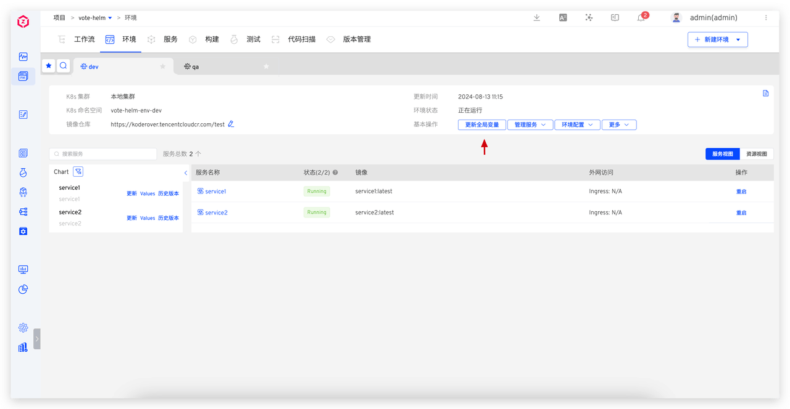
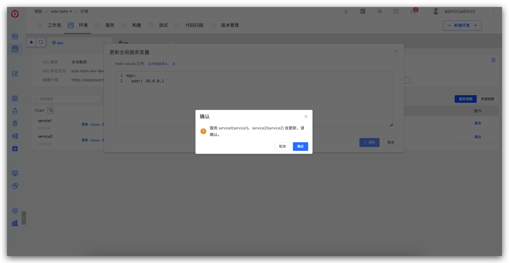

This article introduces how to use Zadig's Helm Chart project variable configuration capabilities to achieve multi-environment isolation and global configuration management through a single configuration. Key use cases include:

- **Define values to distinguish services**:
  - Database Isolation: Each environment's business data is stored independently in different databases, ensuring no interference
  - Differentiated Domain Access: Use different domain names to access different environments
  - Differentiated Business Configuration: Business configurations managed in Nacos, Apollo, and other configuration centers, with different environments using different configurations
- **Global Shared Configuration Management**: Globally manage configurations shared by multiple services

Zadig provides system-built-in variables and custom variables to distinguish different variable values across environments. The following sections detail the practical implementation of these configurations in the Zadig system.

## Define Values to Distinguish Services

Depending on the needs of different environments, services can be distinguished and configured by setting different values for variables.

### Define Values File

For scenarios involving database isolation, differentiated domain access, and differentiated business configuration, define the database, domain name, business configuration, and other information as variables in the values file.

### Use Values File

When creating a new environment or adding a service to an environment, define the values of the corresponding variables in the values file:

The variables for the same service in the dev environment and the qa environment are distinguished as follows:

## Global Shared Configuration Management

In practical application scenarios, multiple services often share the same configuration information (such as database addresses, configuration management system addresses, etc.). To effectively manage these shared configurations and simplify maintenance work, we can use **global variables** to uniformly store and manage these variables.

### Benefits

- **Unified Management**: One modification, globally effective
- **Reduce Errors**: Avoid configuration inconsistencies caused by duplicate configurations
- **Improve Efficiency**: Simplify configuration maintenance work

After modifying the global variables, the system will automatically detect these changes, and all services that depend on these global variables will automatically update accordingly:

