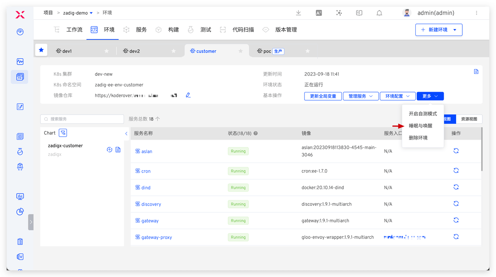
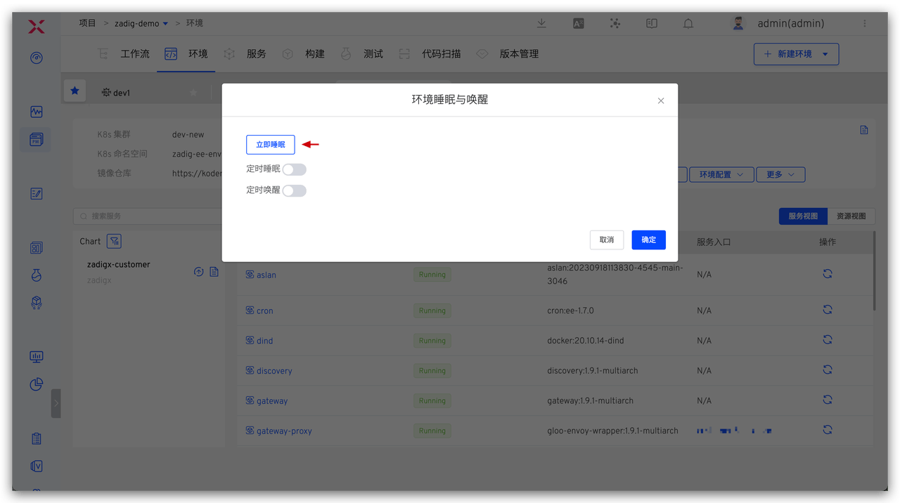
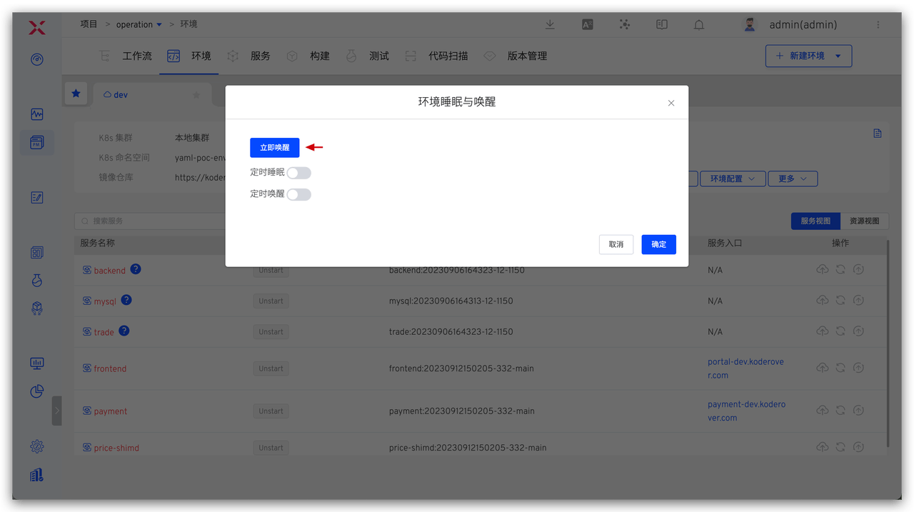
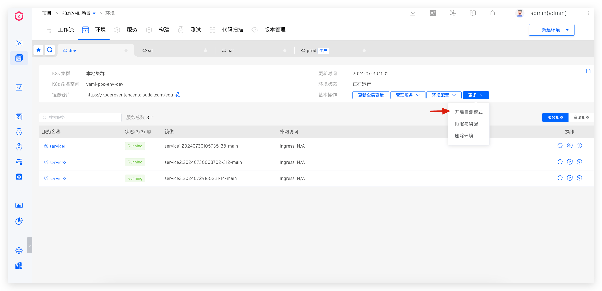
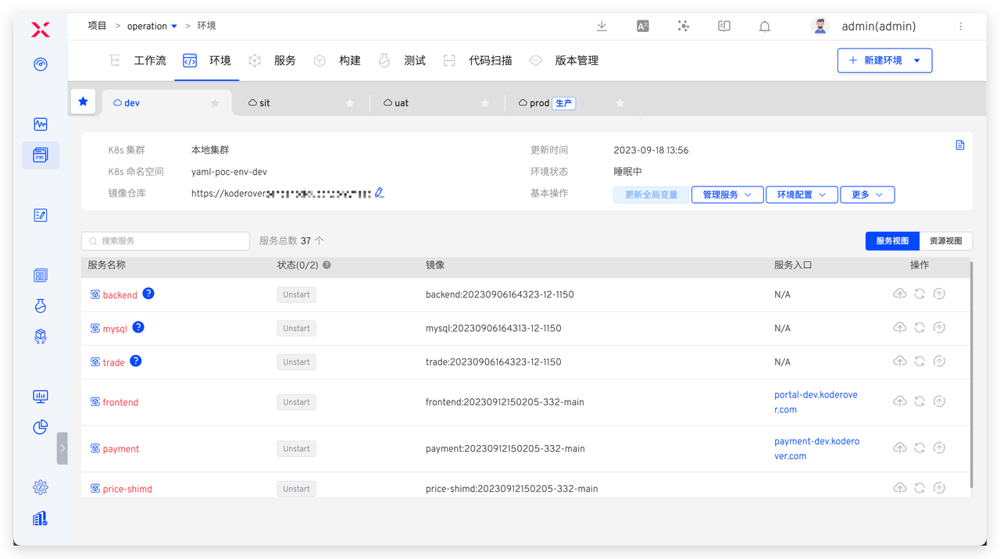
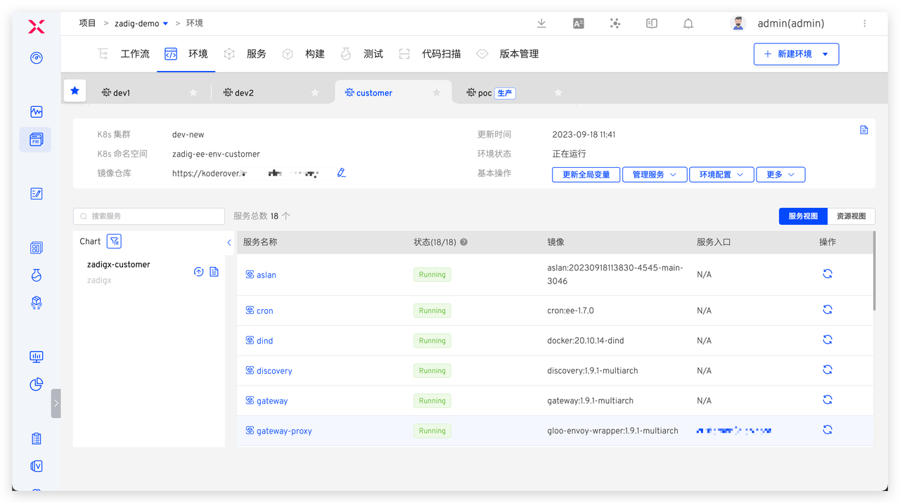

This article introduces how to configure and use environment sleep functionality, as well as demonstrate its effects.

::: warning Warning
Services cannot be added or updated in a sleeping environment.
:::

## One-Click Sleep/Wake

Go to the environment, click Sleep and Wake → Sleep immediately to put the environment to sleep with one click.

When you need to use the environment, enter the sleeping environment and click Sleep and Wake → Wake up immediately to restore the environment to a usable state.

## Configure Timed Sleep/Wake

Go to the environment, click Sleep and Wake → Configure Timed Sleep and Wake Cron Expression.

**Example Configuration**: The environment will sleep at 22:00 every day and wake up at 8:00 every day.

## Usage Effects Overview

### Sleep Effect

After sleeping, the number of replicas of all service instances in the environment will be automatically adjusted to 0, and CronJobs will be suspended, saving the cloud resource costs used by the environment.

### Wake Effect

After waking up, all services in the environment will return to their previous state according to the service orchestration order.

