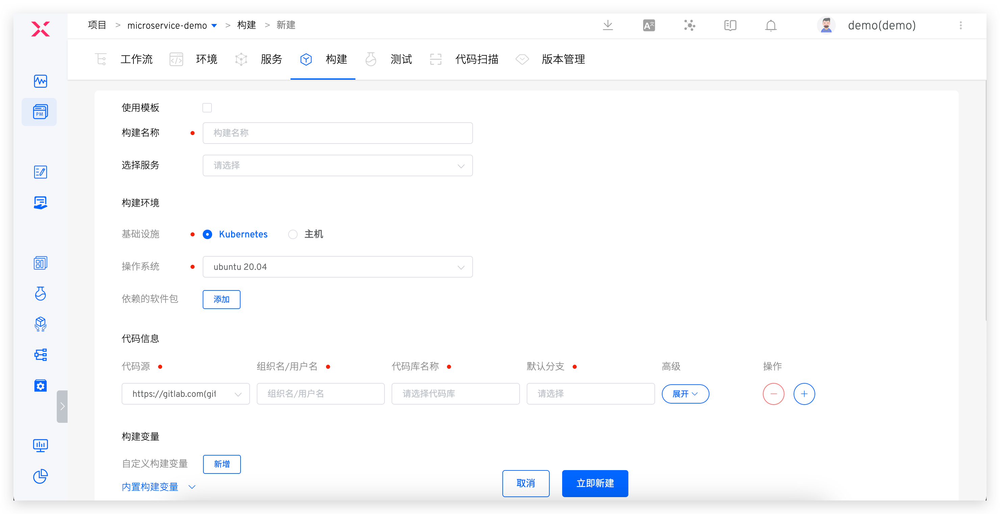
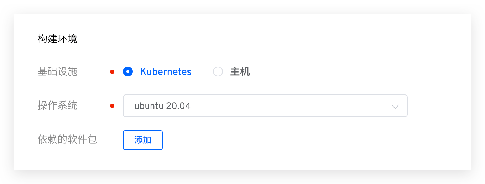
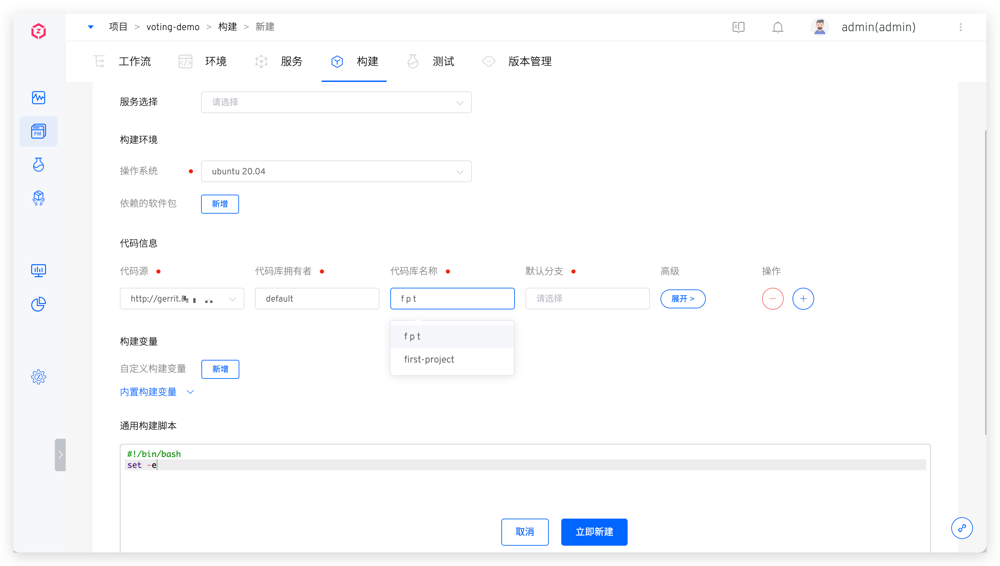
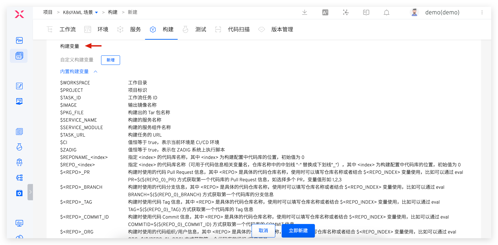
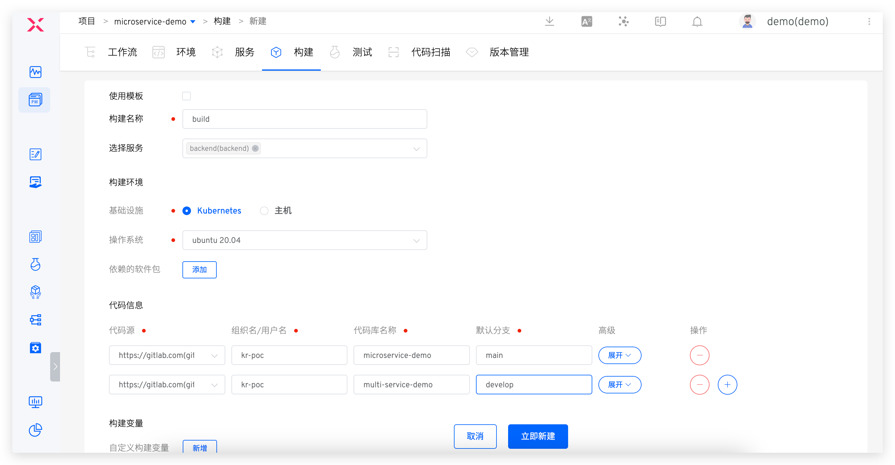
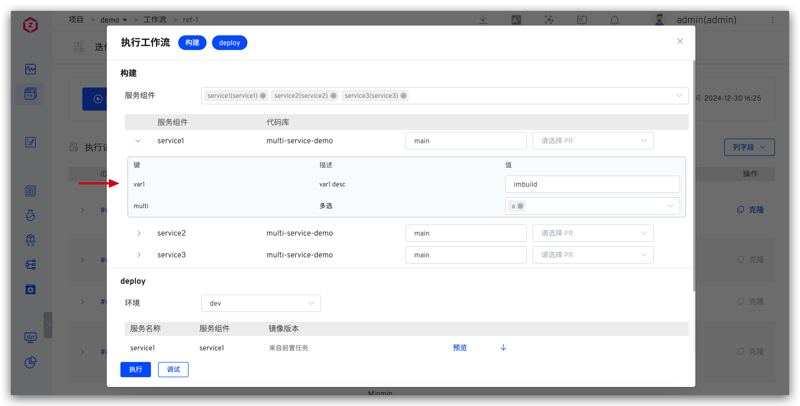
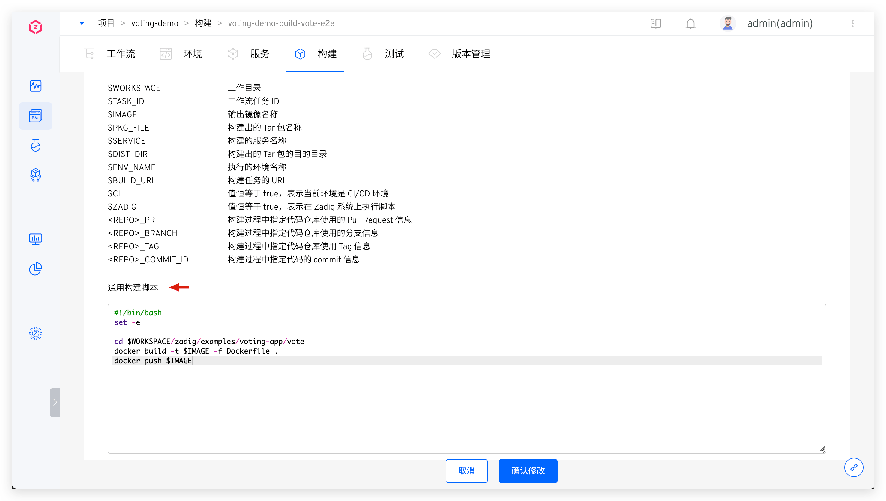
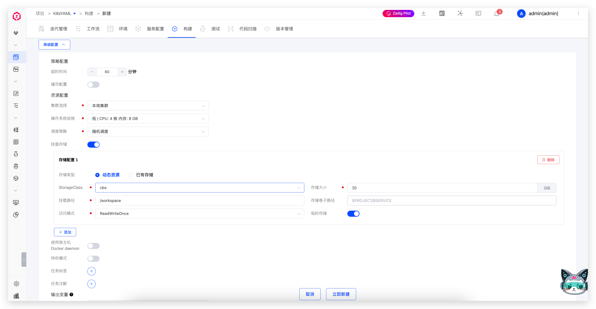
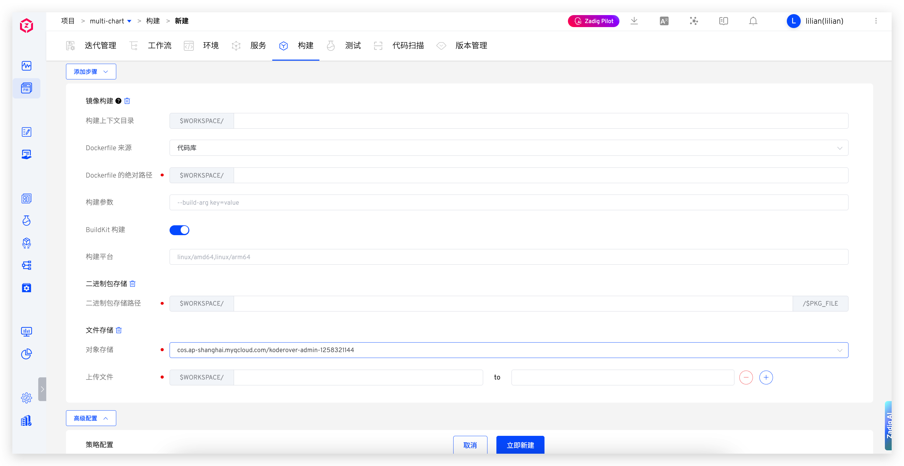

Zadig build supports operations such as pulling code, compiling code, building Docker images/APK packages/Tar packages, pushing images, and uploading to object storage. It comes with common build environments and software packages and supports build caching.



- Supports configuring multiple builds for a service, and select on demand in the workflow configuration. For more details, please refer to [Workflow - Build task configuration](/en/Zadig%20v4.1/project/workflow-jobs/#%E6%9E%84%E5%BB%BA%E4%BB%BB%E5%8A%A1)
- It supports multiple services using the same build configuration. For more details, please refer to [Shared Build](/en/Zadig%20v4.1/project/build/share/)
- Supports modifying the generation rules for building deliverables. For more details, please refer to [Build deliverable generation rules](/en/Zadig%20v4.1/project/service/k8s/#policy-configuration)

::: tip Preparation
Clearly identify the dependencies required for the build, including but not limited to:
- Service compilation code dependencies (such as dependencies on Base libraries, open-source libraries, etc.)
- Service compilation environment dependencies (such as Go version, Node version, compilation tools, etc.)
- Service compilation system dependencies (such as operating systems, etc.)
:::

### Basic Configuration


Parameter Description:
- `Build Name`: Customize it to be meaningful and easy to understand
- `Service Selection`: Select the service to use this build configuration

### Build Environment

Configure the environment for the build process, supporting both Kubernetes and host infrastructure.



#### Using Kubernetes

The build process runs in a K8s Pod, and you can configure operating system and software package dependencies.

- `Operating System`: The platform provides by default Ubuntu 18.04 / Ubuntu 20.04 as the basic build system, it supports adding custom images as the build operating system, refer to [Build image management](/en/Zadig%20v4.1/settings/custom-image/#%E6%AD%A5%E9%AA%A4-1-%E7%94%9F%E6%88%90%E6%9E%84%E5%BB%BA%E9%95%9C%E5%83%8F)
- `Dependencies Software Package`: Various software package tools needed during the build process, such as different versions of Java, Go, Govendor, Node, Bower, Yarn, Phantomjs, etc.

::: tip
1. The default Ubuntu series build systems provided by the platform already support the following tools/commands, which can be used directly in [Software Package Management](/en/Zadig%20v4.1/settings/app/) and build scripts:
    - build-essential / cmake / curl / docker / git
    - libfontconfig / libfreetype6-dev / libpcre3-dev / librrd-dev / libsasl2-dev
    - netcat-openbsd / pkg-config / python / tar / wget
2. When selecting software packages, pay attention to the installation dependencies. The system will install them in the order of selection. For example: Govendor depends on Go, so please select Go first, then Govendor
3. The platform has already built in some common software packages. If there are other software packages or version requirements, the system administrator can configure their installation scripts in [Software Package Management](/en/Zadig%20v4.1/settings/app)
:::

#### Using Host

Execute build steps on the selected host, and the required software, tools, etc., can be installed in advance on the host.

### Code Information



Parameter Description:
- `Code Source`: The platform where the code base is located. Please refer to [Code Source Information](/en/Zadig%20v4.1/settings/codehost/overview/#function-compatibility-list) for supported code sources
- `Code Repository Owner`: Supports configuring all code repository owners under integrated code sources
- `Code Repository Name`: The name of the code repository
- `Default Branch`: The default branch selected when executing workflow configuration build variables, which can be modified during execution
- `Remote name`: Specifies the name of the remote code repository, default `origin`
- `Clone Directory Name`: Defines the directory name after the code repository is cloned, defaulting to the name of the code repository
- `Submodule`: Synchronizes the code repositories configured in `submodule`
- `Pull Specific Commit`: When enabled, supports selecting a specific Commit to execute when running the workflow
- `Display when executing`: On by default. If set to off, the code repository option will not be displayed when executing the workflow, and the code configuration will use the default value

The working directory structure is as follows:

```bash
├── $WORKSPACE         # The root directory of the build task
    ├── repository 1   # The first code repository
    ├── repository 2   # The second code repository
       ├── code       # The code in the second code repository
       └── ...
    └── ...
```

Where:
- `$WORKSPACE` is the built-in variable of the Zadig system build module, for a more detailed description, refer to [System built-in environment variables](/en/Zadig%20v4.1/project/build/#build-variables)

### Build Variables

Includes both system-built-in build variables and user-defined build variables, which can be used directly in the build script.

> Tip: Add `env` commands to [Build script](#build-script) to view all build variables.



**Built-in Build Variables**

Built-in variables and their descriptions are as follows:

|Variable Name|Description|
|-------|---|
|`WORKSPACE`|Current workflow working directory|
|`WORKFLOW`|Workflow ID for executing the build|
|`PROJECT`|Project ID|
|`TASK_ID`|The ID of the current workflow task, i.e., the task sequence number|
|`IMAGE`|The image name generated by the system according to the built-in rules is used for deployment updates of container services. The naming rules can be modified in the service's [Policy configuration](/en/Zadig%20v4.1/project/service/k8s/#policy-configuration)|
|`PKG_FILE`|The system can modify the naming rules of the delivery file name generated by the built-in rules, and can modify its naming rules in the service's [Policy configuration](/en/Zadig%20v4.1/project/service/k8s/#policy-configuration)|
|`SERVICE_NAME`|The name of the built service|
|`SERVICE_MODULE`|The name of the built service component|
|`TASK_URL`|The URL of the build task|
|`CI`|The value is always true and can be used as needed, such as to determine if it is a CI script or another script|
|`Zadig`|The value is always true and can be used as needed, such as to determine if it is being executed in the Zadig system|
|`REPONAME_<index>`|1. Get the code repository name of the specified `<index>`<br>2. `<index>` is the position of the code in the build configuration, with an initial value of 0<br>3. In the following example, using `$REPO_0` in the build script will get the name of the first code repository `voting-app`|
|`REPO_<index>`|1. Get the code repository name of the specified `<index>` and automatically replace the hyphen `-` in the name with an underscore `_`<br>2. `<index>` is the position of the code in the build configuration, with an initial value of 0<br>3. In the following example, using `$REPO_0` in the build script will get the converted name of the first code repository `voting_app`|
|`<REPO>_PR`|1. Get the Pull Request information used for the specified `<REPO>` during the build process. When using, please replace `<REPO>` with the specific code repository name<br>2. When the `<REPO>` information contains a hyphen `-`, replace `-` with an underscore `_`<br>3. In the following example, to get the Pull Request information for the `voting-app` repository, use `$voting_app_PR` or `eval PR=\${${REPO_0}_PR}`<br>4. If multiple PRs are specified during the build, such as PR IDs 1, 2, 3, the value of the variable will be `1,2,3`<br>5. When the code repository is from the `other` code source, this variable is not supported|
|`<REPO>_BRANCH`|1. Get the branch information used for the specified `<REPO>` during the build process. When using, please replace `<REPO>` with the specific code repository name<br>2. When the `<REPO>` information contains a hyphen `-`, replace `-` with an underscore `_`<br>3. In the following example, to get the branch information for the `voting-app` repository, use `$voting_app_BRANCH` or `eval BRANCH=\${${REPO_0}_BRANCH}`|
|`<REPO>_PRE_MERGE_BRANCHES`|1. Pre-merge branches when running multi-branch merge builds; `<REPO>` is the specific repository name and can be provided directly or combined with the `$<REPO_INDEX>` variable<br>2. If `<REPO>` contains a hyphen `-`, replace it with an underscore `_`<br>3. For example, use `eval BRANCH=\${${REPO_0}_PRE_MERGE_BRANCHES}` to get the pre-merge branch info for the first repository|
|`<REPO>_TAG`|1. Get the Tag information used for the specified `<REPO>` during the build process. When using, please replace `<REPO>` with the specific code repository name<br>2. When the `<REPO>` information contains a hyphen `-`, replace `-` with an underscore `_`<br>3. In the following example, to get the Tag information for the `voting-app` repository, use `$voting_app_TAG` or `eval TAG=\${${REPO_0}_TAG}`|
|`<REPO>_COMMIT_ID`|1. Get the Commit ID information used for the specified `<REPO>` during the build process. When using, please replace `<REPO>` with the specific code repository name<br>2. When the `<REPO>` information contains a hyphen `-`, replace `-` with an underscore `_`<br>3. In the following example, to get the Commit ID information for the `voting-app` repository, use `$voting_app_COMMIT_ID` or `eval COMMIT_ID=\${${REPO_0}_COMMIT_ID}`<br>4. When the code repository is from the `other` code source, this variable is not supported|
|`<REPO>_ORG`|1. Get the organization/user information used for the specified `<REPO>` during the test process. When using, please replace `<REPO>` with the specific code repository name<br>2. When the `<REPO>` information contains a hyphen `-`, replace `-` with an underscore `_`<br>3. In the following example, to get the organization/user information for the `voting-app` repository, use `$voting_app_ORG` or `eval ORG=\${${REPO_0}_ORG}`|



**Custom Build Variables**

Explanation:

- Supports string (single-line/multi-line), single-choice, multiple-choice, file, and dynamic variable types
- You can set string-type variables as sensitive information, and the value of sensitive variables will not be output in the build log of the workflow task
- When executing workflow tasks, you can modify the values of custom build variables to override the default values configured here, as shown in the figure below:



### Build Script

Declare the build process and implementation in the build script.

> [Build variables](#build-variables) can be used in build scripts



### Advanced Configuration



Explanation:

- `Policy Configuration`: Configure the timeout time for the build service. If the build is not successful after the set time threshold, it will be considered a timeout failure
- `Cache Configuration`: After caching is enabled, the cache directory configured here will be used when the workflow is executed. The directory configuration can use [Build variables](#build-variables)
- `Cluster Selection`: Select the cluster resource to be used when the build task runs, where the local cluster refers to the cluster where the Zadig system is located. For cluster integration, refer to [Cluster Management](/en/Zadig%20v4.1/pages/cluster_manage/)
- `Operating System Specification`: Configure resource specifications for performing build tasks. The platform provides four configurations for High/Medium/Low/Lowest. In addition, you can also customize according to actual needs. If you need to use GPU resource, resource configuration form is `vendorname.com/gpu:num`, please refer to [Scheduling GPU](https://kubernetes.io/zh-cn/docs/tasks/manage-gpus/scheduling-gpus/) for more information
- `Scheduling Policy`: Select the cluster scheduling policy, and the default is `Random Scheduling` policy. Please refer to [Set scheduling policy](/en/Zadig%20v4.1/pages/cluster_manage/#%E8%AE%BE%E7%BD%AE%E8%B0%83%E5%BA%A6%E7%AD%96%E7%95%A5) management
- `Mount Storage`: Mount persistent storage for build tasks, supports configuring storage type, storage size and mount path, can be used for storing build artifacts and other scenarios
- `Use Host Docker daemon`: After enabling, the Docker daemon on the node where the container is located will be used during the build execution process to perform Docker operations
- `Privileged`: After enabling, the container in the Pod will run in privileged mode. This is suitable for build scenarios that require running Docker inside the container or need higher system permissions. **Note: Privileged mode has certain security risks and is only recommended in trusted environments**
- `Task Labels`: Configure the Pod resource tags for the build task execution
- `Task Annotations`: Configure the Pod resource annotations for the build task execution
- `Output Variables`: Output the environment variables in the build, which can realize the variable transfer between different tasks in the workflow, refer to [Variable passing](/en/Zadig%20v4.1/project/common-workflow/#%E5%8F%98%E9%87%8F%E4%BC%A0%E9%80%92)

### More Build Steps

In `Add Steps`, you can add more build steps as needed.



**Image Building**

> Build the image according to the configured parameters, using the built-in variable `IMAGE` as the name of the built image, and push it to the image repository.

Parameter Description:

- `Build Context Directory`: The directory where the execution docker build is located
- `Dockerfile Source`: Includes `Code Repository` and `Template Library`. For more information on the template library, see [Dockerfile Template Management](/en/Zadig%20v4.1/template/dockerfile/)
- `Dockerfile Absolute Path`: When Dockerfile originates from the code base, specify the Dockerfile path used to execute docker build
- `Template Selection`: When the Dockerfile originates from the template library, select the specific Dockerfile template
- `Build Parameters`: All parameters that support docker build, such as: `--build-arg key1=value1 --build-arg key2=value2`
- `BuildKit Build`: After enabling, supports multi-platform builds, improving build efficiency and compatibility.

Among the above parameters, except `Dockerfile Source` and `Template Selection`, [Variables](#build-variables) can be used for all other parameters.

**Binary Package Storage**

Configure the storage path for the built binary package.

**File Storage**

Upload the specified file to the object storage. After uploading, the file will be stored in the specified directory of the corresponding bucket in the object storage. The directory here can use [Variables](#build-variables), but it does not support nested variables, such as `${$REPO_0}_BRANCH`.

- Upload specified file: configure the specified file path, such as `infra/result.xml` in the figure above
- Upload all files in the directory (excluding subdirectories): configure the specified directory, such as `infra/examples/` in the figure above

**Shell Script Execution**

Add a Shell script execution step to perform certain operations after the build.