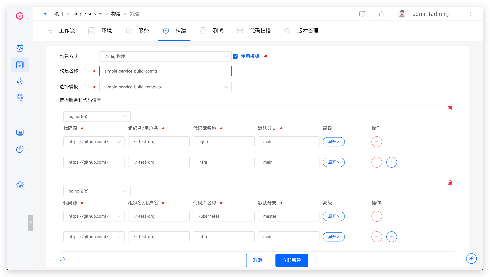
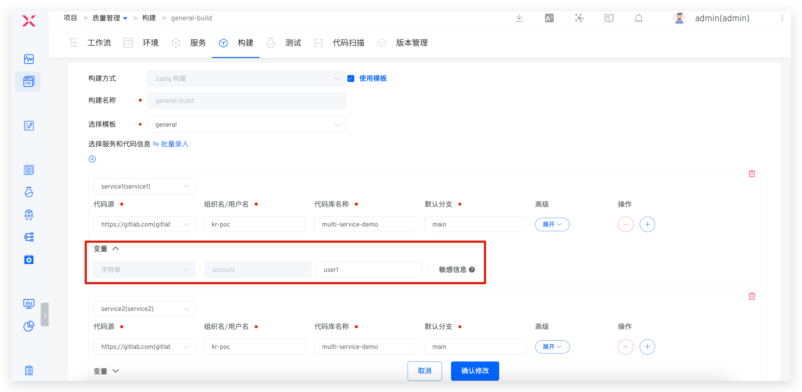
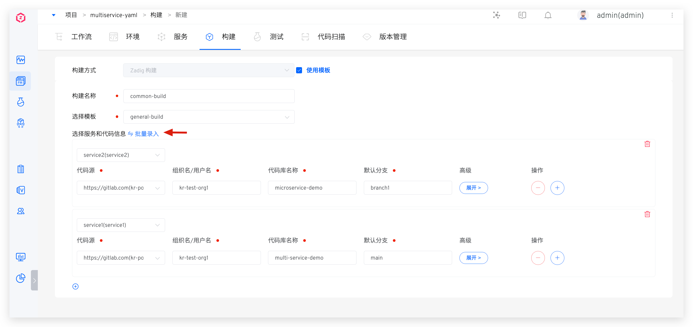
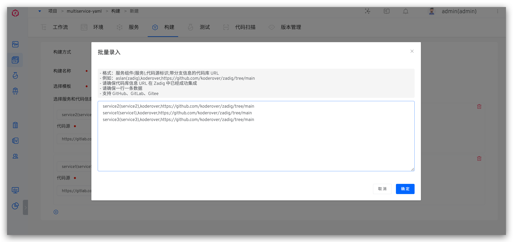

This article introduces how to use Zadig build templates to achieve shared build across multiple projects and standardize the build process of services. When the build configurations of numerous services are similar (for example, multiple service codes of the same technology stack are maintained in separate repositories, the software packages required for building are the same, the build scripts are similar, and only the code information differs), Zadig build templates can be used to enhance the efficiency of configuration and building.

## Configure Build Templates

Go to `Assets` → `Template Library` → `Build`, configure the build template, refer to [New build template](/en/Zadig%20v4.1/template/build/#new-build-template) for the specific configuration.

## Using Build Templates

Create a Zadig build, select `Use Template` → fill in the build name and choose the build template → select the service and configure the code information as needed, then save.

> For relevant parameters in the code information, please refer to [Code information description](/en/Zadig%20v4.1/project/build/#code-information).

If variables are defined in the template, you can define their values in the build, as shown in the figure below.

### Batch Entry

Click `Batch Entry` to batch configure the services and code repositories using the template

::: tip Caution
- Format: service component (service), code source identifier, code repository URL with branch information
- For example: aslan(zadig), koderover, https://github.com/koderover/zadig/tree/main
- Ensure that the code source is already successfully integrated in Zadig. Refer to [Code Source Integration](/en/Zadig%20v4.1/settings/codehost/overview) for the integration method
- One line per data entry
- Please refer to the supported code source: [Code Source Information](/en/Zadig%20v4.1/settings/codehost/overview/#function-compatibility-list)
:::