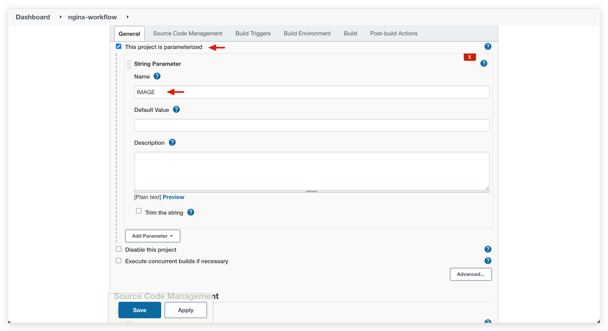
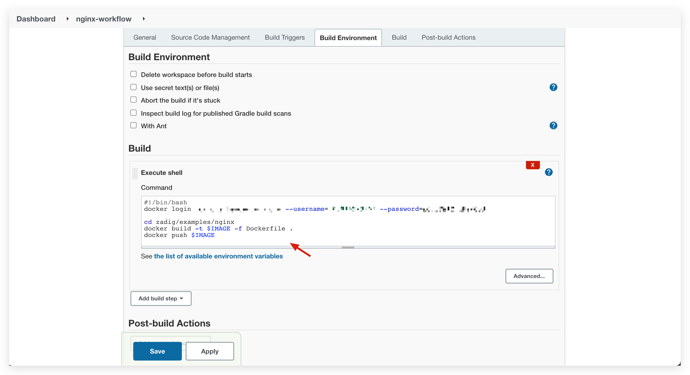
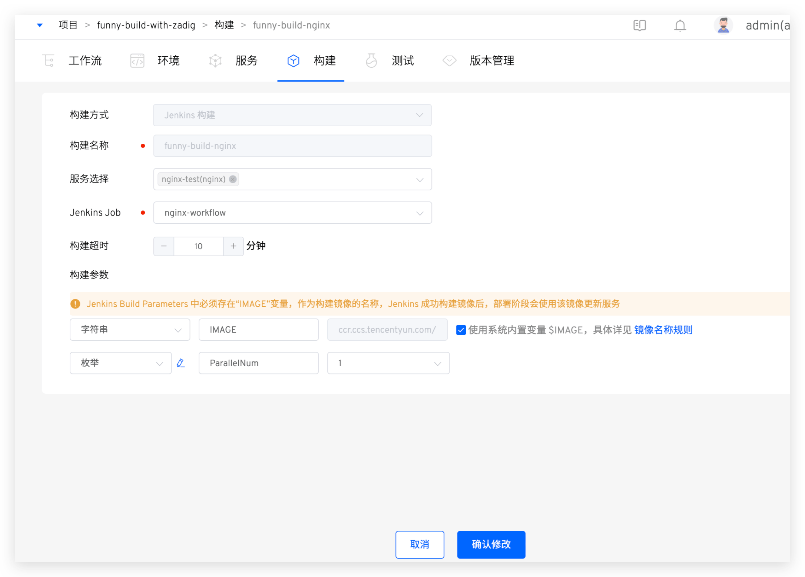
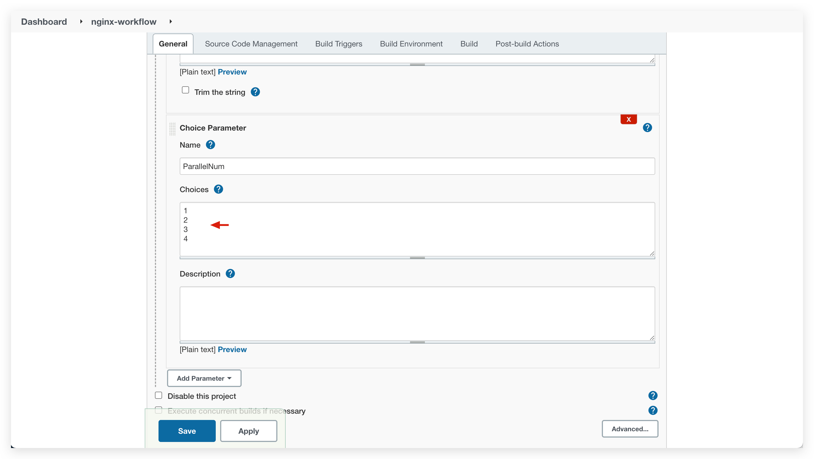
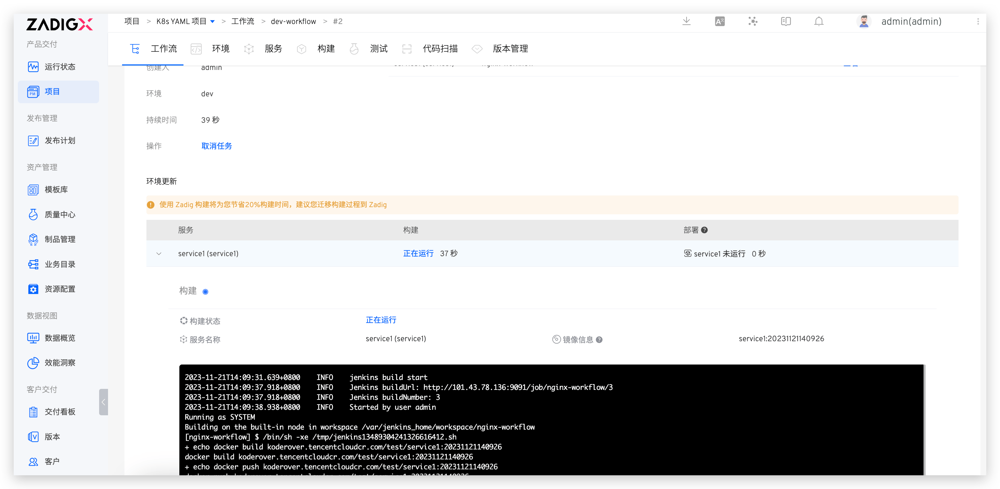

This article introduces how to use "Jenkins Build" in the Zadig build module. If the service build process is already managed on Jenkins, the Zadig product workflow can directly call the existing Jenkins job to build the image and push it to the image repository, and update the service image in conjunction with Zadig deployment tasks.

The differences between `Zadig Build` and `Jenkins Build` are as follows:

- **Zadig Build**: Defines the complete build process for a service in the Zadig platform
- **Jenkins Build**: The specific build process for the service is defined and executed in Jenkins. Zadig provides an entry point to trigger the specific Jenkins job, and updates the services deployed in Zadig based on the image produced by the Jenkins job

### Prerequisites
1. You need to integrate Jenkins servers in the Zadig system first. For details, see [Jenkins integration](/en/Zadig%20v4.1/settings/jenkins)
2. You need to integrate the image repository in the Zadig system first. For details, see [Image Repository Management](/en/Zadig%20v4.1/settings/image-registry/)
3. The Jenkins job you intend to use must be configured with Build Parameters, including the `IMAGE` variable, which represents the built image. The `IMAGE` should be pushed to the integrated image repository. An example is provided below:

### How to Configure

To create a new build, select `Jenkins Build` as the build source, fill in the relevant parameters, and save. The parameters are described as follows:
- `Service Selection`: The service to be built
- `Jenkins Job`: Select the Jenkins job from the integrated Jenkins server as needed
- `Build Timeout`: If the build process has not completed within the set time, it will be considered a build timeout
- `Build Parameters`: Zadig automatically parses the parameters from the corresponding Jenkins job, and the parameter values can be modified in the Zadig platform. The descriptions are as follows:
    - `IMAGE` parameter: that is, the `IMAGE` variable in [Prerequisites](#prerequisites), which will be passed to the corresponding Jenkins Job when running the workflow as the name of the mirror product. Supports the use of built-in variables to assign values to them, refer to [Policy configuration](/en/Zadig%20v4.1/project/service/k8s/#policy-configuration)
    - Enumerated parameters: You can modify the optional values of enumerated parameters. Note: The optional values must be supported by the Jenkins job. For example, if the Jenkins job parameter configuration is as shown below, you can modify the optional values of the enumerated parameter `ParallelNum` in Zadig to 1, 2, 3, 4

### Usage Effect

Executing a Zadig product workflow can trigger the execution of Jenkins tasks and deploy the images generated by the Jenkins tasks to the environment.