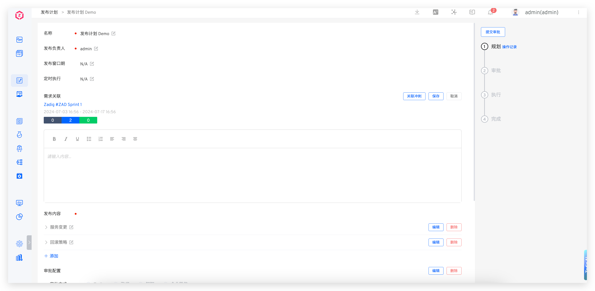
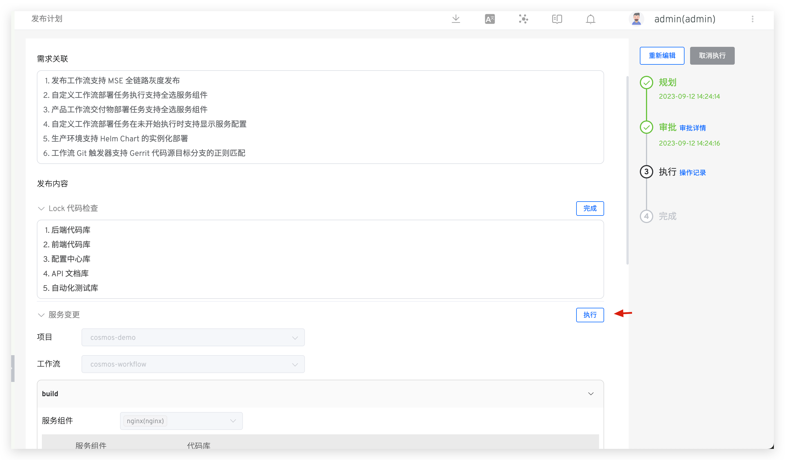
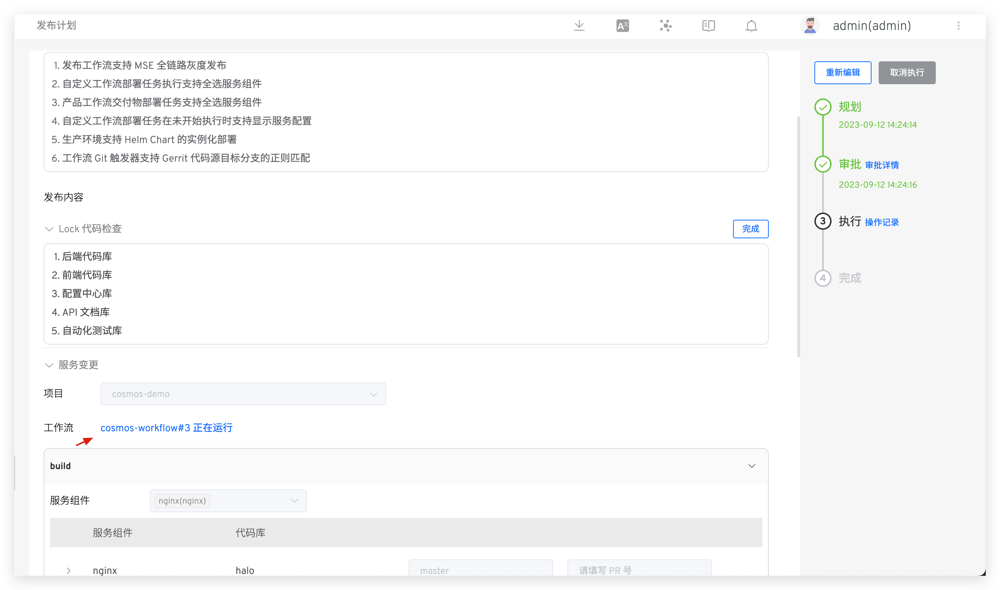
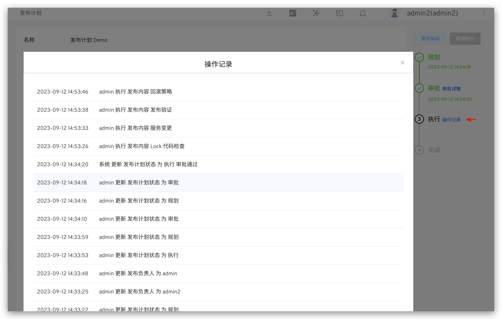

This article primarily explains how to use Zadig's release plan feature, including planning, approval, and execution of release plans, as well as tracking detailed operation records.

## Planning
Access Management -> Release Plan: Create a new release plan, fill in the details, and save it as a draft. This feature supports multi-person collaboration for planning the release.



Parameter Description:

- `Name`: The name of the release plan
- `Release Owner`: The person responsible for this release. After the release plan is formulated, only the owner can execute the release
- `Release Window`: The time window during which publishing operations can be performed
- `Scheduled Execution`: Execute the workflow in the release items at a specified time
- `Requirement Association`: The associated requirement list, supporting multiple JIRA sprints
- `Release Content`: Specific release content, which can include two types: rich text and workflow
    - `Rich Text Type`: Input content
    - `Workflow Type`: Select the project and workflow in Zadig and configure the workflow parameters as needed
- `Approval Configuration`: Configure approval as needed, supporting three methods: Zadig, Feishu, and DingTalk
    - `Zadig` : The approval application will be sent to the email address corresponding to the account Zadig For specific approval configuration, please refer to the document [Zadig](/en/Zadig%20v4.1/workflow/approval/#zadigx-%E5%AE%A1%E6%89%B9/)
    - `Feishu` : The approval application will be sent to Feishu. For specific approval configuration, please refer to the document [Feishu for approval.](/en/Zadig%20v4.1/workflow/approval/%E9%A3%9E%E4%B9%A6%E5%AE%A1%E6%89%B9/)
    - `Dingtalk` : The approval application will be sent to DingTalk. For specific approval configuration, please refer to the document [DingTalk approval.](/en/Zadig%20v4.1/workflow/approval/%E9%92%89%E9%92%89%E5%AE%A1%E6%89%B9/)

## Approval

> This applies to scenarios where the release plan includes approval configuration.

After the release owner submits the approval, the approver is responsible for the approval. Only after the approval is granted can the release owner proceed with the release.

::: tip
If the approval is rejected, the release plan content can be edited again and the release plan can be re-planned.
:::


## Execution

::: tip
1. Execution can be performed within the release time window.
2. Only the release owner can execute the release.
:::

For rich text type release content, click `Complete` on the right and enter the release notes.


For workflow type release content, click `Execute` on the right to automatically trigger the workflow execution. Click the link to view the workflow execution details.
<!-- 终版 ok 后再展开说明工作流执行参数 -->




For release items that need to be skipped, click `Skip`. Once all release items are either executed or skipped, the release plan will be automatically marked as completed.

## Operation Record

The system keeps a detailed record of the release plan's operation logs. Click `Operation Record` to view them.



## Hook External Systems and CallBack

### Hook External Systems

**Request**

```
POST
```

**Body Parameter Description**

| Parameter Name          | Type                                           | Description                                                           |
| ----------------------- | ---------------------------------------------- | --------------------------------------------------------------------- |
| `id`                    | string                                         | Release plan id                                                       |
| `index`                 | string                                         | Release plan index                                                    |
| `name`                  | string                                         | Release plan name                                                     |
| `event_name`            | string                                         | Event name, enum values: finish_planning, start_execute, all_job_done |
| `description`           | string                                         | Requirement association                                               |
| `manager`               | string                                         | Release owner                                                         |
| `manager_id`            | string                                         | Release owner ID                                                      |
| `instance_code`         | string                                         | Instance Code (different after each edit)                             |
| `start_time`            | int                                            | Release window - start time                                           |
| `end_time`              | int                                            | Release window - end time   |
| `schedule_execute_time` | int                                            | Scheduled execution time    |
| `approval_time`         | int                                            | Approval time               |
| `planning_time`         | int                                            | Planning time               |
| `executing_time`        | int                                            | Execution time              |
| `success_time`          | int                                            | Success time                |
| `status`                | string                                         | Status                      |
| `jobs`                  | [][HookReleasePlanJob](#hook-release-plan-job) | Release content list        |
| `created_by`            | string                                         | Creator                     |
| `create_time`           | int                                            | Creation time               |
| `updated_by`            | string                                         | Updater                     |
| `update_time`           | int                                            | Update time                 |


<h4 id="release-status">Release Plan Status Description</h4>

| Name                                             | Description                                       |
| ------------------------------------------------ | ------------------------------------------------- |
| `planning`                                       | Planning                                          |
| `finish_planning`                                | Finished planning                                 |
| `wait_for_approval`                              | Waiting for approval                              |
| `executing`                                      | Executing                                         |
| `denied`                                         | Denied                                            |
| `timeout`                                        | Timeout                                           |
| `success`                                        | Success                                           |
| `wait_for_finish_planning_external_check`        | Waiting for finish planning external check        |
| `wait_for_execute_external_check`                | Waiting for execution external check              |
| `wait_for_all_done_external_check`               | Waiting for all jobs done external check          |
| `wait_for_finish_planning_external_check_failed` | Waiting for finish planning external check failed |
| `wait_for_execute_external_check_failed`         | Waiting for execution external check failed       |
| `wait_for_all_done_external_check_failed`        | Waiting for all jobs done external check failed   |
| `cancel`                                         | Cancel                                            |

<h4 id="hook-release-plan-job">HookReleasePlanJob Parameter Description</h4>

| Parameter Name  | Type           | Description                                                                                                                                                                                                                  |
| --------------- | -------------- | ---------------------------------------------------------------------------------------------------------------------------------------------------------------------------------------------------------------------------- |
| `id`            | string         | Release task id                                                                                                                                                                                                              |
| `name`          | string         | Release task name                                                                                                                                                                                                            |
| `status`        | string         | Release task status                                                                                                                                                                                                          |
| `type`          | string         | Release task type, including text and workflow                                                                                                                                                                               |
| `spec`          | ReleaseJobSpec | Release task specification, when type is text, the specification is [TextReleasePlanJob](#hook-text-release-plan-job), when type is workflow, the specification is [WorkflowReleasePlanJob](#hook-workflow-release-plan-job) |
| `executed_by`   | string         | Executor                                                                                                                                                                                                                     |
| `executed_time` | string         | Execution time                                                                                                                                                                                                               |

<h4 id="release-plan-job-status">Release Plan Task Status Description</h4>

| Name      | Description |
| --------- | ----------- |
| `todo`    | Not started |
| `done`    | Completed   |
| `skipped` | Skipped     |
| `failed`  | Failed      |
| `running` | Running     |

<h4 id="hook-text-release-plan-job">TextReleasePlanJob Parameter Description</h4>

| Parameter Name | Type   | Description |
| -------------- | ------ | ----------- |
| `content`      | string | Content     |
| `remark`       | string | Remark      |

<h4 id="hook-workflow-release-plan-job">WorkflowReleasePlanJob Parameter Description</h4>

| Parameter Name | Type                       | Description                                                                                                                        |
| -------------- | -------------------------- | ---------------------------------------------------------------------------------------------------------------------------------- |
| `workflow`     | [Workflow](#hook-workflow) | Workflow                                                                                                                           |
| `status`       | string                     | Task status including: created(creating), running(running), passed(passed), failed(failed), timeout(timeout), cancelled(cancelled) |
| `task_id`      | int                        | Workflow task ID                                                                                                                   |

<h4 id="hook-workflow">Workflow Parameter Description</h4>

| Parameter Name | Type                                    | Description           |
| -------------- | --------------------------------------- | --------------------- |
| `name`         | string                                  | Workflow identifier   |
| `display_name` | string                                  | Workflow display name |
| `disabled`     | bool                                    | Whether disabled      |
| `params`       | [][WorkflowParam](#hook-workflow-param) | Global variable list  |
| `stages`       | [][WorkflowStage](#hook-workflow-stage) | Stages                |
| `project`      | string                                  | Project identifier    |
| `description`  | string                                  | Description           |
| `created_by`   | string                                  | Creator               |
| `create_time`  | int                                     | Creation time         |
| `updated_by`   | string                                  | Updater               |
| `update_time`  | int                                     | Update time           |
| `remark`       | string                                  | Remark                |

<h4 id="hook-workflow-param">WorkflowParam Global Variable Parameter Description</h4>

| Parameter Name   | Type                        | Description                                           |
| ---------------- | --------------------------- | ----------------------------------------------------- |
| `name`           | string                      | Variable name                                         |
| `description`    | string                      | Variable description                                  |
| `type`           | string                      | Variable type, supports string/text/choice/repo types |
| `value`          | string                      | Variable value                                        |
| `repo`           | [Repo](#hook-workflow-repo) | repo type variable value, used when type is repo      |
| `choice_options` | []string                    | Choice option values                                  |
| `choice_value`   | []string                    | Choice values                                         |
| `default`        | string                      | Default value                                         |
| `is_credential`  | bool                        | Whether it is sensitive information                   |
| `source`         | string                      | Source, supports runtime/fixed/reference              |

<h4 id="hook-workflow-repo">Repo Parameter Description</h4>

| Parameter Name   | Type   | Description          |
| ---------------- | ------ | -------------------- |
| `source`         | string | Source               |
| `repo_owner`     | string | Repository owner     |
| `repo_namespace` | string | Repository namespace |
| `repo_name`      | string | Repository name      |
| `remote_name`    | string | Remote name          |
| `branch`         | string | Branch name          |
| `prs`            | []int  | PR number list       |
| `tag`            | string | Tag name             |
| `commit_id`      | string | Commit ID            |
| `commit_message` | string | Commit message       |
| `checkout_path`  | string | Checkout path        |
| `codehost_id`    | int    | Code source ID       |
| `address`        | string | Address              |

<h4 id="hook-workflow-stage">WorkflowStage Parameter Description</h4>

| Parameter Name | Type                                | Description |
| -------------- | ----------------------------------- | ----------- |
| `name`         | string                              | Name        |
| `jobs`         | [][WorkflowJob](#hook-workflow-job) | Job list    |

<h4 id="hook-workflow-job">WorkflowJob Parameter Description</h4>

| Parameter Name | Type                                       | Description                                                                                                                         |
| -------------- | ------------------------------------------ | ----------------------------------------------------------------------------------------------------------------------------------- |
| `name`         | string                                     | Name                                                                                                                                |
| `type`         | [WorkflowJobType](#hook-workflow-job-type) | Type, supports zadig-build/zadig-deploy/zadig-vm-deploy/zadig-test/zadig-scanning/zadig-distribute-image/freestyle/apollo/nacos/sql |
| `spec`         | any                                        | Job specification                                                                                                                   |
| `run_policy`   | string                                     | Run policy, supports default_not_run/force_run/skip, if empty then default run                                                      |

<h4 id="hook-workflow-job-type">WorkflowJobType Parameter Description</h4>

| Parameter Name           | Corresponding Spec                                                         | Description               |
| ------------------------ | -------------------------------------------------------------------------- | ------------------------- |
| `zadig-build`            | [WorkflowBuildJobSpec](#hook-workflow-build-job-spec)                      | Build job Spec            |
| `zadig-deploy`           | [WorkflowDeployJobSpec](#hook-workflow-deploy-job-spec)                    | Deploy job Spec           |
| `zadig-vm-deploy`        | [WorkflowVmDeployJobSpec](#hook-workflow-vm-deploy-job-spec)               | VM deploy job Spec        |
| `zadig-test`             | [WorkflowTestingJobSpec](#hook-workflow-testing-job-spec)                  | Test job Spec             |
| `zadig-scanning`         | [WorkflowScanningJobSpec](#hook-workflow-scanning-job-spec)                | Scanning job Spec         |
| `zadig-distribute-image` | [WorkflowDistributeImageJobSpec](#hook-workflow-distribute-image-job-spec) | Distribute image job Spec |
| `freestyle`              | [WorkflowFreestyleJobSpec](#hook-workflow-freestyle-job-spec)              | General job Spec          |
| `apollo`                 | [WorkflowApolloJobSpec](#hook-workflow-apollo-job-spec)                    | Apollo job Spec           |
| `nacos`                  | [WorkflowNacosJobSpec](#hook-workflow-nacos-job-spec)                      | Nacos job Spec            |
| `sql`                    | [WorkflowSqlJobSpec](#hook-workflow-sql-job-spec)                          | SQL job Spec              |

<h4 id="hook-workflow-build-job-spec">WorkflowBuildJobSpec Parameter Description</h4>

| Parameter Name       | Type              | Description                                      |
| -------------------- | ----------------- | ------------------------------------------------ |
| `source`             | string            | Source, optional values: runtime/fixed/fromjob   |
| `job_name`           | string            | Referenced job name, used when source is fromjob |
| `ref_repos`          | bool              | Whether to reference selected job code info      |
| `service_and_builds` | []ServiceAndBuild | Service and build list                           |

<h4 id="hook-workflow-service-and-build">ServiceAndBuild Parameter Description</h4>

| Parameter Name   | Type                               | Description            |
| ---------------- | ---------------------------------- | ---------------------- |
| `service_name`   | string                             | Service name           |
| `service_module` | string                             | Service module         |
| `build_name`     | string                             | Build name             |
| `image`          | string                             | Image address          |
| `package`        | string                             | Binary package address |
| `image_name`     | string                             | Image name             |
| `key_vals`       | [][KeyVal](#hook-workflow-key-val) | Build variable list    |
| `repos`          | [][Repo](#hook-workflow-repo)      | Repository list        |

<h4 id="hook-workflow-key-val">KeyVal Parameter Description</h4>

| Parameter Name  | Type     | Description                                                             |
| --------------- | -------- | ----------------------------------------------------------------------- |
| `key`           | string   | Variable name                                                           |
| `value`         | string   | Variable value                                                          |
| `type`          | string   | Variable type, optional values: string/choice/multi-select/image/script |
| `registry_id`   | string   | Image registry ID                                                       |
| `script`        | string   | Script                                                                  |
| `call_function` | string   | Call function                                                           |
| `choice_option` | []string | Choice option values                                                    |
| `choice_value`  | []string | Choice values                                                           |
| `is_credential` | bool     | Whether it is sensitive information                                     |
| `description`   | string   | Description                                                             |
| `source`        | string   | Source, optional values: runtime/fixed/reference                        |

<h4 id="hook-workflow-deploy-job-spec">WorkflowDeployJobSpec Parameter Description</h4>

| Parameter Name    | Type                                                      | Description                                                                                                 |
| ----------------- | --------------------------------------------------------- | ----------------------------------------------------------------------------------------------------------- |
| `env`             | string                                                    | Environment name                                                                                            |
| `production`      | bool                                                      | Whether it is production environment                                                                        |
| `deploy_type`     | string                                                    | Deploy type                                                                                                 |
| `source`          | string                                                    | Source, fromjob/runtime, runtime means runtime input, fromjob means get from upstream build job             |
| `env_source`      | string                                                    | Environment source, fromjob/runtime, runtime means runtime input, fromjob means get from upstream build job |
| `deploy_contents` | []string                                                  | Deploy content, including image/vars/config                                                                 |
| `job_name`        | string                                                    | Referenced job name, used when source is fromjob                                                            |
| `version_name`    | string                                                    | Version name, used when importing from version                                                              |
| `services`        | [][DeployServiceInfo](#hook-workflow-deploy-service-info) | Service list                                                                                                |

<h4 id="hook-workflow-deploy-service-info">DeployServiceInfo Parameter Description</h4>

| Parameter Name         | Type                                                    | Description                                                                    |
| ---------------------- | ------------------------------------------------------- | ------------------------------------------------------------------------------ |
| `service_name`         | string                                                  | Service name                                                                   |
| `modules`              | [][DeployModuleInfo](#hook-workflow-deploy-module-info) | Module list                                                                    |
| `deployed`             | bool                                                    | Whether deployed                                                               |
| `auto_sync`            | bool                                                    | Whether auto sync is enabled in environment                                    |
| `update_config`        | bool                                                    | Whether to update config                                                       |
| `updatable`            | bool                                                    | Whether updatable                                                              |
| `variable_kvs`         | [][DeployVariableKv](#hook-workflow-deploy-variable-kv) | Variable list                                                                  |
| `variable_yaml`        | string                                                  | Final variable Yaml, used for Helm and K8S Yaml services                       |
| `value_merge_strategy` | string                                                  | Values merge strategy, used for Helm services, options: override/reuse-values  |
| `override_kvs`         | string                                                  | Key-value pair variables, used for Helm services, json encoded key-value pairs |

<h4 id="hook-workflow-deploy-module-info">DeployModuleInfo Parameter Description</h4>

| Parameter Name   | Type   | Description    |
| ---------------- | ------ | -------------- |
| `service_module` | string | Service module |
| `image`          | string | Image address  |
| `image_name`     | string | Image name     |


<h4 id="hook-workflow-deploy-variable-kv">DeployVariableKv Parameter Description</h4>

| Parameter Name        | Type   | Description                                           |
| --------------------- | ------ | ----------------------------------------------------- |
| `key`                 | string | Variable name                                         |
| `value`               | string | Image address                                         |
| `type`                | string | Variable type, optional values: string/bool/enum/yaml |
| `options`             | string | Choice option values, used when type is enum          |
| `desc`                | string | Description                                           |
| `use_global_variable` | bool   | Whether to use global variable                        |

<h4 id="hook-workflow-vm-deploy-job-spec">WorkflowVmDeployJobSpec Parameter Description</h4>

| Parameter Name           | Type                                                         | Description                                                                                     |
| ------------------------ | ------------------------------------------------------------ | ----------------------------------------------------------------------------------------------- |
| `env`                    | string                                                       | Environment name                                                                                |
| `production`             | bool                                                         | Whether it is production environment                                                            |
| `env_alias`              | string                                                       | Environment alias                                                                               |
| `source`                 | string                                                       | Source, fromjob/runtime, runtime means runtime input, fromjob means get from upstream build job |
| `job_name`               | string                                                       | Referenced job name, used when source is fromjob                                                |
| `ref_repos`              | bool                                                         | Whether to reference selected job code info                                                     |
| `service_and_vm_deploys` | [][ServiceAndVmDeploy](#hook-workflow-service-and-vm-deploy) | Service and VM deploy list                                                                      |

<h4 id="hook-workflow-service-and-vm-deploy">ServiceAndVmDeploy Parameter Description</h4>

| Parameter Name         | Type                               | Description                                             |
| ---------------------- | ---------------------------------- | ------------------------------------------------------- |
| `service_name`         | string                             | Service name                                            |
| `service_module`       | string                             | Service module                                          |
| `deploy_name`          | string                             | Deploy name                                             |
| `deploy_artifact_type` | string                             | Deploy artifact type, optional values: image/file/other |
| `artifact_url`         | string                             | Deploy artifact address                                 |
| `file_name`            | string                             | Deploy artifact file name                               |
| `image`                | string                             | Deploy artifact image address                           |
| `key_vals`             | [][KeyVal](#hook-workflow-key-val) | Variable list                                           |
| `repos`                | [][Repo](#hook-workflow-repo)      | Repository list                                         |

<h4 id="hook-workflow-freestyle-job-spec">WorkflowFreestyleJobSpec Parameter Description</h4>

| Parameter Name   | Type                                                             | Description                                                                                     |
| ---------------- | ---------------------------------------------------------------- | ----------------------------------------------------------------------------------------------- |
| `freestyle_type` | string                                                           | General job type, empty for single service, service_freestyle for multi-service                 |
| `source`         | string                                                           | Source, fromjob/runtime, runtime means runtime input, fromjob means get from upstream build job |
| `job_name`       | string                                                           | Referenced job name, used when source is fromjob                                                |
| `ref_repos`      | bool                                                             | Whether to reference selected job code info                                                     |
| `repos`          | [][Repo](#hook-workflow-repo)                                    | Repository list, used for single service                                                        |
| `envs`           | [][KeyVal](#hook-workflow-key-val)                               | Variable list, used for single service                                                          |
| `services`       | [][FreeStyleServiceInfo](#hook-workflow-free-style-service-info) | Service list                                                                                    |

<h4 id="hook-workflow-free-style-service-info">FreeStyleServiceInfo Parameter Description</h4>

| Parameter Name   | Type                               | Description     |
| ---------------- | ---------------------------------- | --------------- |
| `service_name`   | string                             | Service name    |
| `service_module` | string                             | Service module  |
| `repos`          | [][Repo](#hook-workflow-repo)      | Repository list |
| `key_vals`       | [][KeyVal](#hook-workflow-key-val) | Variable list   |

<h4 id="hook-workflow-testing-job-spec">WorkflowTestingJobSpec Parameter Description</h4>

| Parameter Name      | Type                                                | Description                                                                                     |
| ------------------- | --------------------------------------------------- | ----------------------------------------------------------------------------------------------- |
| `testing_type`      | string                                              | Test job type, empty for single service, service_test for multi-service                         |
| `source`            | string                                              | Source, fromjob/runtime, runtime means runtime input, fromjob means get from upstream build job |
| `job_name`          | string                                              | Referenced job name, used when source is fromjob                                                |
| `ref_repos`         | bool                                                | Whether to reference selected job code info                                                     |
| `service_and_tests` | [][ServiceAndTest](#hook-workflow-service-and-test) | Service and test list, used when test job type is multi-service                                 |
| `test_modules`      | [][TestModule](#hook-workflow-test-module)          | Test module list, used when test job type is single service                                     |

<h4 id="hook-workflow-service-and-test">ServiceAndTest Parameter Description</h4>

| Parameter Name   | Type                               | Description     |
| ---------------- | ---------------------------------- | --------------- |
| `name`           | string                             | Test name       |
| `service_name`   | string                             | Service name    |
| `service_module` | string                             | Service module  |
| `repos`          | [][Repo](#hook-workflow-repo)      | Repository list |
| `key_vals`       | [][KeyVal](#hook-workflow-key-val) | Variable list   |

<h4 id="hook-workflow-test-module">TestModule Parameter Description</h4>

| Parameter Name | Type                               | Description     |
| -------------- | ---------------------------------- | --------------- |
| `name`         | string                             | Test name       |
| `repos`        | [][Repo](#hook-workflow-repo)      | Repository list |
| `key_vals`     | [][KeyVal](#hook-workflow-key-val) | Variable list   |

<h4 id="hook-workflow-scannings-job-spec">WorkflowScanningsJobSpec Parameter Description</h4>

| Parameter Name          | Type                                                          | Description                                                                                     |
| ----------------------- | ------------------------------------------------------------- | ----------------------------------------------------------------------------------------------- |
| `scannings_type`        | string                                                        | Scanning job type, empty for single service, service_scannings for multi-service                |
| `source`                | string                                                        | Source, fromjob/runtime, runtime means runtime input, fromjob means get from upstream build job |
| `job_name`              | string                                                        | Referenced job name, used when source is fromjob                                                |
| `ref_repos`             | bool                                                          | Whether to reference selected job code info                                                     |
| `service_and_scannings` | [][ServiceAndScannings](#hook-workflow-service-and-scannings) | Service and scanning list, used when scanning job type is multi-service                         |
| `scannings_modules`     | [][ScanningsModule](#hook-workflow-scannings-module)          | Scanning module list, used when scanning job type is single service                             |

<h4 id="hook-workflow-service-and-scannings">ServiceAndScannings Parameter Description</h4>

| Parameter Name   | Type                               | Description     |
| ---------------- | ---------------------------------- | --------------- |
| `name`           | string                             | Scanning name   |
| `service_name`   | string                             | Service name    |
| `service_module` | string                             | Service module  |
| `repos`          | [][Repo](#hook-workflow-repo)      | Repository list |
| `key_vals`       | [][KeyVal](#hook-workflow-key-val) | Variable list   |

<h4 id="hook-workflow-scannings-module">ScanningsModule Parameter Description</h4>

| Parameter Name | Type                               | Description     |
| -------------- | ---------------------------------- | --------------- |
| `name`         | string                             | Scanning name   |
| `repos`        | [][Repo](#hook-workflow-repo)      | Repository list |
| `key_vals`     | [][KeyVal](#hook-workflow-key-val) | Variable list   |

<h4 id="hook-workflow-nacos-job-spec">WorkflowNacosJobSpec Parameter Description</h4>

| Parameter Name | Type                                     | Description                                                                 |
| -------------- | ---------------------------------------- | --------------------------------------------------------------------------- |
| `nacos_id`     | string                                   | Nacos ID                                                                    |
| `namespace_id` | string                                   | Nacos namespace ID                                                          |
| `source`       | string                                   | Source, fixed/runtime, runtime means runtime input, fixed means fixed value |
| `nacos_datas`  | [][NacosData](#hook-workflow-nacos-data) | Nacos data list                                                             |

<h4 id="hook-workflow-nacos-data">NacosData Parameter Description</h4>

| Parameter Name     | Type   | Description           |
| ------------------ | ------ | --------------------- |
| `data_id`          | string | Data ID               |
| `group`            | string | Data group            |
| `desc`             | string | Data description      |
| `format`           | string | Data format           |
| `content`          | string | Data content          |
| `original_content` | string | Original data content |
| `namespace_id`     | string | Nacos namespace ID    |
| `namespace_name`   | string | Nacos namespace name  |

<h4 id="hook-workflow-apollo-job-spec">WorkflowApolloJobSpec Parameter Description</h4>

| Parameter Name   | Type                                                 | Description           |
| ---------------- | ---------------------------------------------------- | --------------------- |
| `apollo_id`      | string                                               | Apollo ID             |
| `namespace_list` | [][ApolloNamespace](#hook-workflow-apollo-namespace) | Apollo namespace list |

<h4 id="hook-workflow-apollo-namespace">ApolloNamespace Parameter Description</h4>

| Parameter Name    | Type                                   | Description     |
| ----------------- | -------------------------------------- | --------------- |
| `app_id`          | string                                 | Application ID  |
| `cluster_id`      | string                                 | Cluster ID      |
| `env`             | string                                 | Environment     |
| `namespace`       | string                                 | Namespace       |
| `type`            | string                                 | Type            |
| `original_config` | [][ApolloKV](#hook-workflow-apollo-kv) | Original config |
| `kv`              | [][ApolloKV](#hook-workflow-apollo-kv) | Key-value list  |

<h4 id="hook-workflow-apollo-kv">ApolloKV Parameter Description</h4>

| Parameter Name | Type   | Description |
| -------------- | ------ | ----------- |
| `key`          | string | Key         |
| `val`          | string | Value       |

<h4 id="hook-workflow-sql-job-spec">WorkflowSqlJobSpec Parameter Description</h4>

| Parameter Name | Type   | Description                                                                 |
| -------------- | ------ | --------------------------------------------------------------------------- |
| `id`           | string | Database instance ID                                                        |
| `type`         | string | Database instance type, mysql/mariadb                                       |
| `sql`          | string | SQL statement                                                               |
| `source`       | string | Source, fixed/runtime, runtime means runtime input, fixed means fixed value |

<h4 id="hook-workflow-distribute-image-job-spec">WorkflowDistributeImageJobSpec Parameter Description</h4>

| Parameter Name                 | Type                                                              | Description                                                                                     |
| ------------------------------ | ----------------------------------------------------------------- | ----------------------------------------------------------------------------------------------- |
| `source`                       | string                                                            | Source, fromjob/runtime, runtime means runtime input, fromjob means get from upstream build job |
| `job_name`                     | string                                                            | Referenced job name, used when source is fromjob                                                |
| `distribute_method`            | string                                                            | Distribute image method, image_push/cloud_sync                                                  |
| `targets`                      | [][DistributeImageTarget](#hook-workflow-distribute-image-target) | Image distribution target list                                                                  |
| `enable_target_image_tag_rule` | string                                                            | Whether to enable image version rule                                                            |
| `target_image_tag_rule`        | string                                                            | Image version rule                                                                              |

<h4 id="hook-workflow-distribute-image-target">DistributeImageTarget Parameter Description</h4>

| Parameter Name   | Type   | Description                                         |
| ---------------- | ------ | --------------------------------------------------- |
| `service_name`   | string | Service name                                        |
| `service_module` | string | Service module                                      |
| `source_tag`     | string | Source image tag                                    |
| `target_tag`     | string | Image version                                       |
| `image_name`     | string | Image name                                          |
| `source_image`   | string | Source image                                        |
| `target_image`   | string | Target image                                        |
| `update_tag`     | bool   | If UpdateTag is false, use source tag as target tag |

**Body Parameter Example**

::: details

```json
{
  "object_kind": "release_plan",
  "event": "release_plan",
  "workflow": null,
  "release_plan": {
    "id": "68b7ec363306e52e21b2dbe6",
    "index": 52,
    "name": "workflow-plan-3",
    "event_name": "all_job_done",
    "manager": "patrick",
    "manager_id": "14790d50-37b3-11f0-b3aa-ee39782dea6e",
    "start_time": 1756883513,
    "end_time": 1757488313,
    "schedule_execute_time": 1756893020,
    "description": "<p><br></p>",
    "created_by": "patrick",
    "create_time": 1756884022,
    "updated_by": "系统",
    "update_time": 1756893023,
    "jobs": [
      {
        "id": "e092f96c-4f78-410e-88bb-7afa881471d9",
        "name": "all",
        "type": "workflow",
        "spec": {
          "workflow": {
            "name": "release-plan-hook-2",
            "display_name": "release-plan-hook-2",
            "disabled": false,
            "category": "",
            "params": [],
            "stages": [
              {
                "name": "build",
                "jobs": [
                  {
                    "name": "build",
                    "type": "zadig-build",
                    "spec": {
                      "source": "runtime",
                      "job_name": "",
                      "ref_repos": false,
                      "service_and_builds": [
                        {
                          "service_name": "service1",
                          "service_module": "service1",
                          "build_name": "yaml-general-build",
                          "image": "{{.job.build.service1.service1.output.IMAGE}}",
                          "package": "{{.job.build.service1.service1.output.PKG_FILE}}",
                          "image_name": "service1",
                          "key_vals": [
                            {
                              "key": "gggg",
                              "value": "gggg",
                              "type": "string",
                              "registry_id": "",
                              "is_credential": false,
                              "description": "",
                              "source": "runtime"
                            }
                          ],
                          "repos": [
                            {
                              "source": "gitlab",
                              "repo_owner": "kr-test-org1",
                              "repo_namespace": "kr-test-org1",
                              "repo_name": "multi-service-demo",
                              "remote_name": "origin",
                              "branch": "patrick-01",
                              "tag": "",
                              "commit_id": "311fa899187a674a2e7fbf76cf2eeecdc8a51ac1",
                              "commit_message": "update service2 values\n",
                              "checkout_path": "",
                              "submodules": false,
                              "codehost_id": 1,
                              "address": "https://gitlab.com/",
                            }
                          ]
                        }
                      ]
                    },
                    "run_policy": ""
                  }
                ]
              }
            ],
            "project": "yaml",
            "description": "",
            "created_by": "patrick",
            "create_time": 1756883358,
            "updated_by": "patrick",
            "update_time": 1756883481,
            "remark": "",
            "enable_approval_ticket": false,
            "approval_ticket_id": ""
          },
          "status": "prepare",
          "task_id": 3
        },
        "status": "failed",
        "executed_by": "系统",
        "executed_time": 1756893022
      }
    ],
    "status": "wait_for_success_external_check",
    "planning_time": 1756892886,
    "approval_time": 0,
    "executing_time": 1756892896,
    "success_time": 1756893100
  }
}
```

:::

### Release Plan CallBack

**Request**

```
POST /api/callback/release_plan
```

**Body Parameter Description**

| Parameter Name    | Type   | Description                                                           | Required | Default |
| ----------------- | ------ | --------------------------------------------------------------------- | -------- | ------- |
| `hook_event`      | string | Hook event, enum values: finish_planning, start_execute, all_job_done | Yes      | None    |
| `release_plan_id` | string | Release plan ID                                                       | Yes      | None    |
| `instance_code`   | string | Instance Code                                                         | Yes      | None    |
| `result`          | string | Result, enum values: success, failed                                  | Yes      | None    |
| `failed_reason`   | string | Failed reason                                                         | No       | None    |

**Body Parameter Example**

```json
{
    "hook_event": "all_job_done",
    "release_plan_id": "68b7ec363306e52e21b2dbe6",
    "instance_code": "e52e21b68b7ec3",
    "result": "success",
    "failed_reason": ""
}
```

**Normal Response**

```json
{
  "id": "6895627bd3a843cb7423728a"
}
```