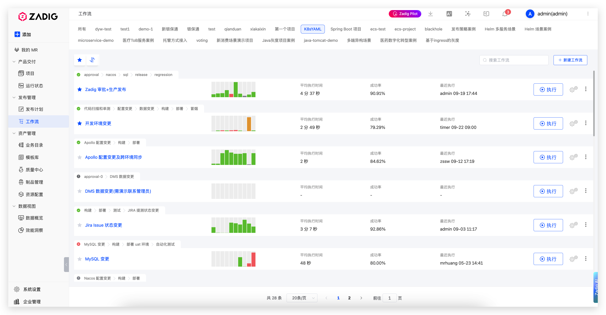

Zadig provides a global workflow page as a unified workflow management center, offering convenient workflow management and execution experience.

## Feature Overview

The global workflow page integrates workflows from all projects, providing a unified management interface that enables engineers to:

- **Unified Management**: View and manage workflows from all projects in a single page
- **Quick Access**: Quickly locate target workflows through search and filtering functions
- **Status Monitoring**: Real-time viewing of workflow execution status and performance metrics
- **Convenient Operations**: One-click execution, configuration, and management of workflows

## Use Cases

### Daily Development Process

Engineers can use the global workflow page to:

1. **Quick Execution**: Select corresponding workflows to execute development, testing, deployment operations with one click
2. **Status Monitoring**: Real-time viewing of workflow execution status and historical records

### Unified Workflow Management

- **Unified View**: Manage workflows from multiple projects in a single interface
- **Quick Switching**: Quickly switch between workflows from different projects through project tags
