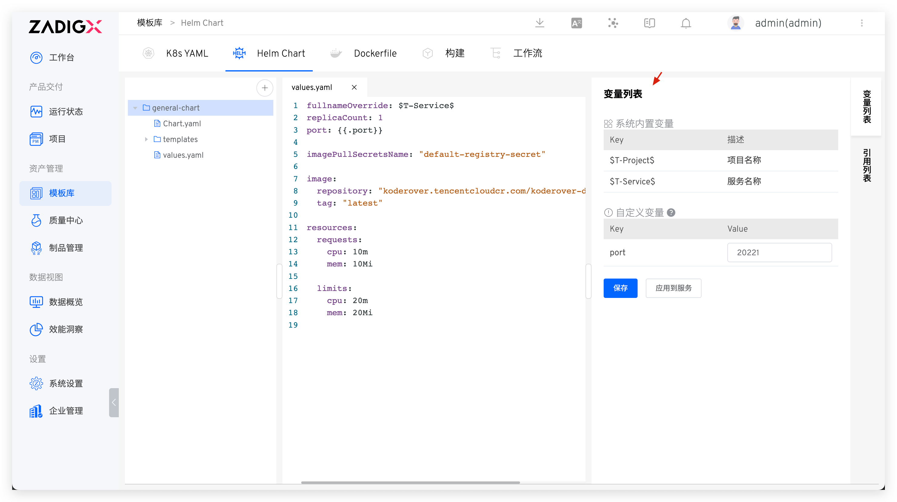
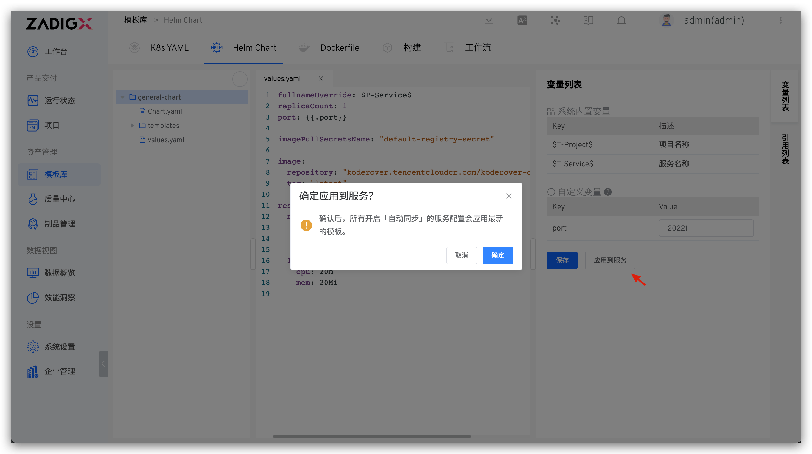

::: tip Background
</img> The Helm Chart template is suitable for projects deployed with Helm Chart, allowing users to deploy K8s applications more flexibly and efficiently.
:::

## New Template

Visit `Assets` → `Templates` → `Helm Chart` in sequence, click the `+` button, enter the Helm Chart template name in the pop-up modal box, and import the template content from the code repository.

::: tip Tips
Refer to the code repository for supported code repository: [Code Source Information](/en/Zadig%20v4.1/settings/codehost/overview/#function-compatibility-list), and refer to the code repository integration: [code repository integration](/en/Zadig%20v4.1/settings/codehost/overview/)
:::


### Variable List

After the template content is saved successfully, the system will automatically parse the variables used in the values.yaml of the template.

- `System Built-in Variables`: Includes `$T-Project$` and `$T-Service$`, which can be used directly in the Helm Chart template. After creating a new service based on the template in the project, these will be automatically replaced with the corresponding project name and service name.
- `Custom Variables`: Define and use in the template using the format <span v-pre>`{{.key}}`</span>. You can assign a default value. When creating a new service based on the template in the project, you can modify the value of the custom variable to redefine the service.



### Apply to Service

Click `Apply to Service` to update all service configurations with `Automatic Synchronization` enabled using the latest template content.

> Turn on the `Automatic Synchronization` operation for the service. Refer to [the use template to create a new service](/en/Zadig%20v4.1/project/service/helm/chart/#create-a-new-service).
:::



## Using Templates
When creating a new service in [the K8s Helm Chart project](/en/Zadig%20v4.1/project/helm-chart/), you can choose to import services from templates, and refer to [using templates to create a new service](/en/Zadig%20v4.1/project/service/helm/chart/#create-a-new-service).

## Helm Chart Template Example

A Helm Chart template is also a complete Helm Chart in terms of structure, as shown below:

```shell
path/to/your/helm-chart
├── Chart.yaml # The Chart.yaml file is required for the chart
├── templates # The template directory in the chart, a series of Kubernetes YAML files
│   ├── deployment.yaml
│   ├── service.yaml
│   └── .....
└── values.yaml # The default configuration values for the chart
```

You can also visit the [general-chart](https://github.com/koderover/zadig/tree/main/examples/multi-service-demo/general-chart) template in the multi-service-demo case to learn more.