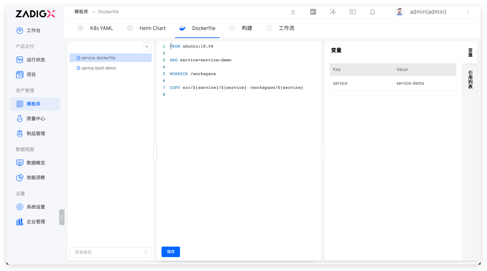
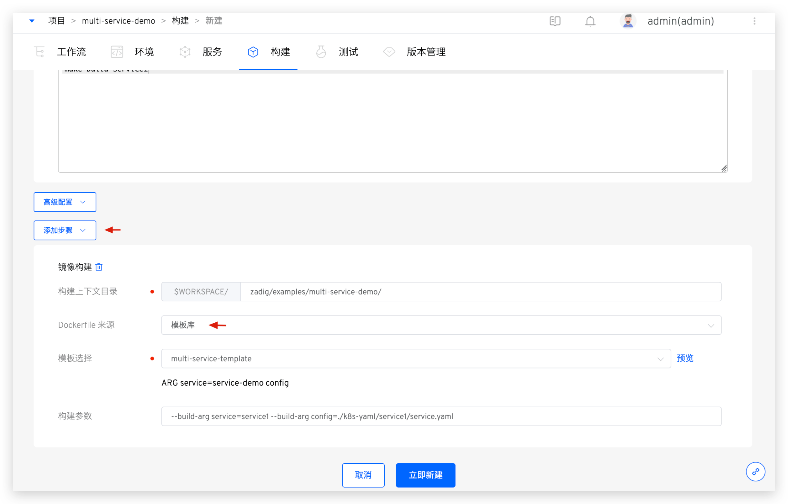
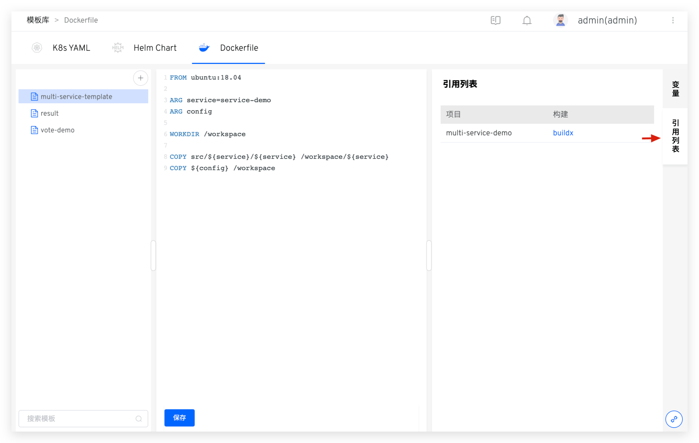

::: tip Background
</img> Dockerfile template capability, which allows users to wrap common image construction steps into templates, minimizing repetitive build configuration work. This feature is currently not supported in free projects.
:::

## New Template

::: tip Tips
Dockerfile templates are valid throughout the system and can be applied to different projects.
:::

Visit `Assets` → `Templates` → `Dockerfile` in turn to enter the Dockerfile template management page. After clicking the `+` button, enter the Dockerfile template name and fill in the template content on the right. After the template content is saved successfully, the system will automatically parse the variables defined by the command and the value of the variables used in the template ARG.

## Using Templates

When configuring the build, select the image build in `Add Steps`, and choose the template library for `Dockerfile Source`. Select the desired Dockerfile template as needed.

> For `Add Steps` instructions, refer to [the image build](/en/Zadig%20v4.1/project/build/#add-more-build-steps).

1. After selecting the Dockerfile template, the system will automatically display the variable information in the template. You can also click `Preview` on the right to view the complete content of the template
2. Based on the actual situation of the build service, fill in the build parameters as needed and assign values to the template using `--build-arg variable1=variable1_value --build-arg variable2=variable2_value`

## View the Citation List

Click `Reference List` on the right side of the Dockerfile template to view the list of projects and builds that reference the template for building the image.

