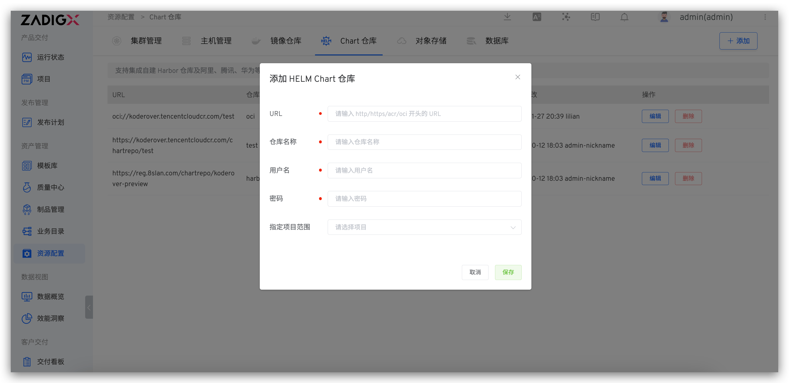

This article describes how to integrate a Chart repository in the Zadig system.

## How to Integrate

Access `Resource Configuration` → `Chart Repository` → `Add`, fill in the Chart repository configuration information, and save it.

Field Description:

- `URL`: Repository access address. Supports http, https, acr, and oci protocols
- `Repository Name`: Repository name
- `Username`: Repository username
- `Password`: Repository password
- `Specified Project Scope`: Specifies which projects can use the Chart repository. `All Projects` includes projects created after the repository is added

## Using the Chart Repository

1. Import Chart configuration from Chart repository, quickly create new services, and refer to [synchronize services from Chart repository](/en/Zadig%20v4.1/project/service/helm/chart/#synchronize-services-from-chart-repository)
2. Add the Chart configuration in the Chart repository to the production environment, quickly instantiate the deployment, and refer to [add services](/en/Zadig%20v4.1/project/env/helm/chart/#add-a-service)
3. Upload the verified Chart to the Chart repository, which can be used for version delivery and refer to [version management](/en/Zadig%20v4.1/project/version/#create-a-version)