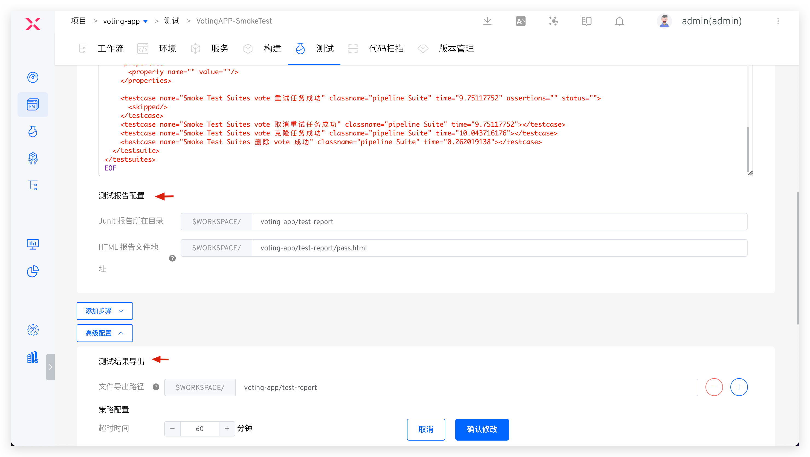

Through the Zadig system, you can connect with all third-party object storage service providers that support the `Amazon S3` [(Amazon Simple Storage Service)](https://docs.aws.amazon.com/zh_cn/AmazonS3/latest/userguide/Welcome.html) protocol, including but not limited to cloud providers such as Amazon, Alibaba Cloud, Tencent Cloud, Huawei Cloud, and Qiniu Cloud.

:::tip
By configuring object storage, the system can automatically store workflow build task history logs, build workspace caches, test task history logs, and test reports in the object storage space.
:::
## Add Object Storage

Click `Assets` → `Object Storage` → `Add`, fill in the configuration information for the object storage and save it. You can specify which projects can use the object storage in the `Project Scope`, including `All Projects` that are created after the object storage is added.

### Alibaba Cloud OSS

Parameter Description:

- `Provider`: Alibaba Cloud OSS
- `Endpoint`: S3 service entry address, refer to the service provider's documentation for details
- `AK`: Access Key provided by the service provider
- `SK`: Secret Key provided by the service provider
- `Bucket`: Bucket name
- `Storage Path Prefix`: The storage path prefix for files in the object storage space
- `Protocol`: Use HTTP or HTTPS protocol
- `Default Use`: Whether this is the default object storage. If not explicitly specified when using object storage, the system will use the default object storage

### Tencent Cloud COS

Parameter Description:

- `Provider`: Tencent Cloud COS
- `Endpoint`: S3 service entry address, refer to the service provider's documentation for details
- `AK`: Access Key provided by the service provider
- `SK`: Secret Key provided by the service provider
- `Bucket`: Bucket name
- `Storage Path Prefix`: The storage path prefix for files in the object storage space
- `Protocol`: Use HTTP or HTTPS protocol
- `Default Use`: Whether this is the default object storage. If not explicitly specified when using object storage, the system will use the default object storage

### Qiniu Cloud Kodo

Parameter Description:

- `Provider`: Qiniu Cloud Kodo
- `Endpoint`: S3 service entry address, refer to the service provider's documentation for details
- `AK`: Access Key provided by the service provider
- `SK`: Secret Key provided by the service provider
- `Bucket`: Space name
- `Storage Path Prefix`: The storage path prefix for files in the object storage space
- `Protocol`: Use HTTP or HTTPS protocol
- `Default Use`: Whether this is the default object storage. If not explicitly specified when using object storage, the system will use the default object storage

### Huawei Cloud OBS

Parameter Description:

- `Provider`: Huawei Cloud OBS
- `Endpoint`: S3 service entry address, refer to the service provider's documentation for details
- `AK`: Access Key provided by the service provider
- `SK`: Secret Key provided by the service provider
- `Bucket`: Bucket name
- `Storage Path Prefix`: The storage path prefix for files in the object storage space
- `Protocol`: Use HTTP or HTTPS protocol
- `Default Use`: Whether this is the default object storage. If not explicitly specified when using object storage, the system will use the default object storage

### Amazon S3

Parameter Description:

- `Provider`: Amazon S3
- `Endpoint`: S3 service entry address, refer to the service provider's documentation for details
- `AK`: Access Key provided by the service provider
- `SK`: Secret Key provided by the service provider
- `Bucket`: Bucket name
- `Storage Path Prefix`: The storage path prefix for files in the object storage space
- `Protocol`: Use HTTP or HTTPS protocol
- `Default Use`: Whether this is the default object storage. If not explicitly specified when using object storage, the system will use the default object storage

### Volcanic Engine

Parameter Description:

- `Provider`: Volcanic Engine
- `Endpoint`: S3 endpoint
- `AK`: Access Key provided by the service provider
- `SK`: Secret Key provided by the service provider
- `Bucket`: Bucket name
- `Storage Path Prefix`: The storage path prefix for files in the bucket
- `Protocol`: Use HTTP or HTTPS protocol
- `Default Use`: Whether this is the default object storage. If not explicitly specified when using object storage, the system will use the default object storage

### Other Requirements

Parameter Description:

- `Provider`: Other
- `Endpoint`: S3 service entry address
- `AK`: Access Key for object storage, used for authentication
- `SK`: Secret Key for object storage, used for authentication
- `Bucket`: Bucket name
- `Storage Path Prefix`: The storage path prefix for files in the object storage space
- `Protocol`: Use HTTP or HTTPS protocol
- `Default Use`: Whether this is the default object storage. If not explicitly specified when using object storage, the system will use the default object storage

## Object Storage Usage Scenarios

### Run Logs

These include workflow run logs, test run logs, and code scan run logs, which will be automatically uploaded to the default object storage.

For example, to upload workflow logs to Tencent Cloud COS: In the specified Bucket, search for the workflow identifier > workflow task number > log folder.

### Workflow Build Cache

After selecting object storage as cache medium in the cache resource configuration of the cluster, the build cache of the workflow will be uploaded to the default object storage. For cluster cache resource configuration, please refer to the document: [cache resource configuration](/en/Zadig%20v4.1/pages/cluster_manage/#cache-resource-configuration) .

### Test Reports and Results

Configure the test report path and test result export file in the test configuration. After the test task is completed, the relevant content will be uploaded to the default object storage and can be viewed and downloaded directly in Zadig.

### File Storage

You can specify file storage in build, test, and general tasks, upload files to the specified object storage, refer to the document: [file storage](/en/Zadig%20v4.1/project/build/#more-build-steps) .

### Helm Chart Version

The version created in the Helm Chart project will be uploaded to the default object store and can be downloaded directly. To create a Helm Chart version, please refer to the document: [Version Management](/en/Zadig%20v4.1/project/version/#k8s-helm-chart-project) .

