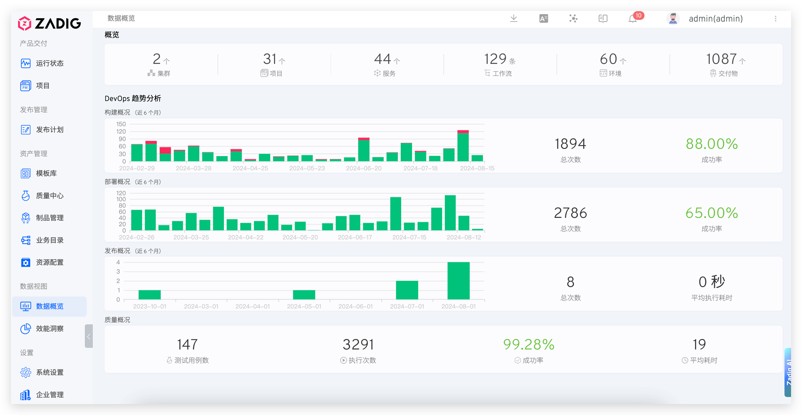

## Function Overview

Data Overview provides a comprehensive data dashboard for the entire system, helping administrators and team leaders quickly understand the operational status and project delivery situation of the Zadig platform. Through intuitive charts and statistical data, you can analyze the overall operational status of internal enterprise projects from a macro perspective.

## Main Features

### System Resource Statistics
- **Number of Clusters**: Total number of Kubernetes clusters currently managed
- **Number of Projects**: Total number of projects created on the platform
- **Total Number of Microservices**: Number of microservices across all projects
- **Total Number of Workflows**: Total number of workflows configured on the platform
- **Total Number of Environments**: Number of environments across all projects
- **Total Number of Deliverables**: Number of deliverables generated through workflows

### Operational Status Analysis
- **Build Data**: Overview of build task operations over the past 6 months, including total runs and success rate
- **Deployment Data**: Overview of deployment task operations over the past 6 months, including total runs and success rate
- **Release Data**: Overview of release task operations over the past 6 months, including total runs and success rate
- **Quality Test Data**: Overview of test task operations over the past 6 months, including total runs and success rate

## Use Cases

1. **System Monitoring**: Regularly check the overall operational status of the system to identify anomalies in a timely manner
2. **Capacity Planning**: Plan system expansion reasonably based on resource usage
3. **Performance Evaluation**: Evaluate team and system performance through success rate and other indicators
4. **Trend Analysis**: Observe changes in various indicators to provide data support for improvements

## Interface Display

From these objective data, we can analyze the overall operational status of the internal projects within the enterprise.