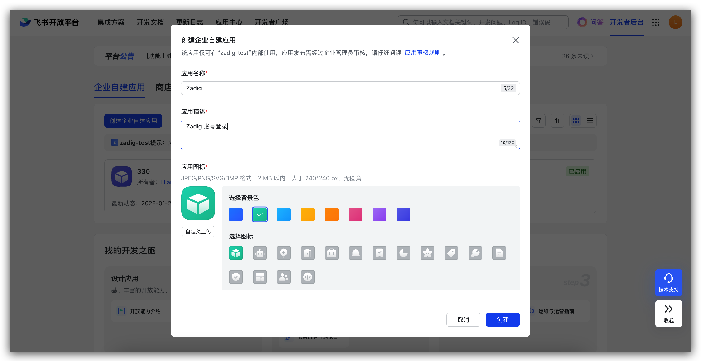
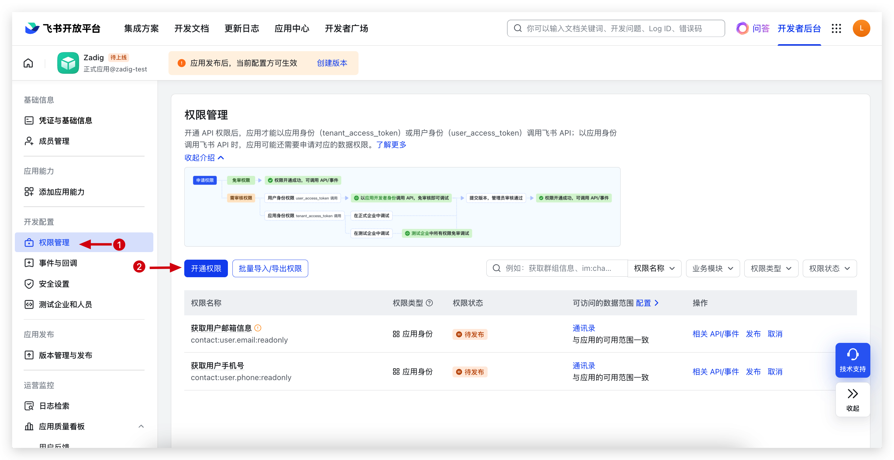
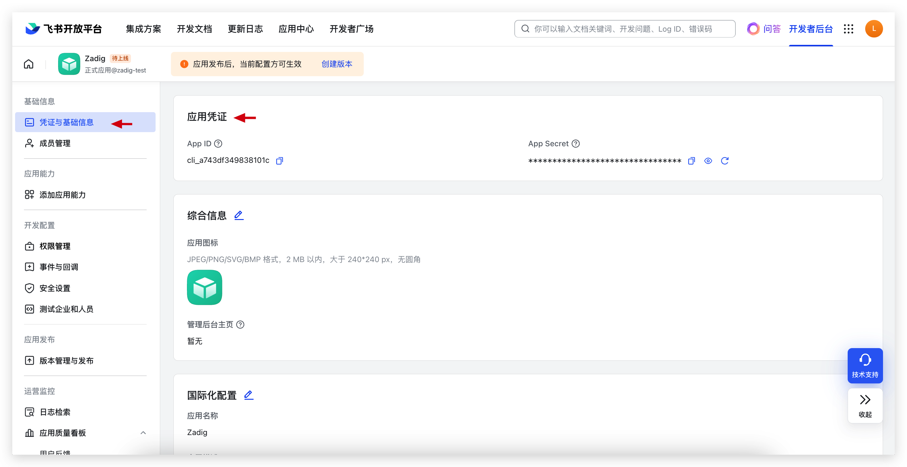
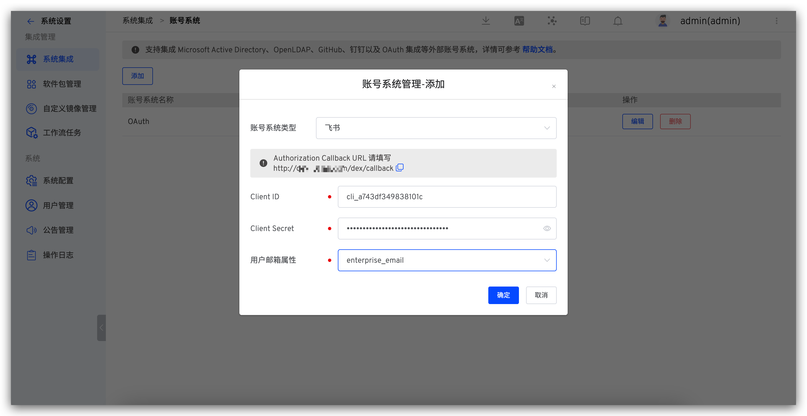
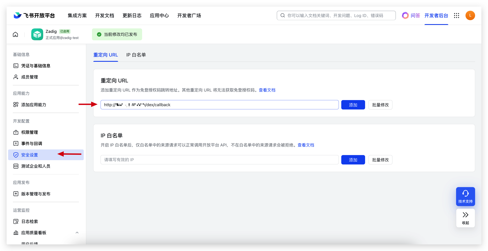

The Zadig account system supports integrating Feishu accounts, allowing users to log in to Zadig by configuring the Feishu application.

## Step 1: Create a Feishu App

1. Visit [Feishu Open Platform](https://open.feishu.cn/) and create an "Enterprise Self-Built Application," as shown below.

2. Configure the permission scope in permission management, as shown below.

Required permissions:

- `contact:user.email:readonly`
- `contact:user.phone:readonly`

3. Retrieve the `App ID` and `App Secret`, as shown below.

4. Create a version and publish the Feishu application.

## Step 2: Configure Zadig Account Integration

Visit Zadig, click `System Settings` -> `Integration` -> `Account System`, select `Feishu`, and enter the `App ID` and `App Secret` obtained in step 1, as shown below.

Retrieve the Callback URL and configure the callback address in the Feishu Open Platform, as shown below.

