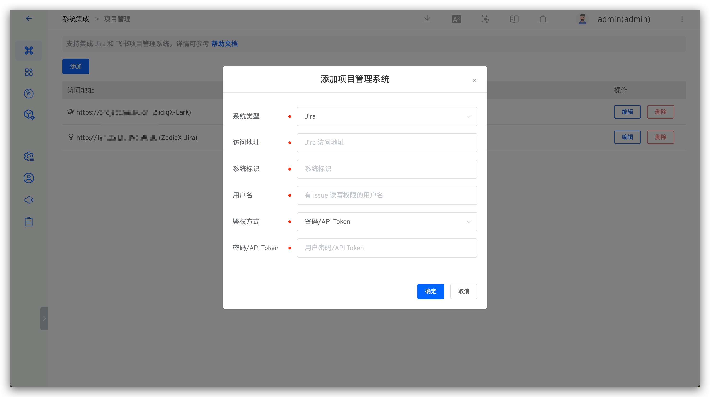
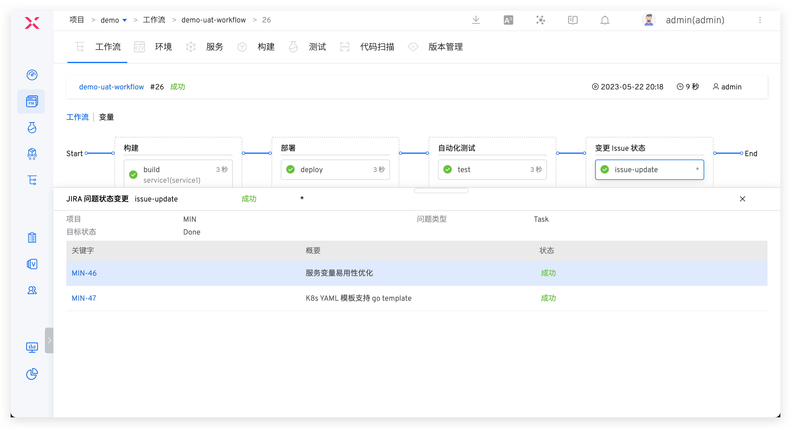
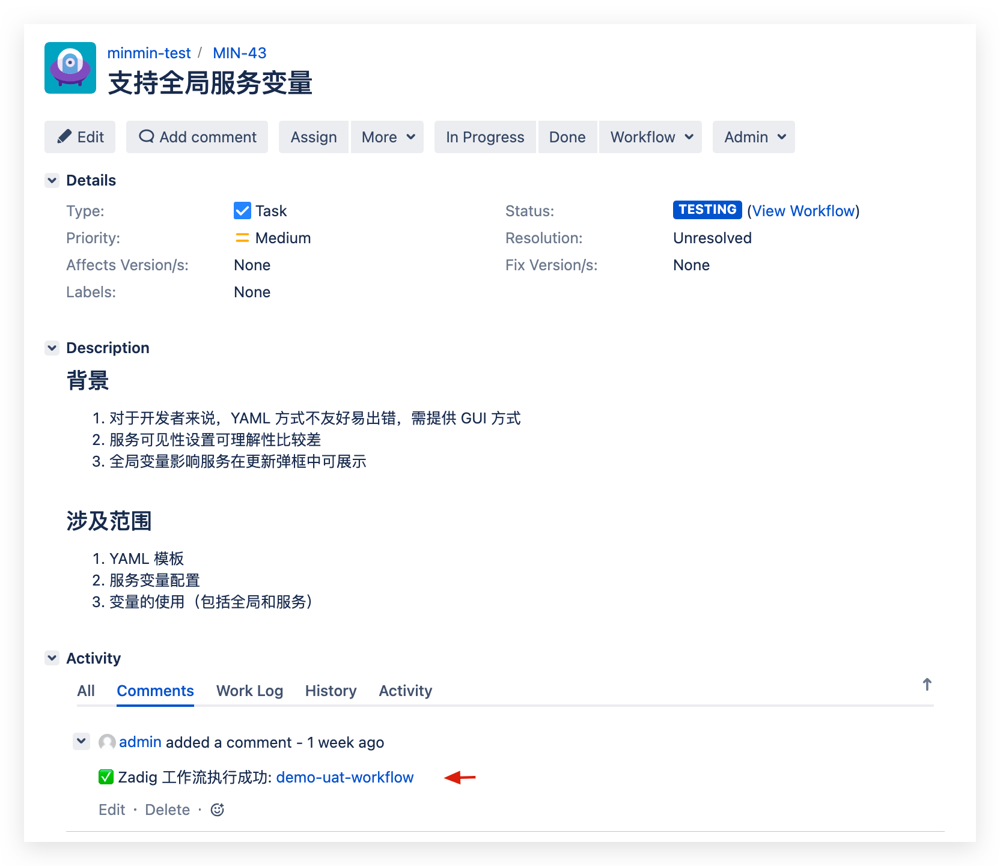

This article introduces how to integrate the project management system Jira on the Zadig system to achieve the two-way interconnection of Zadig + Jira.

## How to Configure

Click `System Settings` -> `Integration` -> `Project Management` -> Click Add.

Parameter Description:
- `Type`: Choose Jira
- `Access Address`: Jira address
- `Identity`: Customized, to facilitate quick identification in the Zadig system; the system identifier must be unique
- `Username`: A user with read permissions for Issues
- `Authentication Method`: Choose either `Password/API Token` or `Access Token`
- `Password/Token`: The password or corresponding Token for the username (fill in when using the `Password/API Token` authentication method)
- `Access Token`: The Access Token used for authentication (fill in when using the `Access Token` authentication method)
::: tip
The SaaS version can use the API Token from your Atlassian account for authentication, while the private deployment can use a password or Access Token for authentication.
:::

After confirming that the information is correct, save it.

## Usage Scenarios

### Automatically Change Issues Through Workflows

Supports Jira project management tasks in the workflow, and automatically modify the specified Issue status through the workflow of Zadig with one click. For specific configuration, reference: [JIRA Issue status changes](/en/Zadig%20v4.1/project/workflow-jobs/#jira-issue-status-change).

### Automatically Trigger Workflows with Jira Events

After configuring the Jira trigger in the workflow, the Zadig workflow can be automatically triggered when a Jira Issue changes. After the workflow execution is complete, the execution information will be commented on the corresponding Issue, enabling two-way tracking between Zadig and Jira. For specific configuration, reference: [Jira Trigger](/en/Zadig%20v4.1/project/workflow-trigger/#jira-trigger).

