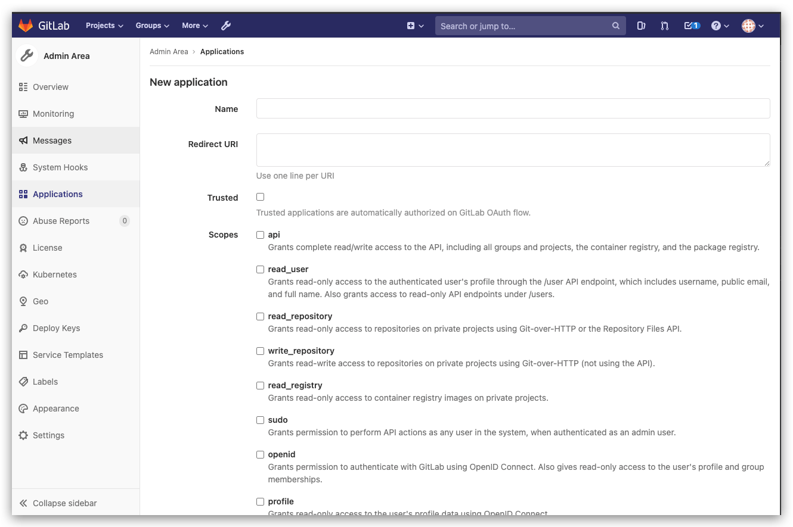
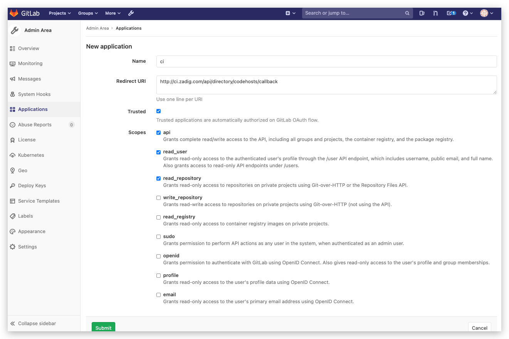
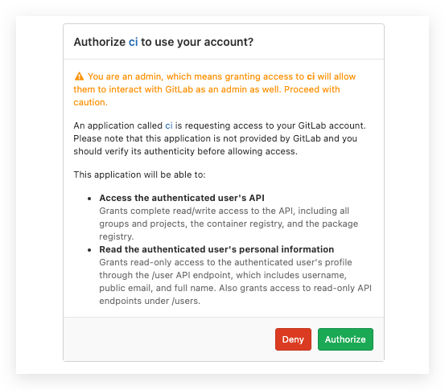
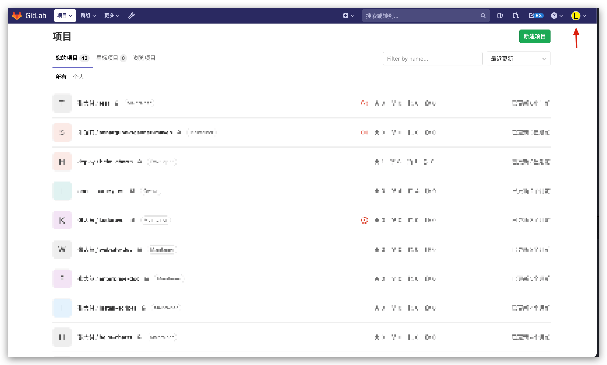
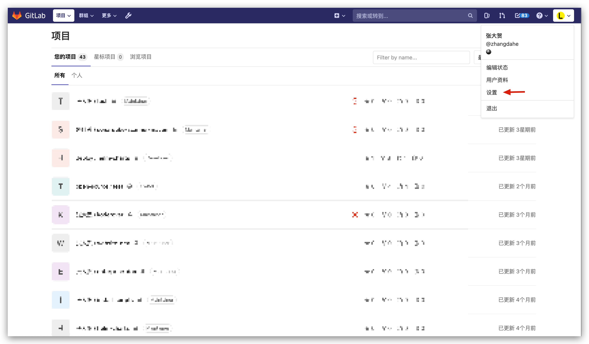
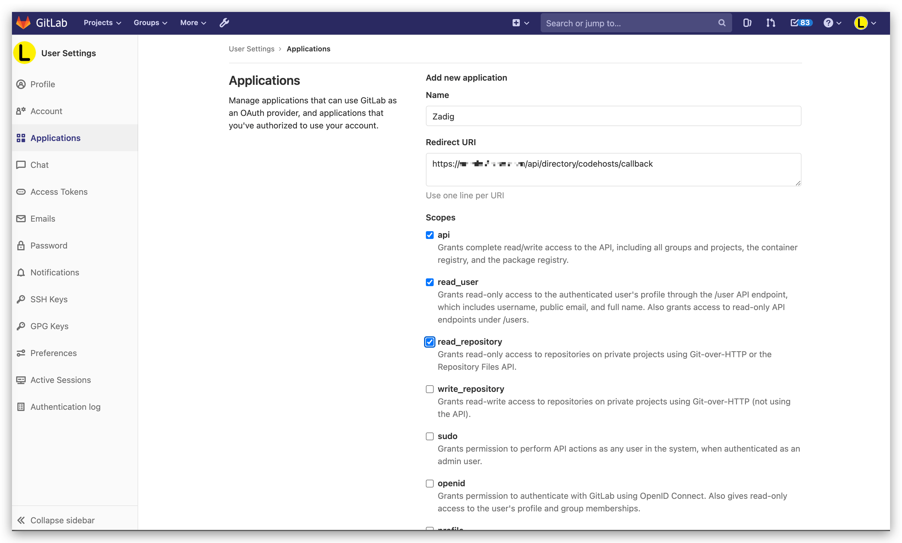
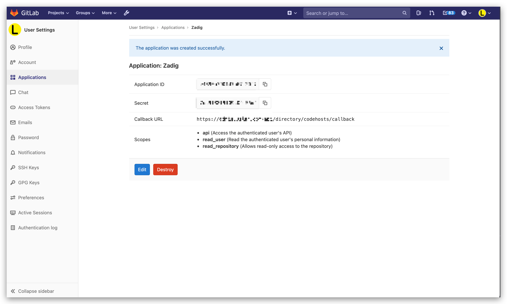

This article primarily explains how to integrate GitLab code sources.

> 1. Currently, the Zadig system uses the OAuth2 method to authenticate code with GitLab
> 2. Please ensure that the GitLab API is version 4, and it is recommended to use GitLab 11.0+ for integration

To integrate GitLab, you can follow the configuration process below:

- GitLab users or administrators create a new OAuth application
- Configure the OAuth application, filling in the basic information and callback URL
- Obtain the `Application ID` and `Secret` information for the OAuth application
- Configure GitLab integration by entering the obtained `Application ID` and `Secret` information into the Zadig system
- Redirect to GitLab for authentication and authorization

## Organizational User Integration

### Step 1: Create a New GitLab OAuth Application

> `To enable GitLab OAuth2, you must register an application in GitLab.`

GitLab administrators can create new applications through `Admin Area` -> `Applications`.

### Step 2: Configure the GitLab OAuth Application

On the Create New Application page, you need to:

- Fill in the application name
- Enter `http://[Zadig.yours.com]/api/directory/codehosts/callback` for the callback URL
- Grant the `api`, `read_user`, and `read_repository` permissions
- Click Create

:::tip Note
Replace `Zadig.yours.com` in the callback URL with the actual address of the Zadig system deployment
:::

### Step 3: Obtain Application ID and Secret Information

After the application is created successfully, GitLab will return the relevant information, including the `Application ID` and `Secret`.

### Step 4: Integrate Application ID and Secret into the System

Switch to the Zadig system, and the administrator should click `System Settings` -> `Integration` -> `Git Provider` -> Add button.

Enter the following known information:

- `Provider`: Choose `GitLab` here
- `Alias`: Customize this to easily identify the code source in the Zadig system; this information must be unique within the entire system
- `GitLab URL`: GitLab address
- `Application ID`: The Application ID returned after the application is created successfully
- `Secret`: The Secret returned after the application is created successfully

After confirming the information, click `Go to Authorization` and wait patiently. The system will redirect to GitLab for authorization.

Click the authorization button, agree to the authorization, and GitLab will redirect to the Zadig system. GitLab integration is now complete.

## Individual User Integration

### Step 1: Create a New GitLab OAuth Application

> `To enable GitLab OAuth2, you must register an application in GitLab.`

GitLab users can create new applications through personal settings via `Setting` -> `Applications`.

### Step 2: Configure the GitLab OAuth Application

On the Create New Application page, you need to:

- Fill in the application name
- Enter `http://[Zadig.yours.com]/api/directory/codehosts/callback` for the callback URL
- Grant the `api`, `read_user`, and `read_repository` permissions
- Click Create

:::tip Note
Replace `Zadig.yours.com` in the callback URL with the actual address of the Zadig system deployment
:::

### Step 3: Obtain Application ID and Secret Information

After the application is created successfully, GitLab will return the relevant information, including the `Application ID` and `Secret`.

