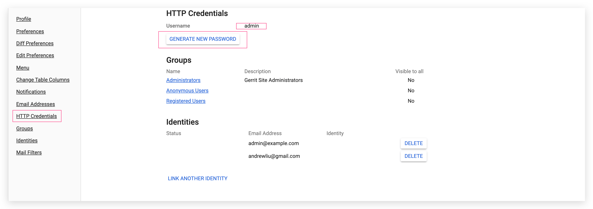
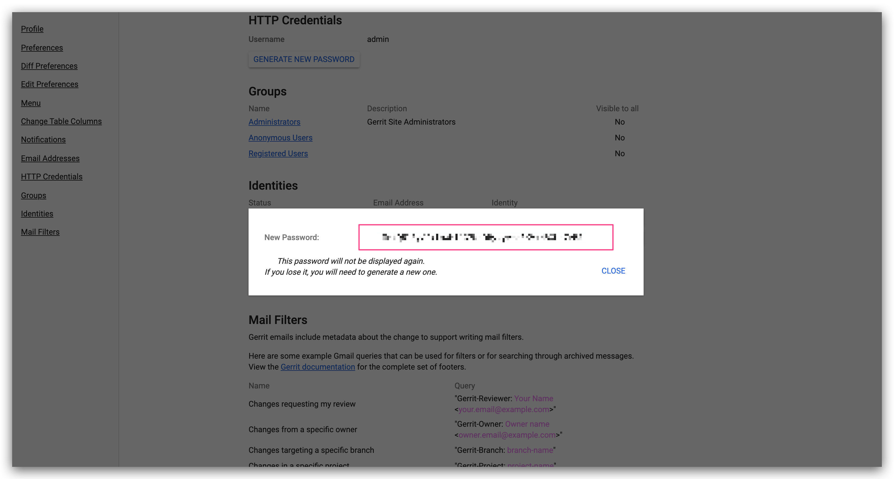

This article primarily introduces how to integrate Gerrit code sources on Zadig.

> Currently, the Zadig system uses Basic Auth to obtain code from Gerrit and call Gerrit's API

To configure Gerrit support, you can follow the procedure below:

- Log in to Gerrit (it is recommended to use a dedicated account), go to the settings page, and obtain the username and password
- On the Zadig configuration page, enter the Gerrit address, username, and password, and save the settings

### Step 1: Get Gerrit's Username and Password

Gerrit administrators can access the settings page by clicking the `Settings` button in the upper right corner of Gerrit. Find the HTTP password `HTTP Credentials` configuration area and click `GENERATE NEW PASSWORD` to generate a new password and copy the newly generated password.

### Step 2: Enter the Configuration in Zadig

Switch to the Zadig system, and the administrator should click `System Settings` -> `Integration` -> `Code Source` in sequence -> click the Add button.

Enter the following known information:

- `Provider`: Select `Gerrit` here
- `Alias`: Customize this to make it easy to identify this code source in the Zadig system. This information must be unique within the entire system
- `Gerrit URL`: Gerrit address, such as https://gerrit.example.com
- `Username`: Gerrit username
- `Password`: The password copied in the previous step

After confirming the information, click `Save`. The Gerrit integration is now complete.