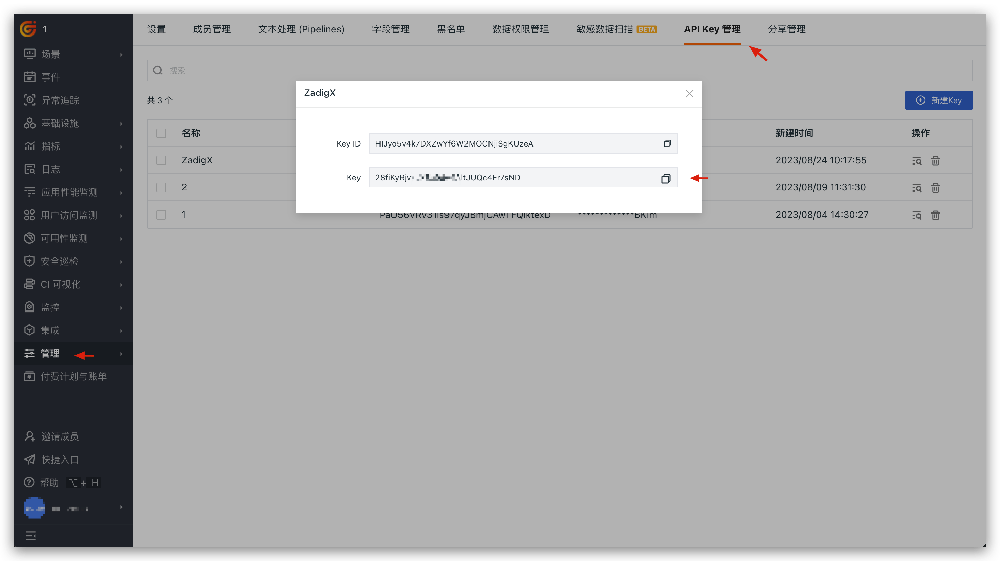

This article introduces how to integrate the monitor system Grafana into the Zadig system.

<!-- ## 如何集成观测云

### 步骤 1：获取观测云 API Key

在观测云工作空间的管理 > API Key 管理，新建 API Key 并保存 Key 信息。

### 步骤 2：在 Zadig 上配置观测云

系统管理员依次访问 `系统设置` -> `系统集成` -> `监控系统`，添加观测云的相关信息，如下图所示。

参数说明：
- `系统类型`：选择`观测云`
- `系统标识`：自定义，方便在 Zadig 系统中快速识别出该系统即可
- `访问地址`：观测云访问地址
- `OpenAPI 地址`：和观测云系统部署类型、部署节点相关，参考 [官方文档](https://docs.guance.com/open-api/#endpoint) 查阅
- `API Token`：第一步中获取的 API Key 信息

## 如何使用观测云

在自定义工作流中配置`观测云监测` 任务即可使用观测云监测服务是否健康，参考文档：[观测云监测](/en/Zadig%20v4.1/project/workflow-jobs/#观测云监测)。 -->

## How to Integrate Grafana

### Step 1: Obtain the Grafana API Key

In Grafana, go to Configuration > Create Service Account, set the role to Viewer, and then add and obtain the Token.

### Step 2: Configure Grafana in Zadig

The system administrator should go to `System Settings` → `System Integration` → `Monitoring System` and add the relevant information for Grafana as shown below.

Parameter Description:
- `Type`: Select `Grafana`
- `System Identifier`: Customize this to make it easy to quickly identify the system within the Zadig system
- `Address`: The Grafana access address
- `API Token`: The API key obtained in Step 1

## How to Use Grafana

Configure `Grafana Service Monitoring Task` in a custom workflow to use Grafana Monitor whether the service is healthy, refer to [Grafana](/en/Zadig%20v4.1/project/workflow-jobs/#grafana-service-monitoring) .