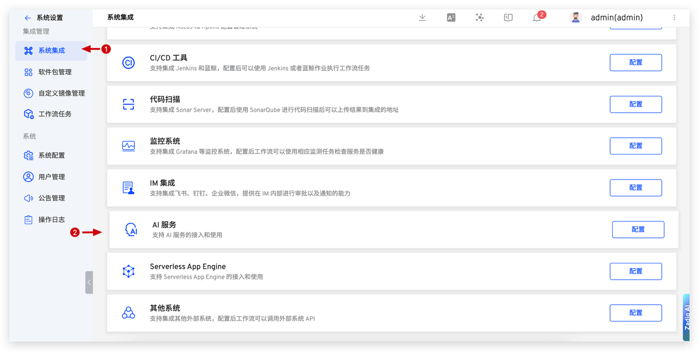

This article introduces AI service integration in the Zadig system.

Main application scenarios:
- AI Performance Diagnosis
- AI Environmental Inspection
- AI Pilot

## DeepSeek

1. Complete registration on DeepSeek, generate [API Key](https://platform.deepseek.com/api_keys), create a new API Key, and copy it.

2. In Zadig, go to `System Settings` -> `Integrations` -> `AI Service`, and add the DeepSeek AI service.

**Parameter Description:**

1. Provider: Select DeepSeek
2. Model Name: Enter the model provided by DeepSeek
3. Address: https://api.deepseek.com/v1
4. API Key: The API Key obtained in the previous step

## SiliconFlow

1. Complete registration on SiliconFlow, generate [API Key](https://cloud.siliconflow.cn/account/ak), create a new API Key, and copy it.

2. In Zadig, go to `System Settings` -> `Integrations` -> `AI Service`, and add the AI service.

**Parameter Description:**

1. Provider: Select SiliconFlow
2. Model Name: Enter the model provided by SiliconFlow
3. Address: https://api.siliconflow.cn/v1
4. API Key: The API Key obtained in the previous step

## Huawei ModelArts Studio

1. Complete registration on [Huawei ModelArts Studio](https://www.huaweicloud.com/product/modelarts/studio.html), generate API Key, create a new API Key, and copy it.

2. In Zadig, go to `System Settings` -> `Integrations` -> `AI Service`, and add the Huawei ModelArts Studio AI service.

**Parameter Description:**

1. Provider: Select Huawei ModelArts Studio
2. Model Name: Enter the model provided by Huawei ModelArts Studio, such as `deepseek-r1-250528`
3. Address: https://api.modelarts-maas.com/v1/
4. API Key: The API Key obtained in the previous step

## Volcengine Ark

1. Complete registration on Volcengine Ark, generate [API Key](https://www.volcengine.com/product/ark), create a new API Key, and copy it.

2. In Zadig, go to `System Settings` -> `Integrations` -> `AI Service`, and add the Volcengine Ark AI service.

**Parameter Description:**

1. Provider: Select Volcengine Ark
2. Model ID: Enter the model ID provided by Volcengine Ark, such as `deepseek-r1-250528`
3. Address: https://ark.cn-beijing.volces.com/api/v3
4. API Key: The API Key obtained in the previous step

## Aliyun Bailian

1. Complete registration on Aliyun Bailian, generate [API Key](https://bailian.console.aliyun.com/?tab=model#/api-key), create a new API Key, and copy it.

2. In Zadig, go to `System Settings` -> `Integrations` -> `AI Service`, and add the Aliyun Bailian AI service.

**Parameter Description:**

1. Provider: Select Aliyun Bailian
2. Model Name: Enter the model provided by Aliyun Bailian, such as `deepseek-r1-0528`
3. Address: https://dashscope.aliyuncs.com/compatible-mode/v1
4. API Key: The API Key obtained in the previous step

