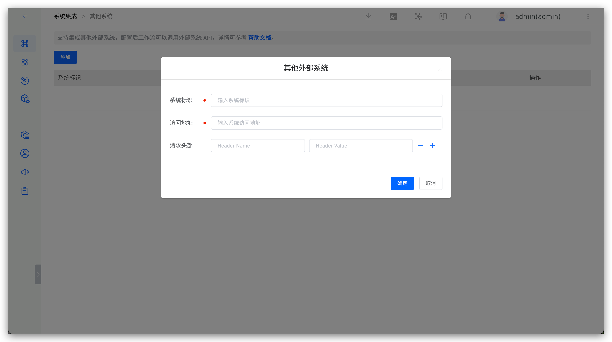

This article describes external system integration in the Zadig system. Main application scenarios:
1. In the `Version Delivery` -> `Create Version` module, after configuring the Hook, external systems can receive information about Helm Chart version delivery completion.
2. In the `Data View` -> `Performance Insights` module, after configuring metrics, data can be collected from external systems.

To access Zadig, click `System Settings` -> `Integrations` -> `Other Systems` to add relevant external system information as shown below.

Field description:

- `Identifier`: Customize for easy identification within the Zadig system. The system identifier must be unique.
- `Address`: The external system access address.
- `Header`: Request header information required to access the external system, optional.