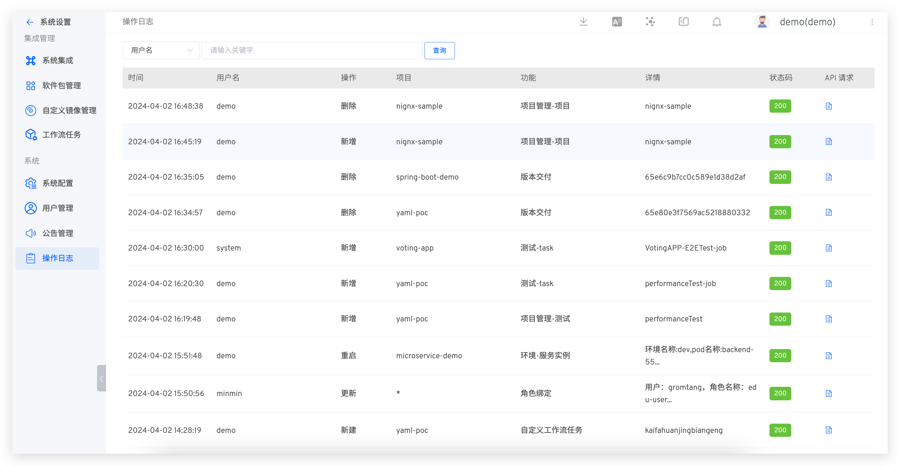

This article introduces the audit log feature in the Zadig system. The Zadig system supports administrators in viewing audit logs to meet security and compliance requirements.

Administrators can go to `System Settings` → `Audit Log` to view audit logs. Additionally, you can search based on username, project, function, and status code to quickly filter out the desired audit logs. The audit log entries include details of the operator and the API payload information.

