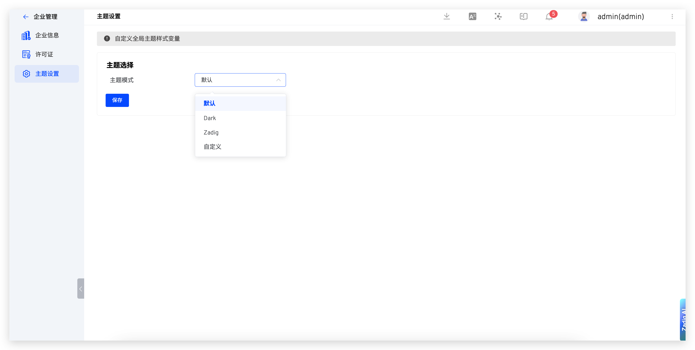

This article primarily introduces how to manage enterprise information in Zadig, including:

- Basic information such as company name, website, and logo
- License information
- System theme settings

## Corporate Information

The system administrator can access `Enterprise` → `Enterprise Info` to modify the company name, website, and enterprise logo.

1. The icon used on the login page (light color): Format: JPEG/PNG/SVG, recommended size: 200px * 60px
2. The icon used in the upper left corner of the login page (dark color) and the icon used in the upper left corner after the sidebar is expanded (dark color): Format: JPEG/PNG/SVG, recommended size: 200px * 60px
3. The icon used in the upper left corner after the sidebar is collapsed: Format: JPEG/PNG/SVG, recommended size: 60px * 60px
4. Favicon icon: Format: JPEG/PNG/SVG/ICO, recommended sizes: 16px * 16px, 32px * 32px, 64px * 64px

## License

### Obtain a Free 30-Day Trial License

After installation, you can obtain a trial license through the [official website](https://koderover.com/getLicense). If you need assistance during the trial process, add the assistant to join the usage communication group.

### Configure the License

The system administrator can access `Enterprise` → `License` to configure the license as needed.

## System Theme

The system administrator can access `Enterprise` → `Theme Settings` to select a built-in system color scheme or customize the system theme color scheme.

> Tip: Once the system theme is set, it will apply to all users.

