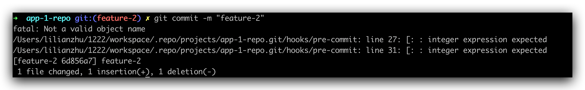

git-zadig is a Git plugin with multi-repository collaborative management capabilities, featuring multi-repository management, local code checking, multi-repository commit and Merge Request creation, code change information aggregation, and integration with Zadig workflows for daily iteration validation.
> Currently only supports GitLab.


## Administrator Operations
### Prepare Manifest Configuration File
Configure the manifest file

> The manifest data structure is completely inherited from Google's git-repo tool, format reference [documentation](https://gerrit.googlesource.com/git-repo/+/master/docs/manifest-format.md)

- Element remote attribute type: Optional, used to specify the remote repository type. When the remote repository is GitLab, specify &lt;remote type="gitlab"/&gt;, which can automatically create MR in the changed repository.
- Element manifest-url: Optional, specifies the repository address where the manifest is located, used for generating commit record link information. If not filled, it will be automatically generated according to the current manifest clone address. When the address is special, the automatic generation may be inaccurate, then manual specification is required.
- Element record-branch: Optional, specifies the branch in the manifest-url repository, used to record MR information created during the multi-repository commit process. Ensure that the configured branch already exists in the manifest-url repository and has push permissions for that branch.

Configuration file example:
> Example reference: [https://github.com/koderover/zadig/tree/main/examples/git-zadig-demo](https://github.com/koderover/zadig/tree/main/examples/git-zadig-demo)

```xml
<manifest>
    <record-branch>change-history</record-branch>
    <manifest-url>https://gitlab.com/kr-poc/manifest-repo</manifest-url>
    <remote name="origin"
            fetch="https://gitlab.com/kr-poc"
            review="https://gitlab.com"
            type="gitlab"/>

    <default revision="main"
            remote="origin"
            sync-j="4" />

    <project path="app-1-repo" name="app-1-repo" />
    <project path="app-2-repo" name="app-2-repo" />
</manifest>
```

### Configure Zadig Workflow

Configure the Zadig workflow according to actual requirements and add corresponding Git triggers, refer to [documentation](/en/Zadig%20v4.1/project/common-workflow/#git-trigger).

1. Use git-zadig tool to sync code during the build process


2. Configure triggers


::: tip Note
  1. Select the repository where the manifest file is located for the trigger code repository
  2. The target branch should be consistent with the record-branch element configuration in the manifest file
  3. Select Push commits for the trigger event
:::

3. Configure IM notifications


### Prepare Pre-check Scripts

- Write git hook scripts and commit them to the code repository for unified management, refer to tutorial: [git hook tutorial](https://git-scm.com/book/zh/v2/%E8%87%AA%E5%AE%9A%E4%B9%89-Git-Git-%E9%92%A9%E5%AD%90)
- Example: [https://github.com/koderover/zadig/tree/main/examples/git-hook-demo](https://github.com/koderover/zadig/tree/main/examples/git-hook-demo)

## Engineer Operations
### Download and Install git-zadig Tool

1. Download the git-zadig tool suitable for your system version on Zadig, as shown in the figure below.


2. After extraction, put the git-zadig tool in PATH and add executable permissions.

### Use Case 1: Multi-repository Commit and Trigger Zadig Workflow

#### Specific Operations
1. Initialize the workspace and download all related repos locally
``` bash
git zadig init -u <manifest-url> -b <manifest-branch>
git zadig sync
```

2. Create a feature branch and start coding
```bash
git zadig start --all <branch>
```

3. After completing coding, commit code and execute the upload command
```bash
# Execute in each project directory locally
git add .
git commit -m "msg"

# Execute in the workspace
git zadig upload
```


**Upload Operation Description**
1. Fill in the necessary MR title and description information
2. Remove the comments before the commits that need to be submitted

#### Implementation Results

1. Manifest repository gets change summary, MR automatically created for changed code repositories.


Get the commit URL of the manifest repository from the output, access the URL to get the summary information of multi-repository code commits, including modified code repositories, feature branches, and corresponding MR information

2. Workflow auto-trigger effect


3. IM notification effect


### Use Case 2: Add Pre-check Scripts

1. Add pre-check scripts for single/multi repositories. The script will automatically identify whether the current working directory belongs to a single repository or multi-repository and initialize accordingly.
```bash
git zadig hook -u <hook-url> -b <hook-branch>
```


2. Perform git operations in the current project, you can find that hook checks have been injected.




3. Clean up single/multi repository pre-check scripts. The script will automatically identify whether the current workflow directory is single repository or multi-repository.
``` bash
git zadig hook -c
```