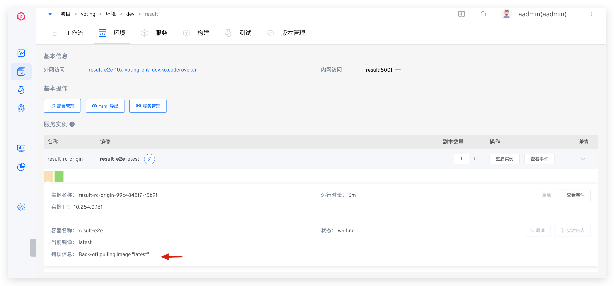
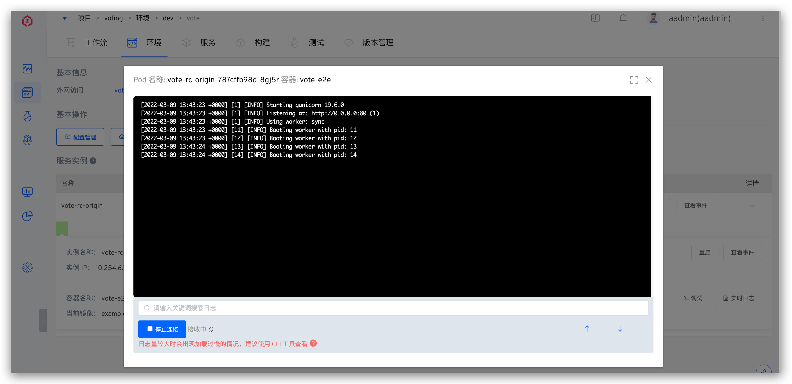
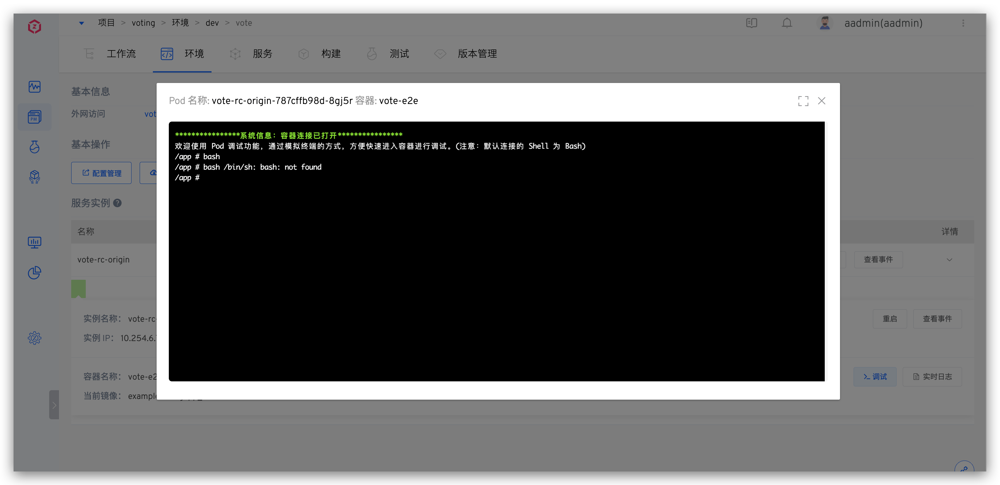
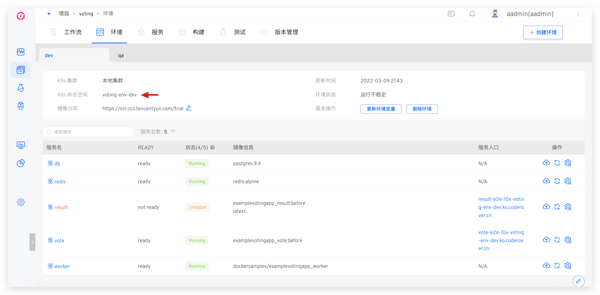
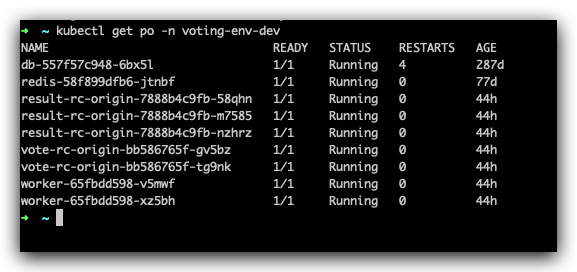
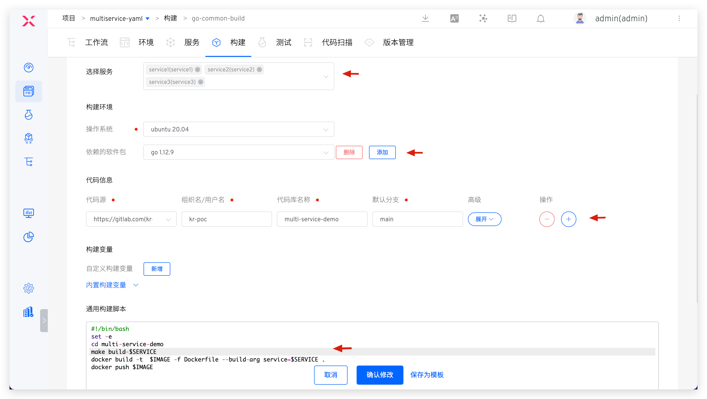

## How to Query Service Logs
Currently, the product supports two ways to query service logs: page query and native kubectl tool query.
The main applicable scenarios for these two different methods are as follows:
- Zadig page query: Can support querying logs in standard output `Stdout` or redirected to `log files`.
- kubectl tool: Can query output in `Stdout` through commands, or directly access containers for operations.

::: tip
Zadig provides two methods, users can choose by themselves. For users familiar with K8s, kubectl tool is recommended
:::
### Page Query

First, check if the service is in `running` status. If the service container is not normally `running`, you can enter the service details page to view `error messages` or use `view events` to troubleshoot why the service failed to start normally, as shown in the figure below.



#### Query Real-time Logs

If the service is running normally and the service log output is in `Stdout`, you can click `Real-time Logs` in the service details page to view the service logs, as shown below.



#### Query File Logs

If the service is running normally and the service log output is in `log files`, you can click `Debug` in the service details page to access the container and view the files where logs are stored, as shown below.



### kubectl Tool Query ([Installation Method](https://kubernetes.io/zh/docs/tasks/tools/#kubectl))
#### Get kubectl Configuration

Go to the `User Settings` page and download your private key configuration. Move the obtained `config` file to kubectl's default folder.

```bash
mv ./config $HOME/.kube
```
After configuration is complete, you can use kubectl to access the cluster.
#### kubectl Query Service Logs

##### View Service Container List

Execute the following command to get the pod information for the corresponding service

```bash
kubectl get po -n <namespace>
```
The namespace can be found at the location shown in the figure below:



The command execution result is shown below



##### Query Standard Output Logs

Execute the following command to get standard output logs

```bash
kubectl logs  <podname> -n <namespace>
#View historical logs, example: kubectl logs vote-rc-origin-f569f57d7-v445j -n voting-env-dev
kubectl logs -f <podname> -n <namespace>
#Similar to tail -f, example: kubectl logs  -f vote-rc-origin-f569f57d7-v445j -n voting-env-dev
```

> For more logs usage, see kubectl logs -h

##### Access Service Container to View Content in Log Files

```bash
kubectl exec -it <podname> bash -n <namespace>
#Access container, can operate on files inside the container
```

> For more kubectl command line operations, see [kubectl Official Documentation](https://kubernetes.io/docs/reference/generated/kubectl/kubectl-commands)

## How to Access Database Services in Environment

4 methods:
  1. Configure a separate Ingress for this database service, access the database through Ingress, but there may be security issues because it exposes your database service on the public network.
  2. Change the database service's Service type to LoadBalancer, the cluster automatically assigns a public IP to this database service, which may also have security issues.
  3. Forward locally through kubectl port-forward.
  4. Use kubectl or system "Debug" function to access the container.

## Can Jenkins builds directly replace service image versions with built image versions without adding build parameters?

No. Due to the limitations of Jenkins external interfaces, it is impossible to directly obtain image information from Jenkins Jobs. Therefore, the "IMAGE" variable must currently be declared in Jenkins Build Parameters, so that Zadig workflow's deployment step can identify which image to use for deployment.

## There are many services under the project, and adding build configurations for each service separately is too cumbersome. How to optimize?

You can configure multiple services in one build, or use build templates to solve the inefficient problem of multi-service build configuration.

### Configure Multiple Services in One Build

Example as follows:

1. Select multiple services as needed in `Build Services`
2. Configure build-required software packages for multiple services in `Dependent Software Packages`
3. Configure build-required code repositories for multiple services in `Code Information`
4. In `Build Script`, cleverly use the `$SERVICE` variable to freely organize build implementations for different services, as shown in the figure:



### Use Build Templates

Reference documentation: [Build Templates](/en/Zadig%20v4.1/template/build/).

## What are the Usage Scenarios of Webhook in the System?

1. Synchronize and create K8s YAML services/K8s Helm Chart services from code repositories. When service configurations in the code repository change, Webhook can realize real-time synchronization of service configuration changes hosted in the code repository to the Zadig system.
2. By configuring workflow Webhook, you can trigger workflow runs when code is pushed to the code repository and Pull Request (Merge Request) is submitted, realizing the process from submission to build automation. For details, refer to [Code Changes Trigger Workflow](/en/Zadig%20v4.1/workflow/trigger/#code-changes-trigger).

## What are the Ways to Obtain Zadig-related Knowledge?

- [Official Documentation](https://docs.koderover.com): Zadig's most comprehensive and timely feature manual
- [Community Forum](https://community.koderover.com): Interact and communicate with community users, product experts, and technical experts
- [Zadig AI Assistant](https://www.koderover.com): AI assistant online Q&A
- WeChat Official Account KodeRover: Contains solutions, best practices, and enterprise cases
