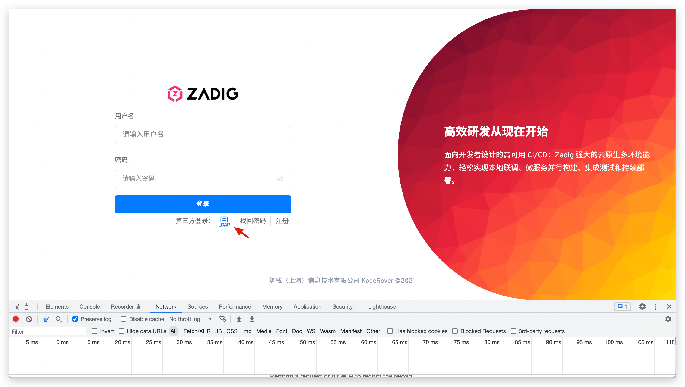
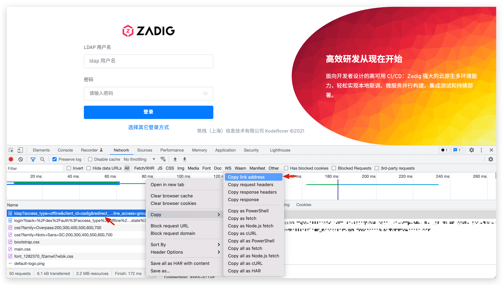
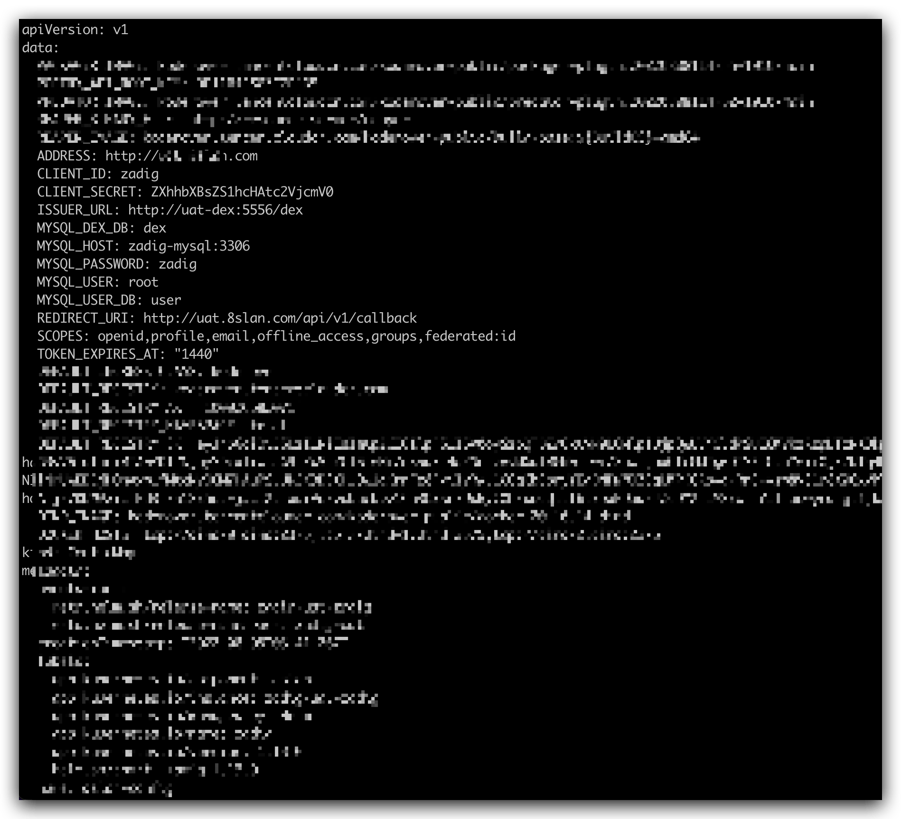
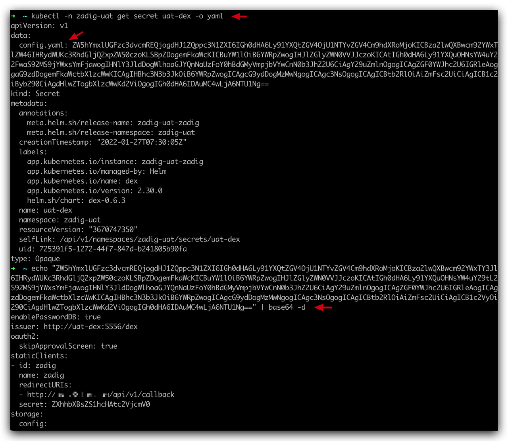
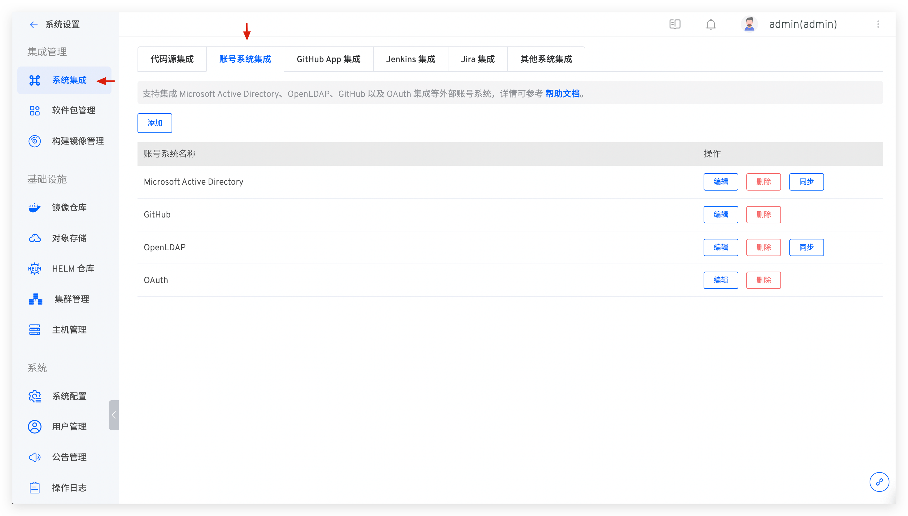
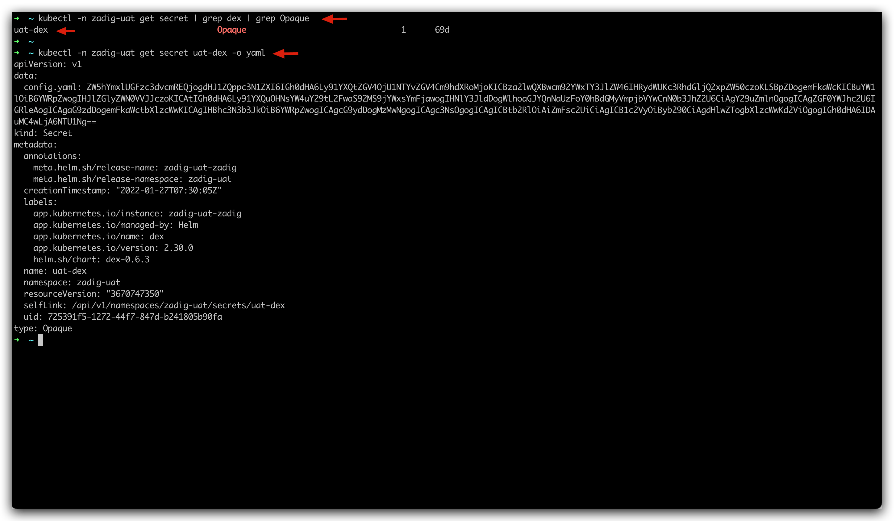
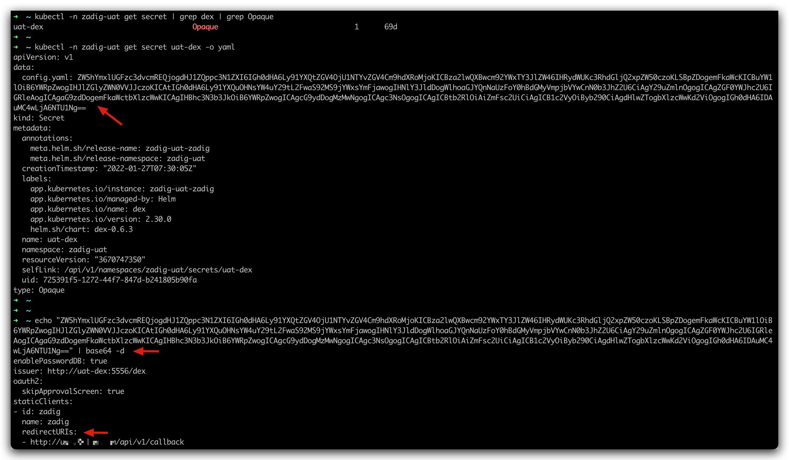
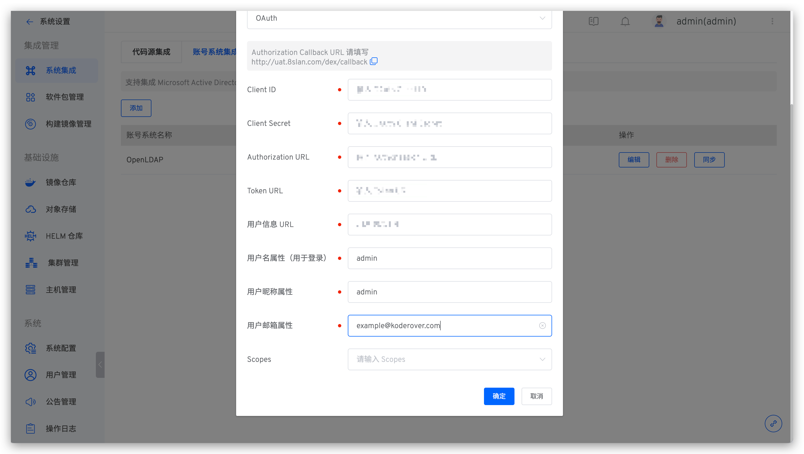
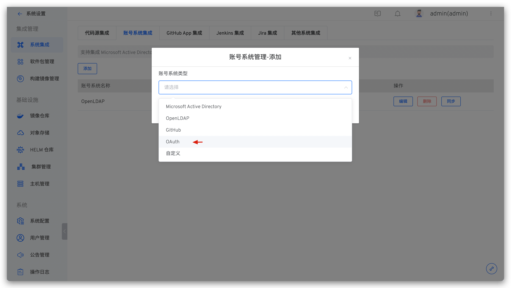

## System Account Cannot Be Logged In

If AD/LDAP/SSO is integrated, please confirm whether the network in the cluster can connect to the AD/LDAP/SSO system normally.

## How to Quickly Access the Third-Party Account Login Interface After Integrating Third-Party Account Login

Take LDAP as an example for illustration: Open the browser debugging mode, click LDAP and copy the first requested address, and access this address to directly access the third-party account login interface.




## What Are the Configurations Related to Users/Accounts and How to Check Them

The integrated account system fails to log in, and generally the configuration is incorrect: including the configuration in the relevant service components and the integrated third-party account system configuration. Several ways to check the configuration here are provided to quickly check if errors are encountered.

### Service Component Configuration

1. With the name `aslan-config` configmap you can view its detailed content through the following command.

```bash
kubectl -n {Zadig Namespace} get configmap aslan-config -o yaml
```



2. With the name `*-dex` secret you can view its detailed content through the following command.

```bash
kubectl -n {Zadig Namespace} get secret {Secret Name} -o yaml # View configuration
echo {configuration found in step 1} | base64 -d # View the configuration plaintext
```



### Third-Party Account System Configuration

In System Settings -> Integration Management -> System Integration -> Account System Integration, you can view the configuration of the integrated account system. Refer to [LDAP](/en/Zadig%20v4.1/settings/account/ldap/) / [OAuth](/en/Zadig%20v4.1/settings/account/oauth2/) / [GitHub](/en/Zadig%20v4.1/settings/account/github/) / [Custom](/en/Zadig%20v4.1/settings/account/custom/) account system to modify the information that is checked incorrectly.



## After Modifying the Configmap and Secret Configurations Related to the User/Account, the System Still Reads the Old Configuration.

The configuration here does not support hot updates. Component `aslan` and component `dex` need to be restarted after updating the configuration.

## Even if the Password Is Correct, an Error Will Be Reported When Logging in 401

aslan depends on secret:zadig-aes-key as the encryption and decryption key. If secret is updated, you need to restart the aslan service.


## Using External High Availability MySQL, the dex Component Reports an Error Unknown database dex or table dex.xx doesn't exist

When installing Zadig using external high availability MySQL, you need to manually create a library called dex in MySQL, otherwise an error with Unknown database dex will occur. Restarting the dex component after deleting all tables in the dex library can solve the problem of table dex.xx doesn't exist.

## dex Component Error Unregistered Returned_uri ( "Xxxx" )

The reason is usually a configuration error in dex, which can be diagnosed by:

1. Use `kubectl -n {Zadig Namespace} get secret | grep dex | grep Opaque` to find dex-related secret configurations in the environment, and use `kubectl -n {Zadig Namespace} get secret {discovered secret name} -o yaml` to view its contents.



2. Copy the content of the configuration config.yaml and execute the content of ` echo "{config.yaml }" | base64 -d ` Decrypt it and check if redirectURLs is correct.



## OAuth Login Error Internal Server Error, Failed to authenticate:Oauth Connector:not found xx claim

Usually the reason is OAuth Configuration error, you can check [OAuth](/en/Zadig%20v4.1/settings/account/oauth2/) for checking. The following error configuration is an example:



It should be noted that in the user name attribute and user nickname attribute, the correct configuration should be the attribute name rather than the attribute instance. For example, the username attribute used for login is account, and one of the instances is called admin, then the account should be configured here instead of admin.

## How to Integrate a cas Single Sign-on System
cas can integrate the OAuth2 protocol. In Zadig's system settings-system integration-account system management, add OAuth configuration to integrate.

