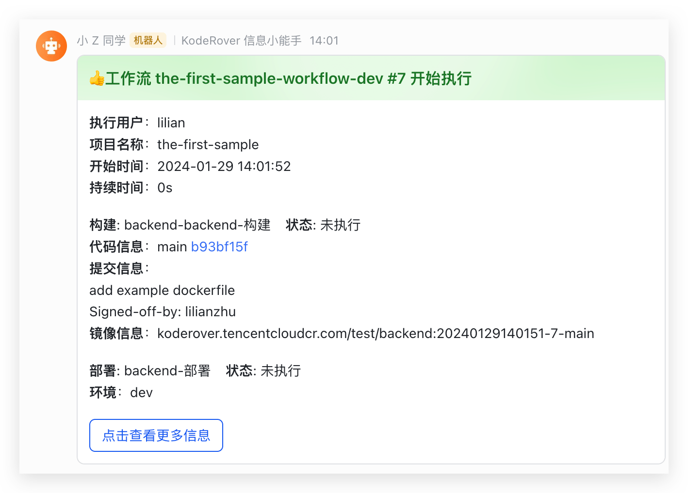

This article uses containerized microservices as an example to help new users quickly get started with the basic capabilities of the Zadig system, covering the entire process from Code to Ship.

## Preparation

- Install Zadig: [Installation Documentation](/en/Zadig%20v4.2/install/guide)
- Integrate GitHub as the code source and fork the [example source code](https://github.com/koderover/zadig/tree/main). For code source integration, refer to: [GitHub Integration](/en/Zadig%20v4.2/settings/codehost/github/)
- Integrate the image registry: [Image Registry Integration](/en/Zadig%20v4.2/settings/image-registry/)

::: tip
If you do not use GitHub as the code source, you can download the code and upload it to your own code source, then integrate it in Zadig. See: [Code Source Integration](/en/Zadig%20v4.2/settings/codehost/overview/).
:::

## Step 1: Project Configuration

Go to Zadig, click "Project" → "New Project", select K8s YAML project type, and fill in the project information.


Click "Create Now" to enter the project initialization wizard, then click "Next" to create a service:


## Step 2: Create a New Service

This includes creating a new service and configuring the build, which is used for subsequent workflow deployment and updates.

### Create a New Service
Click "Sync from Code Repository", select the code repository, branch, and directory where the service configuration is located, then click "Sync".

> In this example, select the `zadig` repository, `main` branch, and specify the folder as `examples/microservice-demo/k8s-yaml/backend`.


After creating the service, the system automatically checks the YAML format and loads system variables, custom variables, and service components.


### Configure Build

Click "Add Build" to configure the build for the service. Select the required package, code hosting platform, repository, and branch, then fill in the build script and save.


Example configuration:
- Package: go 1.20.7
- Code: select the `zadig` repository and `main` branch
- General build script:
``` bash
#!/bin/bash
set -ex

cd zadig/examples/microservice-demo/backend
make build-backend

docker build -t $IMAGE -f Dockerfile .
docker push $IMAGE
```

Click "Next" to proceed to environment preparation.

## Step 3: Add an Environment

Click "Create Environment". The system automatically creates 2 environments and 3 workflows for development and testing. Workflows are automatically bound to environments for continuous delivery.

::: tip
The time required to create an environment depends on the service configuration and quantity. Please wait patiently.
:::


After the environment is created, click "Next" to proceed to workflow delivery.

## Step 4: Workflow Delivery

Click to run the `the-first-sample-workflow-dev` workflow to complete continuous delivery for the dev environment. Select the service and branch or pull request as needed, then start the task:


After the workflow finishes, the service version in the environment is automatically updated:


Other environments are delivered in the same way as the dev environment.

This completes the basic function demonstration of Zadig. The following describes how to configure automatic workflow triggers.

### Configure Automatic Workflow Triggers (Optional)

Click to configure the `the-first-sample-workflow-dev` workflow:


Add a trigger, select Git trigger, fill in the configuration, and save:


After submitting a pull request in GitLab, the check list displays the corresponding workflow status:


Click the task link to jump to Zadig to view workflow details and track code changes:


After the workflow finishes, the environment service image is updated:


### Configure Workflow IM Status Notifications (Optional)

Workflows support third-party webhooks for status notifications. Currently supported: DingTalk, Feishu, WeCom.

> For DingTalk and WeCom configuration, see: [Notification Configuration](/en/Zadig%20v4.2/workflow/im/)

Step 1: Add a Bot in Feishu and get the Webhook address:


Step 2: Configure the workflow, add a notification module, fill in the Feishu Bot Webhook address, and select notification events:


Notification example:



For more practical projects and cases, see [Zadig Tutorial](https://www.koderover.com/tutorials).