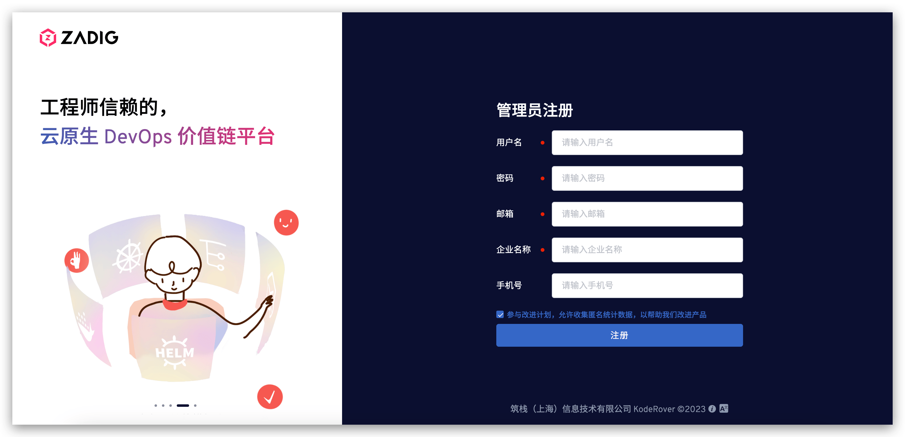

This guide is for quickly deploying Kubernetes and Zadig on a local machine, ideal for first-time users to try out.

::: danger
Local installation does not support version upgrades or high availability, and is not for production use.
:::

## Install and Uninstall Using Shell Scripts

### Step 1: Prepare a Kubernetes Cluster

Use minikube, KinD, or similar tools to set up a local K8s cluster.

::: tip
- Supported K8s versions: v1.16+
- Recommended: 8C16G (Zadig uses 4C8G, supports two concurrent workflows)
:::

For tool installation, refer to:

- [minikube](https://minikube.sigs.k8s.io/docs/start/)
- [docker-desktop](https://www.docker.com/products/docker-desktop/)
- See official docs for other tools

### Step 2: Run the Installation Script

Run in your local cluster:

> If you need to integrate external systems, make sure Zadig has a public IP.

```bash
export IP=<local IP>
export PORT=<any port between 30000-32767>
curl -SsL https://download.koderover.com/install?type=quickstart | bash
```


### Step 3: Access the System

::: tip
If using KinD, map your local port to the K8s NodePort service:

```bash
kubectl -n zadig port-forward svc/gateway-proxy 32000:80
```
:::

Access the system via IP:PORT. On first login, register an administrator.



::: tip
For license setup, see: [License](/en/Zadig%20v4.2/enterprise-mgr/#license)
:::

### Zadig Uninstallation

Set NAMESPACE and run the uninstall script:

```bash
export NAMESPACE=zadig
curl -SsL https://github.com/koderover/zadig/releases/download/v4.1.0/uninstall.sh | bash
```

Or use the latest official uninstall script:

```bash
export NAMESPACE=zadig
curl -SsL https://download.koderover.com/install?type=uninstall | bash
```
