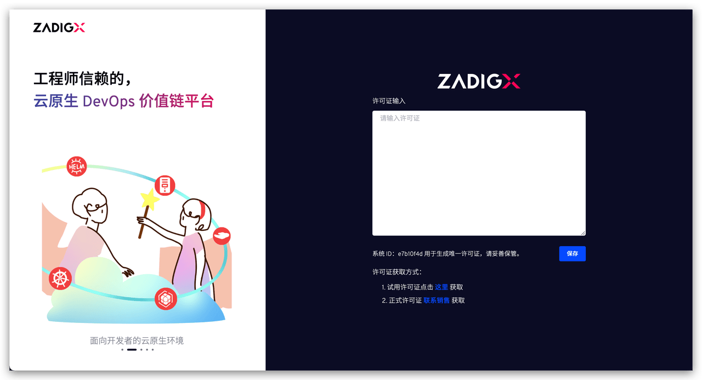

This document primarily describes how to switch from a Zadig system in production to the upgraded Zadig, including precautions, preparations, and detailed upgrade acceptance steps.

## Things to Note

1. You need to purchase the official Zadig license and perform the upgrade under the guidance of the official corporate service team.
2. The data structures of Zadig and the upgraded Zadig differ significantly; the upgrade operation is irreversible, and downgrading will result in system unavailability.
3. The version of Zadig must not be lower than v1.18.0. If the version does not meet this requirement, please refer to the [upgrade documentation](/en/Zadig%20v4.2/release-notes/v1.18.0/) to upgrade it first.

## Preparation

**1. Prepare Business Acceptance Projects**

Prepare one or more core acceptance projects on Zadig, and ensure you can perform operations such as viewing environments, viewing services within the environment, and running workflows. This will enable you to validate Zadig after the upgrade is completed.

**2. Backup Data**

Backup MongoDB data: zadig database, zadig_policy database (the database names should match those specified during installation). The command reference is as follows:

``` bash
mongodump -h IP --port port -u username -p password -d zadig -o 文件存在路径
mongodump -h IP --port port -u username -p password -d zadig_policy -o 文件存在路径
```

Backup MySQL data: user database, dex database. The command reference is as follows:
``` bash
mysqldump -h <HOST> -P <PORT> -u root -p user > user.sql
mysqldump -h <HOST> -P <PORT> -u root -p dex > dex.sql
```

Backup installation parameters: Use `helm -n {Namespace} get values {ReleaseName}` to query the installation parameters, make necessary modifications, and add the following configuration. Save it as values.yaml.

``` yaml
ee:
  mongodb:
    db: "plutus_zadig"
```

**3. Prepare a New Database**

In the MongoDB database instance, create a new database named plutus_zadig and grant read and write permissions.

**4. Obtain a License**

Contact the official team to obtain the Zadig license.

## Upgrade Steps
:::warning Notice
1. When upgrading, ensure that the ReleaseName you are using matches the value used during the initial installation of Zadig.
2. Do not perform any operations on Zadig during the upgrade process.
:::

### Install Zadig

Execute the following command to install Zadig:

``` bash
helm repo add koderover-chart https://koderover.tencentcloudcr.com/chartrepo/chart
helm repo update
helm upgrade {ReleaseName} koderover-chart/zadigx -n {Namespace} -f config.yaml
```

The installation process is influenced by hardware configuration and network conditions. The time may vary in different environments. You can use `kubectl -n {Namespace} get pod` to check the service status. When all services are in the `RUNNING` state, the installation is successful.

### Configure the License

After Zadig is successfully deployed, access the Zadig system, input the license, and save it.



### Import Data

Execute the following command to import MongoDB data (the database name should match the one specified during the initial installation of Zadig):

``` bash
mongorestore -h IP --port port -u username -p password -d zadig --drop file path
mongorestore -h IP --port port -u username -p password -d zadig_policy --drop file path
```

Execute the following command to import MySQL data:

``` bash
mysql> drop database user;
mysql> create database user;
mysql> drop database dex;
mysql> create database dex;
mysql -h <HOST> -P <PORT> -u root -p user < user.sql
mysql -h <HOST> -P <PORT> -u root -p dex < dex.sql
```

After the data is imported, access the Zadig system and input the license.

### Upgrade Acceptance

Verify the following functions to ensure the upgrade is successful:
1. Check if the account system can log in normally.
2. Check whether the data for the project/environment/service/system integration is normal.
3. Check if the environment and service data in the acceptance project are displayed correctly.
4. Check if the product/custom workflows (if any) in the acceptance project can run properly.