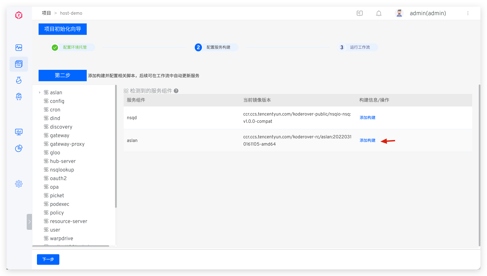
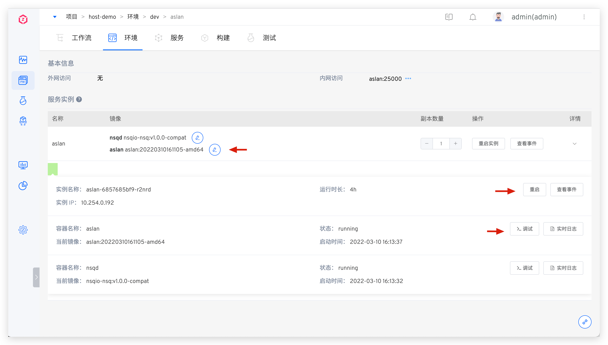
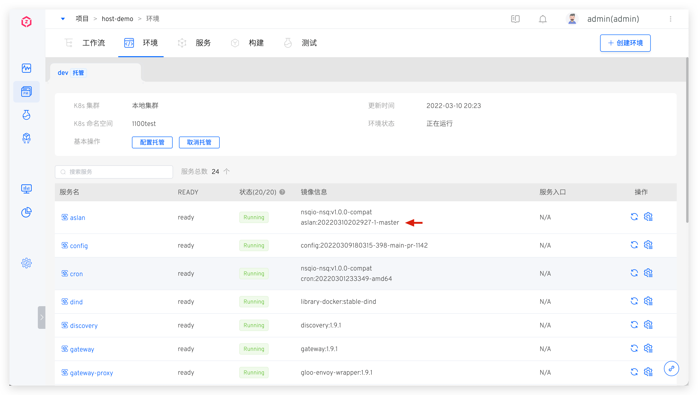

Manages resources in specified Kubernetes cluster namespaces. Create environments and host services in Zadig for cross-cluster testing environment and service management.

## Quick Setup

This guide provides the essential steps to create a K8s hosting project. For detailed examples, see: [Tutorial](https://www.koderover.com/tutorials-detail/codelabs/Hosting-Namespace/index.html?index=..%2F..index#0).

### Create Project
Go to "Project" → "New Project", enter the project name, and select `K8s Hosting Project`.

### Configure Environment Hosting
Enter environment name, select cluster and namespace, and choose services to manage.

::: tip
1. Zadig manages services in both local and remote clusters. Local clusters host the Zadig system.
2. For multi-cluster configuration, see [Cluster Management](/en/Zadig%20v4.2/pages/cluster_manage/).
:::

### Configure Service Build
The system automatically parses service components. Click `Add Build` to configure build settings. See [Build Configuration](/en/Zadig%20v4.2/project/build/).

> For service component concepts, see [Service component](/en/Zadig%20v4.2/env/overview/#what-is-a-service-component).

Click `Next` to complete Kubernetes cluster service hosting. In the integrated environment, preview hosted service status, images, and other information.

Click on a service to view detailed information, including image version modification, deployment events, and real-time logs.

### Execute Workflow
Trigger a workflow, select services to update, and start the task for automated deployment. Verify service updates in the environment after workflow completion.

## Switch to K8s YAML Project

Convert existing hosting projects to K8s YAML projects with one click.

::: tip Caution
1. Workflow/build/test/code scanning/permissions/collaboration mode remain unchanged, with new service management capabilities added.
2. All hosted environments display in the new project.
3. Service configurations in all environments are managed and displayed, with duplicate configurations consolidated.
:::

In the hosting project, click `Switch Project Type` to complete the conversion.
