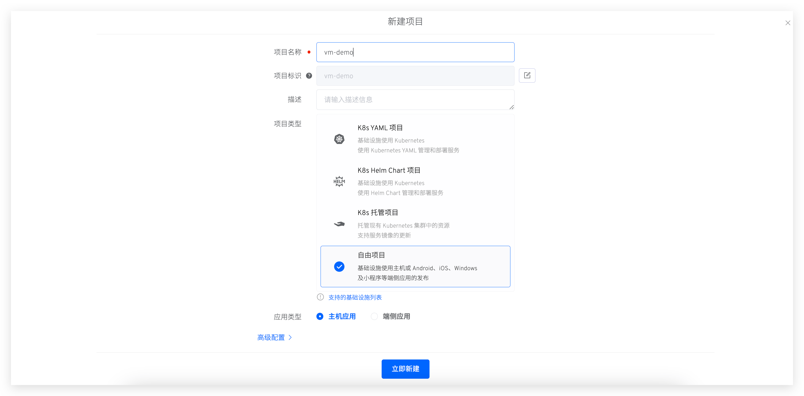
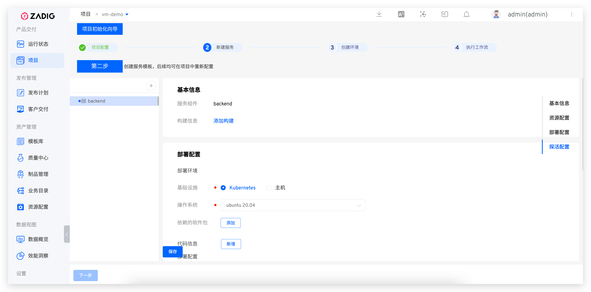
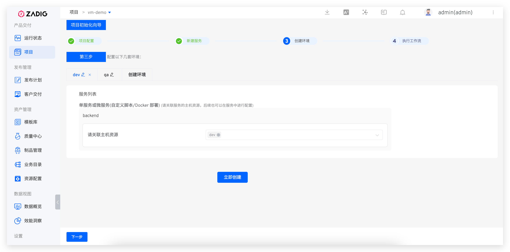
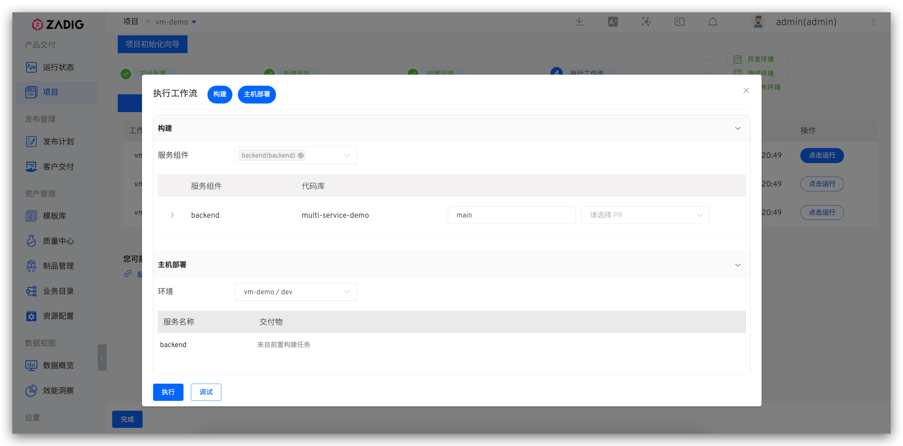

## Quick Setup

This guide provides the essential steps to create a freestyle project. For detailed examples, see: [Tutorial](https://www.koderover.com/tutorials-detail/codelabs/cloudhost/index.html?index=..%2F..index#0).

### Create Project

Go to "Project" → "New Project", enter the project name, select `Freestyle Project`, and choose `VM`.

### Configure Services
Click the `+` button to enter service name. Configure build, deployment, and health check settings.

> See [Host Service](/en/Zadig%20v4.2/project/service/vm/) for configuration details.

### Create Environment

Create an environment and associate it with host resources.

### Deploy via Workflow

Once environment and workflow are ready, click `Next` to select the dev environment workflow for service updates.

