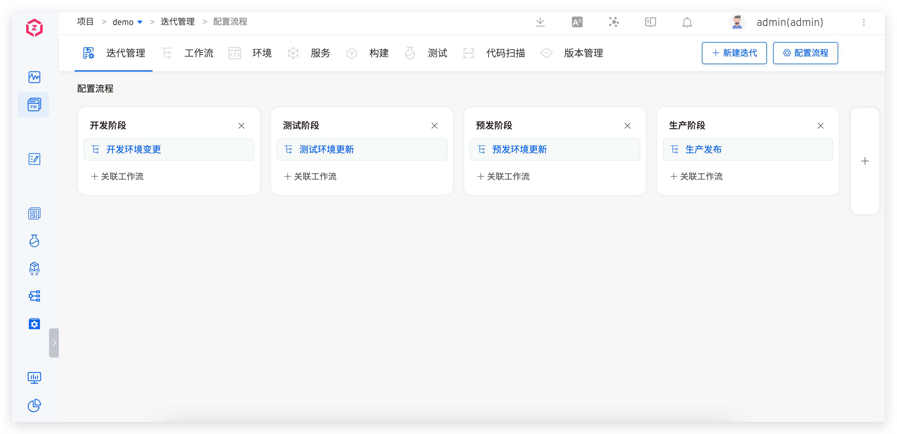
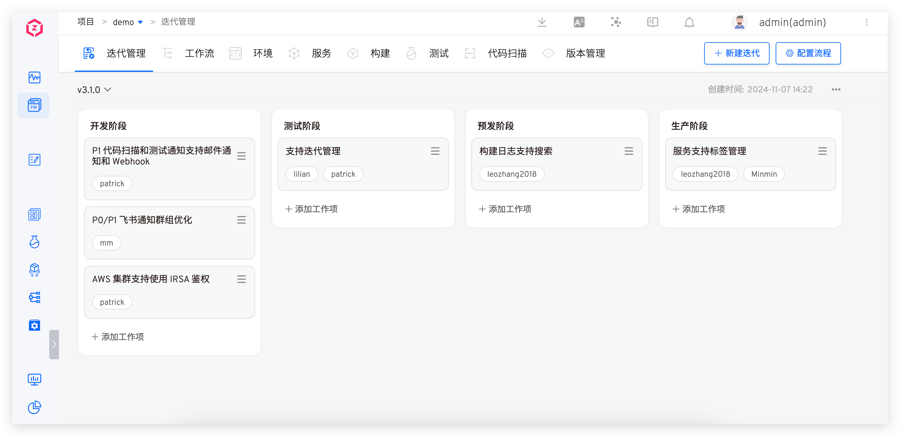
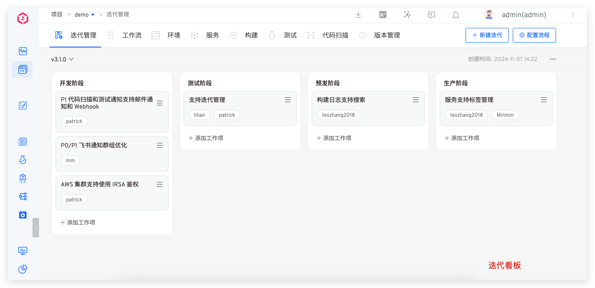
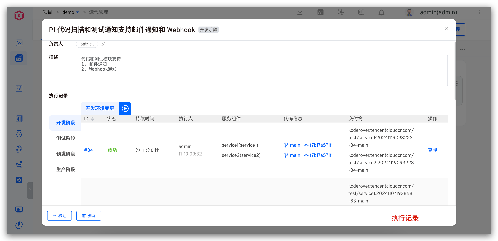
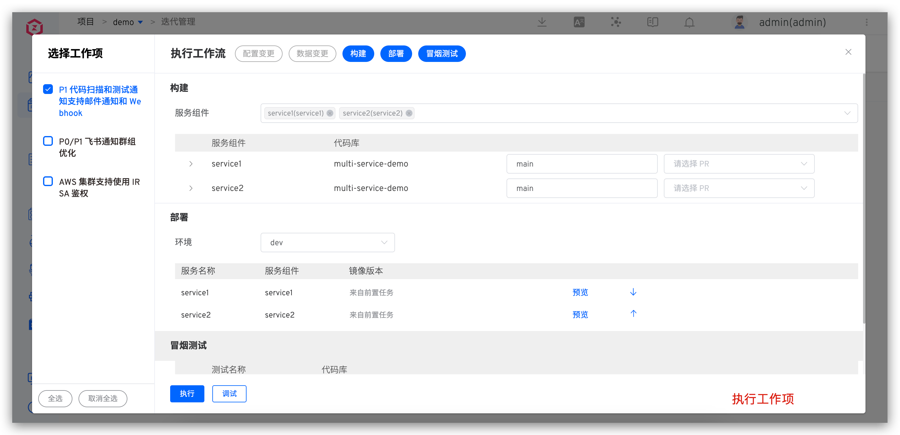

During the complex project iteration process, although the tasks of each role can be automated through workflows, the collaborative information between roles cannot be effectively integrated and transmitted on the platform. Traditionally, change information (such as code branches, image information, configuration changes, data changes, test results, release tickets, etc.) is manually pasted on the project management platform. However, with the evolving demands, this method is no longer sufficient, especially in a steady-state R&D mode where the information flow cannot be smoothly transmitted. This iteration management feature aims to address these issues, achieve process and information visualization, and facilitate collaboration among roles in the R&D process.

This article introduces the basic concepts and usage methods of Zadig's iteration management.

## Basic Concepts

- Process: The structured sequence of steps in a project iteration. In the process, stages and associated workflows can be configured to ensure the transmission of information and the smooth progress of the project.
- Iteration: An iteration is a delivery cycle based on the process. It displays relevant information through a Kanban board and supports operations such as creation, deletion, archiving, and more, making it easier to trace the project status.
- Work Items: Work items are specific tasks within an iteration. They have their own attributes, execution records, and activity logs, and can be created, edited, viewed, deleted, and moved to advance tasks.

## Configuration Process

Visit the iteration management page, click `Config`, and configure the stages in the process along with the workflows needed for each stage.

## Iterative Management

Visit the iteration management page to manage iterations, including creating, modifying, deleting, archiving, and switching operations.

Operating Instructions:
- New: A project can correspond to one or multiple iterations, and each iteration must have a unique name to distinguish different iteration processes.
- Modification: Supports modifying the iteration name, which facilitates renaming iterations according to actual conditions during the project development process.
- Delete: Once an iteration is deleted, it cannot be restored, so please proceed with caution.
- Archive: After completing the tasks in an iteration, you can archive it. Archived iterations can be re-enabled when needed later, facilitating the traceability of historical iterations.
- Switch: You can freely switch between different iterations to facilitate viewing and managing content at different iteration stages.

## Work Item Management

Visit the iteration management page to manage work items, including creating, modifying, deleting, executing, and moving operations.

Work Item Information Description:
- Responsible Person: Designate the person in charge of the work item to clarify ownership and responsibility.
- Description: Provide a detailed explanation of the specific content, goals, and requirements of the work item.
- Execution Record: Record the execution details of the work item according to the stage and workflow, including code information, service information, image information, etc.
- Activity Record: Record various operations related to the work item in the form of time, personnel, and specific activities, fully displaying the dynamic changes of the work item throughout its lifecycle.