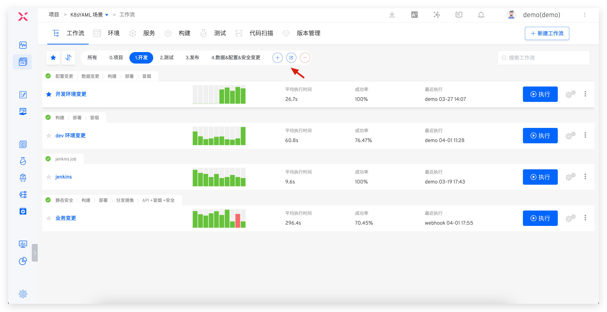
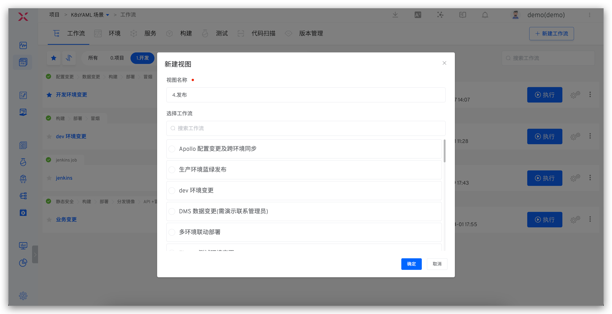

This article introduces the basic concepts of Zadig workflows. Zadig workflows support flexible orchestration of workflow processes, custom execution steps, and also possess capabilities such as configuration changes, data changes, and grayscale releases.

## Basic Concepts

Workflows consist of `stages` and `tasks`:
- Stage: Logically group the tasks of the workflow, such as the build stage, the deployment stage... Multiple stages run in series, and one stage can include multiple tasks.
- Task: An independent and complete operation, such as building, deploying, testing, custom tasks... Multiple tasks can be executed serially or concurrently. Tasks are divided into two types:
    - Custom tasks: Interact with third-party systems through the development of custom tasks. For specific development methods, see [Workflow tasks](/en/Zadig%20v4.2/settings/custom-task/)
    - Official tasks: Zadig officially provides tasks that can meet complex needs for building, deploying, testing, and releasing. The specific task types are as follows:

| Task Type | Task Name | Description | Configuration |
| --- | --- | --- | --- |
| Build | Build | You can directly reference the configuration in the "Project"-"Build" module | [Check](/en/Zadig%20v4.2/project/workflow-jobs/#build) |
| Deploy | Container Service Deployment | Update service images, variables, and service configurations in Zadig environments | [Check](/en/Zadig%20v4.2/project/workflow-jobs/#container-service-deployment) |
|  | Host Service Deployment | Update the host service version in the Zadig environment | [Check](/en/Zadig%20v4.2/project/workflow-jobs/#host-service-deployment) |
|  | Kubernetes Deployment | Update container images in Kubernetes | [Check](/en/Zadig%20v4.2/project/workflow-jobs/#kubernetes-deployment) |
|  | Update K8s YAML Task | Use native Kubernetes Patch capabilities to update YAML | [Check](/en/Zadig%20v4.2/project/workflow-jobs/#update-k8s-yaml-task) |
| Test | Test | You can directly reference the test configuration in the "Project"-"Test" module | [Check](/en/Zadig%20v4.2/project/workflow-jobs/#test) |
|  | Code scanning | You can directly reference the configuration in the "Project"-"Code Scan" module | [Check](/en/Zadig%20v4.2/project/workflow-jobs/#code-scan) |
| Process Control | Manual Approval | Follow-up operations can only be performed after approval | [Check](/en/Zadig%20v4.2/project/workflow-jobs/#manual-approval) |
| Release Strategies | Helm Chart Deployment | Directly deploy Charts from the Helm repository to the environment | [Check](/en/Zadig%20v4.2/project/workflow-jobs/#helm-chart-deployment) |
|  | MSE Grayscale Release | Create full-link grayscale publishing resources based on MSE | [Check](/en/Zadig%20v4.2/project/release-workflow/#mse-grayscale-release) |
|  | Offline MSE Grayscale Service | Delete MSE Specified Grayscale Tag-Related Resources from the Environment | [Check](/en/Zadig%20v4.2/project/release-workflow/#offline-mse-grayscale-service) |
|  | Deploy Blue and Green Environments | Deploy blue and green environments based on the configuration in the "Service" module | [Check](/en/Zadig%20v4.2/project/release-workflow/#deploy-blue-and-green-environments) |
|  | Blue-Green Release | Combined with the pre-installed "Deploy Blue and Green Environments", perform blue and green releases | [Check](/en/Zadig%20v4.2/project/release-workflow/#blue-green-release) |
|  | Canary Deployment | Deploy the Canary based on Kubernetes native capabilities | [Check](/en/Zadig%20v4.2/project/release-workflow/#canary-deployment) |
|  | Canary Release | Combined with the pre-installed "Canary Deployment" task, perform Canary releases | [Check](/en/Zadig%20v4.2/project/release-workflow/#canary-release) |
|  | Grayscale Release | Perform grayscale releases based on Kubernetes native capabilities | [Check](/en/Zadig%20v4.2/project/release-workflow/#grayscale-release) |
|  | Grayscale Rollback | Perform rollback tasks based on Kubernetes native capabilities, rolling back to the state before grayscale | [Check](/en/Zadig%20v4.2/project/release-workflow/#grayscale-rollback) |
|  | Istio Release | Perform the release process based on Istio | [Check](/en/Zadig%20v4.2/project/release-workflow/#istio-release) |
|  | Istio Rollback | Perform rollback tasks based on Istio, rolling back to the state before the Istio release | [Check](/en/Zadig%20v4.2/project/release-workflow/#istio-rollback) |
|  | Update Istio Grayscale Policy | Update the configuration of Istio grayscale policy in the environment | [Check](/en/Zadig%20v4.2/project/workflow-jobs/#update-istio-grayscale-policy) |
| Project Collaboration | Feishu Work Item Status Change | Modify the status of the specified Feishu project work item | [Check](/en/Zadig%20v4.2/project/workflow-jobs/#feishu-work-item-status-change) |
|  | JIRA Issue Status Change | Modify the status of the specified JIRA issue | [Check](/en/Zadig%20v4.2/project/workflow-jobs/#jira-issue-status-change) |
|  | PingCode Work Item Status Change | Modify the status of the specified PingCode project work item | [Check](/en/Zadig%20v4.2/project/workflow-jobs/#pingcode-work-item-status-change) |
|  | Tapd Work Item Status Change | Modify the status of the specified Tapd project work item | [Check](/en/Zadig%20v4.2/project/workflow-jobs/#tapd-work-item-status-change) |
| Configuration changes | Nacos Configuration Change | Update the specified Nacos configuration | [Check](/en/Zadig%20v4.2/project/workflow-jobs/#nacos-configuration-change) |
|  | Apollo Configuration Change | Update and publish the specified Apollo configuration | [Check](/en/Zadig%20v4.2/project/workflow-jobs/#apollo-configuration-change) |
| Data changes | SQL Data Change | Perform data changes for the specified database | [Check](/en/Zadig%20v4.2/project/workflow-jobs/#sql-data-change) |
|  | DMS Data Change Work Order | Create and track DMS data change work orders | [Check](/en/Zadig%20v4.2/project/workflow-jobs/#dms-data-change-work-order) |
| Service Monitoring |Grafana Monitoring | Use Grafana to monitor the health of your services| [Check](/en/Zadig%20v4.2/project/workflow-jobs/#grafana-monitoring) |
| CI/CD | Execute Jenkins Job | Execute multiple Jenkins jobs simultaneously and obtain corresponding logs | [Check](/en/Zadig%20v4.2/project/workflow-jobs/#execute-jenkins-job) |
|  | Execute Blue Whale Job | Trigger the execution plan of the Blue Whale Operation Platform | [Check](/en/Zadig%20v4.2/project/workflow-jobs/#execute-blue-whale-job) |
| Other Requirements | General Task | Support functions such as pulling code, executing shell scripts, file storage, etc | [Check](/en/Zadig%20v4.2/project/workflow-jobs/#general-task) |
|  | Image Distribution | Push the retagged image to the image repository | [Check](/en/Zadig%20v4.2/project/workflow-jobs/#image-distribution) |
|  | Trigger Zadig Workflow | Trigger other Zadig workflows | [Check](/en/Zadig%20v4.2/project/workflow-jobs/#trigger-zadig-workflow) |
|  | Offline Service | Delete service-related resources from the specified environment | [Check](/en/Zadig%20v4.2/project/workflow-jobs/#offline-service) |

## Trigger

Supported trigger types:
| Required | Description | Configuration and Usage |
| --- | --- | --- |
| Git Trigger | Automatically trigger the workflow after code changes | [Check](/en/Zadig%20v4.2/project/workflow-trigger/#git-%E8%A7%A6%E5%8F%91%E5%99%A8) |
| Timer | Schedule the workflow to trigger at a specific time | [Check](/en/Zadig%20v4.2/project/workflow-trigger/#%E5%AE%9A%E6%97%B6%E5%99%A8) |
| JIRA Trigger | Automatically trigger the workflow after JIRA issue status changes | [Check](/en/Zadig%20v4.2/project/workflow-trigger/#jira-%E8%A7%A6%E5%8F%91%E5%99%A8) |
| Feishu Project Trigger | Automatically trigger the workflow after Feishu project status changes | [Check](/en/Zadig%20v4.2/project/workflow-trigger/#%E9%A3%9E%E4%B9%A6%E9%A1%B9%E7%9B%AE%E8%A7%A6%E5%8F%91%E5%99%A8) |
| Universal Trigger | Third-party systems can automatically trigger the workflow through webhooks | [Check](/en/Zadig%20v4.2/project/workflow-trigger/#%E9%80%9A%E7%94%A8%E8%A7%A6%E5%8F%91%E5%99%A8) |

## Notification

Workflows support notifications to Feishu, Enterprise WeChat, and DingTalk groups. For specific configuration and usage, see [Workflow Notifications](/en/Zadig%20v4.2/workflow/im/)

## Workflow View

> Organize workflows in different views for quick preview and use.

Enter the project -> workflow, click the View tab to view the workflow information in the current view, and click the `+` button to create a new view.

- Only system administrators and project administrators can perform `Create View`, `Edit View`, and `Delete View` operations
- The `All` view contains all workflows under the current project and cannot be deleted
- After creating a new workflow in a view, the workflow will automatically belong to the current view

