This article uses practical cases to illustrate how to address the challenges of complexity and consistency in Apollo configuration management using Zadig.

## Administrator Configuration

Administrators can integrate the Apollo configuration management system in Zadig and configure the "Apollo Configuration Change" task in the workflow to achieve automated configuration changes and help engineers complete consistent configuration delivery.

### Step 1: Integrate Apollo

Access Zadig System Settings > Integration Management > Configuration Management > Add Apollo Configuration Management System.

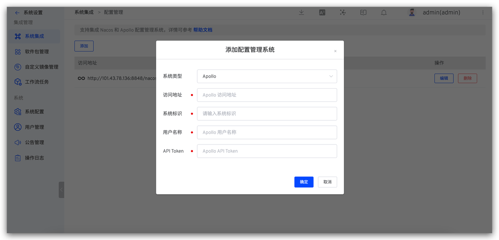

### Step 2: Configure Workflow Tasks

By orchestrating the "Apollo Configuration Change" task into the workflow, you can achieve automatic configuration changes with a single click in Zadig. Specific steps: Edit workflow > Add configuration change task > Select Apollo Configuration Change > Fill in the relevant parameters and save.

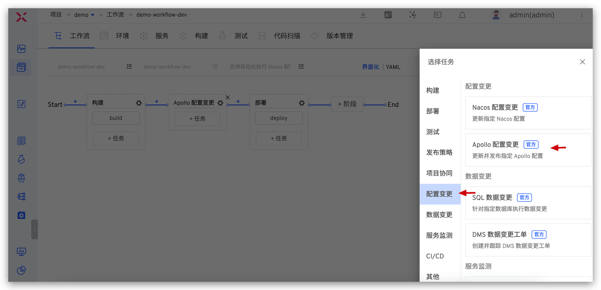
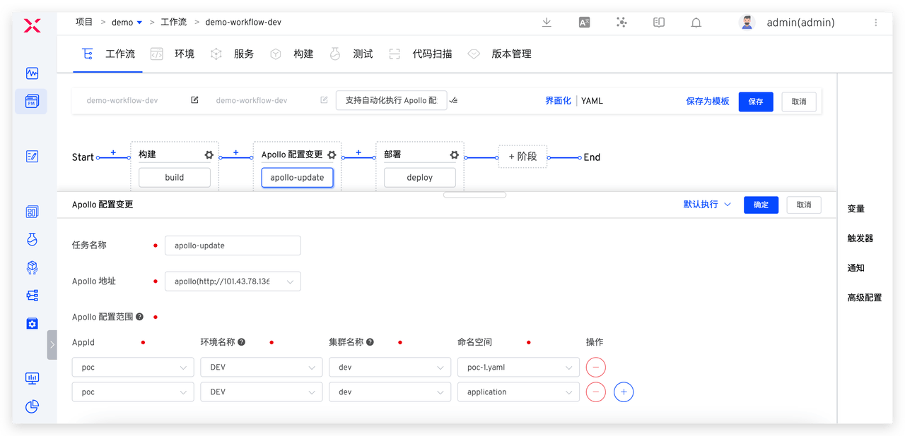

To control the use and change permissions of multiple environments, for example, only allowing developers to change the configuration of the development environment and not modifying the configuration of other environments, you can set the Apollo configuration scope in Zadig to control configuration modification permissions and ensure the stability of the system environment.

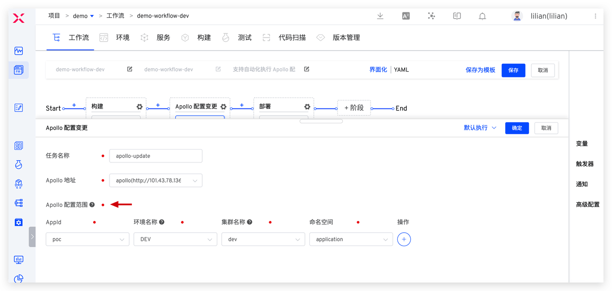

Configure three workflows, with specific settings as follows:

| Workflow Example         | Purpose             | Step Configuration                                                               |
|--------------------|------------------|---------------------------------------------------------------------|
| demo-workflow-dev  | Daily Updates to the Development Environment | Build > dev Environment Apollo Configuration Change > Deploy dev Environment                        |
| demo-workflow-sit  | Updates to the Integration Test Environment | Build > sit Environment Apollo Configuration Change > Deploy sit Environment > Automated Testing > IM Notification |
| demo-workflow-prod | Production Release         | SRE Approval > prod Environment Apollo Configuration Change > Deploy prod Environment > Regression Testing        |

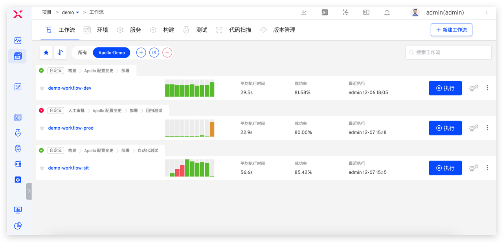

## Engineer Usage

Below, we will detail how to achieve consistent Apollo configuration changes in the development, testing, and production release stages using Zadig.

### Scenario 1: Self-Test and Joint Debugging by Development Engineers

> Build > Apollo Configuration Change > Deploy, to achieve automated changes in business and configuration in the development environment.

When the development engineer needs to self-test and joint debug after code implementation, execute the demo-workflow-dev workflow, select the service that needs to be updated, and in the Apollo Configuration Change task, select the configuration items and modify the configuration content.

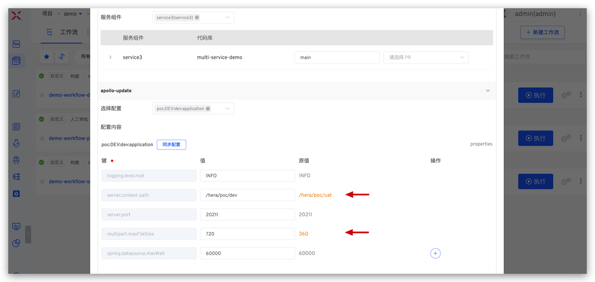

After the configuration change is successful, the deployment task will be automatically executed to update the development environment, achieving one-click changes in business code and configuration in the development environment, and enabling quick self-testing and joint debugging.

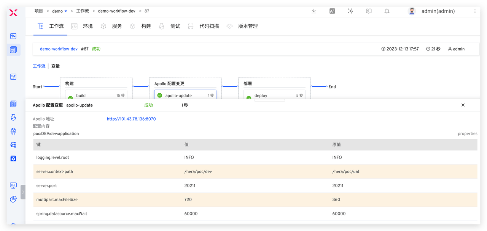
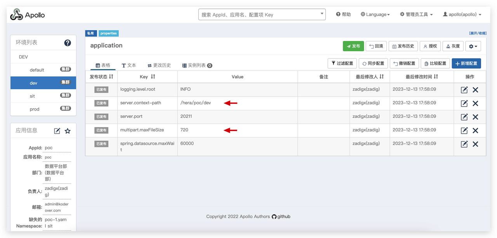

### Scenario 2: Integration Testing by Test Engineers

> Build > Apollo Configuration Change > Deploy > Automated Testing > IM Notification, to achieve automated and efficient changes in business and configuration in the test environment.

When the test engineer performs integration testing, execute the demo-workflow-sit workflow, select the service that needs to be updated and the corresponding configuration changes.

As shown in the figure below, click "Synchronize Configuration" and select the service configuration from the development environment. You can obtain the configuration differences between the development environment and the test environment and select the configurations that need to be synchronized. After clicking the synchronization button, you can clearly understand the changes through a before-and-after comparison. Finally, click Execute workflow to complete the automated changes to the test environment configuration.

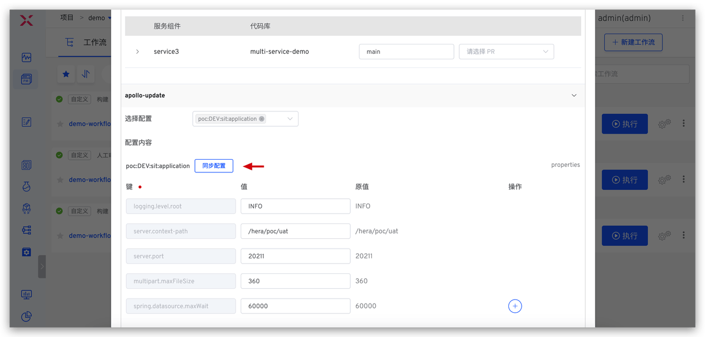
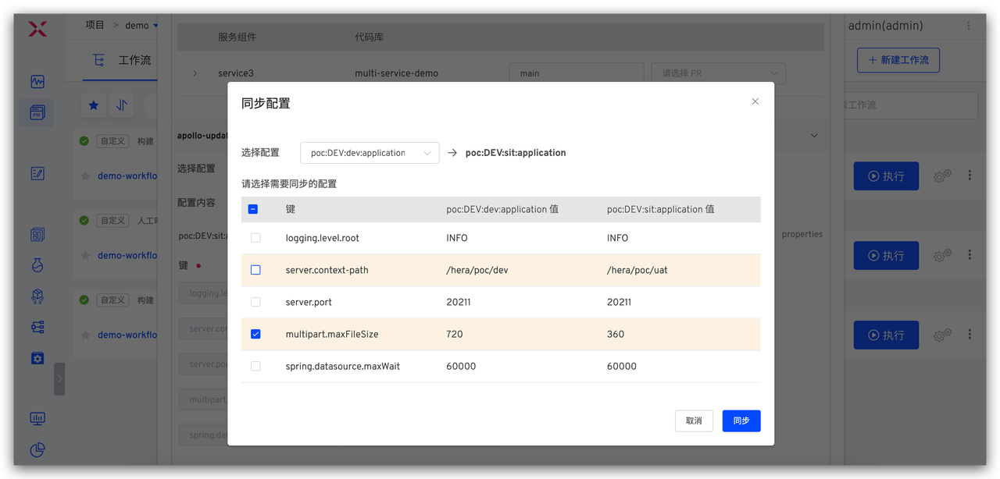
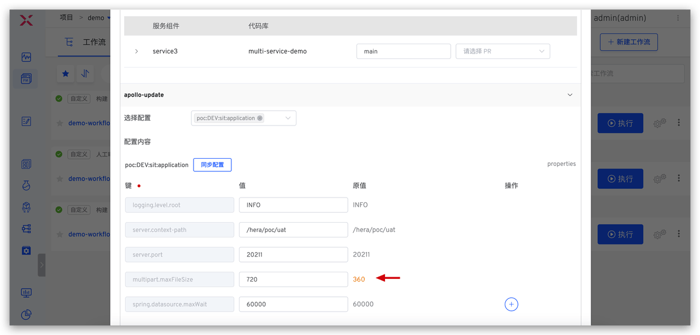

### Scenario 3: Production Release by Release Engineers

> SRE Approval > Apollo Configuration Change > Deploy prod Environment > Automated Testing, to achieve automated and secure deployment of business and configuration.

The release engineer executes the demo-workflow-prod workflow for production release, selects the Apollo configuration to be changed, and modifies the content.

Similar to the test engineer's operation, select the configuration from the test environment to obtain the differences between the test environment and the production environment, and after selecting the configurations that need to be synchronized, make changes to the production environment.

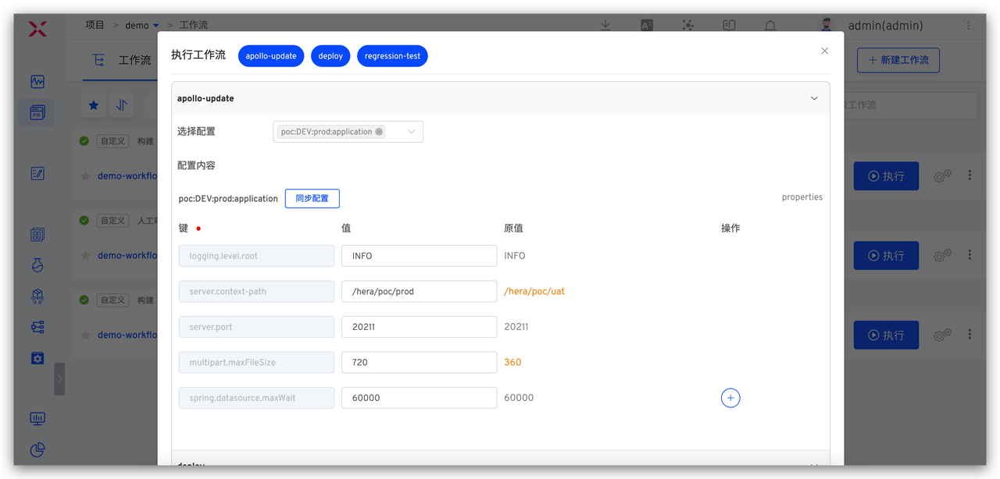

Additionally, given the seriousness of production releases, relevant responsible persons are usually required to approve the release content. Approval personnel can review the specific changes in the task through Zadig workflow task information to ensure the correctness and reliability of the published content.

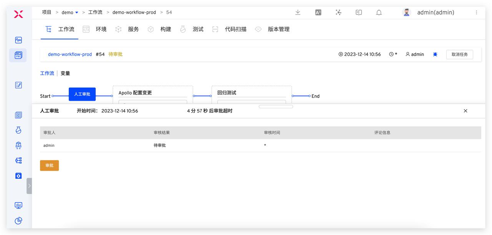
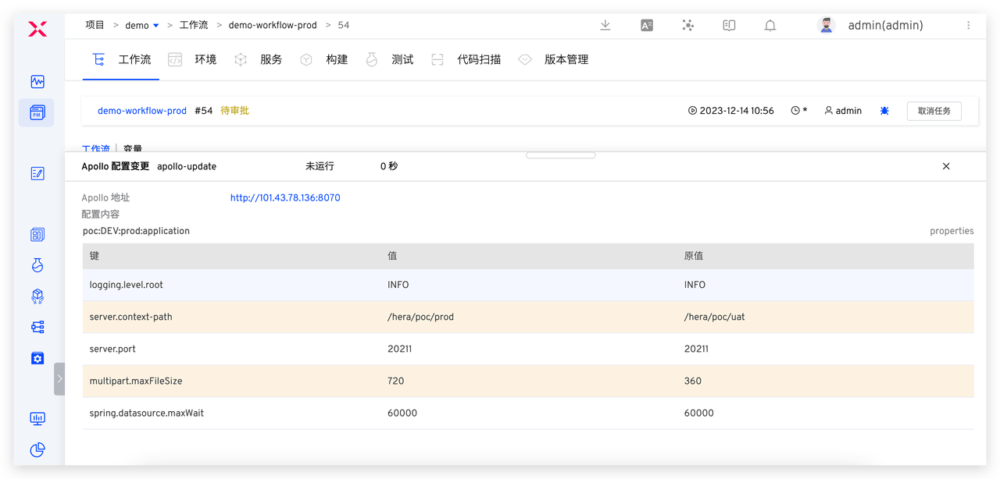

### Scenario 4: Release Engineer Configuration Rollback

If there is an issue with the production release, the configuration can be rolled back directly through the workflow.

The release engineer finds the task that needs to be rolled back, clicks the **Rollback** button, selects the configuration to roll back, and clicks the **OK** button to perform the rollback.

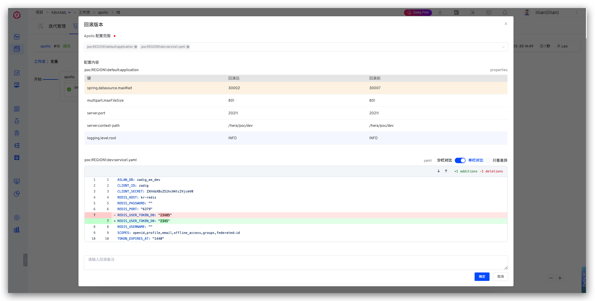
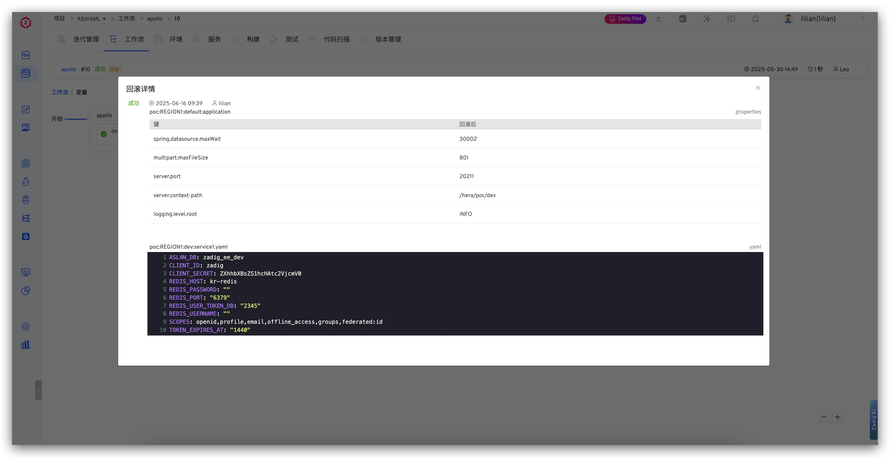