This article details the basic principles of how to combine Zadig and Ingress to achieve a stable production release, and demonstrates the specific operations in Zadig through practical examples.

## Basic Principles

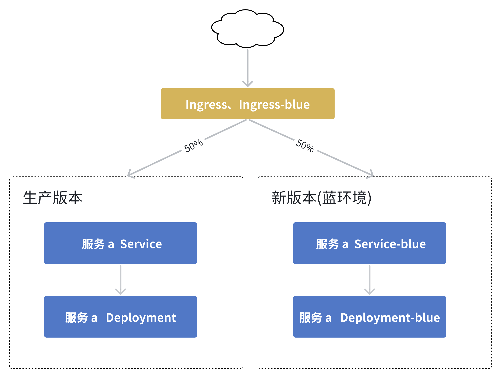

> Note: The production version and the new version (blue environment) are managed in the same production environment in Zadig.

**How It Works:**
1. Deploy the blue environment: Copy the current workload, set a new image, and create a blue service pointing to it.
2. Switch part of the production traffic to the blue environment: Create a ingress-blue of the same Host based on the original ingress service pointing blue service and turn on `nginx.ingress.kubernetes.io/canary: "true"` , and modify the weight configuration nginx. `ingress.kubernetes.io/canary-weight:50` according to the actual situation.
3. Blue-Green Release: Set the production workload image to the new image.
4. Cut off blue environment traffic: Modify the ingress-blue configuration to `nginx.ingress.kubernetes.io/canary: "false"`.
5. Blue-Green Cleanup: After the workflow is executed, regardless of the final state, delete the blue service and blue workload.

Below, we will detail how to combine Ingress in Zadig to achieve a safe, stable, and efficient production release.

## Project Preparation

### Create a Project

Create a project and configure production services `a`, `b`, and `c`. This example's source code and service YAML configuration can be referenced from the [project](https://github.com/koderover/zadig/tree/main/examples/grayscale-demo).

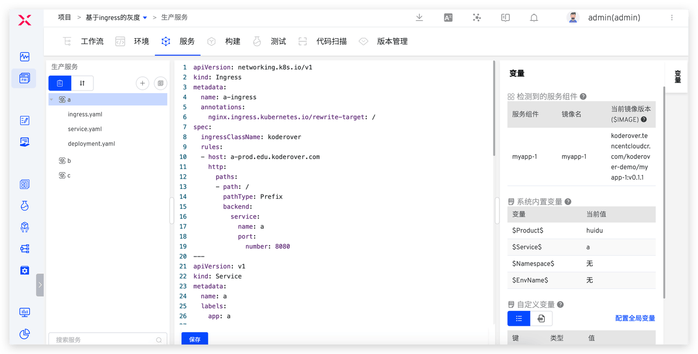

Add ingress configuration to the service YAML configuration:

```yaml
apiVersion: networking.k8s.io/v1
kind: Ingress
metadata:
  name: a-ingress
  annotations:
    nginx.ingress.kubernetes.io/rewrite-target: /
spec:
  ingressClassName: koderover
  rules:
  - host: a-prod.edu.koderover.com
    http:
      paths:
      - path: /
        pathType: Prefix
        backend:
          service:
            name: a
            port:
              number: 8080
```

### Environment Configuration

1. Create a production environment prod > Manage Services > Add Service, and select `a`, `b`, and `c`.

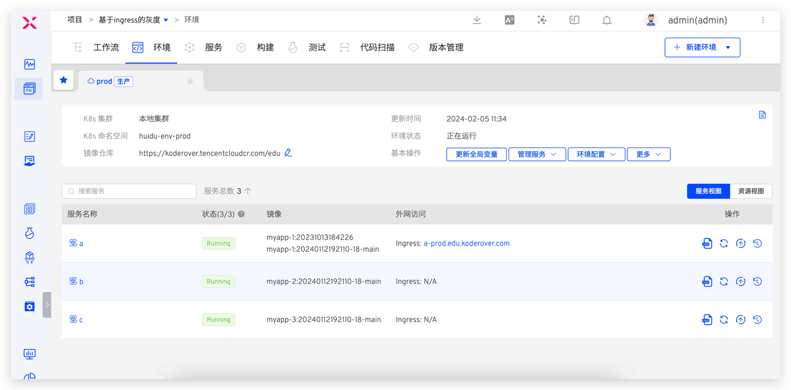

2. Add ingress-blue to prepare for production release configuration.

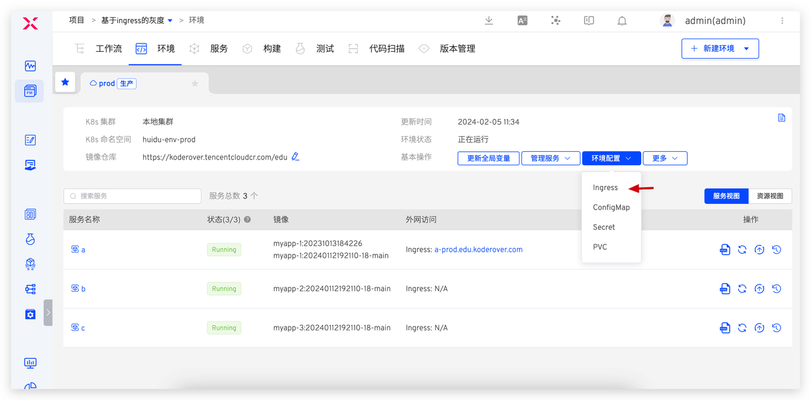
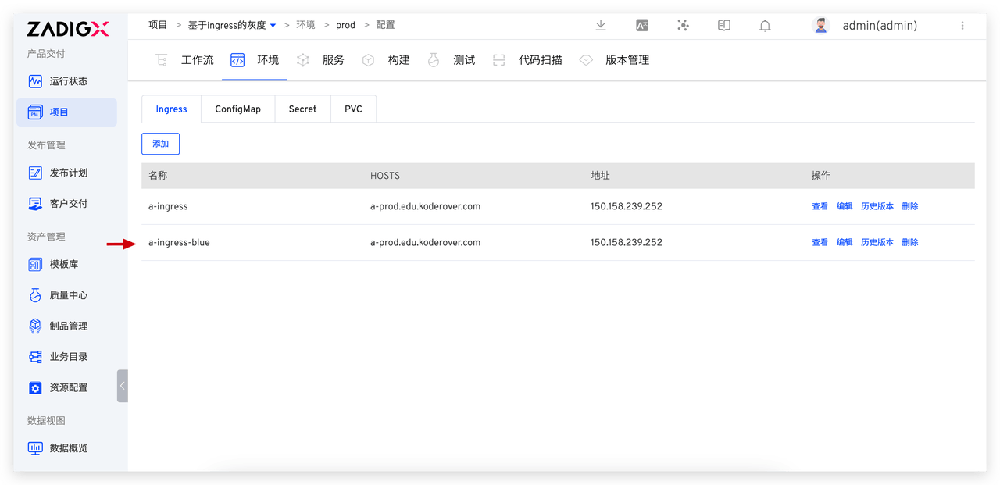

The ingress-blue configuration for service a is as follows:

```yaml
apiVersion: networking.k8s.io/v1
kind: Ingress
metadata:
  name: a-ingress-blue
  annotations:
    nginx.ingress.kubernetes.io/rewrite-target: /
    nginx.ingress.kubernetes.io/canary: "false"
    nginx.ingress.kubernetes.io/canary-weight: "0"
spec:
  ingressClassName: koderover
  rules:
  - host: a-prod.edu.koderover.com  #Ensure the host is consistent with the one used in the ingress configuration of service a
    http:
      paths:
      - path: /
        pathType: Prefix
        backend:
          service:
            name: a-blue #Point to the new version of service a
            port:
              number: 8080

```

### Configure the workflow:

Create a new workflow > Select the "Blue-Green Release" template > Configure the workflow. The workflow contains the following steps and specific configurations:

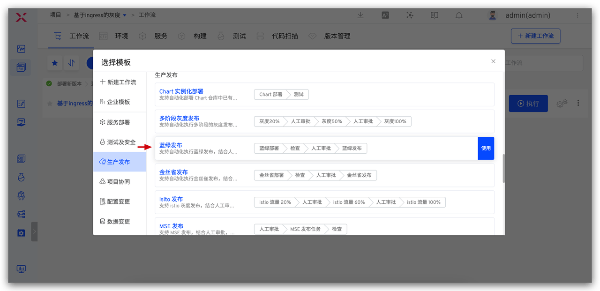
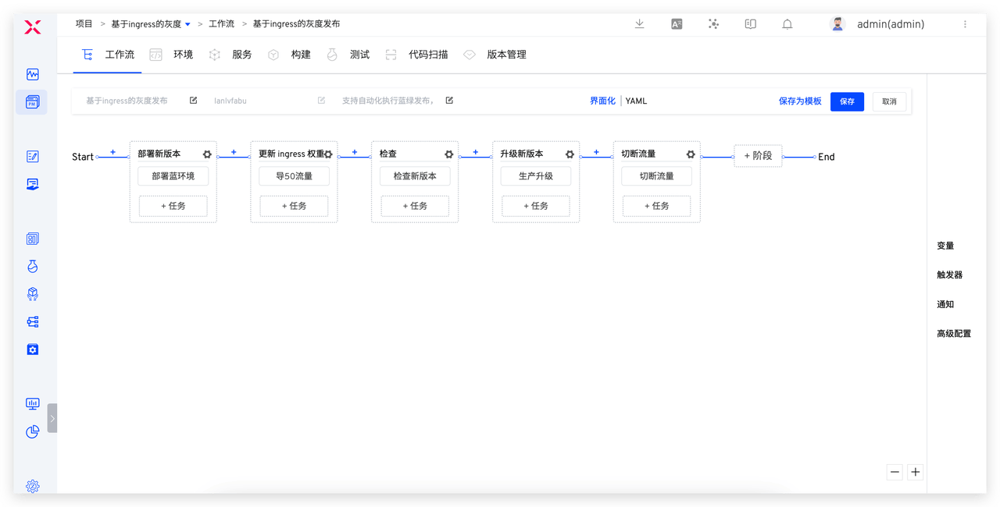

1. `Deploy Blue and Green Environment`: Use the "Deploy Blue and Green Environment" task to add service a.

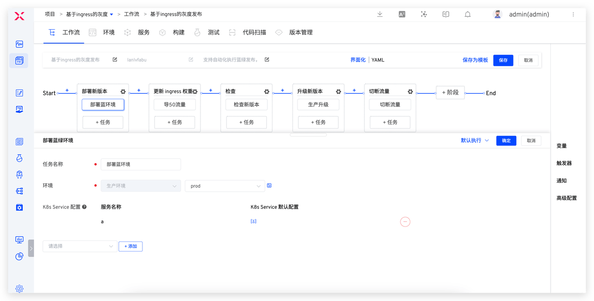

2. `导 50 流量` : Use "Update K8s YAML Task", select ingress-blue Configuration, and set `nginx.ingress.kubernetes.io/canary: "true"` and `nginx.ingress.kubernetes.io/canary-weight: "50"` .

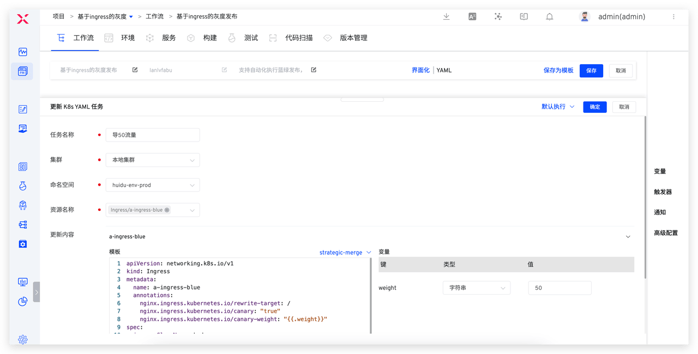

3. `Check New Version`: Use the "General Task" or "Test" task to configure the corresponding check scripts and perform automated testing for the new version.
4. `Approval`: Enable "Manual Approval" in the production upgrade stage to ensure the reliability of the release.

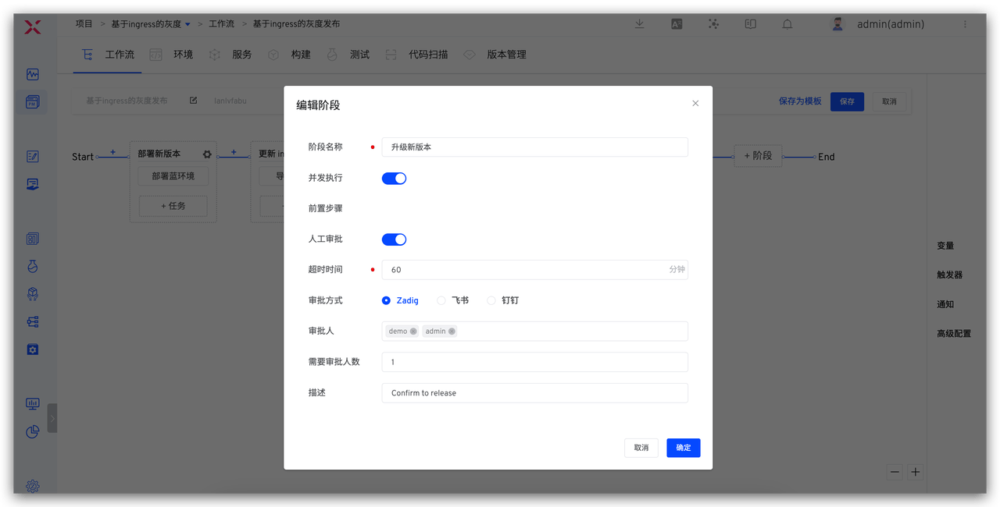

5. `Production Upgrade`: Use the "Blue-Green Release" task, ensuring the "Deploy Blue-Green Environment" task is correctly selected in the configuration.

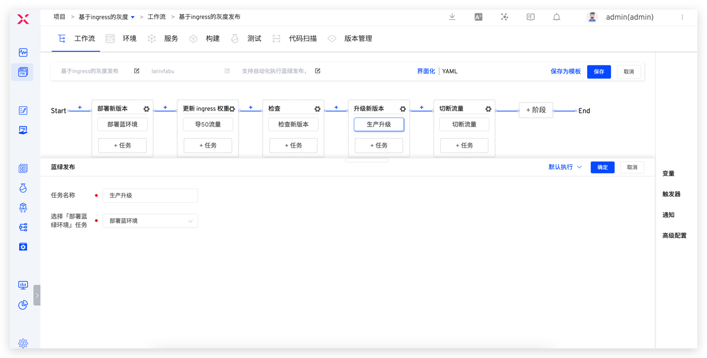

6. `Cut Off Traffic`: Use the "Update K8s YAML Task," select the ingress-blue configuration, and set `nginx.ingress.kubernetes.io/canary: "false"` and `nginx.ingress.kubernetes.io/canary-weight: "0"`.

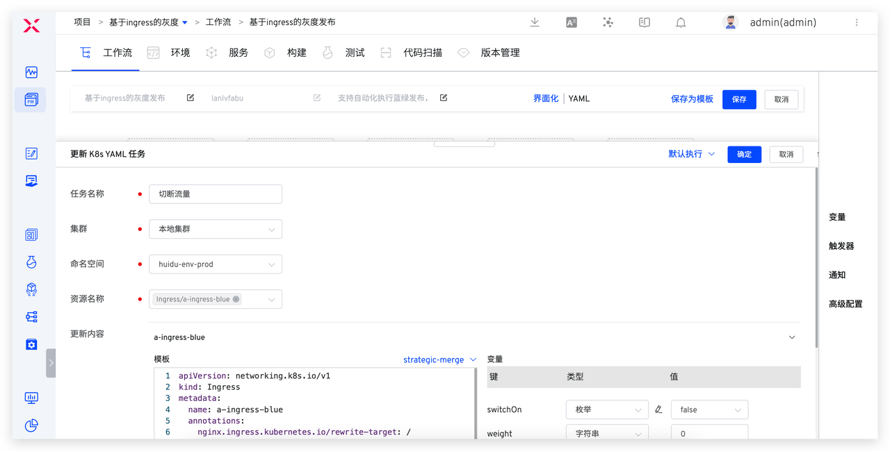

## Execute Production Release

### Execute the Workflow

Perform the workflow with the following configuration:
- Deploy the blue environment: Select myapp-1(a) for the service component and choose the image to be published
- Divert 50% Traffic: Select the ingress-blue resource
- Cut Off Traffic: Select the ingress-blue resource

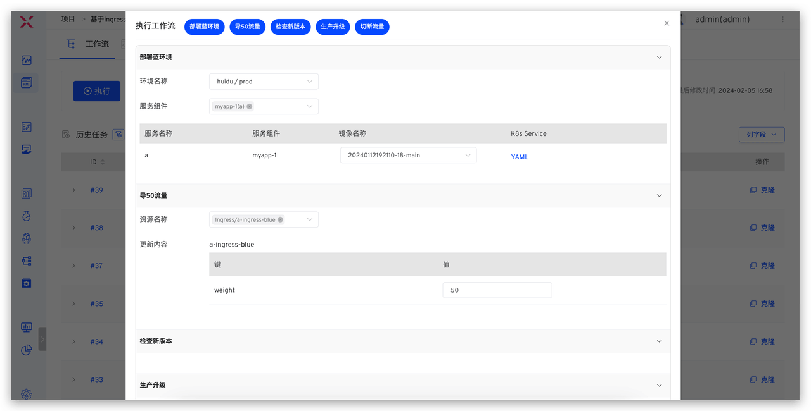
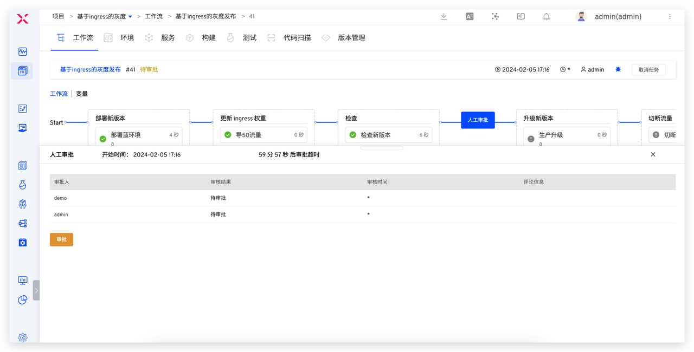

When the workflow reaches the pending approval state, the following operations have been completed: automatic deployment of the blue environment, diversion of 50% of traffic to the new version, and automated testing and verification of the production environment. Next, we will use Zadig's environment capabilities to verify whether the traffic distribution meets expectations.

### Effect Verification

During the release process, there are two sets of deployments and services for service a, one for the production version and one for the new version. At this time, 50% of the traffic is expected to go to the production version and 50% to the new version.

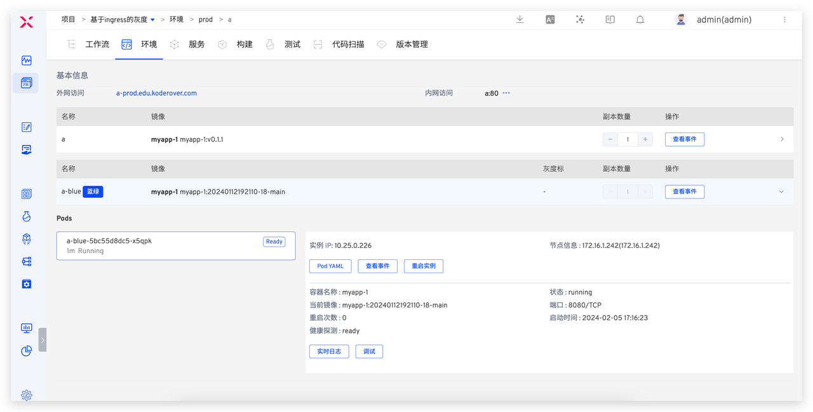
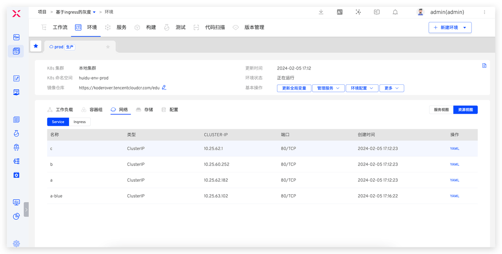


Execute the following request to view the service logs and verify the traffic distribution results.

```bash
for i in $(seq 1 100); do curl -X PUT http://a-prod.edu.koderover.com/api/v1/count; done
```

The number of requests entering the production version and the new version of service a:

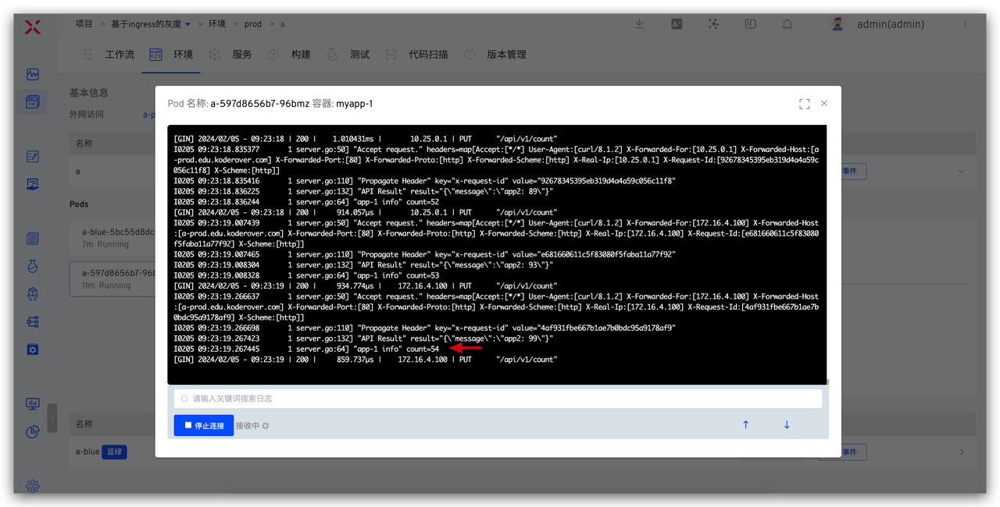
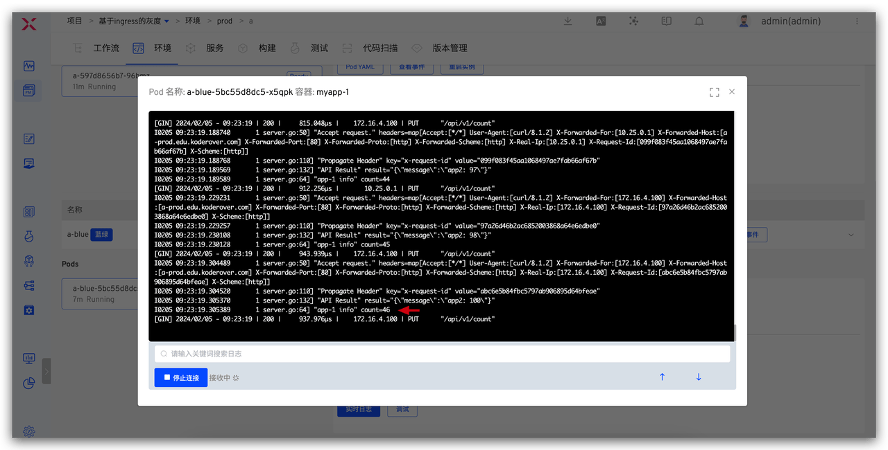

After manual approval, the workflow will automatically update the production environment image, switch all traffic back to production, and finally clean up all temporary resources.

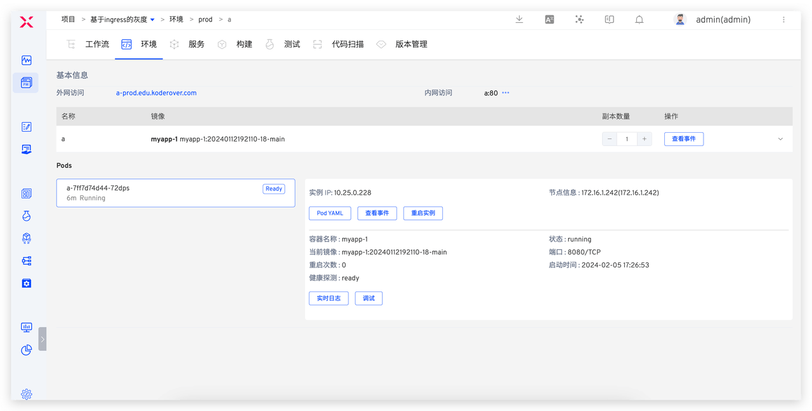
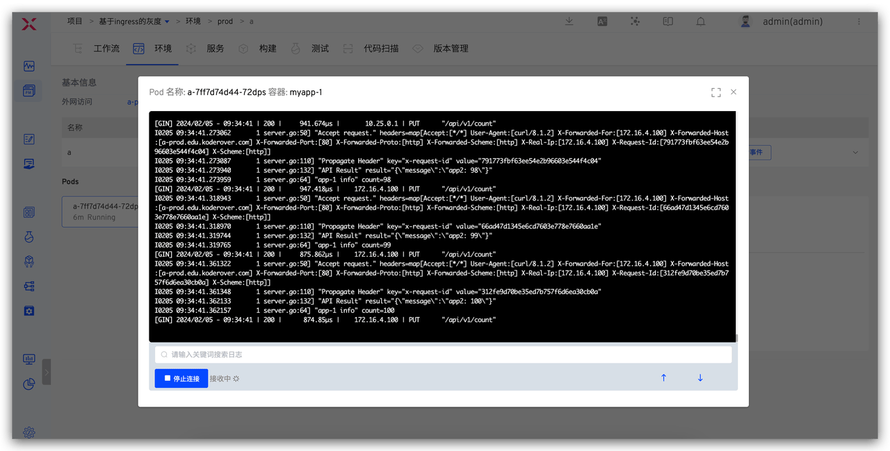

At this point, a complete production release has been completed. In actual use, you can control the timing of the new version's release during the manual approval stage using monitoring data to ensure that production releases occur during low-usage periods, reducing the impact on users.
