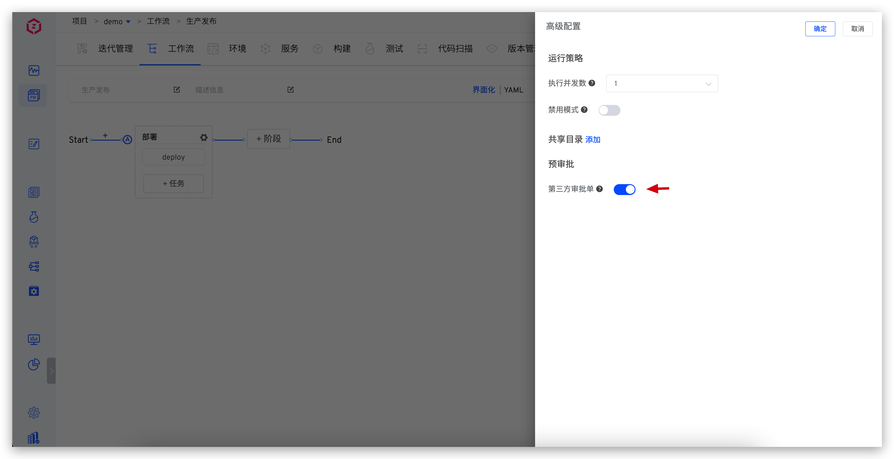
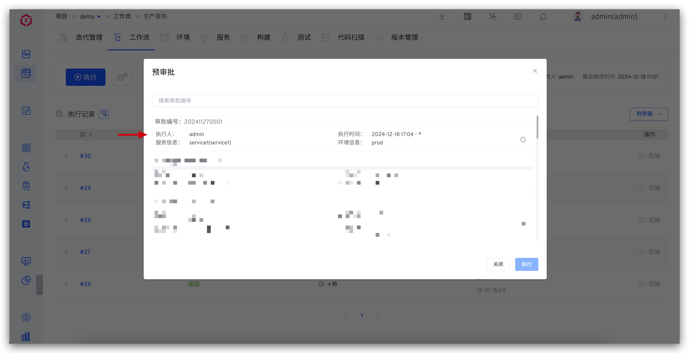

This article explains how Zadig integrates with external approval systems, using the results of external approval forms as checkpoints for workflow execution.

Approval checkpoints and execution option limitations:
1. Approval status
2. Executor
3. Execution time
4. Environment
5. Service

## Step 1: Call OpenAPI to Submit Approval Data

Refer to the [creation of a pre-approval form OpenAPI](/en/Zadig%20v4.2/api/workflow/) documentation to submit approval data to the Zadig system.

## Step 2: Enable Workflow Pre-Approval

Edit the workflow, enable "Third-Party Approval Form" in "Advanced Configuration" - "Pre-Approval", and save the workflow.

## Step 3: Execute the Workflow

After enabling pre-approval, when executing the workflow, you must first select an approval form to proceed with the workflow.

**Note:**
- Approval form selection restrictions:
  1. The approval form is selectable if its status is valid.
  2. The approval form can be selected if the executor includes the current user or if no executor is set.
  3. The approval form can be selected if the current time is within the execution time range set in the approval form.
- Workflow variable selection restrictions:
  1. The environment options must match the environment information set in the approval form.
  2. The service options must match the service information set in the approval form.
  3. If no service or environment is set in the approval form, all environments and services in the system can be selected.