This article introduces the testing and production service configurations in the K8s Helm Chart project.

> [Helm](https://helm.sh/) is a package management tool for Kubernetes applications. Using Helm Chart, you can define, install, and upgrade complex Kubernetes applications.

## Create a New Service

The system supports the following three methods to create a new K8s Helm Chart service:

- `Sync from Code Repository` : Synchronize the service's configuration from the code base Helm Chart. For supported code sources, refer to [Code Source Information](/en/Zadig%20v4.2/settings/codehost/overview/#function-compatibility-list).
- `Sync from Chart Repository`: Synchronize the service's Helm Chart configuration from the Chart repository.
- `Create Using Template`: Use the service Helm Chart template in the Zadig platform to create new services. This method supports creating a single service or multiple services in batch.

### Sync Service from Code Repository
Click on "Sync from Code Repository" -> Fill in the directory of the code repository and the service configuration -> Click "Load" to synchronize the service from the code repository. After synchronization is successful, when the files in the corresponding directory in the code repository change, the service configuration here will be automatically updated via a Webhook.

::: tip
1. You need to integrate the code source in the system. For more information, refer to [Code Source Integration](/en/Zadig%20v4.2/settings/codehost/overview/)
2. For supported code sources, refer to [Code Source Information](/en/Zadig%20v4.2/settings/codehost/overview/#function-compatibility-list)
:::

Taking the [service2](https://github.com/koderover/zadig/tree/main/examples/multi-service-demo/full-charts/service2) service as an example, the directory structure of the service's Helm Chart configuration is:

``` shell
├── zadig/examples/multi-service-demo/full-charts/service2
│   ├── Chart.yaml
│   ├── templates
│   │   ├── _helpers.tpl
│   │   ├── deployment.yaml
│   │   └── service.yaml
│   └── values.yaml
```

Synchronize the service from the code repository:

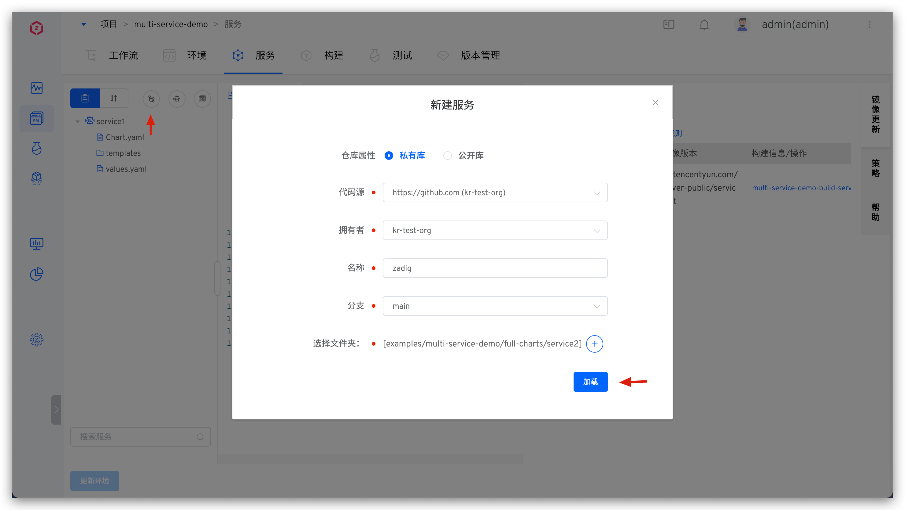

Effect after synchronization:

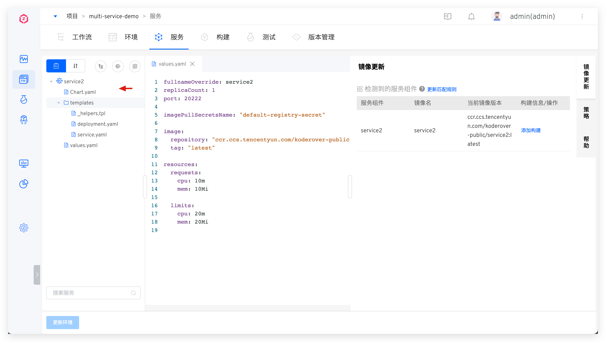

### Sync Service from Chart Repository
::: tip Prerequisites
You need to integrate the Helm Chart repository first. For more information, refer to [Integrate Helm Chart Repository](/en/Zadig%20v4.2/settings/helm/).
:::

Click on "Sync from Chart Repository", select the Chart repository and Chart, and create the service.
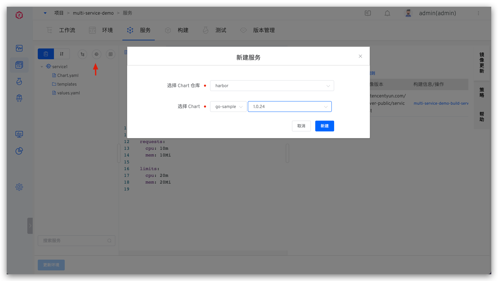

### Create a Single Service Using Templates
::: tip Prerequisites
You need to create a Helm Chart template in the system template library first. For more information, refer to [Helm Chart Template Management](/en/Zadig%20v4.2/template/helm_chart/)
:::

- Click on "Create Using Template" -> Fill in the service name and select the template -> Fill in the configuration as needed and import it.
  - Variable configuration can use the default values in the template or be reassigned when creating
  - After `Automatic Synchronization` is enabled, when the `Apply to Service` operation is performed on the used template in the template library, the service configuration will be automatically synchronized based on the template content


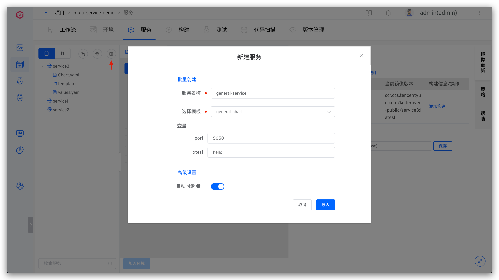

- In `Advanced Settings`, the system also supports overriding the values.yaml content in the template with a new values.yaml file, either by manual input or by importing from a specified code repository.


### Bulk Creation of Services Using the Template
::: tip
Custom variables cannot be used in the values.yaml file of the Helm Chart template
:::

Use the [multi-service-demo](https://github.com/koderover/zadig/tree/main/examples/multi-service-demo) example to illustrate how to use templates to create multiple services in batch. The necessary directory structure is as follows:

``` shell
zadig/examples/multi-service-demo
├── base-chart # Helm Chart template
│   ├── Chart.yaml
│   ├── templates
│   │   ├── _helpers.tpl
│   │   ├── deployment.yaml
│   │   └── service.yaml
│   └── values.yaml # Custom variables are not supported
└── values # Corresponding to the values files of 3 services
    ├── service1.yaml
    ├── service2.yaml
    └── service3.yaml
```

Click on "Create Using Template" -> Click `Batch Create` -> Select the Helm Chart template -> Choose the values file to import the service and import it.

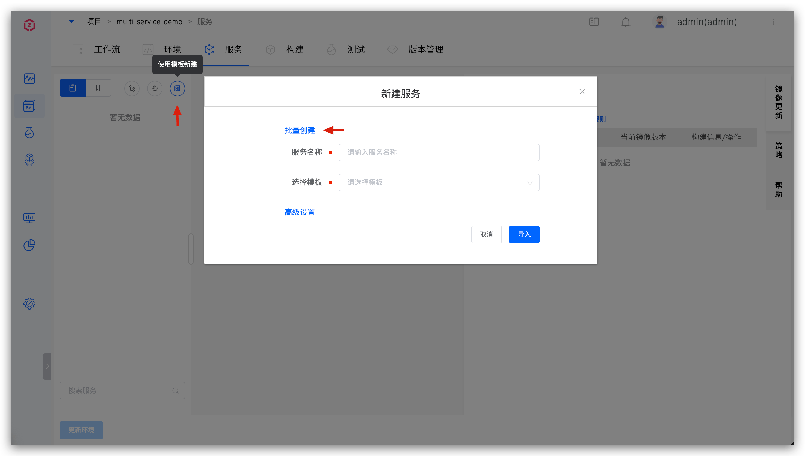
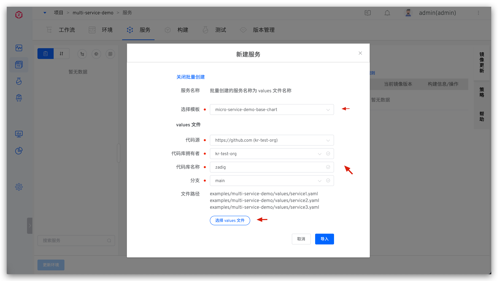

After importing, the effect is shown in the figure below. Each values file will be defined as a service, and the values file name will be the service name. After the services are created in batch, click `Update Environment` to quickly apply the services to the environment.

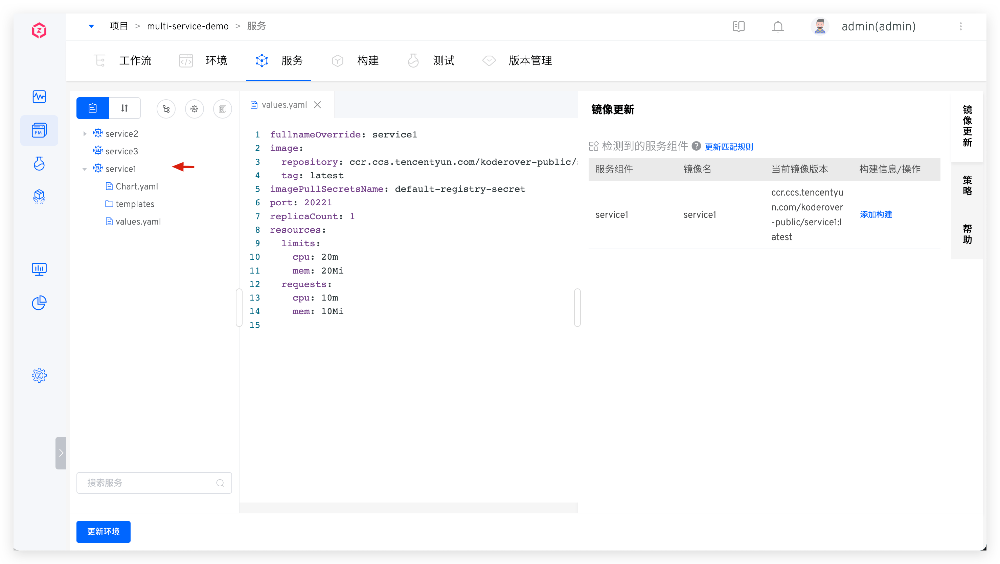

## Service Version Rollback

Refer to [Service Version Rollback](/en/Zadig%20v4.2/project/service/versions/).

## Service Components

Refer to [Service Components](/en/Zadig%20v4.2/env/overview/#what-is-a-service-component#k8s-helm-chart-project).

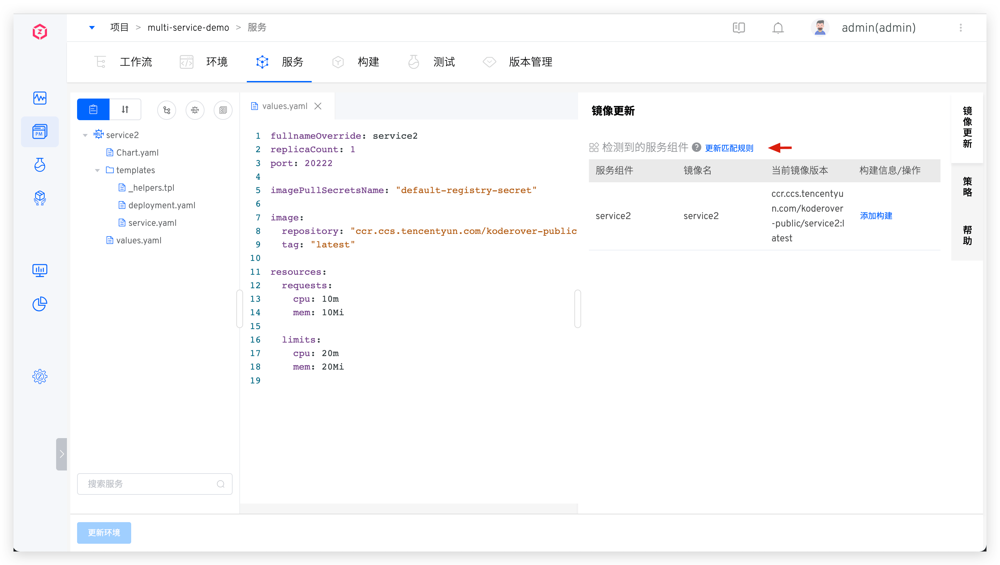

## Customize Helm Release Name

By default, the system uses the service name as the Helm Release name for deployment. You can modify this as needed in the `Helm Release Name Configuration` on the right side of the service. The system supports configuration using constants and the following variables:

- `$Product$`: Project name
- `$Service$`: Service name
- `$Namespace$`: The namespace where the environment resides
- `$EnvName$`: Environment name

When the service's Helm Release name configuration is modified, the system will automatically redeploy the services in the environment to generate a new Helm Release.

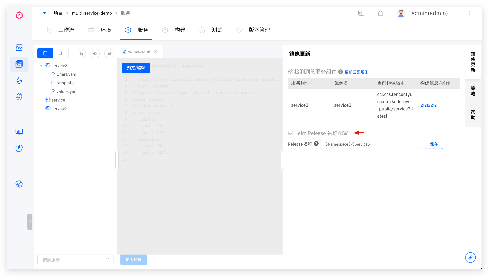

## Service Orchestration
> The Zadig system supports orchestrating and managing the deployment sequence of multiple services. Services in the same startup sequence group will be executed in parallel during deployment, while services in different startup sequence groups will be executed in the order of the groups. This is suitable for scenarios where multiple services have dependencies on each other.

Click the `Service Orchestration` icon and drag and drop the order of service startup as needed.

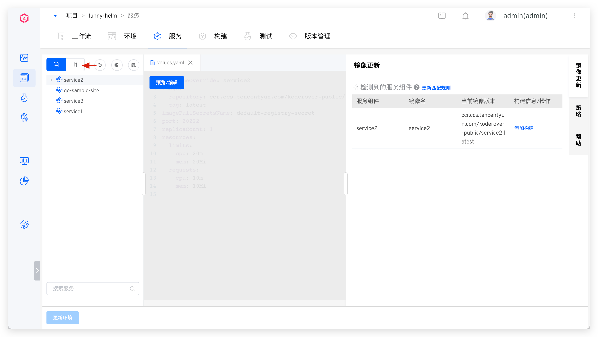
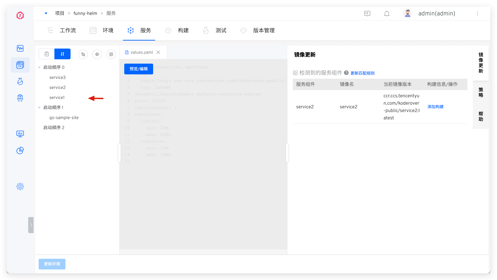

## Update Service

### Update Services Synced from Code Repository

After synchronizing the Chart configuration from the code repository, a Webhook will be automatically created. When there are changes in the corresponding code repository, the Chart configuration of the service will be automatically synchronized to Zadig. You can also click the synchronization button on the right side of the service and click `Load` to actively synchronize the update.

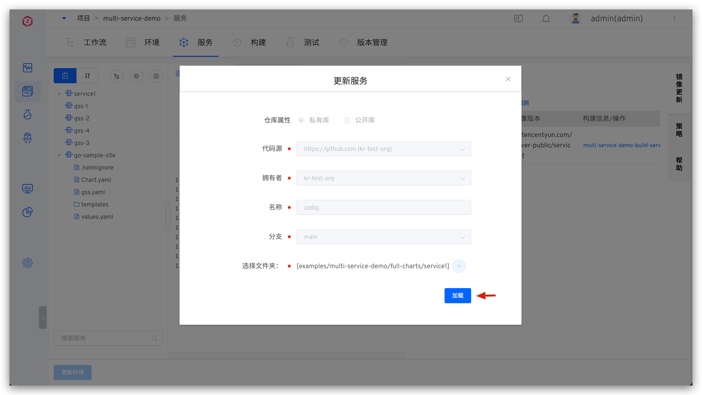

### Update Services Synced from Chart Repository

Click the synchronization button on the right side of the service, modify the Chart version number as needed, and click `Update`.

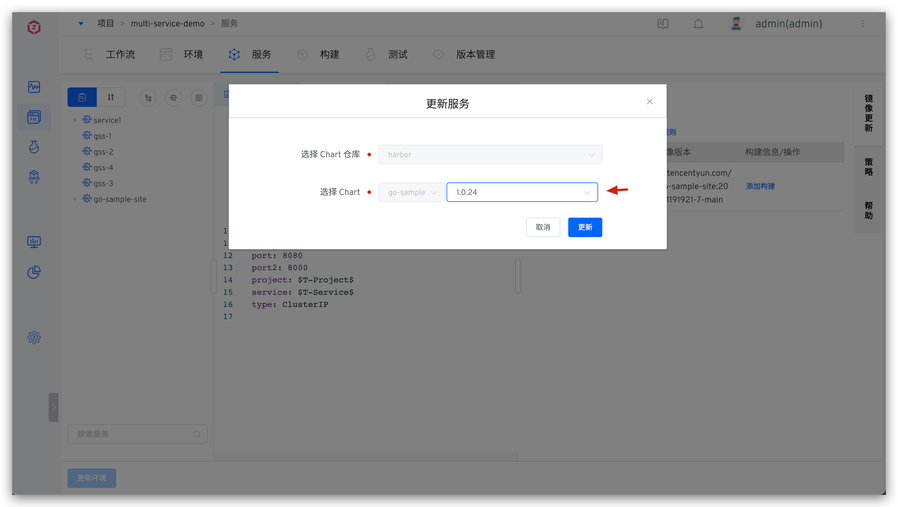

### Update Services Created Using Templates

When the template content changes, click the synchronization button on the right side of the service -> Click `Import` to synchronize the latest content in the template. You can also modify the Helm values file content in `Advanced Settings` before importing.

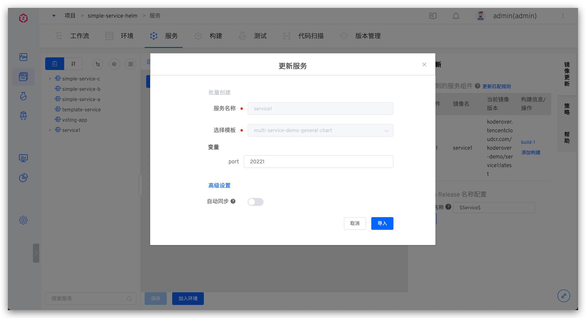

If the service does not enable automatic synchronization, you can also edit the content of the service values.yaml directly.

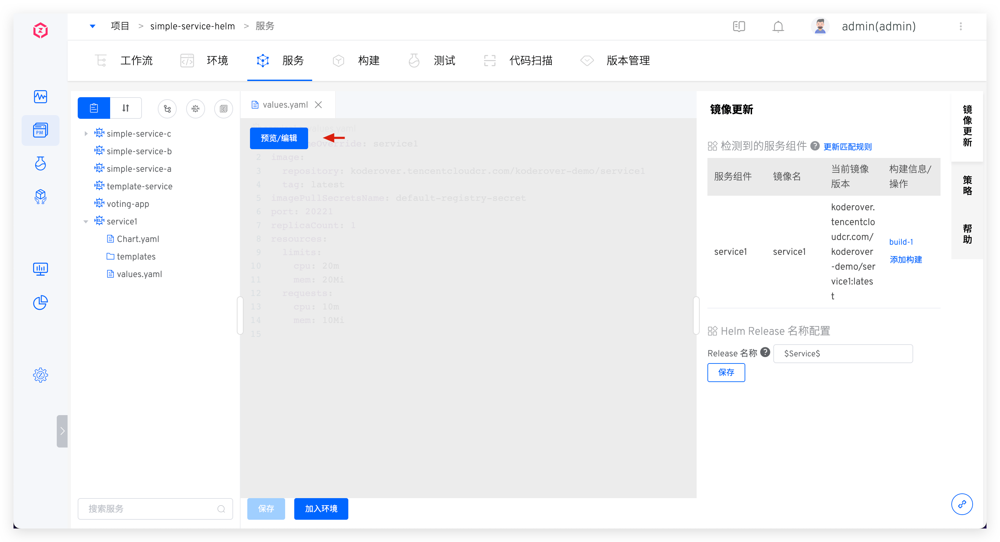

## Delete Service

Click the delete button on the right side of the service to delete the service configuration. If you need to delete the service from the environment, click `Update Environment` and select the environment you want to update.

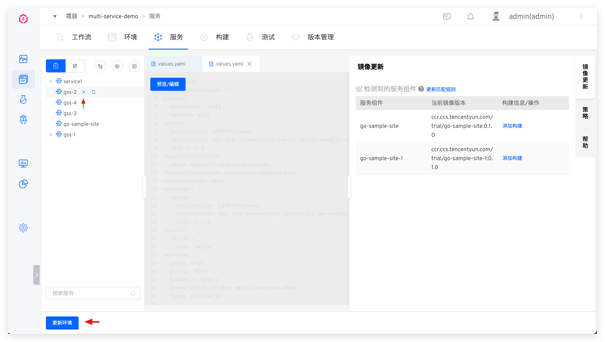

## Tag Management

By tagging services, you can quickly classify and search for service metadata. For more information, refer to [Tag Management](/en/Zadig%20v4.2/project/service/label/).

## Policy Configuration


In the policy, you can set:

- `Service deployment timeout`: The timeout for deploying the service to the environment. The default value is 10 minutes. If the service is still not in the Running state after this threshold, it is considered a deployment timeout.
- `Maximum number of release history versions`: The number of release history versions retained in the cluster. **Note: Keeping too many history versions may consume more resources and impact system performance.**
- `Delivery artifact naming rules`: For details, refer to [Policy configuration](/en/Zadig%20v4.2/project/service/k8s/#policy-configuration).

## Helm Chart Sample

The [koderover/zadig](https://github.com/koderover/zadig/tree/main) repository provides a Helm Chart sample. For more details, click [this link](https://github.com/koderover/zadig/tree/main/examples/multi-service-demo/full-charts/service1).