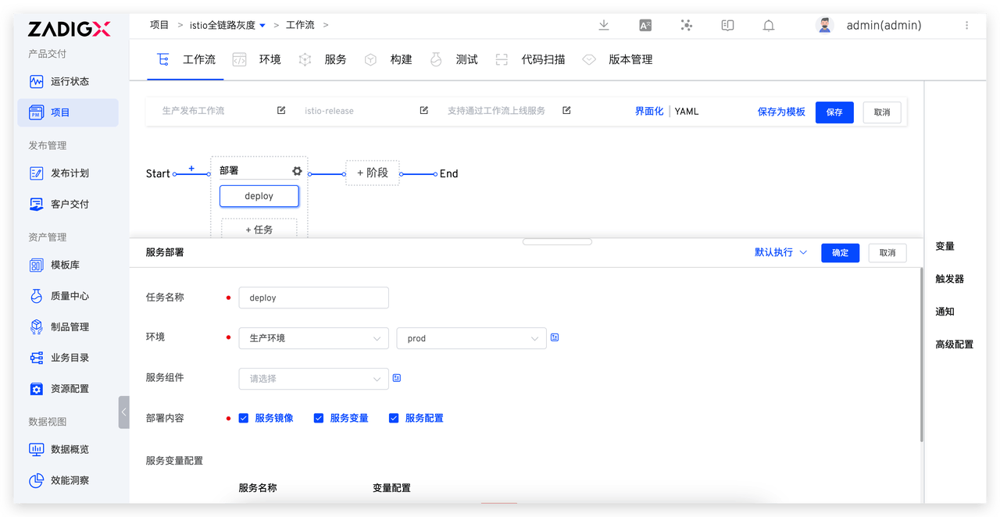
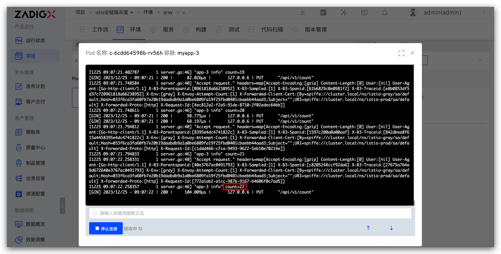
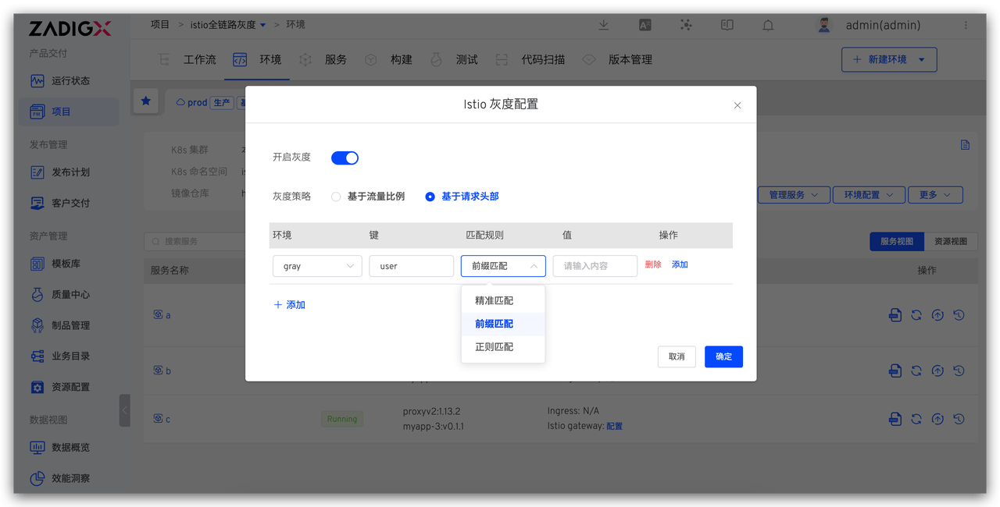
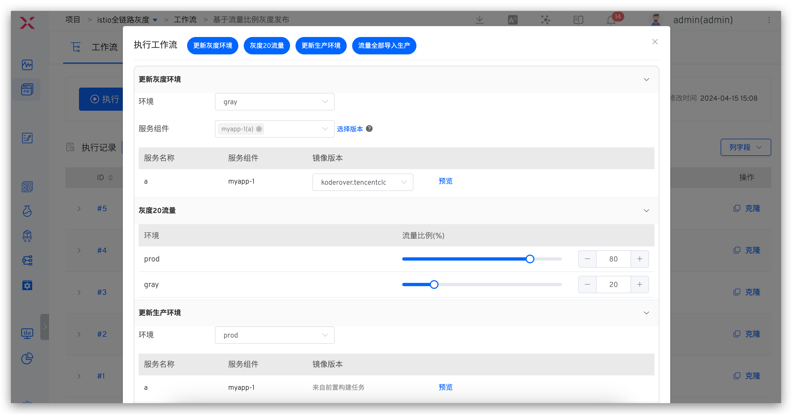

In this article, we will delve into how Zadig uses Istio to implement a full-link grayscale release solution, including an in-depth introduction to the solution's principles, a detailed explanation of administrator configurations, and the actual operations of engineers in daily use.

## Introduction to the Solution Principles


### Core Mechanisms

1. **Enable Istio Grayscale Function**: Zadig automatically adds an istio-injection Label to the Namespace where the environment is located, injects an istio-proxy sidecar to all pods and restarts the pods. Finally, an EnvoyFilter is created, which uses some functions of the Tracing component to realize the ability to automatically pass grayscale targets in the calling link.

2. **Create Grayscale Environment**: Zadig automatically creates the corresponding Service for all services in the baseline environment within the grayscale environment, ensuring the call chain between the baseline and grayscale environments is connected.

3. **Set Grayscale Policy**:
   - **Based on Request Header**: Zadig creates a VirutalService containing HTTPMatchRequest for all services in the grayscale and baseline environments, which is used to forward to the corresponding environment according to the request header. If the requested traffic has grayscale marks, it will be forwarded to the grayscale environment, otherwise it will be forwarded to the baseline environment.
   - **Based on Traffic Ratio**: Zadig creates a VirutalService containing HTTPMatchRequest and HTTPRouteDestination for all services in the grayscale and baseline environments, which is used to achieve traffic proportional allocation and forwarding to the corresponding environment based on request headers. After entering the service mesh, the traffic is divided into two parts based on the configured traffic ratio. After the traffic proportional allocation is completed, a grayscale mark with a specific environment identifier is allocated according to the environment in which the traffic is located. Then, the request traffic is forwarded to the environment corresponding to the grayscale mark based on the grayscale mark.

4. **Configure Istio Gateway for Ingress Service**: Zadig creates an Istio gateway configuration for the ingress service, binds the domain name configured by the user, and binds the VirtualService corresponding to the ingress service to the gateway. Using this domain name for access enables grayscale capabilities for the ingress service.

Using the above capabilities, the full-link grayscale function is implemented on Zadig without invasive modifications to the code. The following details how to configure and use the Istio grayscale feature on Zadig.

## Prerequisites

1. **Business Architecture**: Should have full-link data transmission capabilities or use Tracing components
2. **Service Resources**: Each service has K8s Service resources
3. **Cluster Components**: Install Istio components in the cluster

## Administrators Perform Project Initialization

Operations and maintenance or DevOps engineers initialize projects on Zadig, including creating new projects, creating new services, creating new environments, and enabling Istio grayscale, creating new grayscale release workflows, etc. The following operations are one-time operations, and you only need to configure the workflow as needed in the future.

### Step 1: Create a New Project

Create a new project on Zadig, enter the project name, and select the "K8s YAML" project type.


### Step 2: Create a New Production Service and Production Environment

- In Zadig, under Service - Production Service, create services `a`, `b`, and `c`, and configure the corresponding YAML and build. For specific configuration, refer to [the source code](https://github.com/koderover/zadig/tree/main/examples/grayscale-demo/yaml).


- Create a new production `prod` environment in Zadig and add services `a`, `b`, and `c`.


### Step 3: Enable Grayscale and Configure the Entry Service Istio Gateway

- Go to the production environment > More > Istio Grayscale Configuration > Enable Grayscale.


- Configure the entry service Istio gateway. If the ingress service requires grayscale, add the ingress service to the grayscale `gray` environment and configure its access address in the production `prod` environment.


### Step 4: Create a New Production Release Workflow

- Create a new workflow, select "Deployment Task", and choose the production environment.



## Engineers Perform Grayscale Release

### Create a Grayscale Environment

- Go to the baseline environment `prod` > Create grayscale environment `gray`.


- Add grayscale services. Manage Services > Add Services > Select services that require grayscale, such as `a` and `c`.


### Update the Grayscale Environment

- Execute the production release workflow, select the grayscale environment `gray`, select the grayscale services `a` and `c` and their corresponding images, and update the grayscale environment.


### Configure Grayscale Rules

Currently, Zadig supports two grayscale strategies: `Based on Traffic Ratio` and `Based on Request Header`. The following sections detail how to configure and use them.

#### Based on Traffic Ratio

The grayscale strategy based on traffic ratio allows a portion of user requests to be directed to the new version, and gradually increase the traffic ratio of the new version based on the release observations to minimize the impact of potential issues on users. Once the new version stabilizes, you can consider switching all traffic to the new version.

**Example Configuration**: 20% of requests flow into the grayscale environment, and 80% of traffic flows into the production environment.

- Access the production environment > More operations > Istio grayscale configuration. Select the traffic ratio-based grayscale policy and configure the `prod` environment traffic ratio to 80% and the `gray` environment traffic ratio to 20%.

::: warning Warning
The sum of the traffic ratios of the two environments must equal 100.
:::


- Execute the following request to view the service logs and verify the traffic distribution results.

```bash
for i in $(seq 1 100); do curl -X PUT http://{bound istio entry service address}/api/v1/count; done
```

The number of requests entering service `a` in the production `prod` environment and the grayscale `gray` environment:


The number of requests entering service `c` in the production `prod` environment and the grayscale `gray` environment:




#### Based on Request Header

The grayscale strategy based on the request header directs user requests to a specific version by checking the request header information. This allows flexible control of traffic distribution under different conditions (such as specific users, specific geographical locations, etc.), achieving finer-grained version management and grayscale release. It meets the release requirements of gradually rolling out new features and testing and controlling for different user groups.

**Example Configuration**: All VIP user requests flow into the grayscale environment, using the new version.

- Access the production environment > More operations > Istio grayscale configuration, set the grayscale policy to `Based on Request Header`, and configure the `gray` environment to match the request header. Select `Prefix Match` for the match rule and enter `vip` as the value.




- For requests with the header `user:vip-zadig`, the traffic normally enters the `gray` environment.

```bash
curl -X GET -H "user: vip-zadig" http://{bound istio entry service address}/api/v1/info
```

Service `a` log in the grayscale `gray` environment:


- Execute a request without any header information, and the traffic will normally enter the `prod` environment.

```bash
curl -X GET http://{bound istio entry service address}/api/v1/info
```

Service `a` logs in the production `prod` environment:


### Release the Production Environment

- Execute the production release workflow, select the production `prod` environment, and choose services `a` and `c` along with their corresponding images to update the production environment.


### Clean Up the Grayscale Environment

After the release is completed, to avoid wasting cluster resources, you can choose to put the grayscale environment to sleep. For specific operations, refer to the article [「Zadig Introducing Environmental Sleep, Averaging 50% Test Resource Savings」](https://mp.weixin.qq.com/s/Ar56J0e-Og4k6K9V4RDk-Q).

## Execute Workflow to Automatically Change Istio Grayscale Policy

In the above content, we explored using environmental capabilities to update Istio grayscale release strategies. If, in actual applications, the grayscale release process has been standardized, you can automate this process by choreographing a workflow task named "Update Istio Grayscale Strategy". This simplifies operations, ensures that each release follows the established process, reduces manual errors, and improves efficiency and reliability.

### Based on Traffic Ratio

Workflow configuration: `Update Grayscale Environment` → `20% Traffic to Grayscale` → `Manual Approval` → `Update Production Environment` → `All Traffic to Production`



### Based on Request Header

Workflow configuration: `Update Grayscale Environment` → `Configure Grayscale Request Header` → `Manual Approval` → `Update Production Environment` → `All Traffic to Production`

