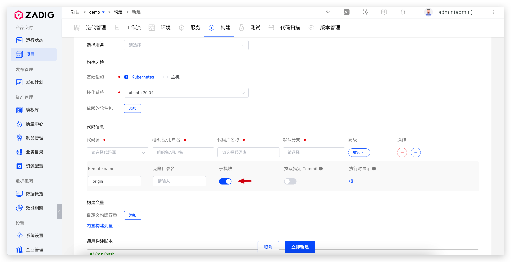

This article introduces how to pull submodule code on Zadig using the HTTPS and SSH protocols.

## HTTPS Protocol

### Step 1: Check the Submodule Declaration

:::tip
The repository included in .gitmodules needs to be added to Zadig's "System Settings" - "Code Source" integration in advance
:::

Check the configuration in .gitmodules and confirm the use of HTTPS clone code

### Step 2: Enable the Submodule in the Corresponding Task

Enable the submodule in the task.



## SSH Protocol

### Step 1: Check the Submodule Declaration

Check the current configuration in .gitmodules and confirm the use of SSH clone code

### Step 2: Prepare the SSH Private Key

Prepare the SSH private key for authentication when cloning the code in the submodule. If multiple submodules exist, and each requires a different SSH private key, prepare multiple private keys

### Step 3: Configure the SSH Private Key File

Create a config file and specify the private key files corresponding to different repositories in the config file. The example is as follows:

```
Host github.com
    StrictHostKeyChecking no
    IdentityFile ~/.SSH/id_rsa.github
Host gitlab.com
    StrictHostKeyChecking no
    IdentityFile ~/.SSH/id_rsa.gitlab
```

### Step 4: Copy the Private Key to the Custom Build Image

Copy the private key file prepared in the previous step to the `~/.ssh` path in the image runtime, build, and push the custom build image. For more details, refer to [Custom Image Management](/en/Zadig%20v4.2/settings/custom-image/).

### Step 5: Enable the Submodule in the Task

Enable the submodule in the task.

