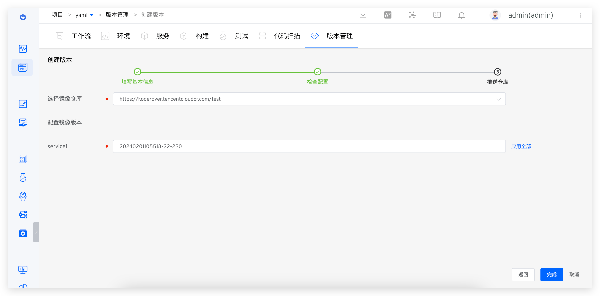

This article introduces how to manage versions of K8s YAML projects and K8s Helm Chart projects on Zadig.

## K8s YAML Project

### Create a Version

- Enter the K8s YAML project → `Version Management` and click `Create Version`.


- Enter the version creation process. The first step is to fill in the basic information.


- The second step is to select the environment and services, and preview and confirm the service configuration.


- The third step is to select the image repository and fill in the image version as needed.



- After clicking "Complete," the selected service images will be pushed to the corresponding repository.

### Version Details

Click the version in the version management list to view detailed delivery information, including the workflow task that created the version, the image information of the delivery, package information, service configuration, and startup sequence, etc.:


### Version Release

Execute the "Deployment" task in the workflow, select a version, and deploy all service **images** contained in the version to the specified environment.


### Version Rollback

When creating a new environment, you can specify the service version to achieve version rollback: Create a new environment → Select `Rollback` and choose the version to rollback. Click OK to use this version to create a new environment.


## K8s Helm Chart Project

### Create a Version

- Enter the Helm project → `Version Management` and click `Create Version`.


- Enter the version creation process. The first step is to fill in the basic information.


- The second step is to select the environment and services, and make minor modifications to the selected service configuration to meet the requirements of the production environment.


If you need to uniformly modify the variable values in all service values files, you can use `Global Variables`. As shown in the figure below, fill in the global variable and click `Apply`. The corresponding variable values in all service values files will be uniformly modified to the values set in `Global Variables`.


- The third step is to select the repository to which the delivery items will be pushed, and fill in the Chart version number as needed, and configure the image tag.
> Helm Repo needs to be integrated in advance, refer to [Helm Repo](/en/Zadig%20v4.2/settings/helm/#how-to-integrate) for specific configuration.<br> When configuring the image Tag , if one Chart including multiple [service components](/en/Zadig%20v4.2/env/overview/#what-is-a-service-component) , `Apply All` can be used to quickly set the image of all service components Tag .


- After clicking "Complete," the selected service configuration (Chart) and images will be pushed to the corresponding repository.

### Version Details

- Click the version to view the version details, including the downloadable full Chart information, image information, etc., as shown in the figure below.


### Version Release

- Execute the "Deployment" task in the workflow, select a version, and deploy all service **images** contained in the version to the specified environment.


- Execute the "Helm Chart Deployment" task in the workflow, select a version, and deploy all Charts contained in the version to the specified environment.


### Hook External Systems

After a version is successfully created, Zadig supports automatically hooking external systems. After the external system receives the request, it can perform custom operations based on its own needs. The specific configuration method is as follows:

1. Integrate external systems. For specific integration methods, refer to [Other External Systems Integration](/en/Zadig%20v4.2/settings/others/).
2. In the Project - Version Management, enable `Hook Configuration` as shown in the figure below.


After completing the configuration, create a version. After successfully pushing the image and Chart, automatically hook the external system. The specific Payload information is as follows:

```json
{
  "project_name": "helm-test",
  "version": "v1.1",
  "status": "success",
  "error": "",
  "start_time": "1640249525",
  "end_time": "1640249825",
  "charts": [
    {
      "chart_name": "gss-1",
      "chart_version": "1.1",
      "chart_url": "https://technosophos.github.io/tscharts/gss-1-1.1.tgz",
      "images": [
        {
          "service_module": "go-sample-site",
          "image": "ccr.ccs.tencentyun.com/trial/go-sample-site:20211215150832-27-main"
        },
        {
          "service_module": "go-sample-site-2",
          "image": "ccr.ccs.tencentyun.com/trial/go-sample-site:20211215150832-27-main"
        }
      ]
    },
    {
      "chart_name": "gss-2",
      "chart_version": "1.2",
      "chart_url": "https://technosophos.github.io/tscharts/gss-1-1.2.tgz",
      "images": [
        {
          "service_module": "go-sample-site",
          "image": "ccr.ccs.tencentyun.com/trial/go-sample-site:20211215150832-27-main"
        },
        {
          "service_module": "go-sample-site-2",
          "image": "ccr.ccs.tencentyun.com/trial/go-sample-site:20211215150832-27-main"
        }
      ]
    }
  ]
}
```

**Return Description**
|Parameter Name|Required|Description|
|---|---|---|
|`project_name`|string|Project Name|
|`version`|string|Delivery Version Number|
|`status`|string|Task Status|
|`start_time`|string|Version creation time in Unix timestamp format|
|`end_time`|string|Version creation completion time in Unix timestamp format|
|`charts`|[][charts](#charts)|Chart Information|

<h5 id="charts">Chart Parameter Description</h5>

|Parameter Name|Required|Description|
|---|---|---|
|`chart_name`|string|Chart Name|
|`chart_version`|string|Chart Version Number|
|`chart_url`|string|Chart Download Link|
|`images`|[][Image](#image)|Image Information|

<h5 id="image">Images Parameter Description</h5>

|Parameter Name|Required|Description|
|---|---|---|
|`service_module`|string|Service Component Name|
|`image`|string|Image Name|