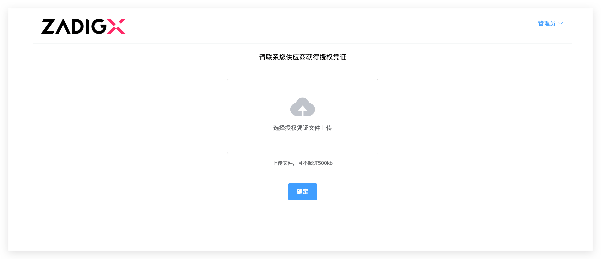

This article primarily introduces the operations related to the customer console during customer delivery.

## Install the Customer Console
### Installation Requirements
- Kubernetes version: 1.16+

### Execute the Installation Script
The actual installation script is obtained from the vendor, for example:

``` bash
curl -sS http://a.b.com/api/plutus/customer/installer/install_plutus_customer.sh | bash
```
The specific execution process is as follows:


As shown in the above figure, the installation process requires the following information:
1. Enter the Namespace for the console installation
2. Access method: IP+Port or Domain
    1. If you choose IP+Port, enter the specific IP and Port information
    2. If you choose Domain, enter the specific Domain information

After a successful installation, the access address and console password can be obtained from the script output.

::: danger
 The console does not currently support password modification, so the password must be saved to avoid loss.
:::

## Configure Authorization Credentials



1. Upload the authorization credentials provided by the vendor
2. Click `Confirm`

## Update the Version


1. When the vendor releases a new version, the customer console can automatically detect the new version.
2. To update the version, click the "Deploy" button in the version list, confirm the configuration content in the pop-up box, and click "Deploy" to start deploying the new version

## Manage the Environment


1. Enter the environment to view the overall status of the application
2. Click on the service name to view the service image information, service status, events, real-time logs, adjust the number of replicas, restart instances, etc


## Update the Authorization Credentials


1. Enter the authorization credentials
2. Click `Synchronize Authorization Credentials`