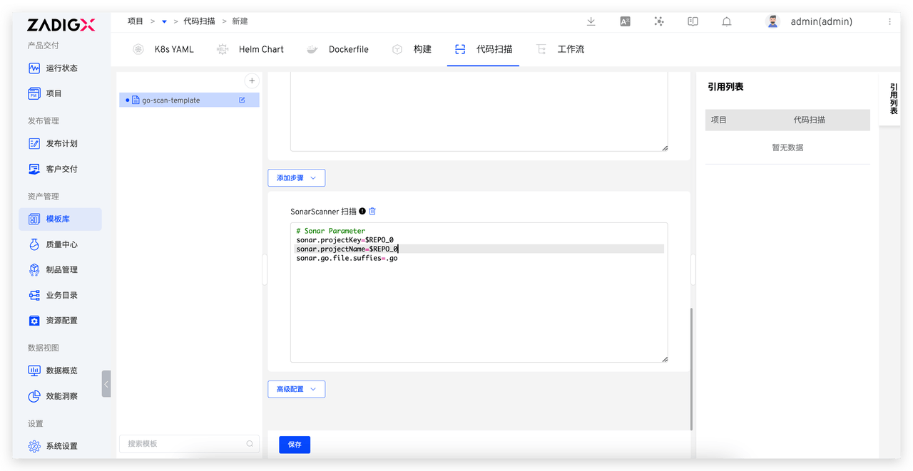

Abstract the code scanning process of a project into a template, allowing for multiple projects to reuse a single configuration. This significantly reduces the company's operational and maintenance workload in quality engineering, enhancing the quality and security of the code.

## New Template

Go to `Assets` → `Templates` → `Scan` in sequence to enter the build template management page. Click the `+` button, enter the template name, and refer to [Scan Configuration](/en/Zadig%20v4.2/project/scan/) to complete the template configuration.

## Using Templates

Create a new code scan, check `Use Template`, select the template, and fill in the code information.

For more best practices, refer to [Sonar Scan Best Practices](/en/Zadig%20v4.2/sonar-scan/practice/).